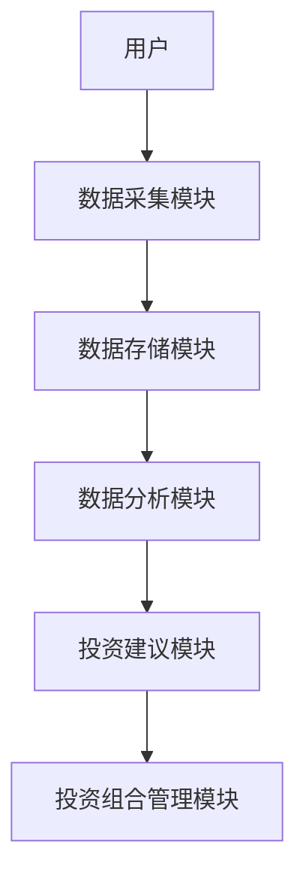

                 

# 特价股票投资中的行业周期性考虑

> 关键词：特价股票，行业周期性，投资策略，风险管理，数据分析

> 摘要：本文探讨了在特价股票投资中如何考虑行业周期性，分析了行业周期对投资的影响，并提出了基于周期性分析的投资策略和风险管理方法，帮助投资者做出更明智的投资决策。

---

## 第一部分：特价股票与行业周期性概述

### 第1章：特价股票的基本概念

#### 1.1 什么是特价股票
特价股票通常指价格远低于市场平均水平的股票，这些股票可能因为公司业绩不佳、市场波动或其他因素而被低估。投资者认为这些股票具有潜在的上涨空间，因此成为投资的热点。

#### 1.2 特价股票的特点
- 低估值：市盈率、市净率等指标远低于行业平均水平。
- 高波动性：价格波动较大，可能带来较高的收益或损失。
- 风险较高：通常涉及经营不佳或处于困境中的公司。

#### 1.3 特价股票的投资价值
- 可能存在市场错估，具有较高的上涨潜力。
- 在市场反弹时，可能表现出色。
- 适合长期投资者，尤其是价值投资者。

### 第2章：行业周期性的基本概念

#### 2.1 行业周期性的定义
行业周期性指行业在经济周期中的波动，通常分为复苏期、增长期、成熟期和衰退期四个阶段。

#### 2.2 行业周期的四个阶段
- **复苏期**：行业从衰退中逐渐恢复，市场需求回升，企业利润开始增长。
- **增长期**：行业快速发展，市场需求旺盛，企业利润持续增长。
- **成熟期**：行业增长放缓，市场需求稳定，企业竞争加剧。
- **衰退期**：行业需求下降，企业利润减少，部分企业可能退出市场。

#### 2.3 行业周期性对投资的影响
- 在复苏期和增长期，行业内的公司通常表现较好，股票可能有较高的收益。
- 在成熟期和衰退期，行业内的公司可能面临压力，股票可能表现不佳。

### 第3章：特价股票与行业周期性的关系

#### 3.1 特价股票与行业周期性的概述
特价股票往往出现在行业周期的衰退期或复苏初期，因为这些时期的公司可能面临困境，但具有潜在的复苏机会。

#### 3.2 特价股票在不同周期阶段的表现
- **衰退期**：公司业绩下滑，股价下跌，但可能存在抄底机会。
- **复苏期**：公司逐渐恢复，股价开始回升，特价股票可能逐渐回归合理价值。
- **增长期和成熟期**：行业内的高价股票可能更多，特价股票较少。

#### 3.3 行业周期性对投资策略的影响
- 在衰退期，投资者可以关注那些基本面良好但被市场低估的公司。
- 在复苏期，投资者可以逐步增加对行业内的特价股票的投资。

---

## 第二部分：行业周期性分析方法

### 第4章：行业周期性分析框架

#### 4.1 行业生命周期分析
行业生命周期分析是判断行业周期的重要工具，通常包括四个阶段：导入期、成长期、成熟期和衰退期。

#### 4.2 行业周期性分析的关键指标
- **宏观经济指标**：GDP增长率、利率、通货膨胀率等。
- **行业-specific指标**：行业销售收入增长率、利润率、市场占有率等。

#### 4.3 行业周期性分析的步骤
1. 收集行业数据。
2. 分析行业所处的生命周期阶段。
3. 结合宏观经济指标判断行业趋势。

### 第5章：数据分析与建模

#### 5.1 数据收集与预处理
- 数据来源：公司财务报表、行业报告、宏观经济数据等。
- 数据清洗：处理缺失值、异常值等。

#### 5.2 行业周期性分析的数学模型
- 使用时间序列分析（ARIMA模型）预测行业周期。
- 使用回归分析评估宏观经济指标对行业周期的影响。

#### 5.3 数据分析工具与方法
- 数据可视化工具：Matplotlib、Tableau。
- 统计分析工具：Python的Pandas库、R语言。

---

## 第三部分：投资策略与风险管理

### 第6章：投资策略设计

#### 6.1 基于周期性分析的投资策略
- **低估阶段**：在衰退期寻找基本面良好但股价被低估的公司。
- **布局复苏期**：在行业开始复苏时逐步增加投资。

#### 6.2 投资组合优化
- 分散投资：将资金分配到不同行业的特价股票，降低风险。
- 定期调整：根据行业周期变化调整投资组合。

### 第7章：风险管理策略

#### 7.1 风险识别
- 市场风险：行业周期波动导致股价大幅波动。
- 个股风险：某些公司可能因自身问题而表现不佳。

#### 7.2 风险控制措施
- 设置止损点：当股价下跌达到一定幅度时及时卖出。
- 关注行业动态：及时了解行业周期变化，避免投资处于衰退期的行业。

---

## 第四部分：系统架构与实现

### 第8章：系统架构设计

#### 8.1 系统功能设计
- 数据采集模块：收集行业和公司的数据。
- 数据分析模块：进行周期性分析，生成投资建议。
- 投资组合管理模块：优化投资组合，管理风险。

#### 8.2 系统架构图

### 第9章：系统实现

#### 9.1 数据采集与预处理
- 使用Python的requests库和BeautifulSoup库抓取数据。
- 使用Pandas库进行数据清洗。

#### 9.2 数据分析与建模
- 使用时间序列分析预测行业周期。
- 使用多元回归分析评估宏观经济指标对行业周期的影响。

---

## 作者

作者：AI天才研究院/AI Genius Institute & 禅与计算机程序设计艺术 /Zen And The Art of Computer Programming

---

**最佳实践 Tips:**
- 定期监控行业周期变化，及时调整投资策略。
- 风险管理是投资成功的关键，设置止损点和分散投资可以有效降低风险。
- 持续学习行业动态和投资知识，提升自己的分析能力。

---

通过以上结构和内容，您可以系统地了解特价股票投资中的行业周期性考虑，并根据实际数据和市场情况，制定适合自己的投资策略。希望这篇文章能为您提供有价值的见解和指导！

