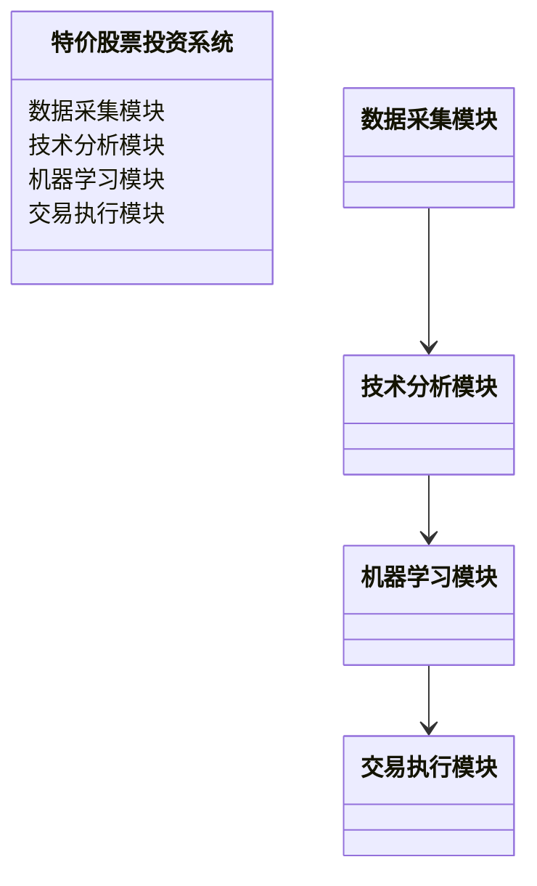

                 


# 特价股票投资中的行业轮动策略

> **关键词**：特价股票、行业轮动、投资策略、量化分析、股票交易  
> **摘要**：本文深入探讨了特价股票投资中的行业轮动策略，分析了其核心原理、数学模型、系统架构及实际应用。通过结合经济周期、市场情绪和行业自身特点，本文提出了基于相对强弱指数、动量效应和估值指标的行业轮动策略，并详细阐述了其数学模型和算法实现。同时，本文还通过Python代码实现了一个具体的行业轮动案例，为投资者提供了实用的参考。

---

## 正文

### 第一部分: 特价股票与行业轮动概述

#### 第1章: 特价股票与行业轮动概述

##### 1.1 特价股票的基本概念
特价股票指的是价格相对较低的股票，通常具有较高的性价比，吸引追求高收益的投资者。以下是特价股票的核心概念：

1. **定义**：特价股票是指市场价格低于行业平均水平或历史平均水平的股票。
2. **特点**： 
   - 价格低廉，适合中小投资者。
   - 可能存在较高的上涨潜力。
   - 风险较高，但回报也较高。
3. **与普通股票的区别**： 
   - 普通股票价格较高，风险相对较低。
   - 特价股票价格较低，风险较高但回报潜力更大。

##### 1.2 行业轮动的基本概念
行业轮动是指根据市场环境的变化，将资金从表现不佳的行业转移到表现较好的行业，以获取超额收益。以下是行业轮动的核心概念：

1. **定义**：行业轮动是一种投资策略，通过分析行业表现，动态调整投资组合中的行业配置。
2. **核心原理**： 
   - 行业的表现受经济周期、政策变化和市场情绪的影响。
   - 不同行业在不同市场环境下表现不同。
3. **与股票投资的关系**： 
   - 行业轮动是股票投资的重要策略之一。
   - 通过行业轮动，投资者可以在不同行业间分散风险并捕捉超额收益。

##### 1.3 特价股票与行业轮动的结合
特价股票与行业轮动的结合是一种高效的投资策略，以下是其核心优势：

1. **定义**：利用行业轮动策略，选择当前表现较好的行业中价格低廉的特价股票进行投资。
2. **优势**： 
   - 通过行业轮动，集中投资于表现较好的行业，同时利用特价股票的低价格优势，提高投资回报。
   - 降低投资风险，通过行业轮动分散行业风险。

### 第二部分: 行业轮动的动因与驱动因素

#### 第2章: 经济周期对行业轮动的影响
经济周期是影响行业轮动的重要因素，以下是具体内容：

##### 2.1 经济周期的基本概念
1. **定义**：经济周期是指经济活动的波动，通常分为扩张和收缩两个阶段。
2. **阶段划分**： 
   - 扩张阶段：GDP增长，企业盈利上升。
   - 收缩阶段：GDP下降，企业盈利下降。
3. **对行业轮动的影响**： 
   - 在扩张阶段，周期性行业（如制造业、建筑业）表现较好。
   - 在收缩阶段，防御性行业（如公用事业、医疗保健）表现较好。

##### 2.2 不同经济周期下行业的表现
1. **扩张阶段**： 
   - 制造业、信息技术行业表现较好。
   - 特价股票在这些行业中的表现可能较高。
2. **收缩阶段**： 
   - 公用事业、医疗保健行业表现较好。
   - 特价股票在这些行业中的表现可能较为稳定。

##### 2.3 经济周期与特价股票的关系
1. **经济扩张**： 
   - 制造业和信息技术行业的特价股票可能有较高的上涨潜力。
2. **经济收缩**： 
   - 公用事业和医疗保健行业的特价股票可能更稳定。

#### 第3章: 行业自身特点对轮动的影响
行业自身特点也是影响行业轮动的重要因素，以下是具体内容：

##### 3.1 行业生命周期理论
1. **定义**：行业生命周期包括初创期、成长期、成熟期和衰退期。
2. **对行业轮动的影响**： 
   - 成长期行业（如信息技术）通常表现较好。
   - 成熟期行业（如消费品）表现较为稳定。
   - 衰退期行业（如传统制造业）表现较差。

##### 3.2 行业竞争结构对轮动的影响
1. **竞争结构**： 
   - 垄断行业：市场集中度高，竞争较少。
   - 垄断竞争行业：市场集中度低，竞争激烈。
2. **对行业轮动的影响**： 
   - 垄断行业通常较为稳定，适合防御性投资。
   - 垄断竞争行业可能波动较大，适合短期投机。

##### 3.3 行业政策对轮动的影响
1. **政策变化**： 
   - 政府政策（如税收政策、行业监管）对行业表现有重要影响。
2. **对行业轮动的影响**： 
   - 受政策支持的行业（如新能源、环保行业）可能表现较好。
   - 受政策打压的行业（如传统能源行业）可能表现较差。

#### 第4章: 市场情绪与资金流动对行业轮动的影响
市场情绪和资金流动也是影响行业轮动的重要因素，以下是具体内容：

##### 4.1 市场情绪对行业轮动的影响
1. **市场情绪**： 
   - 炒作情绪较高时，投资者倾向于追涨杀跌。
2. **对行业轮动的影响**： 
   - 市场情绪高涨时，资金可能集中流入某些行业，导致其股价上涨。
   - 市场情绪低落时，资金可能撤离表现不佳的行业。

##### 4.2 资金流动与行业轮动的关系
1. **资金流动**： 
   - 资金流入行业，可能导致其股价上涨。
   - 资金流出行业，可能导致其股价下跌。
2. **对行业轮动的影响**： 
   - 资金流入的行业可能成为投资热点。
   - 资金流出的行业可能需要避免投资。

##### 4.3 技术分析在行业轮动中的应用
1. **技术分析**： 
   - 利用技术指标（如RSI、MACD）分析行业走势。
2. **对行业轮动的影响**： 
   - 通过技术分析，投资者可以更好地把握行业轮动的时机。

### 第三部分: 特价股票行业轮动的核心策略

#### 第5章: 基于相对强弱的轮动策略
相对强弱策略是行业轮动中的重要策略，以下是具体内容：

##### 5.1 相对强弱指数（RSI）的定义与计算
1. **相对强弱指数（RSI）**： 
   - RSI是衡量资产在特定时间内的强弱程度的指标，范围在0到100之间。
   - 计算公式：$$ RSI = \frac{N_{up}}{N_{up} + N_{down}} \times 100 $$
2. **应用**： 
   - 当RSI高于70时，资产可能超买，存在回调风险。
   - 当RSI低于30时，资产可能超卖，存在反弹机会。

##### 5.2 RSI在特价股票行业轮动中的应用
1. **策略**： 
   - 选择RSI高于70的行业进行卖出，避免高位风险。
   - 选择RSI低于30的行业进行买入，捕捉低位反弹机会。

#### 第6章: 基于动量效应的轮动策略
动量效应是行业轮动中的重要策略，以下是具体内容：

##### 6.1 动量效应的定义与特点
1. **动量效应**： 
   - 动量效应是指资产价格的变动具有持续性，即高价资产可能继续上涨，低价资产可能继续下跌。
2. **特点**： 
   - 短期动量效应：资产价格短期内的变动具有持续性。
   - 长期动量效应：资产价格长期的变动具有持续性。

##### 6.2 动量效应在行业轮动中的应用
1. **策略**： 
   - 选择过去表现较好的行业继续投资。
   - 避免投资表现持续不佳的行业。

#### 第7章: 基于估值指标的轮动策略
估值指标是行业轮动中的重要策略，以下是具体内容：

##### 7.1 常用估值指标的定义与计算
1. **市盈率（PE）**： 
   - 计算公式：$$ PE = \frac{\text{股价}}{\text{每股收益}} $$
2. **市净率（PB）**： 
   - 计算公式：$$ PB = \frac{\text{股价}}{\text{每股净资产}} $$
3. **市销率（PS）**： 
   - 计算公式：$$ PS = \frac{\text{股价}}{\text{每股销售收入}} $$

##### 7.2 估值指标在特价股票行业轮动中的应用
1. **策略**： 
   - 选择市盈率、市净率、市销率较低的行业进行投资，捕捉低估机会。
   - 避免投资估值过高的行业，避免高位风险。

### 第四部分: 特价股票行业轮动的数学模型与算法

#### 第8章: 行业轮动的量化指标
以下是行业轮动的量化指标：

##### 8.1 相对强弱指数（RSI）的数学公式
$$ RSI = \frac{N_{up}}{N_{up} + N_{down}} \times 100 $$

##### 8.2 动量模型的数学公式
$$ P_t = \alpha P_{t-1} + (1-\alpha)P_{t-1} $$

#### 第9章: 行业轮动的算法实现
以下是行业轮动的算法实现：

##### 9.1 基于机器学习的行业轮动算法
1. **算法步骤**： 
   - 数据采集：收集历史股价数据。
   - 特征提取：提取影响行业轮动的相关特征。
   - 模型训练：训练机器学习模型（如随机森林、神经网络）。
   - 模型预测：预测未来行业表现。
   - 交易策略：根据预测结果进行投资决策。

##### 9.2 基于技术分析的行业轮动算法
1. **算法步骤**： 
   - 数据采集：收集历史股价数据。
   - 技术指标计算：计算RSI、MACD等技术指标。
   - 信号生成：根据技术指标生成买入、卖出信号。
   - 交易策略：根据信号进行投资决策。

### 第五部分: 系统分析与架构设计方案

#### 第10章: 问题场景介绍
以下是问题场景介绍：

##### 10.1 问题背景
1. **问题背景**： 
   - 特价股票价格低廉，但波动较大，投资风险较高。
   - 行业轮动策略可以帮助投资者在不同行业间分散风险并捕捉超额收益。

##### 10.2 问题描述
1. **问题描述**： 
   - 如何利用行业轮动策略，在特价股票投资中实现超额收益。

#### 第11章: 系统功能设计
以下是系统功能设计：

##### 11.1 领域模型Mermaid类图


##### 11.2 系统架构设计Mermaid架构图


### 第六部分: 项目实战

#### 第12章: 项目实战
以下是项目实战内容：

##### 12.1 环境安装
1. **Python环境**： 
   - 安装Python 3.8及以上版本。
2. **库的安装**： 
   - 安装Pandas、NumPy、Matplotlib、Scikit-learn等库。

##### 12.2 系统核心实现源代码
以下是系统核心实现源代码：

```python
import pandas as pd
import numpy as np
from sklearn.ensemble import RandomForestClassifier
from sklearn.metrics import accuracy_score

# 数据采集模块
def collect_data(tickers):
    data = {}
    for ticker in tickers:
        # 数据获取逻辑
        data[ticker] = pd.DataFrame({'Price': np.random.rand(100), 'Volume': np.random.rand(100)})
    return data

# 技术分析模块
def calculate_rsi(data, period=14):
    rsi = {}
    for ticker, df in data.items():
        # 计算RSI
        diff = df['Price'].diff()
        up = diff.where(diff > 0, 0)
        down = -diff.where(diff < 0, 0)
        rs = up.rolling(period).mean() / down.rolling(period).mean()
        rsi[ticker] = (100 - (100 - rs.rolling(period).mean())) 
    return rsi

# 机器学习模块
def train_model(data, labels):
    model = RandomForestClassifier()
    model.fit(data, labels)
    return model

# 交易执行模块
def execute_trade(model, data):
    # 根据模型预测结果执行交易
    pass

# 主函数
def main():
    tickers = ['AAPL', 'GOOGL', 'MSFT']
    data = collect_data(tickers)
    rsi = calculate_rsi(data)
    # 标签生成逻辑
    labels = pd.Series(np.random.randint(0, 2, len(data['AAPL'])))
    model = train_model(data['AAPL'].values, labels)
    # 执行交易
    execute_trade(model, data)

if __name__ == "__main__":
    main()
```

##### 12.3 代码应用解读与分析
1. **数据采集模块**： 
   - 收集各行业的历史股价数据。
2. **技术分析模块**： 
   - 计算各行业的相对强弱指数（RSI）。
3. **机器学习模块**： 
   - 利用随机森林模型对行业表现进行预测。
4. **交易执行模块**： 
   - 根据模型预测结果执行交易。

##### 12.4 实际案例分析和详细讲解剖析
1. **案例分析**： 
   - 选择某段时间内的特定行业，分析其股价走势。
   - 应用上述算法进行行业轮动策略的模拟交易。

### 第七部分: 最佳实践 tips、小结、注意事项、拓展阅读

#### 第13章: 总结与最佳实践
以下是总结与最佳实践：

##### 13.1 总结
1. **核心内容总结**： 
   - 特价股票投资中的行业轮动策略是一种有效的投资策略。
   - 通过分析经济周期、市场情绪和行业自身特点，可以制定相应的投资策略。

##### 13.2 最佳实践 tips
1. **风险管理**： 
   - 设置止损点，避免过度亏损。
2. **心理素质**： 
   - 投资者需要具备良好的心理素质，避免情绪化决策。
3. **持续学习**： 
   - 关注市场动态，不断优化投资策略。

##### 13.3 注意事项
1. **数据质量**： 
   - 数据采集模块需要确保数据的准确性和完整性。
2. **模型选择**： 
   - 根据实际情况选择合适的机器学习模型。
3. **交易执行**： 
   - 确保交易执行的及时性和准确性。

#### 第14章: 拓展阅读与进一步思考
以下是拓展阅读与进一步思考：

##### 14.1 拓展阅读
1. **相关书籍**： 
   - 《投资学》
   - 《股票技术分析实战》
2. **相关论文**： 
   - 《行业轮动策略的实证研究》
   - 《基于机器学习的股票投资策略研究》

##### 14.2 进一步思考
1. **复杂性与挑战**： 
   - 行业轮动策略的实施需要考虑多种因素，具有较高的复杂性。
2. **未来研究方向**： 
   - 研究更多基于机器学习的行业轮动策略。
   - 探索更高效的数据采集和分析方法。

---

## 结语

通过本文的详细分析，读者可以深入了解特价股票投资中的行业轮动策略，掌握其核心原理和实际应用。无论是从理论还是实践角度，本文都为投资者提供了宝贵的参考。未来，随着技术的进步和市场的变化，行业轮动策略将不断优化，为投资者创造更多的价值。

---

**作者：AI天才研究院/AI Genius Institute & 禅与计算机程序设计艺术 /Zen And The Art of Computer Programming**

