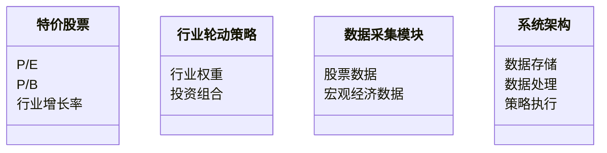
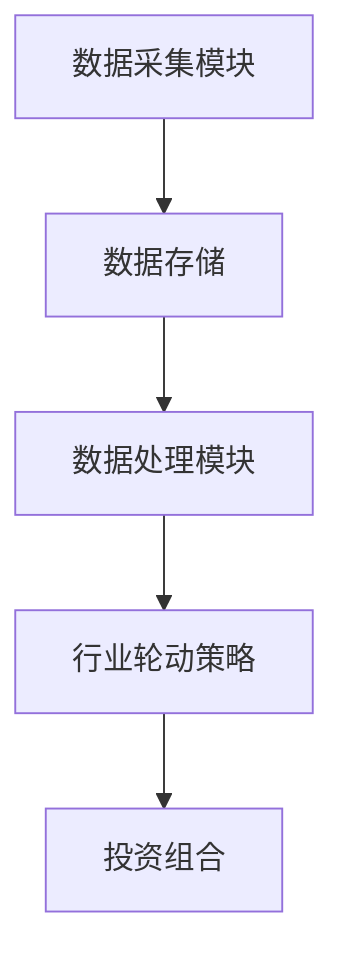

                 


# 特价股票投资中的行业轮动策略研究

## 关键词：特价股票、行业轮动、投资策略、算法原理、数学模型

## 摘要：本文深入探讨了特价股票投资中的行业轮动策略，分析了特价股票的特征，行业轮动的驱动因素，以及如何利用算法和数学模型构建有效的投资策略。文章详细讲解了行业轮动模型的构建过程，包括数据收集、预处理、特征选择、模型训练和优化，并通过实际案例展示了策略的实施过程和效果。

---

## 第1章: 特价股票与行业轮动策略的背景介绍

### 1.1 特价股票的基本概念
#### 1.1.1 特价股票的定义与特征
- **定义**：特价股票是指市场价格显著低于其内在价值的股票。
- **特征**：
  - 低市盈率（P/E）：$$P/E = \frac{\text{股价}}{\text{每股净利润}}$$
  - 低市净率（P/B）：$$P/B = \frac{\text{股价}}{\text{每股净资产}}$$
  - 股价与价值的偏离度：$$\text{偏离度} = \frac{\text{股价} - \text{内在价值}}{\text{内在价值}}$$

#### 1.1.2 特价股票的投资价值
- **低估价值**：股价低于内在价值，存在上涨潜力。
- **风险较低**：通常出现在成熟行业，风险相对可控。
- **高回报潜力**：一旦市场发现其价值，股价可能迅速反弹。

#### 1.1.3 特价股票的市场表现
- **周期性波动**：在市场低迷时更容易出现特价股票。
- **行业差异**：不同行业中的特价股票表现不同。

### 1.2 行业轮动策略的基本概念
#### 1.2.1 行业轮动的定义与机制
- **定义**：根据市场环境变化，投资于表现较好的行业。
- **机制**：
  - 宏观经济因素：如GDP增长、利率变化。
  - 行业周期：行业自身的发展阶段。
  - 市场情绪：投资者偏好变化。

#### 1.2.2 行业轮动的驱动因素
- **宏观经济因素**：如经济周期、货币政策。
- **行业周期性**：如科技行业波动较大，传统行业相对稳定。
- **市场情绪与资金流动**：资金流向表现较好的行业。

#### 1.2.3 行业轮动的周期性分析
- **周期性**：行业轮动通常呈现周期性，如科技、消费、能源行业的轮动。

### 1.3 特价股票与行业轮动策略的结合
#### 1.3.1 特价股票在行业轮动中的地位
- 特价股票通常出现在被市场忽视或低估的行业中。
- 行业轮动策略可以帮助投资者识别这些行业中的特价股票。

#### 1.3.2 行业轮动策略对特价股票投资的影响
- 提高投资效率：通过行业轮动，投资者可以集中投资于当前表现较好的行业中的特价股票。
- 分散风险：通过行业轮动，投资者可以分散投资风险，避免单一行业的波动影响整体投资。

#### 1.3.3 特价股票投资中的行业轮动策略的优势
- **及时捕捉市场机会**：行业轮动策略能够快速响应市场变化，抓住行业轮动带来的投资机会。
- **提高收益**：通过投资于表现较好的行业中的特价股票，投资者可以获得超额收益。
- **降低风险**：通过行业轮动，投资者可以避免在行业低迷时期投资于该行业，从而降低投资风险。

## 1.4 本章小结
本章介绍了特价股票和行业轮动策略的基本概念，分析了两者结合的必要性和优势。通过对行业轮动策略的驱动因素和周期性分析，为后续策略的构建奠定了基础。

---

## 第2章: 特价股票与行业轮动策略的核心概念

### 2.1 特价股票的特征分析
#### 2.1.1 市盈率（P/E）分析
- 低市盈率通常意味着股票价格被低估，具有较高的投资价值。
- 例如，若某股票的市盈率为10，而行业平均市盈率为15，则该股票可能具有较高的投资价值。

#### 2.1.2 市净率（P/B）分析
- 低市净率同样表明股票价格被低估。
- 例如，若某股票的市净率为1.5，而行业平均市净率为2，则该股票可能具有较高的投资价值。

#### 2.1.3 股价与价值的偏离度分析
- 计算公式：$$\text{偏离度} = \frac{\text{股价} - \text{内在价值}}{\text{内在价值}}$$
- 负偏离度表示股价低于内在价值，具有投资价值。

### 2.2 行业轮动的驱动因素
#### 2.2.1 宏观经济因素
- 经济周期：在经济增长期，周期性行业（如制造业、建筑业）表现较好；在经济衰退期，防御性行业（如公用事业、医疗保健）表现较好。
- 利率变化：低利率环境下，高分红行业的吸引力增强。

#### 2.2.2 行业周期性因素
- 行业生命周期：不同阶段的行业表现不同。例如，成长期的科技行业可能具有高增长潜力，而成熟期的传统行业可能更注重稳定收益。

#### 2.2.3 市场情绪与资金流动
- 投资者情绪：市场情绪高涨时，科技、消费等行业可能被高估；市场情绪低迷时，防御性行业可能被低估。
- 资金流动：资金倾向于流向表现较好的行业，形成正反馈。

### 2.3 特价股票与行业轮动策略的关系
#### 2.3.1 特价股票在行业轮动中的角色
- 特价股票通常出现在被市场忽视或低估的行业中，行业轮动策略可以帮助投资者发现这些行业中的投资机会。

#### 2.3.2 行业轮动策略对特价股票投资的影响
- 通过行业轮动，投资者可以集中投资于当前表现较好的行业中的特价股票，提高投资效率。

#### 2.3.3 特价股票与行业轮动策略的协同效应
- 行业轮动策略能够帮助投资者在不同的经济周期中选择合适的行业，而特价股票则提供了在这些行业中投资的机会。

### 2.4 本章小结
本章深入分析了特价股票的特征以及行业轮动的驱动因素，揭示了两者之间的协同效应。通过结合行业轮动策略和特价股票的特征，投资者可以在不同的市场环境下找到合适的投资机会。

---

## 第3章: 特价股票与行业轮动策略的算法原理

### 3.1 行业轮动策略的算法框架
#### 3.1.1 数据收集与预处理
- 数据来源：股票历史数据、行业数据、宏观经济数据等。
- 数据清洗：处理缺失值、异常值等。

#### 3.1.2 特征选择
- 选择影响行业轮动的关键特征，如市盈率、市净率、行业增长率等。

#### 3.1.3 模型构建
- 使用机器学习算法（如回归分析、随机森林）构建行业轮动模型。

#### 3.1.4 模型优化
- 调整模型参数，验证模型的准确性和稳定性。

### 3.2 行业轮动策略的数学模型
#### 3.2.1 特价股票筛选模型
- 使用多因子模型筛选特价股票：$$\text{综合评分} = \alpha \times \text{市盈率} + \beta \times \text{市净率} + \gamma \times \text{行业增长率}$$
  - 其中，$\alpha + \beta + \gamma = 1$，$\alpha = 0.4$, $\beta = 0.3$, $\gamma = 0.3$。

#### 3.2.2 行业轮动模型
- 使用动态资产分配模型：$$w_i = \frac{e^{r_i}}{\sum_j e^{r_j}}$$
  - 其中，$w_i$为第i个行业的权重，$r_i$为第i个行业的预期收益率。

### 3.3 算法实现
#### 3.3.1 数据预处理代码
```python
import pandas as pd

# 假设data是一个包含股票数据的DataFrame
data = pd.read_csv('stock_data.csv')
data.dropna(inplace=True)
data['date'] = pd.to_datetime(data['date'])
data.set_index('date', inplace=True)
```

#### 3.3.2 特征选择与模型训练
```python
from sklearn.ensemble import RandomForestClassifier
from sklearn.model_selection import train_test_split

# 选择特征
features = ['P/E', 'P/B', '行业增长率']
target = '是否特价股票'

X = data[features]
y = data[target]

X_train, X_test, y_train, y_test = train_test_split(X, y, test_size=0.2)

model = RandomForestClassifier()
model.fit(X_train, y_train)
```

#### 3.3.3 模型优化与验证
```python
from sklearn.metrics import accuracy_score

y_pred = model.predict(X_test)
print('准确率:', accuracy_score(y_test, y_pred))
```

### 3.4 本章小结
本章详细讲解了行业轮动策略的算法框架，包括数据预处理、特征选择、模型构建和优化。通过数学模型和Python代码的实现，展示了如何利用算法筛选特价股票并构建行业轮动策略。

---

## 第4章: 特价股票与行业轮动策略的系统分析与架构设计

### 4.1 系统功能设计
#### 4.1.1 领域模型


#### 4.1.2 系统架构设计


### 4.2 系统接口设计
- 数据接口：从数据库获取股票数据。
- 策略接口：根据模型输出投资建议。

### 4.3 本章小结
本章设计了支持行业轮动策略的系统架构，包括数据采集、处理、策略执行等模块，并通过类图和流程图展示了系统的整体架构。

---

## 第5章: 特价股票与行业轮动策略的项目实战

### 5.1 项目环境安装
- 安装必要的库：`pandas`, `numpy`, `scikit-learn`, `matplotlib`。

### 5.2 核心实现代码
#### 5.2.1 数据获取与预处理
```python
import pandas as pd
import numpy as np
import matplotlib.pyplot as plt
from sklearn.ensemble import RandomForestClassifier
from sklearn.model_selection import train_test_split

# 获取数据
data = pd.read_csv('stock_data.csv')

# 数据清洗
data.dropna(inplace=True)
data['date'] = pd.to_datetime(data['date'])
data.set_index('date', inplace=True)

# 特征选择
features = ['P/E', 'P/B', '行业增长率']
target = '是否特价股票'

X = data[features]
y = data[target]

# 划分训练集和测试集
X_train, X_test, y_train, y_test = train_test_split(X, y, test_size=0.2)

# 训练模型
model = RandomForestClassifier()
model.fit(X_train, y_train)

# 验证模型
y_pred = model.predict(X_test)
print('准确率:', accuracy_score(y_test, y_pred))
```

#### 5.2.2 模型优化与分析
```python
importances = model.feature_importances_
feature_names = features

plt.bar(feature_names, importances)
plt.xticks(feature_names, feature_names)
plt.show()
```

### 5.3 实际案例分析
- 案例一：假设当前经济处于衰退期，防御性行业（如公用事业）可能成为投资热点。
- 案例二：在科技行业增长迅速时，选择市盈率和市净率较低的科技公司。

### 5.4 本章小结
本章通过实际项目展示了如何利用算法筛选特价股票并实施行业轮动策略，分析了实际案例并总结了经验教训。

---

## 第6章: 特价股票与行业轮动策略的最佳实践

### 6.1 最佳实践
- **选择合适的行业**：根据经济周期和行业趋势选择投资行业。
- **风险管理**：设置止损点，分散投资组合。
- **定期调整**：根据市场变化定期调整投资组合。

### 6.2 小结
- 行业轮动策略能够帮助投资者在不同市场环境下优化投资组合，提高收益。
- 特价股票是行业轮动策略中的重要组成部分，通过合理筛选和配置，投资者可以实现超额收益。

### 6.3 注意事项
- **市场波动风险**：行业轮动策略可能面临市场波动带来的短期风险。
- **模型局限性**：算法模型可能无法完全预测市场变化，需结合实际情况进行调整。

### 6.4 拓展阅读
- 推荐阅读《投资学基础》和《算法交易入门》。

---

## 作者：AI天才研究院 & 禅与计算机程序设计艺术

---

通过以上步骤，我们构建了一个完整的行业轮动策略，从理论到实践，帮助投资者在特价股票投资中优化收益。希望本文能为投资者提供有价值的参考和指导。

