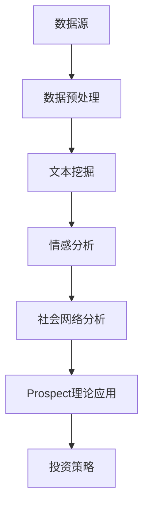

                 


# 特价股票投资中的计算社会科学与行为金融学应用

> 关键词：特价股票投资，行为金融学，计算社会科学，算法，系统设计

> 摘要：本文探讨了特价股票投资中行为金融学和计算社会科学的应用，结合数学模型和算法，分析投资者行为和市场情绪对股票价格的影响，提出基于大数据分析的投资策略。

---

## 第一部分：背景与基础

### 第1章：特价股票投资概述

#### 1.1 特价股票投资的定义与特点
- 特价股票：市场价格远低于其内在价值的股票，常见于市场忽视或低估的企业。
- 特价股票投资：通过分析挖掘这些被低估的股票，寻找潜在收益。

#### 1.2 行为金融学与计算社会科学
- 行为金融学：研究心理因素对投资者决策的影响，挑战传统有效市场假说。
- 计算社会科学：利用大数据和计算方法分析社会现象，应用于金融市场研究。

#### 1.3 结合行为金融学的特价股票投资
- 识别市场情绪波动，捕捉投资机会。
- 分析投资者行为偏差，避免决策错误。

---

## 第二部分：行为金融学的核心理论

### 第2章：基础行为理论

#### 2.1 心理账户理论
- 心理账户：投资者将资金分为不同账户，影响决策。
- 实例：投资者可能将股票投资与存款分开处理，影响风险偏好。

#### 2.2 过度自信效应
- 投资者倾向于过度自信，高估自己分析能力。
- 影响：可能导致过度交易和错误决策。

#### 2.3 损失厌恶理论
- 损失厌恶：人们对损失的敏感度高于收益。
- 影响：投资者可能因害怕亏损而错失投资机会。

### 第3章：Prospect理论

#### 3.1 基本概念
- Prospect理论：描述决策者如何评估风险和收益。
- 曲线分析：收益和损失的概率权重函数。

#### 3.2 应用实例
- 投资者在面对收益和损失时的决策差异。
- 通过Prospect理论预测投资者行为。

---

## 第三部分：计算社会科学中的算法与模型

### 第4章：文本挖掘与情感分析

#### 4.1 文本挖掘
- 技术：从财经新闻和社交媒体提取情感信息。
- 应用：分析市场情绪，预测股价波动。

#### 4.2 情感分析算法
- 方法：基于机器学习的情感分类模型。
- 工具：Python库如TextBlob和 VaderSentiment。

### 第5章：社会网络分析

#### 5.1 社会网络分析
- 技术：识别关键节点和社区结构。
- 应用：分析社交影响，预测市场动向。

---

## 第四部分：系统设计与实战

### 第6章：系统架构设计

#### 6.1 系统功能设计
- 数据采集：实时获取市场数据和社交媒体信息。
- 情感分析：处理文本数据，生成情绪指标。
- 模型构建：基于行为理论建立预测模型。
- 策略制定：生成投资信号，辅助决策。

#### 6.2 系统架构图


### 第7章：项目实战

#### 7.1 环境安装
- 安装Python、Jieba、TextBlob等工具。

#### 7.2 核心实现代码
```python
from textblob import TextBlob
import pandas as pd

def analyze_sentiment(text):
    blob = TextBlob(text)
    return blob.sentiment.polarity

data = pd.read_csv('stock_reviews.csv')
data['sentiment'] = data['review'].apply(analyze_sentiment)
```

#### 7.3 结果分析
- 分析社交媒体情绪与股票价格的相关性。
- 验证模型预测准确性，评估策略的有效性。

---

## 第五部分：总结与展望

### 第8章：总结
- 综合运用行为金融学和计算社会科学理论。
- 基于大数据分析，辅助投资决策。

### 第9章：未来展望
- 结合更多数据源，如语音和图像。
- 开发更复杂的预测模型，提升投资收益。

---

## 作者：AI天才研究院 & 禅与计算机程序设计艺术

---

本文通过理论与实践结合，展示了行为金融学和计算社会科学在特价股票投资中的应用，帮助投资者更好地理解市场行为，做出明智决策。

