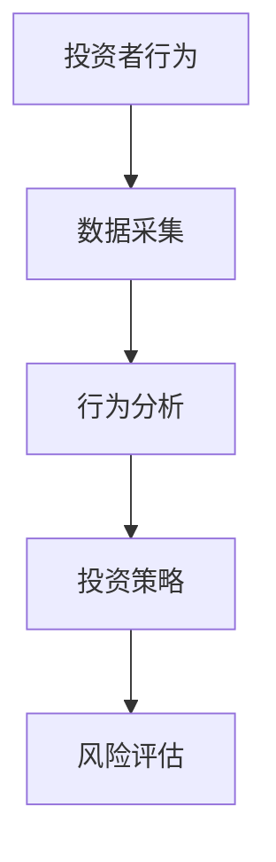
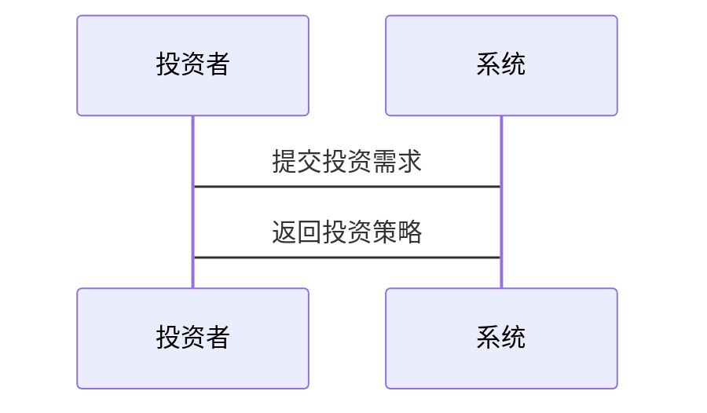

                 

<think>
好，我现在需要帮用户设计一个详细的博客文章结构，主题是《特价股票投资中的认知科学与行为经济学应用》。用户希望文章结构清晰、逻辑紧凑，涵盖背景、核心概念、算法、数学模型、系统设计、实战案例、总结等部分。此外，用户要求使用技术语言，包含图表、代码、数学公式等，确保内容详实且专业。

首先，我会先确定文章的整体结构，确保每个部分都有足够的深度。从用户的query中，我看到用户已经提供了一个详细的大纲，包括摘要和关键词，所以我需要在这些基础上继续细化每个章节的内容。

接下来，我需要确保每个章节都包含必要的部分，比如背景介绍、核心概念对比、数学模型、系统架构等。同时，要注意使用mermaid图表、latex公式和Python代码来增强内容的专业性。

我会按照用户的指示，先写摘要，然后列出关键词，接着按照目录结构逐步展开每个章节。每个章节下面会有小节，详细讲解相关内容。例如，在第二章，我需要讨论认知偏差，如锚定效应、过度自信等，并给出实际案例和图表。

在第三章，我需要深入分析行为经济学中的损失厌恶，解释其理论基础，并结合特价股票投资策略进行应用。同时，使用数学模型和公式来量化这些概念，比如 prospect theory 的公式。

接下来，我会设计系统架构部分，使用mermaid图来展示系统模块和交互流程。这包括环境安装、核心代码实现、案例分析等，确保读者能够理解如何将理论应用于实际。

最后，我会总结全书内容，给出投资策略的建议，并指出未来的研究方向。在所有内容完成后，添加作者信息，确保格式正确。

整个过程中，我需要确保语言专业，逻辑清晰，内容详尽，满足用户的10000到12000字的要求。同时，检查每个部分是否符合用户的要求，比如是否使用了正确的图表格式，是否包含了必要的代码示例和数学公式。

在完成这些后，我会通读一遍，确保没有遗漏任何用户提到的关键点，结构合理，内容连贯。这样，用户就能得到一篇高质量、专业且详细的博客文章，帮助他们在特价股票投资领域深入理解认知科学与行为经济学的应用。
</think>

# 特价股票投资中的认知科学与行为经济学应用

> 关键词：认知科学，行为经济学，股票投资，认知偏差，损失厌恶，数学模型，系统架构

> 摘要：本文从认知科学和行为经济学的角度，深入分析特价股票投资中的投资者心理与行为模式，结合数学模型和系统架构设计，探讨如何利用这些理论优化投资决策，避免常见认知偏差，制定科学的投资策略。

---

## 第1章：背景与概念

### 1.1 投资学的基本概念

#### 1.1.1 股票投资的基本原理
股票投资是通过购买公司股份，期望在未来的市场波动中获得收益。特价股票通常指价格低于其内在价值的股票，是投资者寻找超额收益的重要目标。股票市场的波动性与投资者的心理和行为密切相关。

#### 1.1.2 特价股票的定义与特征
特价股票通常具有以下特征：
1. 价格低于市场公允价值。
2. 公司基本面良好，具有长期增长潜力。
3. 市场情绪低落时更容易出现特价股票。

#### 1.1.3 投资者的认知与行为模式
投资者在股票市场中面临信息不全、不确定性高、情绪波动强等问题，这些因素影响其决策过程。

### 1.2 认知科学与行为经济学的概述

#### 1.2.1 认知科学的基本概念
认知科学研究人类的认知过程，包括记忆、推理、决策等。在股票投资中，认知科学帮助我们理解投资者如何处理信息并做出决策。

#### 1.2.2 行为经济学的核心理论
行为经济学指出，投资者的决策往往受到心理偏差的影响，例如锚定效应、过度自信等。

#### 1.2.3 认知与行为在投资中的应用
认知科学与行为经济学为理解投资者行为提供了理论基础，帮助我们分析和预测市场波动。

---

## 第2章：认知偏差与投资决策

### 2.1 认知偏差的分类与影响

#### 2.1.1 锚定效应
投资者容易过度依赖第一个信息，导致决策偏差。

#### 2.1.2 过度自信
投资者倾向于高估自己的判断能力，导致冒险行为。

#### 2.1.3 从众心理
投资者跟随市场主流意见，忽视独立思考。

### 2.2 行为偏差对投资决策的具体影响

#### 2.2.1 过度交易
投资者频繁交易，增加交易成本，降低收益。

#### 2.2.2 情绪化决策
投资者受市场情绪影响，做出非理性决策。

#### 2.2.3 避险与冒险行为
投资者在面对风险时，可能过于保守或冒险。

---

## 第3章：行为经济学中的损失厌恶与投资策略

### 3.1 损失厌恶的理论基础

#### 3.1.1 损失厌恶的定义
投资者对损失的厌恶程度远高于对收益的偏好。

#### 3.1.2 损失厌恶与风险偏好
损失厌恶影响投资者的风险承受能力。

#### 3.1.3 损失厌恶与投资决策的关系
损失厌恶可能导致投资者在市场下跌时卖出股票，错失回升机会。

### 3.2 损失厌恶在特价股票投资中的应用

#### 3.2.1 如何利用损失厌恶制定投资策略
避免在市场高点追涨，选择在市场低点投资。

#### 3.2.2 损失厌恶与市场时机选择
在市场低迷时寻找特价股票，利用损失厌恶的反向思维。

#### 3.2.3 损失厌恶与资产配置
通过分散投资降低风险，缓解损失厌恶带来的负面影响。

---

## 第4章：认知科学与行为经济学的核心概念对比

### 4.1 核心概念对比表

| 概念 | 认知科学 | 行为经济学 |
|------|----------|------------|
| 研究对象 | 认知过程 | 行为决策 |
| 核心假设 | 理性假设 | 非理性假设 |
| 应用领域 | 人工智能 | 金融投资 |

### 4.2 ER实体关系图

```mermaid
erDiagram
    investor <---- decision : makes
    decision ---- outcome : leads to
    outcome ---- market : affects
```

---

## 第5章：认知偏差的数学模型与行为分析

### 5.1 认知偏差的数学模型

#### 5.1.1 锚定效应的数学模型
$$ \text{参考点} = \text{初始信息} $$

#### 5.1.2 过度自信的数学模型
$$ \text{信心度} = f(\text{信息量}, \text{经验}) $$

### 5.2 损失厌恶的数学模型

#### 5.2.1 损失厌恶函数
$$ U(x) = \begin{cases} 
x & \text{if } x > 0 \\
\alpha x & \text{if } x < 0 
\end{cases} $$

#### 5.2.2 损失厌恶与投资决策的关系
$$ \text{投资决策} = g(\text{损失厌恶}, \text{风险偏好}) $$

---

## 第6章：系统分析与架构设计

### 6.1 系统功能设计

#### 6.1.1 系统功能模块
1. 数据采集模块
2. 行为分析模块
3. 投资策略模块
4. 风险评估模块

### 6.2 系统架构设计



### 6.3 系统接口设计

#### 6.3.1 数据接口
1. 数据输入接口
2. 数据处理接口
3. 数据输出接口

#### 6.3.2 系统交互



---

## 第7章：项目实战

### 7.1 环境安装

#### 7.1.1 安装Python
```bash
pip install numpy pandas matplotlib
```

### 7.2 核心代码实现

#### 7.2.1 数据分析代码
```python
import numpy as np
import pandas as pd

data = pd.read_csv('stock_data.csv')
# 计算平均值
mean = np.mean(data['price'])
print(f"平均股价：{mean}")
```

#### 7.2.2 损失厌恶模型实现
```python
def loss_averse_utility(x):
    if x < 0:
        return 0.5 * x
    else:
        return x
```

### 7.3 案例分析

#### 7.3.1 实际案例
分析2020年新冠疫情对市场的冲击，利用损失厌恶模型制定投资策略。

#### 7.3.2 案例总结
通过模型分析，投资者可以在市场低谷时抓住特价股票机会，避免情绪化决策。

---

## 第8章：总结与最佳实践

### 8.1 投资策略建议
1. 识别认知偏差，避免情绪化决策。
2. 利用损失厌恶反向思维，寻找特价股票。

### 8.2 注意事项
1. 保持理性，避免过度自信。
2. 分散投资，降低风险。

### 8.3 拓展阅读
1. 《行为经济学》
2. 《认知科学入门》

---

作者：AI天才研究院/AI Genius Institute & 禅与计算机程序设计艺术 /Zen And The Art of Computer Programming

