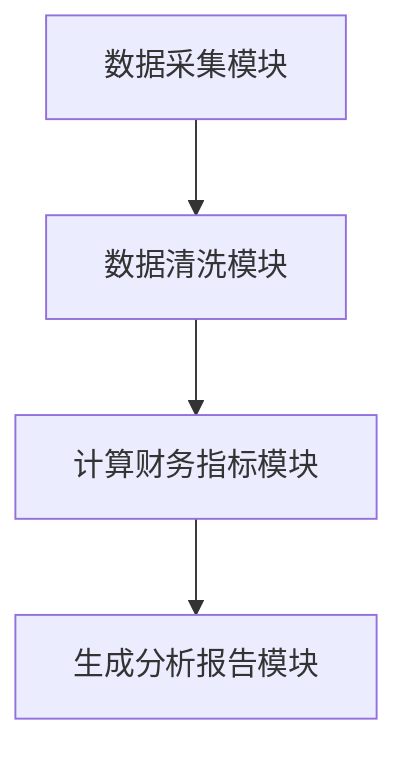
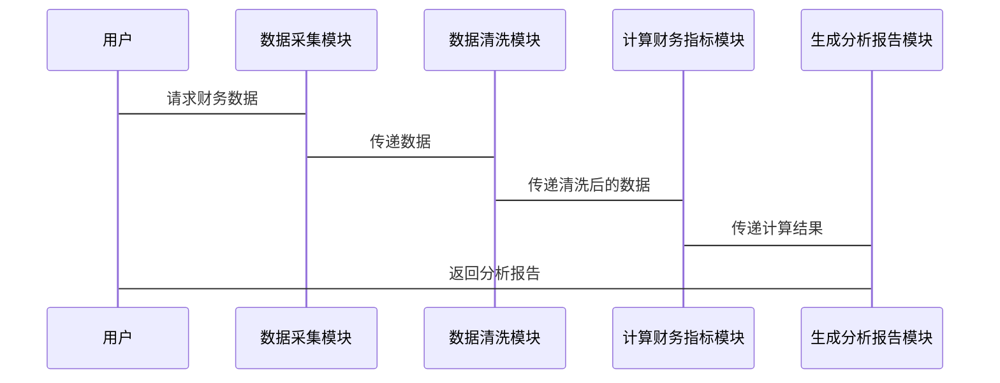

                 


# 特价股票投资中的财务报表分析技巧

**关键词：** 特价股票、财务报表分析、投资技巧、财务指标、风险管理

**摘要：**  
本文旨在探讨如何在特价股票投资中有效利用财务报表分析技巧，帮助投资者识别潜在的投资机会，评估公司财务健康状况，并制定合理的投资策略。通过系统地分析财务报表的核心概念、算法原理、系统架构及实际案例，本文为投资者提供了一套科学的分析方法和工具，以在特价股票市场中做出明智的投资决策。

---

## 第1章: 特价股票与财务报表分析概述

### 1.1 特价股票的定义与特点

#### 1.1.1 特价股票的定义  
特价股票通常指的是价格远低于其行业平均水平或历史平均水平的股票。这类股票通常具有较高的波动性和潜在的高回报率，但也伴随着较高的风险。

#### 1.1.2 特价股票的市场特点  
- **低估值**：特价股票往往市盈率、市净率等估值指标低于行业平均水平。  
- **高波动性**：由于市场对这类股票的未来走势存在较大不确定性，其价格波动较大。  
- **潜在高回报**：如果公司基本面改善或市场情绪好转，特价股票可能会出现大幅反弹。  

#### 1.1.3 特价股票的投资风险与机会  
- **风险**：公司基本面差、行业前景不佳、政策风险等。  
- **机会**：市场低估、价值回归、资产重组等。  

### 1.2 财务报表分析的定义与重要性

#### 1.2.1 财务报表分析的定义  
财务报表分析是通过对公司财务报表（资产负债表、利润表、现金流量表）的解读，评估公司的财务状况、经营成果和现金流量，从而为投资决策提供依据。  

#### 1.2.2 财务报表分析在投资中的重要性  
- **评估公司盈利能力**：通过利润表分析公司的收入和利润情况。  
- **评估公司财务健康状况**：通过资产负债表分析公司的资产、负债和所有者权益结构。  
- **评估公司现金流状况**：通过现金流量表分析公司的现金流健康情况。  

#### 1.2.3 财务报表分析的基本方法  
- **趋势分析**：分析公司在不同时间段的财务数据变化趋势。  
- **横向比较**：将公司与行业内的其他公司进行对比分析。  
- **比率分析**：通过计算各项财务比率，评估公司的财务健康状况。  

### 1.3 特价股票投资中的财务报表分析目标

#### 1.3.1 识别公司财务健康状况  
通过分析财务报表，识别公司是否存在财务风险，如高负债率、低现金流等。  

#### 1.3.2 评估公司盈利能力与风险  
通过分析利润率、毛利率等指标，评估公司的盈利能力；通过分析资产负债率、流动比率等指标，评估公司的偿债能力。  

#### 1.3.3 寻找投资机会与规避风险  
通过财务报表分析，识别具有潜在上涨空间的特价股票，同时规避那些财务状况不佳的公司。  

### 1.4 本章小结  
本章介绍了特价股票的定义、特点及其投资风险与机会，同时阐述了财务报表分析在投资中的重要性及其基本方法。通过财务报表分析，投资者可以更好地评估公司的财务状况，从而做出更明智的投资决策。

---

## 第2章: 财务报表的核心概念与联系

### 2.1 财务报表的基本结构

#### 2.1.1 资产负债表  
资产负债表反映了公司在某一特定时点的资产、负债和所有者权益的状况。  
- **资产**：公司拥有的资源，如现金、应收账款、存货等。  
- **负债**：公司欠款，如应付账款、长期借款等。  
- **所有者权益**：公司资产减去负债后的剩余部分，包括股本、资本公积等。  

#### 2.1.2 利润表  
利润表反映了公司在一定会计期间内的收入和利润情况。  
- **收入**：公司通过销售产品或服务获得的收入。  
- **成本**：生产产品或提供服务所发生的成本。  
- **利润**：收入减去成本和费用后的净收益。  

#### 2.1.3 现金流量表  
现金流量表反映了公司在一定会计期间内的现金流入和流出情况。  
- **经营活动现金流**：公司日常经营活动中产生的现金流。  
- **投资活动现金流**：公司投资活动（如购买或出售资产）产生的现金流。  
- **筹资活动现金流**：公司通过筹资活动（如借款或发行股票）产生的现金流。  

### 2.2 财务指标的核心概念

#### 2.2.1 资产负债率  
资产负债率 = 负债总额 / 资产总额  
资产负债率越高，说明公司依赖负债的程度越高，财务风险越大。  

#### 2.2.2 净利润率  
净利润率 = 净利润 / 收入  
净利润率越高，说明公司盈利能力越强。  

#### 2.2.3 每股收益  
每股收益（EPS）= 净利润 / 平均股份数  
每股收益越高，说明公司每股股票的盈利能力越强。  

### 2.3 财务指标的属性特征对比表格

| 指标名称       | 属性         | 定义与意义                           |
|----------------|--------------|--------------------------------------|
| 资产负债率     | 风险指标     | 衡量公司负债与资产的比例，反映财务风险。 |
| 净利润率       | 盈利能力指标 | 衡量公司每单位收入的盈利能力。         |
| 每股收益       | 盈利能力指标 | 衡量公司每股股票的盈利能力。           |

### 2.4 财务报表分析的ER实体关系图

```mermaid
er
  股票
  ----|
  股票代码  (PK)
  公司名称
  行业
  财务报表
  ----|
  股票代码 (FK)
  财务指标
  ----|
  股票代码 (FK)
  指标名称
  指标值
```

### 2.5 本章小结  
本章详细介绍了财务报表的基本结构及其核心概念，并通过对比表格和ER实体关系图，展示了财务指标的属性特征及其在财务报表分析中的作用。

---

## 第3章: 财务报表分析的算法原理

### 3.1 财务报表分析的算法流程


### 3.2 财务指标计算的数学模型

#### 公式3-1: 净资产收益率（ROE）
$$ \text{ROE} = \frac{\text{净利润}}{\text{平均净资产}} $$

#### 公式3-2: 资产负债率
$$ \text{资产负债率} = \frac{\text{负债总额}}{\text{资产总额}} $$

### 3.3 财务报表分析的Python实现

```python
import pandas as pd

# 数据采集与清洗
def fetch_financial_data(stock_code):
    # 假设我们有一个函数来获取股票的财务数据
    # 返回一个包含财务指标的字典
    data = {
        '净利润': 1000000,
        '平均净资产': 5000000,
        '负债总额': 3000000,
        '资产总额': 8000000
    }
    return data

# 计算财务指标
def calculate_ratios(data):
    roe = data['净利润'] / data['平均净资产']
    debt_ratio = data['负债总额'] / data['资产总额']
    return {'ROE': roe, 'Debt Ratio': debt_ratio}

# 主程序
stock_code = 'ABC'
data = fetch_financial_data(stock_code)
ratios = calculate_ratios(data)
print(f"ROE: {ratios['ROE']}")
print(f"Debt Ratio: {ratios['Debt Ratio']}")
```

### 3.4 本章小结  
本章通过流程图和数学公式，详细介绍了财务报表分析的算法流程及其数学模型，并通过Python代码示例展示了如何实现这些计算。

---

## 第4章: 财务报表分析的系统架构设计

### 4.1 系统功能模块划分

#### 模块4-1: 数据采集  
- 从数据库或API获取财务数据。  

#### 模块4-2: 数据清洗  
- 处理缺失值、异常值等数据问题。  

#### 模块4-3: 计算财务指标  
- 根据公式计算各项财务指标。  

#### 模块4-4: 生成分析报告  
- 生成包含财务指标和分析结果的报告。  

### 4.2 系统架构图



### 4.3 系统接口设计  
- 数据接口：通过API获取财务数据。  
- 报告接口：生成包含财务指标的报告。  

### 4.4 系统交互图



### 4.5 本章小结  
本章通过系统架构设计，展示了如何构建一个高效的财务报表分析系统，并通过接口设计和交互图，详细描述了系统的功能模块及其之间的关系。

---

## 第5章: 财务报表分析的项目实战

### 5.1 环境搭建

#### 5.1.1 安装Python和相关库  
- 安装Python 3.x  
- 安装pandas、numpy、matplotlib等库：  
  ```bash
  pip install pandas numpy matplotlib
  ```

### 5.2 系统核心实现源代码

```python
import pandas as pd
import numpy as np
import matplotlib.pyplot as plt

# 数据采集与清洗
def fetch_data(stock_code):
    # 假设我们有一个CSV文件存储了股票数据
    data = pd.read_csv(f'data_{stock_code}.csv')
    return data

# 数据清洗
def clean_data(data):
    # 处理缺失值
    data = data.dropna()
    return data

# 计算财务指标
def calculate_indicators(data):
    # 计算平均净资产收益率（ROE）
    roe = data['净利润'].mean() / data['净资产'].mean()
    # 计算资产负债率
    debt_ratio = data['负债'].sum() / data['资产'].sum()
    return {'ROE': roe, 'Debt Ratio': debt_ratio}

# 可视化分析
def visualize_data(data, stock_code):
    plt.figure(figsize=(10, 6))
    plt.plot(data['日期'], data['股价'], label=f'{stock_code}股价')
    plt.xlabel('日期')
    plt.ylabel('股价')
    plt.title(f'{stock_code}股价走势图')
    plt.legend()
    plt.show()

# 主程序
stock_code = 'ABC'
data = fetch_data(stock_code)
cleaned_data = clean_data(data)
ratios = calculate_indicators(cleaned_data)
visualize_data(cleaned_data, stock_code)

print(f"ROE: {ratios['ROE']}")
print(f"Debt Ratio: {ratios['Debt Ratio']}")
```

### 5.3 代码应用解读与分析

#### 5.3.1 数据采集  
从CSV文件中读取指定股票的财务数据。  

#### 5.3.2 数据清洗  
删除缺失值，确保数据完整性和准确性。  

#### 5.3.3 计算财务指标  
计算ROE和资产负债率，评估公司的财务状况。  

#### 5.3.4 可视化分析  
绘制股价走势图，帮助投资者直观了解股票价格变化趋势。  

### 5.4 实际案例分析

#### 案例背景  
假设我们关注股票代码为“ABC”的公司，其财务数据如下：  

| 日期   | 股价 | 净利润 | 资产 | 负债 |
|--------|------|--------|------|------|
| 2022-12| 5    | 100000 | 500000| 200000|
| 2022-11| 4.5   | 90000  | 480000| 190000|
| 2022-10| 4.8   | 85000  | 460000| 180000|

#### 计算结果  
- ROE = (100000 + 90000 + 85000) / 3 / 平均净资产  
- 平均净资产 = (500000 + 480000 + 460000) / 3 = 476666.67  
- ROE = (275000) / 3 / 476666.67 ≈ 0.200 或 20.0%  
- 资产负债率 = (200000 + 190000 + 180000) / 3 / (500000 + 480000 + 460000) / 3 ≈ 0.37 或 37.0%  

#### 结果解读  
- ROE为20.0%，表明公司在过去三个月中每单位净资产创造了20%的净利润。  
- 资产负债率为37.0%，表明公司负债占资产的比例较低，财务风险较小。  

### 5.5 本章小结  
本章通过实际案例，展示了如何利用Python代码进行财务报表分析，包括数据采集、清洗、计算和可视化。通过案例分析，读者可以更好地理解如何将理论应用于实践。

---

## 第6章: 总结与展望

### 6.1 本章总结  
本文详细探讨了特价股票投资中的财务报表分析技巧，包括财务报表的核心概念、算法原理、系统架构及实际案例分析。通过这些分析，投资者可以更好地识别潜在的投资机会，评估公司的财务健康状况，并制定合理的投资策略。

### 6.2 未来展望  
随着人工智能和大数据技术的不断发展，财务报表分析将更加智能化和自动化。未来的研究可以进一步探索如何利用机器学习算法预测股价走势，或开发更复杂的财务模型来评估公司的长期价值。此外，投资者还可以关注行业动态和政策变化，以更好地应对市场风险。

---

## 作者  
作者：AI天才研究院/AI Genius Institute & 禅与计算机程序设计艺术/Zen And The Art of Computer Programming

