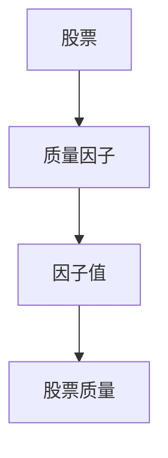
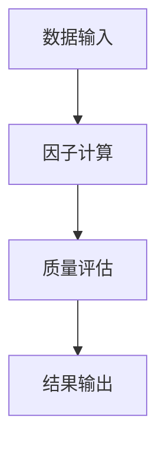
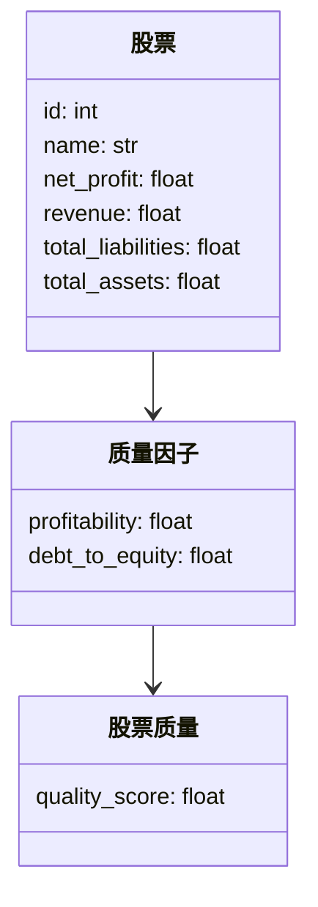
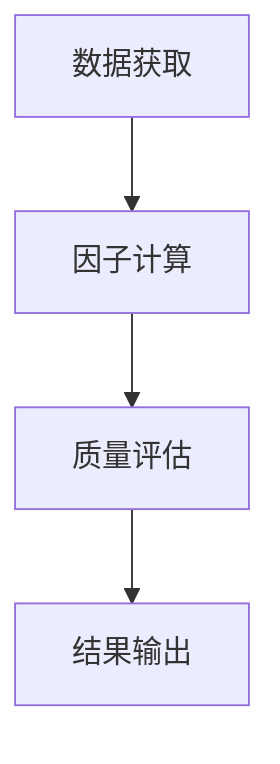

                 


# 特价股票投资中的质量因子分析

> 关键词：特价股票，质量因子，投资分析，股票质量，因子分析

> 摘要：本文深入探讨了特价股票投资中的质量因子分析，从背景介绍、核心概念、算法原理、系统分析、项目实战到最佳实践，全面解析了质量因子在特价股票投资中的重要作用和具体应用方法。

---

## 第1章：特价股票投资与质量因子分析的背景介绍

### 1.1 特价股票投资的定义与特点

#### 1.1.1 特价股票的定义
特价股票通常指价格低于市场平均水平的股票，可能是由于市场波动、公司暂时困境或其他因素导致的股价低估。这种股票往往具有较高的潜在回报，但也伴随着较高的风险。

#### 1.1.2 特价股票投资的特征
- **低估值**：特价股票通常具有较低的市盈率（P/E）或市净率（P/B）。
- **高波动性**：由于股价较低，市场波动可能较大，影响投资者决策。
- **潜在收益**：如果公司基本面改善，股价可能回升，带来较高的投资回报。

#### 1.1.3 特价股票投资的边界与外延
- **边界**：特价股票投资的边界在于合理估值和风险控制，避免盲目追求低价。
- **外延**：包括对公司财务状况、行业地位、管理团队等多方面的综合分析。

### 1.2 质量因子分析的背景与意义

#### 1.2.1 质量因子分析的定义
质量因子分析是一种通过量化股票质量特征来评估投资标的的方法。它结合了公司的财务健康状况、市场地位、管理团队等因素，帮助投资者筛选出具有高质量特性的股票。

#### 1.2.2 质量因子分析的核心要素
- **财务健康状况**：包括盈利能力、资产负债情况等。
- **市场地位**：公司市场份额、行业排名等。
- **管理团队**：管理团队的经验和能力。
- **创新能力**：公司的研发能力和产品创新能力。

#### 1.2.3 质量因子分析在特价股票投资中的作用
- **筛选优质标的**：通过质量因子分析，投资者可以在特价股票中筛选出具有较高潜力的标的。
- **降低投资风险**：通过质量因子分析，可以避免选择基本面较差的低价股，降低投资风险。

### 1.3 质量因子分析的核心概念

#### 1.3.1 质量因子的属性特征
| 因子名称       | 定义                                   | 计算公式                               |
|----------------|--------------------------------------|---------------------------------------|
| 盈利能力       | 公司的盈利能力                        | 净利润 / 营业收入                     |
| 资产负债率     | 公司的债务负担                       | 负债总额 / 资产总额                   |
| 研发投入比例   | 公司在研发上的投入                   | 研发费用 / 营业收入                   |
| 市场地位       | 公司在行业中的排名和市场份额         | -                                     |
| 管理团队能力   | 管理团队的经验和能力                 | -                                     |

#### 1.3.2 质量因子与股票质量的关系
质量因子是衡量股票质量的重要指标，通过综合分析多个质量因子，可以更全面地评估一只股票的投资价值。

#### 1.3.3 质量因子分析的逻辑框架


### 1.4 本章小结

#### 1.4.1 特价股票投资的核心问题
如何在低价股票中筛选出具有高质量特性的标的，以实现较高的投资回报。

#### 1.4.2 质量因子分析的关键点
通过多维度的质量因子分析，综合评估股票的质量，降低投资风险。

#### 1.4.3 本书的研究目标与框架
本书旨在通过质量因子分析，帮助投资者在特价股票中筛选出具有高质量特性的标的，实现稳健的投资回报。

---

## 第2章：质量因子分析的核心概念与联系

### 2.1 质量因子分析的原理

#### 2.1.1 质量因子的定义与分类
质量因子是对股票质量的量化指标，通常包括盈利能力、资产负债率、研发费用等。

#### 2.1.2 质量因子的计算方法
- **盈利能力**：净利润 / 营业收入。
- **资产负债率**：负债总额 / 资产总额。

#### 2.1.3 质量因子的评价标准
- **盈利能力**：高净利润率表示公司盈利能力强。
- **资产负债率**：低负债率表示公司财务风险较低。

### 2.2 质量因子与股票质量的关系

#### 2.2.1 质量因子的属性特征对比
| 因子名称       | 高值特征         | 低值特征         |
|----------------|------------------|------------------|
| 盈利能力       | 利润率高         | 利润率低         |
| 资产负债率     | 负债比例低       | 负债比例高       |
| 研发投入比例   | 研发投入大       | 研发投入小       |

#### 2.2.2 质量因子的ER实体关系图


### 2.3 质量因子分析的流程图

#### 2.3.1 流程图


### 2.4 本章小结

#### 2.4.1 质量因子分析的核心原理
通过多维度的质量因子分析，综合评估股票的质量，帮助投资者筛选出具有高质量特性的标的。

#### 2.4.2 质量因子与股票质量的关系
质量因子是衡量股票质量的重要指标，通过综合分析多个质量因子，可以更全面地评估一只股票的投资价值。

#### 2.4.3 质量因子分析的流程框架
从数据输入到因子计算，再到质量评估，最终输出结果，形成完整的分析流程。

---

## 第3章：质量因子分析的算法原理

### 3.1 质量因子分析的算法概述

#### 3.1.1 质量因子分析的算法类型
- **单因子模型**：仅考虑单一质量因子。
- **多因子模型**：综合考虑多个质量因子。

#### 3.1.2 质量因子分析的算法特点
- **多维性**：综合考虑多个质量因子。
- **动态性**：质量因子随时间变化而变化。

#### 3.1.3 质量因子分析的算法选择
根据具体需求选择合适的算法，例如使用多因子模型进行综合评估。

### 3.2 质量因子分析的算法流程图

#### 3.2.1 算法流程图


### 3.3 质量因子分析的算法实现

#### 3.3.1 Python代码实现
```python
import pandas as pd

# 假设data为包含股票数据的DataFrame
# 计算盈利能力
data['profitability'] = data['net_profit'] / data['revenue']

# 计算资产负债率
data['debt_to_equity'] = data['total_liabilities'] / data['total_assets']

# 根据质量因子筛选股票
data['quality_score'] = (data['profitability'].rank(ascending=False) + 
                         data['debt_to_equity'].rank(ascending=True)) / 2
```

#### 3.3.2 算法原理的数学模型
$$
\text{质量评分} = \frac{\text{盈利能力排名} + \text{资产负债率排名}}{2}
$$

### 3.4 本章小结

#### 3.4.1 质量因子分析的核心算法
通过多因子模型综合评估股票质量，帮助投资者筛选出具有高质量特性的标的。

#### 3.4.2 算法实现的关键点
使用Python代码实现质量因子计算，结合数学模型进行综合评估。

#### 3.4.3 算法流程的总结
从数据输入到因子计算，再到质量评估，最终输出结果，形成完整的算法流程。

---

## 第4章：质量因子分析的系统分析

### 4.1 系统分析的背景与目标

#### 4.1.1 系统分析的背景
质量因子分析需要结合多个系统的功能进行综合评估。

#### 4.1.2 系统分析的目标
设计一个完整的系统架构，实现质量因子分析的自动化。

### 4.2 系统功能设计

#### 4.2.1 领域模型


#### 4.2.2 系统架构设计


### 4.3 系统接口设计

#### 4.3.1 接口描述
- **输入接口**：股票数据接口。
- **输出接口**：质量评分接口。

#### 4.3.2 接口实现
```python
# 数据获取接口
def get_stock_data(ticker):
    # 返回股票数据
    pass

# 质量评分接口
def calculate_quality_score(ticker):
    # 计算并返回质量评分
    pass
```

### 4.4 本章小结

#### 4.4.1 系统分析的核心目标
设计一个完整的系统架构，实现质量因子分析的自动化。

#### 4.4.2 系统功能设计的关键点
通过领域模型和系统架构图，明确各模块的功能和交互关系。

#### 4.4.3 系统接口设计的注意事项
确保接口设计清晰，便于后续扩展和维护。

---

## 第5章：质量因子分析的项目实战

### 5.1 项目环境安装

#### 5.1.1 安装Python
```bash
python --version
pip install --upgrade pip
```

#### 5.1.2 安装相关库
```bash
pip install pandas numpy matplotlib
```

### 5.2 系统核心实现

#### 5.2.1 数据清洗
```python
import pandas as pd

# 读取股票数据
data = pd.read_csv('stock_data.csv')

# 删除缺失值
data.dropna(inplace=True)
```

#### 5.2.2 因子筛选
```python
# 计算盈利能力
data['profitability'] = data['net_profit'] / data['revenue']

# 计算资产负债率
data['debt_to_equity'] = data['total_liabilities'] / data['total_assets']
```

#### 5.2.3 模型实现
```python
# 计算质量评分
data['quality_score'] = (data['profitability'].rank(ascending=False) + 
                         data['debt_to_equity'].rank(ascending=True)) / 2
```

### 5.3 案例分析

#### 5.3.1 数据分析
```python
import matplotlib.pyplot as plt

data['quality_score'].hist()
plt.show()
```

#### 5.3.2 结果解读
质量评分高的股票具有较高的盈利能力，同时负债比例较低，表示其财务状况较为健康。

### 5.4 本章小结

#### 5.4.1 项目实战的核心步骤
从数据清洗到因子计算，再到模型实现，最终输出结果。

#### 5.4.2 实战案例的关键点
通过实际案例分析，验证质量因子分析的可行性和有效性。

#### 5.4.3 项目实现的注意事项
确保数据清洗和因子计算的准确性，同时注意模型的可解释性。

---

## 第6章：质量因子分析的最佳实践

### 6.1 小结

#### 6.1.1 质量因子分析的核心要点
通过多维度的质量因子分析，综合评估股票的质量，帮助投资者筛选出具有高质量特性的标的。

#### 6.1.2 项目实现的关键点
确保数据清洗和因子计算的准确性，同时注意模型的可解释性。

### 6.2 注意事项

#### 6.2.1 数据质量
数据清洗和预处理是确保分析结果准确性的关键。

#### 6.2.2 模型选择
根据具体需求选择合适的模型和算法。

#### 6.2.3 风险控制
在实际投资中，注意分散投资，降低风险。

### 6.3 拓展阅读

#### 6.3.1 推荐书籍
- 《投资学》
- 《量化投资入门》

#### 6.3.2 推荐博客
- 博客名称：量化投资与因子分析

### 6.4 本章小结

#### 6.4.1 质量因子分析的总结
通过多维度的质量因子分析，综合评估股票的质量，帮助投资者筛选出具有高质量特性的标的。

#### 6.4.2 项目实战的经验总结
在实际项目中，注意数据清洗和因子计算的准确性，同时关注模型的可解释性和实用性。

---

## 作者信息

作者：AI天才研究院/AI Genius Institute & 禅与计算机程序设计艺术 /Zen And The Art of Computer Programming

---

本文通过质量因子分析，帮助投资者在特价股票中筛选出具有高质量特性的标的，实现稳健的投资回报。

