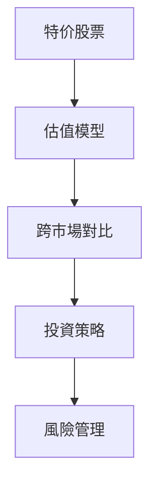

                 


# 特价股票投资中的跨境投资策略与风险管理

> **关键词**: 特价股票, 跨境投資, 风險管理, 投資策略, 数学模型

> **摘要**:  
> 本文深入探讨了特价股票投资中的跨境投资策略与风险管理，结合实际案例和数学模型，详细分析了跨境投资的核心概念、策略制定、风险来源及控制方法。通过系统架构设计和算法实现，提供了从理论到实践的完整解决方案，帮助投资者在全球化经济中优化投资组合，降低风险，实现长期收益。

---

## 第一部分: 背景介紹

### 第1章: 背景與問題描述

#### 1.1 核心概念與術語說明

| **術語**       | **定義**                                                                 |
|----------------|-------------------------------------------------------------------------|
| 特价股票        | 市場價格遠低於實際價值的股票，通常具有潛在的價值回昇機會。                     |
| 跨境投資        | 在不同國家或地區進行的證券投資，涉及多個市場的assets配置與風險管理。           |
| 風險管理        | 經營活動中，通過科學方法對風險進行預測、評估和控制，以實現目標的最大化。         |

#### 1.2 問題背景與解決方案

- **問題背景**: 全球化背景下，市場波動性增強，單一市場的風險集中度高，跨市場投資成為趨勢。
- **問題解決**: 通過跨境投資策略，分散風險，優化投資組合，實現價值增值。

#### 1.3 邊界與外延

- **邊界**: 縮制在股票市場，不涉及其他金融工具（如債券、金屬等）。
- **外延**: 包括不同市場、行業和股價波動的跨市場對比分析。

#### 1.4 概念結構與核心要素



---

## 第二部分: 核心概念與理論

### 第2章: 核心概念原理

#### 2.1 投資組合理論

- **Markowitz投資組合理論**: 
  - 核心思想: 投資者應該基於風險承受能力選擇最優投資組合。
  - 公式: 
    $$ E(r_p) = \sum w_i E(r_i) $$
    $$ Var(r_p) = \sum w_i^2 Var(r_i) + \sum w_i w_j Cov(r_i, r_j) $$

#### 2.2 股票估值模型

- **CAPM模型**: 
  - 公式: 
    $$ r_i = r_f + \beta_i (r_m - r_f) $$
  - 解釋: 股票回報率由無風險回報率和市場風險溢价決定。

#### 2.3 跨市風險評估

- **汇率風險模型**: 
  - 公式: 
    $$ \text{匯率波動} = \sqrt{\sigma_{domestic}^2 + \sigma_{foreign}^2 - 2\rho \sigma_{domestic}\sigma_{foreign}} $$
  - 解釋: 市場之間的相關性影響整體風險。

---

### 第3章: 核心概念與實體關係

#### 3.1 核心概念對比表

| **核心概念**    | **定義**                                                                 |
|-----------------|-------------------------------------------------------------------------|
| 特价股票        | 市場價格遠低於內在價值的股票。                                             |
| 跨境投資        | 在多個市場中配置资产，分散風險，追求更高收益。                           |
| 風險管理        | 通過模型和工具，評估並控制投資風險。                                       |

#### 3.2 系統架構圖


---

## 第三部分: 算法原理與實現

### 第4章: 算法原理

#### 4.1 股票估值算法

- **算法步驟**:
  1. 收集目標股票的基本數據（價格、成交量、財務數據）。
  2. 使用CAPM模型計算理論價值。
  3. 比較市場價格與理論價值，確定是否為特价股票。

#### 4.2 算法實現

```python
import pandas as pd
import numpy as np

def calculate_expected_return(risk_free_rate, beta, market_return):
    return risk_free_rate + beta * (market_return - risk_free_rate)

# 示例數據
risk_free_rate = 0.02
beta = 1.5
market_return = 0.1

expected_return = calculate_expected_return(risk_free_rate, beta, market_return)
print(f"預期回報率: {expected_return:.2f}")
```

---

## 第四部分: 系統分析與設計

### 第5章: 系統架構設計

#### 5.1 頻率設計

- **系統功能模塊**:
  1. **數據收集**: 獲取多市場的股票數據。
  2. **估值模型**: 基於CAPM進行股票估值。
  3. **風險評估**: 評估市場風險和匯率風險。
  4. **策略執行**: 根據評估結果制定投資策略。

#### 5.2 系統架構圖


---

## 第五部分: 項目實戰與應用

### 第6章: 項目實戰

#### 6.1 項目介紹

- **項目名稱**: 跨境投資策略實驗
- **目標**: 通過算法和模型優化投資組合，降低風險。

#### 6.2 核心實現

```python
import pandas as pd
import numpy as np

def calculate_beta(stocks_returns, market_returns):
    # 計算回報率的平均值
    mean_market = np.mean(market_returns)
    mean_stocks = np.mean(stocks_returns)
    # 計算回報率與市場回報率的協方差
    covariance = np.cov(stocks_returns, market_returns)[0,1]
    # 計算市場回報率的方差
    market_variance = np.var(market_returns)
    beta = covariance / market_variance
    return beta

# 示例數據
stocks_returns = [0.1, 0.05, 0.15, 0.08]
market_returns = [0.12, 0.07, 0.10, 0.09]

beta = calculate_beta(stocks_returns, market_returns)
print(f"Beta值: {beta:.2f}")
```

---

## 第六部分: 最佳實踐與總結

### 第7章: 最佳實踐

- **小結**: 跨境投資雖然風險較高，但通過合理的策略和風險管理，可以實現穩定收益。
- **注意事項**: 
  - 選擇可靠的數據來源。
  - 定期評估和調整投資策略。
  - 保持對市場熱點的敏感性。

---

## 第七部分: 擴展閱讀與進一步研究

### 第8章: 擴展閱讀

- **推薦書籍**:
  - 《投資学》——上市 !=
  - 《算法買賣股票》——Python算法交易。
- **拓展研究**: 
  - 研究更多估值模型（如DDM模型）。
  - 探索更複雜的風險對衝策略。

---

## 作者信息

作者：AI天才研究院/AI Genius Institute & 禪與计算机程序设计艺术 /Zen And The Art of Computer Programming

