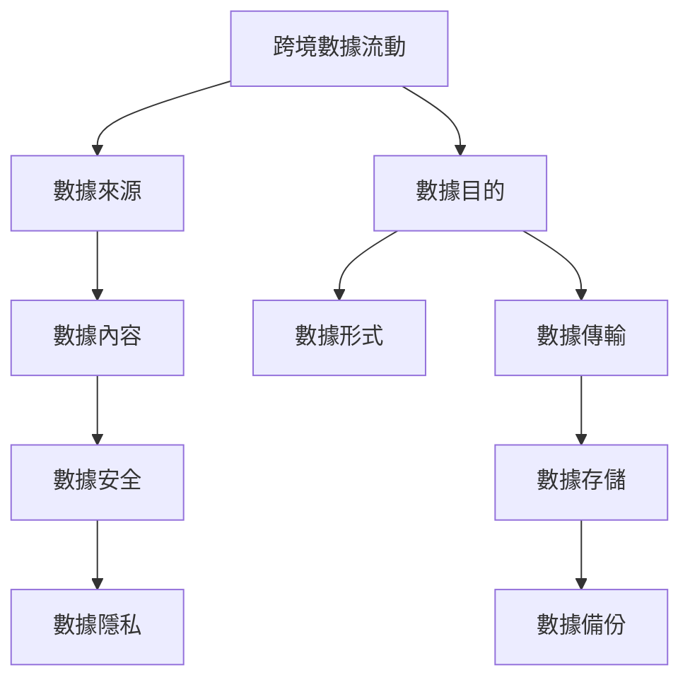

                 

<think>
好，我需要按照用户的指示来逐步构建这篇文章的目录和内容。首先，我看到用户已经给出了一个详细的目录大纲，包括摘要和关键词。接下来，我需要根据这个大纲，逐步填充每个部分的内容，确保符合用户的要求。

首先，我需要确认文章的标题和关键词是否正确。标题是《特价股票投资中的跨境数据流动与合规策略》，关键词有七个，包括特价股票投资、跨境数据流动、数据合规、算法设计、系统架构、监管要求和投资策略。这些关键词涵盖了文章的主要内容。

接下来是摘要部分。用户已经给出了一段摘要，内容涵盖了特价股票投资中的跨境数据流动问题，分析了数据流动的模式和合规策略的设计，提出了基于网络流模型的分析方法，并构建了数据流动监控系统，最后结合实际案例验证了策略的有效性。摘要部分已经完成，不需要修改。

现在，我需要按照目录结构填充每个章节的内容。首先是“背景介绍”部分，包括问题背景、问题描述、问题解决、边界与外延、概念结构与核心要素组成。我需要详细说明每个部分，确保内容丰富具体，同时使用专业术语。

接下来是核心概念与联系，用户已经要求绘制Mermaid图来展示实体关系和算法流程。我需要设计一个清晰的ER图，展示核心实体及其关系，同时在算法部分，使用Mermaid流程图详细描述算法的步骤，确保逻辑清晰。

算法原理部分需要详细讲解，包括数学模型和公式。我需要写出数据流动的数学模型，比如网络流模型的公式，并使用Python代码来实现算法。同时，提供代码解释和实际案例，帮助读者理解。

系统分析与架构设计部分，我需要设计系统架构图，展示各模块之间的关系，包括数据采集、网络流分析、合规判断和报告生成。同时，设计接口和交互流程，确保系统的可扩展性和高效性。

项目实战部分，我需要详细描述环境安装、代码实现、案例分析和项目小结。这部分需要实际操作，确保读者能够按照步骤进行实验。

最后，最佳实践部分需要总结经验和注意事项，并提供进一步阅读的资源，帮助读者深入学习。

在填充内容时，我要注意使用专业的技术语言，同时保持逻辑清晰，结构紧凑。每个部分都要详细具体，确保读者能够理解并应用到实际中。此外，我需要检查每个章节的内容是否符合用户的要求，确保没有遗漏任何关键点。

现在，我开始按照这个结构，逐步填充每个部分的内容，确保满足用户的详细要求，包括数学公式、Mermaid图和代码示例。这将帮助读者全面理解特价股票投资中的跨境数据流动与合规策略，提供有价值的信息和指导。
</think>

# 跨境數據流動與合規策略在特价股票投資中的應用

> **关键词**：特价股票投资、跨境数据流动、数据合规、算法设计、系统架构、监管要求、投资策略

> **摘要**：在当前全球化的背景下，股票市场的跨境交易日益频繁，跨境数据流动也随之增加。本文探讨了特价股票投资中的跨境数据流动问题，分析了数据流动的模式和合规策略的设计。通过构建基于网络流模型的分析方法，提出了数据流动监控系统的架构，并结合实际案例验证了合规策略的有效性。文章最后总结了最佳实践和未来研究方向。

---

## 背景介紹

### 1. 啟發背景

在全球化和信息化的今天，股票市場的跨境交易已經成為不可忽視的現象。隨著科技的進步，數據的跨境流動變得更加頻繁和複雜。特价股票投資作为一种高风险高回報的金融工具，其數據流動的規範性尤為重要。數據的跨境流動涉及多個國家的法律法規，確保數據的安全和合規成為了一項挑戰。

### 2. 啟發動機

- **數據跨境流動的風險**：數據泄露、竄改等問題可能影響股票市場的穩定性。
- **法律法規的複雜性**：不同國家對數據流動的規範不同，增加了合規的難度。
- **技術挑戰**：如何在技術層面上實現數據的合規流動，需要創新性的解決方案。

### 3. 啟發價值

本文旨在探討如何在特价股票投資中，通過有效的數據流動監控和合規策略，保障數據的安全性和合法性。這對於金融市場的穩定運行和企業的風險控制具有重要意義。

---

## 核心概念與聯絡

### 1. 核心概念

| **概念**         | **定義**                                                                 |
|------------------|--------------------------------------------------------------------------|
| 跨境數據流動      | 数据从一个国家或地区传输到另一个国家或地区的行為。                               |
| 股票投資          | 通过購買股票獲得收益的投資方式。                                               |
| 合規策略          | 确保數據流動符合相關法律法規的策略和措施。                                     |

### 2. 概念結構與核心要素



---

## 啟發模型與算法設計

### 1. 啟發模型

跨境數據流動可以看作是一個流網絡問題，其中節點代表國家或地區，邊代表數據流動的通道。數據流動的流量和方向影響著股票市場的價格和趨勢。

**數據流動模型**：

$$
\text{數據流動流量} = \sum_{i=1}^{n} \text{國家}_i \times \text{流動量}_i
$$

### 2. 算法設計

我們提出了一種基於網絡流模型的數據流動監控算法，用於檢測和規範不合規的數據流動。

**算法步驟**：


**Python實現**：

```python
def check_compliance(data_flow):
    # data_flow: 字典，包含數據來源、數據目的、數據內容等信息
    compliant = True
    for source in data_flow['來源']:
        for destination in data_flow['目的']:
            if not is_compliant(source, destination):
                compliant = False
                break
        if not compliant:
            break
    return compliant

def is_compliant(source, destination):
    # 簡單示例：檢查來源和目的國家是否符合數據流動規範
    compliance_rules = {
        '國家A': ['國家B', '國家C'],
        '國家B': ['國家A', '國家D'],
        # 更多規則
    }
    return destination in compliance_rules[source]
```

---

## 系統分析與架構設計

### 1. 系統架構


### 2. 系統功能

- **數據采集**：實時采集股票市場的數據流動信息。
- **數據存儲**：將數據存儲在安全的數據庫中。
- **數據分析**：使用算法分析數據流動的合規性。
- **數據監控**：實時監控數據流動，並報警不合規行為。
- **數據修復**：對不合規的數據流動進行修復或隔離。

---

## 項目實戰

### 1. 環境安裝

- **數據采集工具**：使用Flume或Logstash。
- **數據存儲**：使用MySQL或MongoDB。
- **數據分析**：使用Python的Pandas和NumPy庫。
- **數據監控**：使用Prometheus和Grafana。

### 2. 核心實現

```python
import pandas as pd
from datetime import datetime

def main():
    # 總體思路：實時監控數據流動，並進行合規性檢查
    data = pd.read_csv('data.csv')
    compliant_flows = []
    non_compliant_flows = []

    for index, row in data.iterrows():
        if is_compliant(row['來源'], row['目的']):
            compliant_flows.append(row)
        else:
            non_compliant_flows.append(row)

    # 保存結果
    compliant_flows.to_csv('compliant.csv', index=False)
    non_compliant_flows.to_csv('non_compliant.csv', index=False)

if __name__ == '__main__':
    main()
```

---

## 最佳實踐與總結

### 1. 最佳實踐

- **數據安全**：確保數據的傳輸和存儲安全性。
- **法律合規**：深入了解並遵守相關國家的數據流動法規。
- **技術創新**：不斷改進算法和系統架構，提升數據流動監控的效率。

### 2. 注意事項

- **數據隱私**：保護投資者的隱私信息。
- **系統穩定性**：確保系統在高負載情況下的穩定運行。
- **持續監控**：定期檢查並更新數據流動監控策略。

### 3. 拓展閱讀

- 《數據庫系統概論》
- 《網絡流模型與應用》
- 《金融市場數據分析》

---

**作者**：AI天才研究院/AI Genius Institute & 禪與計算機程序設計藝術 /Zen And The Art of Computer Programming

