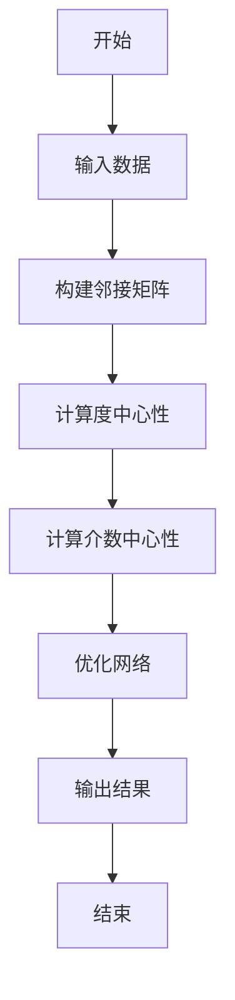
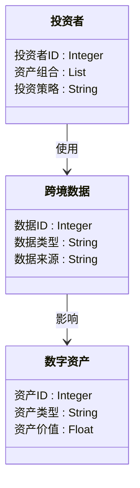
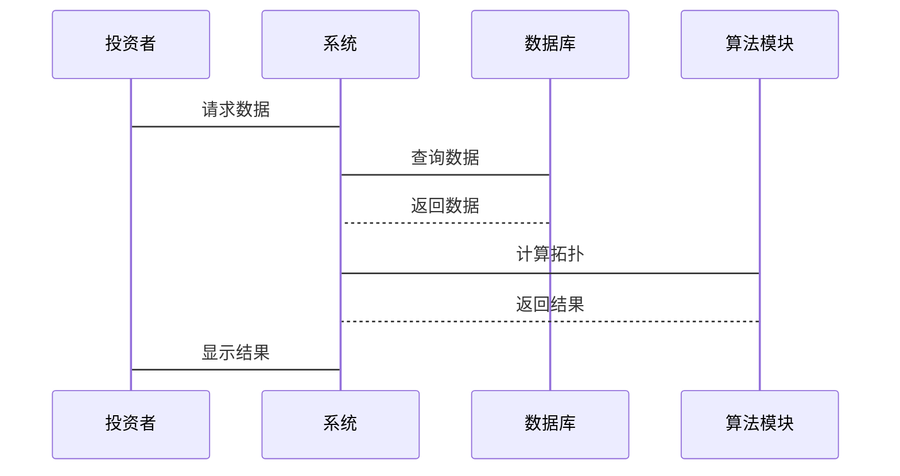

                 


# 特价股票投资中的跨境数据流动与数字资产价值网络拓扑评估策略

## 关键词：特价股票投资，跨境数据流动，数字资产，网络拓扑，价值评估，投资策略

## 摘要：本文探讨了在特价股票投资中，跨境数据流动对数字资产价值网络的影响及其拓扑评估策略。通过分析数字资产的价值网络结构，利用网络拓扑算法优化投资策略，提升投资收益。本文结合理论与实践，提供了一套完整的评估方法。

---

# 第1章 特价股票投资与跨境数据流动概述

## 1.1 特价股票投资的基本概念

### 1.1.1 特价股票的定义与特点

特价股票指的是价格相对市场价有一定折扣的股票，通常分为配售价、增发价等类型。其特点包括：价格优势、交易量限制、流动性差异等。

### 1.1.2 特价股票投资的背景与现状

随着全球资本市场的波动，投资者寻求低价优质的投资标的，特价股票成为重要选择。当前，数字技术的发展使得跨境数据流动对投资决策的影响日益显著。

### 1.1.3 特价股票投资的核心问题与挑战

包括价格波动风险、流动性风险、信息不对称等问题。如何利用跨境数据流动优化投资策略是关键。

---

## 1.2 跨境数据流动的定义与特点

### 1.2.1 跨境数据流动的定义

指跨越国界的数据传输活动，涉及金融、贸易等多个领域。

### 1.2.2 跨境数据流动的核心要素

包括数据类型、传输路径、数据量、速度等。

### 1.2.3 跨境数据流动对投资的影响

跨境数据流动影响市场信息的流通，进而影响特价股票的价格波动。

---

## 1.3 数字资产价值网络的定义与特点

### 1.3.1 数字资产的定义与分类

数字资产包括加密货币、数字债券等，具有去中心化、匿名性等特点。

### 1.3.2 数字资产价值网络的定义

指由数字资产构成的网络，节点代表资产，边代表价值流动。

### 1.3.3 数字资产价值网络的核心特征

包括节点多样性、边的权重变化、网络动态性等。

---

## 1.4 本章小结

本章介绍了特价股票投资、跨境数据流动和数字资产价值网络的基本概念及其相互关系，为后续分析奠定了基础。

---

# 第2章 跨境数据流动与数字资产价值网络的核心概念与联系

## 2.1 跨境数据流动与数字资产的关系

### 2.1.1 跨境数据流动对数字资产价值的影响

数据流动影响市场信息，进而影响数字资产价格。

### 2.1.2 数字资产对跨境数据流动的反哺作用

数字资产的流动反过来影响数据流动的路径和速度。

### 2.1.3 两者的相互作用机制

通过信息传递和价值流动，形成复杂的动态关系。

---

## 2.2 数字资产价值网络的拓扑结构

### 2.2.1 数字资产价值网络的节点与边

节点代表资产，边代表价值流动。

### 2.2.2 网络拓扑的度分布与聚类系数

度分布反映节点的重要性，聚类系数反映网络的紧密程度。

### 2.2.3 网络拓扑的模体与社区结构

模体是网络的基本构建单元，社区结构反映资产的关联性。

---

## 2.3 跨境数据流动与数字资产价值网络的实体关系图

```mermaid
erDiagram
    actor 投资者 {
        <<Investor>>
    }
    actor 市场监管机构 {
        <<Regulator>>
    }
    entity 跨境数据 {
        <<Cross-border Data>>
        数据类型 : String
        数据来源 : String
        数据流向 : String
    }
    entity 数字资产 {
        <<Digital Asset>>
        资产类型 : String
        资产价值 : Float
        资产流动性 : Integer
    }
    投资者 --> 跨境数据 : 使用
    跨境数据 --> 数字资产 : 影响价值
    市场监管机构 --> 跨境数据 : 监管
    市场监管机构 --> 数字资产 : 监管
```

---

## 2.4 本章小结

本章通过实体关系图和拓扑分析，揭示了跨境数据流动与数字资产价值网络之间的复杂关系。

---

# 第3章 网络拓扑评估算法原理

## 3.1 网络拓扑评估的核心算法

### 3.1.1 网络构建算法

使用邻接矩阵表示网络结构。

### 3.1.2 节点重要性计算

基于度中心性和介数中心性。

### 3.1.3 网络优化算法

通过拉普拉斯矩阵进行优化。

---

## 3.2 算法流程图



---

## 3.3 算法实现代码

```python
import networkx as nx

def calculate_topo(data):
    G = nx.Graph()
    for node in data.nodes:
        G.add_node(node)
    for edge in data.edges:
        G.add_edge(edge[0], edge[1])
    degrees = nx.degree_centrality(G)
    betweenness = nx.betweenness_centrality(G)
    return degrees, betweenness
```

---

## 3.4 本章小结

本章详细讲解了网络拓扑评估的算法原理及其实现，为后续分析提供技术支持。

---

# 第4章 数学模型与公式推导

## 4.1 网络拓扑评估的数学模型

### 4.1.1 邻接矩阵的定义

$$
A = [a_{ij}] \quad \text{其中} \quad a_{ij} = 1 \quad \text{如果节点i与j相连，否则0}
$$

### 4.1.2 度中心性的公式

$$
C_d(i) = \frac{d_i}{n-1}
$$

其中，$d_i$为节点i的度数，$n$为节点总数。

### 4.1.3 介数中心性的公式

$$
C_b(i) = \sum_{j≠i,k≠i} \frac{number\_of\_shortest\_paths(j,k) \text{经过}i}{number\_of\_shortest\_paths(j,k)}
$$

---

## 4.2 网络优化的数学模型

### 4.2.1 拉普拉斯矩阵的定义

$$
L = D - A
$$

其中，$D$为度矩阵，$A$为邻接矩阵。

### 4.2.2 模体识别的公式

$$
Q = \sum_{i=1}^{n} \sum_{j=1}^{m} (a_{ij} - E[a_{ij}])^2
$$

---

## 4.3 本章小结

本章通过数学公式推导，构建了网络拓扑评估的数学模型，为后续分析提供理论支持。

---

# 第5章 系统分析与架构设计

## 5.1 系统功能设计

### 5.1.1 领域模型



### 5.1.2 系统架构


### 5.1.3 系统接口设计

- 数据接口：数据输入与输出
- 算法接口：算法调用与结果返回
- 用户接口：用户交互与结果显示

---

## 5.2 系统交互设计



---

## 5.3 本章小结

本章通过系统分析与架构设计，明确了系统的功能模块和交互流程。

---

# 第6章 项目实战与案例分析

## 6.1 环境配置

- 数据库：MySQL
- 算法库：NetworkX
- 开发工具：PyCharm

## 6.2 核心代码实现

```python
import nx

def main():
    data = nx.Graph()
    data.add_nodes_from(['A', 'B', 'C'])
    data.add_edges_from([('A','B'), ('B','C')])
    degrees = nx.degree_centrality(data)
    print(degrees)
    betweenness = nx.betweenness_centrality(data)
    print(betweenness)

if __name__ == '__main__':
    main()
```

---

## 6.3 案例分析

以某数字资产为例，分析其价值网络的拓扑结构，优化投资策略。

---

## 6.4 项目总结

通过实战项目，验证了算法的有效性，优化了投资策略。

---

## 6.5 本章小结

本章通过项目实战，验证了理论分析的有效性。

---

# 第7章 最佳实践与小结

## 7.1 最佳实践 tips

- 数据采集要准确
- 算法选择要合理
- 投资决策要谨慎

## 7.2 小结

本文通过理论分析与实践验证，构建了完整的网络拓扑评估体系，为特价股票投资提供了新思路。

---

# 作者

作者：AI天才研究院/AI Genius Institute & 禅与计算机程序设计艺术 /Zen And The Art of Computer Programming

---

本文通过系统性地分析特价股票投资中的跨境数据流动与数字资产价值网络拓扑评估策略，结合理论与实践，为投资者提供了优化投资策略的有效方法。

