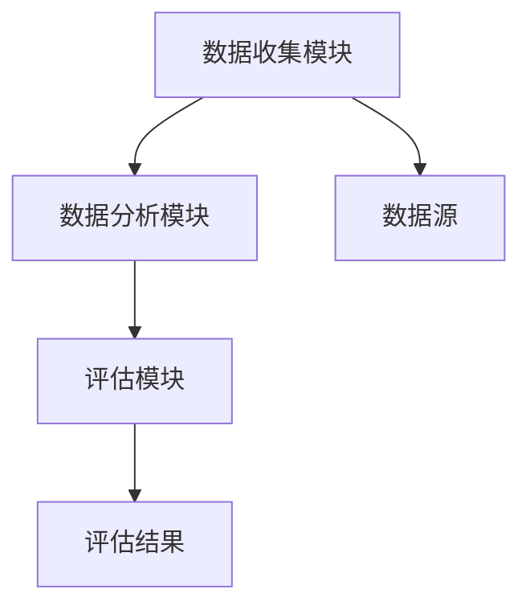
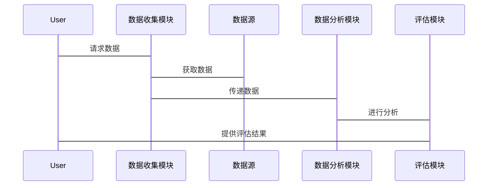

                 


# 特价股票投资中的跨境数据流动与数字资产价值网络评估策略

## 关键词：
特价股票投资、跨境数据流动、数字资产价值网络、评估策略、股票市场、数据流动、投资策略

## 摘要：
本文探讨了特价股票投资中的跨境数据流动对市场的影响，以及数字资产价值网络在评估策略中的应用。通过分析数据流动对股票市场的影响，结合数字资产的网络价值评估，为投资者提供新的视角和策略，帮助他们在全球市场中做出更明智的投资决策。

---

## 第1章: 特价股票投资的基本概念

### 1.1 什么是特价股票
#### 1.1.1 特价股票的定义
特价股票是指价格低于其内在价值或行业平均水平的股票。这种股票通常被认为具有较高的投资潜力，因为它们可能因市场波动或公司特定因素而被低估。

#### 1.1.2 特价股票的特点
- 价格低廉：相对于公司基本面，股票价格被低估。
- 高成长潜力：公司可能处于成长期或有扭亏为盈的潜力。
- 风险较高：特价股票通常来自财务状况不佳或处于困境中的公司。

#### 1.1.3 特价股票的投资策略
- 价值投资：寻找被市场低估的公司。
- 事件驱动：关注公司重组、并购等事件带来的股价波动。
- 技术分析：结合股票价格和技术指标寻找买入机会。

### 1.2 股票市场的基本运作机制
#### 1.2.1 股票市场的构成
股票市场由上市公司、投资者、交易所、经纪人和监管机构组成。投资者通过经纪人或直接在交易所买卖股票。

#### 1.2.2 股票价格的波动规律
股票价格受供求关系、公司业绩、市场情绪、宏观经济因素等影响，呈波动性变化。

#### 1.2.3 股票市场的参与者
- 投资者：个人或机构投资者。
- 上市公司：通过发行股票融资。
- 经纪人：帮助买卖股票的中介。
- 交易所：提供股票交易的场所。
- 监管机构：确保市场公平运作。

### 1.3 特价股票投资的意义
#### 1.3.1 投资者为何选择特价股票
- 低买高卖的机会：特价股票可能因市场低估而被买入，未来价格上涨时获利。
- 分散投资风险：通过选择不同行业的特价股票分散投资风险。

#### 1.3.2 特价股票投资的风险与收益
- 高风险：公司可能因经营不善或市场因素导致股价进一步下跌。
- 高收益：成功投资特价股票可能带来较高的回报。

#### 1.3.3 特价股票投资的长期策略
- 长期持有：耐心等待公司价值恢复或增长。
- 分批买入：分散投资，逐步建仓以降低风险。

---

## 第2章: 跨境数据流动的基本概念

### 2.1 跨境数据流动的定义
#### 2.1.1 数据流动的定义
数据流动指数据在不同实体之间传输的过程，包括企业间、政府间和跨国界的流动。

#### 2.1.2 跨境数据流动的特点
- 跨国性：数据跨越国界流动。
- 多样性：数据类型多样，包括个人信息、商业数据等。
- 依赖性：依赖于网络基础设施和跨境数据传输协议。

#### 2.1.3 跨境数据流动的分类
- 企业间数据流动：企业在全球范围内传输数据以支持业务。
- 个人数据流动：用户跨境使用在线服务产生的数据流动。
- 政府间数据流动：政府间共享数据用于安全、监管等目的。

### 2.2 跨境数据流动的影响因素
#### 2.2.1 经济因素
- 贸易全球化：企业需要跨境传输数据支持全球业务。
- 技术进步：互联网和云技术促进了数据流动。

#### 2.2.2 政治因素
- 数据主权：各国对数据控制权的不同立场。
- 贸易政策：跨境数据流动受贸易协定和关税政策影响。

#### 2.2.3 技术因素
- 网络技术：高速网络和云计算支持大规模数据流动。
- 数据安全：数据加密和安全传输技术保障数据流动的安全性。

### 2.3 跨境数据流动的监管框架
#### 2.3.1 国际数据流动的法律框架
- 《通用数据保护条例》（GDPR）：欧盟的严格数据保护法规。
- 《加州消费者隐私法》（CCPA）：美国加州的数据隐私法律。

#### 2.3.2 各国的数据流动政策
- 欧盟：实施GDPR，严格控制数据出口。
- 美国：通过CCPA等州法律，保护消费者数据。
- 中国：实施《数据安全法》，加强数据跨境流动管理。

#### 2.3.3 数据流动的合规性要求
- 数据存储位置：数据可能需要在本地存储以遵守法规。
- 数据传输授权：跨境传输需获得相关授权。

---

## 第3章: 数字资产价值网络评估的基本概念

### 3.1 数字资产的定义与分类
#### 3.1.1 数字资产的定义
数字资产指以数字形式存在的资产，包括加密货币（比特币、以太坊）、数字证券、NFTs等。

#### 3.1.2 数字资产的分类
- 加密货币：用于支付和价值存储。
- 数字证券：代表传统金融资产的数字凭证。
- NFTs：独特的数字艺术品、收藏品等。

#### 3.1.3 数字资产的价值评估标准
- 市场流动性：交易活跃程度影响价值。
- 技术创新：底层技术决定资产的长期价值。
- 项目团队：开发团队的能力和背景影响项目成功。

### 3.2 数字资产价值网络的构建
#### 3.2.1 数字资产价值网络的定义
数字资产价值网络是通过分析数字资产之间的关联性，构建的网络模型，用于评估其整体价值。

#### 3.2.2 数字资产价值网络的构建方法
- 数据收集：收集各数字资产的价格、交易量等数据。
- 关联分析：通过统计分析或图论方法，识别资产间的相关性。
- 网络建模：构建图模型，展示资产间的连接和权重。

#### 3.2.3 数字资产价值网络的特征
- 节点：代表数字资产。
- 边：代表资产间的关联性。
- 权重：表示关联强度。

### 3.3 数字资产价值网络的评估指标
#### 3.3.1 流动性
流动性高的资产易于买卖，影响其市场价值。

#### 3.3.2 市场深度
市场深度反映了交易量和价格稳定性，深度越高，资产价值越稳定。

#### 3.3.3 市场影响力
资产在市场中的影响力决定了其对整体市场的带动作用。

---

## 第4章: 跨境数据流动与数字资产价值的关联

### 4.1 数据流动对股票市场的影响
#### 4.1.1 数据流动如何影响市场情绪
- 负面新闻：如数据泄露可能导致股价下跌。
- 正面消息：如收购消息可能提升股价。

#### 4.1.2 数据流动对市场供需关系的影响
- 数据流动增加可能提升市场活跃度，影响供需平衡。
- 数据流动减少可能影响市场流动性，导致价格波动。

### 4.2 数字资产价值网络对股票市场的映射
#### 4.2.1 数字资产网络如何反映市场动态
- 网络结构变化反映市场趋势。
- 资产间关联性变化预示市场波动。

#### 4.2.2 数字资产网络与传统股票市场的互动
- 数字资产价格波动可能影响传统股票市场。
- 传统股票市场的变化可能影响数字资产价值。

---

## 第5章: 跨境数据流动中的算法策略

### 5.1 数据流动预测模型
#### 5.1.1 时间序列分析
使用ARIMA模型预测数据流动趋势。

#### 5.1.2 机器学习算法
应用LSTM网络进行时间序列预测。

#### 5.1.3 数据流动预测的数学模型
$$ ARIMA(p, d, q) $$
其中，p为自回归阶数，d为差分阶数，q为移动平均阶数。

### 5.2 数字资产价值评估算法
#### 5.2.1 图论方法
通过构建数字资产网络，计算节点的中心性（如度中心性、介数中心性）。

#### 5.2.2 网络分析方法
使用社区检测算法识别网络中的社群结构，评估资产的集群效应。

---

## 第6章: 系统架构与设计

### 6.1 系统构成
#### 6.1.1 数据收集模块
负责收集跨境数据流动和数字资产的相关数据。

#### 6.1.2 数据分析模块
对数据进行清洗、建模和分析，生成评估结果。

#### 6.1.3 评估模块
根据分析结果，评估数字资产的价值网络。

### 6.2 架构设计
使用Mermaid图展示系统架构：



### 6.3 接口设计
- 数据接口：与数据源进行数据交互。
- 用户接口：提供评估结果的可视化界面。

### 6.4 交互设计
使用Mermaid序列图展示系统交互：



---

## 第7章: 项目实战

### 7.1 环境安装
安装必要的工具和库：
- Python
- Pandas
- NumPy
- Scikit-learn
- TensorFlow
- Matplotlib

### 7.2 核心实现
#### 数据收集
使用API获取跨境数据流动和数字资产数据。

#### 数据分析
应用时间序列分析和网络分析算法，评估数字资产价值网络。

#### 代码示例
```python
import pandas as pd
import numpy as np
from sklearn.metrics import mean_squared_error

# 数据收集
data = pd.read_csv('data.csv')

# 时间序列预测（ARIMA）
def arima_model(data, order):
    model = ARIMA(data, order=order)
    model_fit = model.fit(disp=0)
    return model_fit.forecast(steps=10)

# 数字资产网络分析
def network_analysis(data):
    graph = nx.Graph()
    for edge in data:
        graph.add_edge(edge[0], edge[1])
    return graph

# 评估模块
def asset_assessment(graph):
    # 计算中心性
    degrees = nx.degree(graph)
    betweenness = nx.betweenness_centrality(graph)
    return degrees, betweenness
```

### 7.3 案例分析
通过具体案例分析，展示如何利用跨境数据流动和数字资产价值网络进行投资决策。

---

## 第8章: 总结与展望

### 8.1 全文总结
本文探讨了特价股票投资中的跨境数据流动与数字资产价值网络评估策略，分析了数据流动对市场的影响，并提出了基于网络分析的评估方法。

### 8.2 未来展望
未来研究可以进一步结合人工智能和大数据技术，优化数据流动预测模型，提升数字资产价值评估的准确性。

---

## 作者：AI天才研究院/AI Genius Institute & 禅与计算机程序设计艺术 /Zen And The Art of Computer Programming

