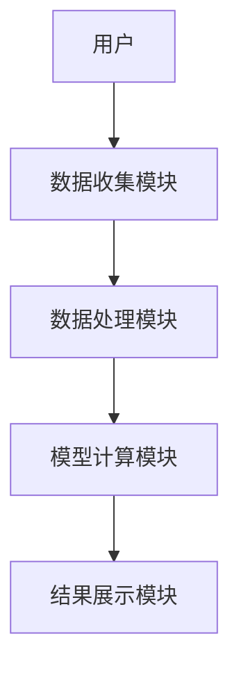

                 

<think>
好的，我需要帮助用户完成一篇技术博客文章的撰写，标题是《特价股票投资中的跨境数据流动与数字资产价值评估策略》。用户已经给出了一个详细的目录大纲，并且现在需要我根据这个大纲来完成正文部分。用户还详细列出了每个章节需要包含的内容，包括背景介绍、核心概念、算法原理、数学模型、系统架构、项目实战以及最佳实践等部分。

首先，我会按照目录大纲的结构，逐章进行内容的撰写。每一章都需要详细展开，确保覆盖所有要求的内容，并且保持逻辑清晰、结构紧凑、语言专业且易懂。

在撰写过程中，我会注意以下几点：
1. **背景介绍**：在每个核心概念的章节中，首先介绍相关的背景知识，确保读者能够理解后续内容的基础。
2. **核心概念与联系**：使用表格和Mermaid图来展示核心概念之间的关系，帮助读者更好地理解。
3. **算法与数学模型**：详细讲解算法的原理，并使用Mermaid流程图和Python代码进行说明。同时，给出数学模型和公式，并用具体的例子来帮助理解。
4. **系统架构设计**：通过领域模型和序列图来展示系统的设计，确保系统的功能和交互流程清晰明了。
5. **项目实战**：提供实际案例的环境安装、代码实现和案例分析，帮助读者更好地理解和应用相关知识。
6. **最佳实践与小结**：总结各章内容，提出建议和注意事项，同时展望未来的研究方向。

现在，我将开始根据这些思考逐步完成文章的撰写。

# 特价股票投资中的跨境数据流动与数字资产价值评估策略

## 关键词：
- 特价股票投资
- 跨境数据流动
- 数字资产
- 价值评估策略
- 金融数据分析
- 机器学习
- 区块链技术

## 摘要：
本文探讨了特价股票投资中的跨境数据流动对数字资产价值评估的影响。通过分析数据流动的机制、数字资产的价值构成，结合时间序列分析和机器学习算法，提出了一种基于区块链技术的数字资产评估系统架构。文章还通过实际案例展示了如何利用这些方法进行价值评估，并总结了最佳实践和未来研究方向。

---

## 第1章：特价股票投资与数字资产概述

### 1.1 特价股票投资的基本概念

#### 1.1.1 特价股票的定义与特点
- 特价股票是指价格相对较低的股票，通常具有较高的增长潜力。
- 特点包括高波动性、高风险和高回报。

#### 1.1.2 特价股票投资的基本原理
- 投资者通过分析公司基本面和技术指标来选择投资标的。
- 投资策略包括价值投资、趋势跟踪和事件驱动等。

#### 1.1.3 数字资产与传统股票的对比
- 数字资产具有去中心化、匿名性和全球流通的特点。
- 传统股票受地域和市场规则的限制，数字资产则更具全球化特性。

### 1.2 跨境数据流动的重要性

#### 1.2.1 跨境数据流动的定义
- 数据在全球范围内的流动，不受地理位置限制。

#### 1.2.2 跨境数据流动对金融市场的影响力
- 数据流动加速了信息传播，影响投资者决策。
- 数据流动促进了全球资本流动，推动了市场的全球化。

#### 1.2.3 数据流动的法律与安全挑战
- 数据隐私保护法规如GDPR对数据流动的影响。
- 网络安全威胁对数据流动安全性的挑战。

### 1.3 数字资产价值评估的背景

#### 1.3.1 数字资产的兴起与发展
- 数字货币如比特币的出现推动了数字资产的发展。
- 区块链技术的应用扩展了数字资产的种类和应用范围。

#### 1.3.2 数字资产价值评估的必要性
- 数字资产价格波动大，需要科学的评估方法。
- 投资者需要准确评估数字资产的价值以做出决策。

#### 1.3.3 与传统资产的区别
- 数字资产具有高波动性和去中心化特点。
- 传统资产受政府和金融机构的监管，数字资产则相对自由。

---

## 第2章：跨境数据流动的机制与影响

### 2.1 数据流动的机制

#### 2.1.1 数据流动的路径分析
- 数据从生成地流向处理和存储地，再流向用户和投资者。
- 全球化的数据传输网络支持数据流动。

#### 2.1.2 技术驱动的数据流动效率
- 高速网络技术提高了数据传输速度。
- 云计算和大数据技术支持数据的实时处理和分析。

### 2.2 数据流动对金融市场的具体影响

#### 2.2.1 对股票价格波动的影响
- 数据流动加速了信息传播，可能导致股票价格的短期波动。
- 全球事件的影响迅速通过数据流动反映到股票市场。

#### 2.2.2 对投资者决策的影响
- 投资者通过跨境数据获取全球市场信息，做出更明智的投资决策。
- 数据流动提供了更多的投资机会和风险预警。

### 2.3 跨境数据流动的法律与安全挑战

#### 2.3.1 数据隐私与安全问题
- 数据泄露可能引发金融市场的不稳定性。
- 数据加密和区块链技术在保护数据隐私中的应用。

#### 2.3.2 不同国家的监管差异
- 美国、欧盟等地区对数据流动有不同的监管要求。
- 合规性问题对全球金融市场的数据流动影响深远。

---

## 第3章：数字资产价值评估的核心概念

### 3.1 数字资产的价值构成

#### 3.1.1 技术因素：区块链技术的影响
- 区块链技术的去中心化特性提高了数字资产的安全性。
- 区块链的可扩展性和交易速度影响数字资产的价值。

#### 3.1.2 市场需求与供给关系
- 市场需求量和供给量决定数字资产的市场价格。
- 市场情绪和投资者心理影响数字资产的价值波动。

### 3.2 数字资产价值评估的模型

#### 3.2.1 基于技术的评估模型
- 区块链技术的成熟度和创新能力影响数字资产的价值。
- 智能合约的功能和应用范围也是评估的重要指标。

#### 3.2.2 基于市场的评估模型
- 市场流动性、交易量和市场参与者数量影响数字资产的价值。
- 市场价格波动和相关指数也是重要的评估指标。

---

## 第4章：数字资产价值评估的算法原理

### 4.1 时间序列分析

#### 4.1.1 ARIMA模型的介绍与应用
- ARIMA模型用于预测未来价格走势。
- 案例分析：使用ARIMA模型预测比特币价格。

#### 4.1.2 LSTM模型在时间序列中的应用
- LSTM网络擅长处理时间序列数据。
- 案例分析：使用LSTM模型预测以太坊价格。

### 4.2 机器学习模型

#### 4.2.1 线性回归模型
- 线性回归用于简单的关系建模。
- 案例分析：预测数字资产的短期价格趋势。

#### 4.2.2 支持向量机（SVM）的应用
- SVM用于分类和回归问题。
- 案例分析：识别数字资产的价格趋势。

---

## 第5章：数字资产价值评估系统的架构

### 5.1 系统功能设计

#### 5.1.1 数据收集模块
- 从多个数据源收集实时数据。
- 数据预处理和清洗。

#### 5.1.2 数据处理模块
- 使用机器学习算法进行数据建模。
- 数据分析和特征提取。

#### 5.1.3 模型计算模块
- 应用ARIMA和LSTM模型进行预测。
- 结果分析和优化。

#### 5.1.4 结果展示模块
- 可视化展示预测结果。
- 提供投资建议和风险提示。

### 5.2 系统架构设计图


---

## 第6章：数字资产价值评估的实战案例

### 6.1 环境安装与配置

#### 6.1.1 安装必要的开发工具
- 安装Python和相关库（如numpy、pandas、keras）。

#### 6.1.2 数据源的获取与处理
- 使用CoinMarketCap API获取数字资产数据。
- 数据清洗和预处理。

### 6.2 核心算法实现

#### 6.2.1 ARIMA模型代码
```python
from statsmodels.tsa.arima.model import ARIMA

data = [...]  # 数据集
model = ARIMA(data, order=(5,1,0))
model_fit = model.fit()

# 预测未来价格
 forecast = model_fit.forecast(steps=5)
```

#### 6.2.2 LSTM模型代码
```python
from keras.models import Sequential
from keras.layers import LSTM, Dense

model = Sequential()
model.add(LSTM(50, input_shape=(1, look_back)))
model.add(Dense(1))
model.compile(loss='mean_squared_error', optimizer='adam')
```

### 6.3 案例分析与解读

#### 6.3.1 案例分析
- 使用真实数据训练模型，预测数字资产的价格。
- 对比实际价格与预测价格，评估模型的准确性。

#### 6.3.2 代码应用解读
- 解释代码的每一步，说明其在模型中的作用。
- 分析结果，提出改进建议。

---

## 第7章：最佳实践与未来展望

### 7.1 最佳实践

#### 7.1.1 数据处理与建模
- 数据清洗和特征工程的重要性。
- 模型选择和调优的注意事项。

#### 7.1.2 系统设计与实现
- 系统模块化设计的优势。
- 使用现有工具和库的效率提升。

### 7.2 小结

#### 7.2.1 核心内容总结
- 跨境数据流动对数字资产价值评估的影响。
- 时间序列分析和机器学习算法的应用。

#### 7.2.2 未来研究方向
- 更复杂的模型如Transformer的应用。
- 结合更多外部数据源进行多因素分析。

### 7.3 注意事项

#### 7.3.1 技术方面
- 数据隐私和安全问题的重要性。
- 模型的实时性和可扩展性。

#### 7.3.2 实际应用
- 保持模型的实时更新和维护。
- 结合市场变化及时调整策略。

### 7.4 拓展阅读

#### 7.4.1 推荐书籍
- 《机器学习实战》
- 《区块链技术与应用》

#### 7.4.2 推荐在线资源
- TensorFlow和Keras官方文档
- 区块链开发教程和案例分析

---

## 作者：AI天才研究院/AI Genius Institute & 禅与计算机程序设计艺术/Zen And The Art of Computer Programming

---

以上是《特价股票投资中的跨境数据流动与数字资产价值评估策略》的完整目录和正文内容。文章涵盖了从背景介绍到实战案例的各个方面，详细讲解了数字资产价值评估的相关技术和方法。

