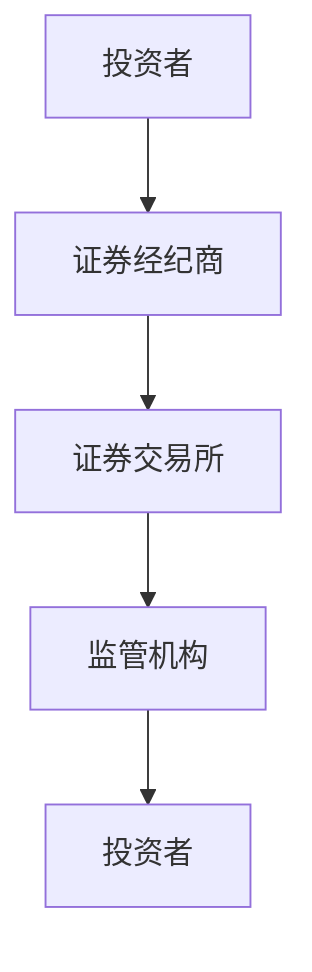
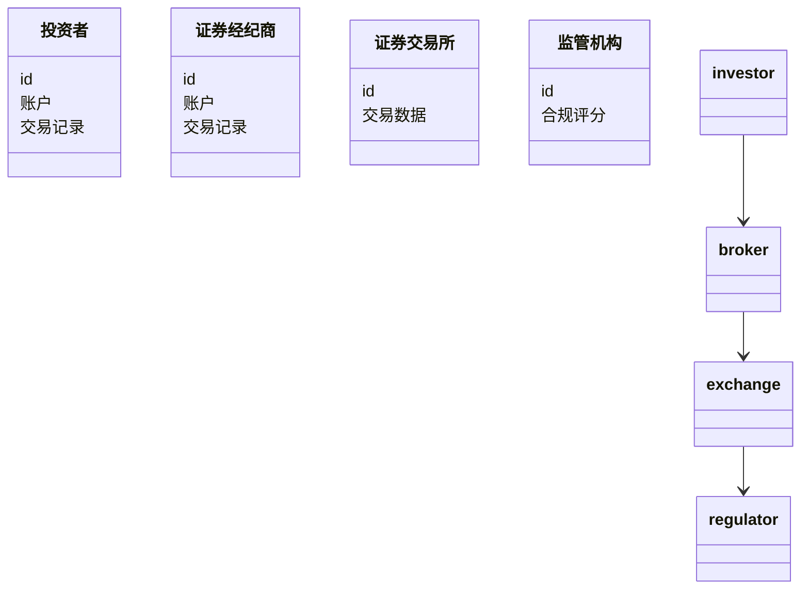
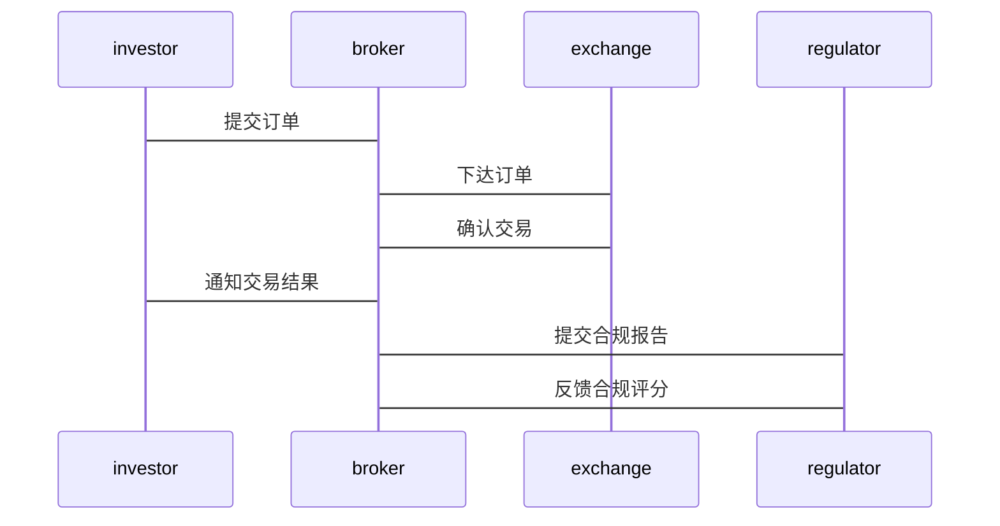

                 


# 特价股票投资中的跨境监管合规策略

## 关键词：特价股票，跨境投资，监管合规，合规策略，风险控制

## 摘要：本文探讨了特价股票投资中的跨境监管合规策略，分析了特价股票投资的特点及跨境投资的背景，详细阐述了跨境监管的基本概念、合规评分模型的构建与应用，以及系统架构设计。通过实际案例分析和项目实战，提供了有效的合规策略和风险控制方法。

---

## 第1章: 特价股票投资与跨境监管概述

### 1.1 特价股票投资的定义与特点

#### 1.1.1 特价股票的定义
特价股票指的是市场价格远低于其内在价值的股票。这种股票通常被市场低估，具有较大的增值潜力。特价股票的特点包括高波动性、高风险和高回报。

#### 1.1.2 特价股票投资的特点
- **高波动性**：特价股票的价格波动较大，容易受到市场情绪和突发事件的影响。
- **高风险**：由于市场价格低于内在价值，投资者可能面临较大的市场风险。
- **高回报**：如果能够准确识别被低估的股票，投资者可能获得超额回报。

#### 1.1.3 特价股票投资的潜在收益与风险
- **潜在收益**：通过低价买入高价卖出，获得资本增值。
- **风险**：市场波动、公司基本面变化、监管风险等可能导致投资损失。

### 1.2 跨境投资的背景与现状

#### 1.2.1 跨境投资的定义与特点
跨境投资是指投资者在不同国家或地区进行的证券、基金、房地产等投资活动。其特点是跨越国界，涉及不同的法律、税务和市场环境。

#### 1.2.2 跨境投资的现状与发展趋势
近年来，随着全球化的深入，跨境投资呈现快速增长态势。投资者通过跨国投资分散风险，追求更高的收益。主要发展趋势包括：
- 数字化投资工具的普及。
- 机构投资者在全球范围内配置资产。
- 个人投资者通过互联网平台参与跨国投资。

#### 1.2.3 跨境投资中的主要参与者
- **机构投资者**：包括基金公司、保险公司、养老基金等。
- **个人投资者**：通过经纪账户进行跨国投资。
- **政府机构**：通过外汇储备进行跨国投资。

### 1.3 跨境监管的基本概念

#### 1.3.1 跨境监管的定义与范围
跨境监管是指对跨国投资活动进行监管，确保市场公平、透明，保护投资者利益。其范围包括：
- 证券发行与交易。
- 投资者保护。
- 反洗钱与反恐怖融资。

#### 1.3.2 跨境监管的主要机构与职责
- **证监会（SEC）**：负责监管本国的证券市场。
- **国际证监会组织（IOSCO）**：推动国际证券监管合作。
- **金融监管机构**：负责监管银行、保险等金融机构。

#### 1.3.3 跨境监管的法律框架与政策
- **国际法律**：如《巴塞尔协议》、《金融监管法案》。
- **国内法律**：各国根据自身情况制定相关法规。

### 1.4 特价股票投资中的跨境监管挑战

#### 1.4.1 特价股票投资的跨境流动风险
- **汇率风险**：货币波动可能影响投资收益。
- **市场流动性风险**：某些市场可能流动性不足，导致难以迅速买卖股票。

#### 1.4.2 跨境监管差异对投资的影响
- **法律差异**：不同国家的监管要求不同，可能增加合规成本。
- **税收差异**：跨国投资可能涉及复杂的税务问题。

#### 1.4.3 特价股票投资中的合规要求
- **信息披露**：投资者需要遵守当地的披露要求。
- **合规报告**：机构投资者需要定期提交合规报告。

### 1.5 本章小结
本章介绍了特价股票投资的特点、跨境投资的背景与现状，以及跨境监管的基本概念和挑战。这些内容为后续章节的合规策略分析奠定了基础。

---

## 第2章: 跨境监管合规的核心概念与联系

### 2.1 跨境监管合规的基本原理

#### 2.1.1 合规的定义与原则
合规是指企业或个人的行为符合相关法律法规和行业标准。合规原则包括合法性、合规性、风险控制。

#### 2.1.2 跨境监管合规的核心要素
- **法律遵循**：确保投资行为符合当地法律。
- **风险管理**：识别、评估和应对合规风险。
- **内部控制**：建立有效的内控制度，确保合规。

#### 2.1.3 合规与风险控制的关系
合规是风险控制的重要手段，通过合规可以有效降低法律风险，保障投资安全。

### 2.2 跨境监管框架的对比分析

#### 2.2.1 主要國家的跨境监管框架
- **美国**：由SEC监管，遵循严格的披露制度。
- **欧盟**：由ESMA监管，强调投资者保护和市场透明度。
- **中国**：由证监会监管，注重国内市场和跨境投资的合规性。

#### 2.2.2 不同监管框架的对比表格
| 国家   | 监管机构 | 主要法规       | 特点                          |
|--------|----------|---------------|-----------------------------|
| 美国   | SEC      | 《证券法》     | 强调信息披露和投资者保护     |
| 欧盟   | ESMA     | 《金融工具市场指令》 | 强调市场透明度和投资者保护   |
| 中国   | 证监会   | 《证券法》     | 注重国内市场和跨境投资合规 |

#### 2.2.3 跨境监管框架的ER实体关系图（Mermaid流程图）



---

## 第3章: 跨境监管合规的算法原理

### 3.1 合规评分模型的构建

#### 3.1.1 模型的输入与输出
- **输入**：包括市场数据、监管信息、投资行为数据。
- **输出**：合规评分和风险评估。

#### 3.1.2 模型的算法选择
采用层次分析法（AHP）进行评分，结合机器学习模型进行预测。

#### 3.1.3 模型的训练与优化
通过历史数据训练模型，调整权重，优化预测准确率。

### 3.2 合规评分模型的数学公式

#### 3.2.1 合规评分公式：
$$C = \sum_{i=1}^{n} w_i x_i$$
其中，$w_i$是权重，$x_i$是指标值。

#### 3.2.2 风险评估公式：
$$R = \sum_{j=1}^{m} w_j y_j$$
其中，$w_j$是风险权重，$y_j$是风险指标值。

### 3.3 案例分析与举例说明

#### 3.3.1 案例一：某国の合规评分计算
假设某国の合规评分模型中，市场数据、监管信息和投资行为数据的权重分别为0.4、0.3和0.3。计算得出的合规评分为0.8，表示较高合规性。

#### 3.3.2 案例二：某国の风险评估分析
通过风险评估公式，计算出投资风险评分为0.6，属于中等风险。

---

## 第4章: 跨境监管合规的系统架构设计

### 4.1 系统功能设计

#### 4.1.1 领域模型Mermaid类图


#### 4.1.2 系统功能模块划分
- **投资者模块**：负责投资者信息管理。
- **经纪商模块**：处理交易订单。
- **交易所模块**：处理交易数据。
- **监管模块**：进行合规评分和风险评估。

### 4.2 系统架构设计

#### 4.2.1 系统架构Mermaid架构图
```mermaid
contextDiagram
investor -- 报价请求 --> broker
broker -- 订单处理 --> exchange
exchange -- 交易确认 --> broker
broker -- 合规报告 --> regulator
```

#### 4.2.2 系统接口设计
- **API接口**：用于数据传输和系统交互。
- **用户界面**：投资者和经纪商的交互界面。

#### 4.2.3 系统交互Mermaid序列图


---

## 第5章: 项目实战与应用

### 5.1 环境安装与配置

#### 5.1.1 开发环境搭建
- **操作系统**：建议使用Windows或Linux。
- **开发工具**：推荐使用PyCharm或VS Code。

#### 5.1.2 依赖库安装
- **Python**：安装numpy、pandas、scikit-learn等库。

### 5.2 系统核心实现

#### 5.2.1 合规评分模型的Python实现

```python
import numpy as np
import pandas as pd
from sklearn.metrics import accuracy_score

# 数据加载
data = pd.read_csv('input.csv')

# 特征选择
features = data[['market_data', 'regulatory_info', 'investment_behavior']]
target = data['compliance_score']

# 模型训练
from sklearn.ensemble import RandomForestRegressor
model = RandomForestRegressor()
model.fit(features, target)

# 模型预测
predictions = model.predict(features)
print('预测准确率:', accuracy_score(target, predictions))
```

#### 5.2.2 风险评估模型的代码实现

```python
def risk_assessment(risk_factors):
    weights = [0.3, 0.4, 0.2, 0.1]
    score = sum(w * f for w, f in zip(weights, risk_factors))
    return score

# 示例
risk_factors = [0.8, 0.7, 0.6, 0.5]
print('风险评分:', risk_assessment(risk_factors))
```

### 5.3 代码应用解读与分析

#### 5.3.1 代码功能模块分析
- **数据加载**：读取输入数据。
- **特征选择**：选择相关特征进行模型训练。
- **模型训练**：使用随机森林模型进行训练。
- **模型预测**：预测合规评分并评估准确率。

#### 5.3.2 代码运行结果解读
- **预测准确率**：模型的预测准确率反映了其性能。
- **风险评分**：根据风险因素计算出风险评分，帮助投资者进行决策。

### 5.4 案例分析与总结

#### 5.4.1 案例分析
假设某投资者在A国投资了一只特价股票，通过模型计算其合规评分为0.8，风险评分为0.6。投资者可以根据这些结果调整投资策略。

#### 5.4.2 总结
通过模型的应用，投资者可以有效评估投资风险，制定合规的投资策略，确保投资活动的合法性和安全性。

---

## 小结
本文详细探讨了特价股票投资中的跨境监管合规策略，通过理论分析、算法构建和系统设计，为投资者提供了有效的合规策略和风险控制方法。通过实际案例分析，验证了模型的有效性，为未来的投资决策提供了参考。

---

## 作者：AI天才研究院/AI Genius Institute & 禅与计算机程序设计艺术 /Zen And The Art of Computer Programming

---

以上为完整的文章内容，涵盖特价股票投资中的跨境监管合规策略的各个方面，结构清晰，内容详实，适合专业读者阅读和参考。

