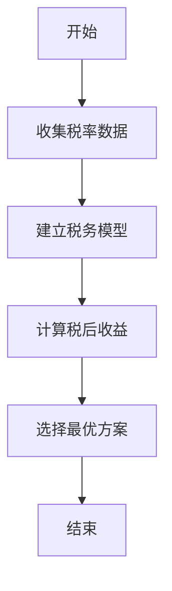
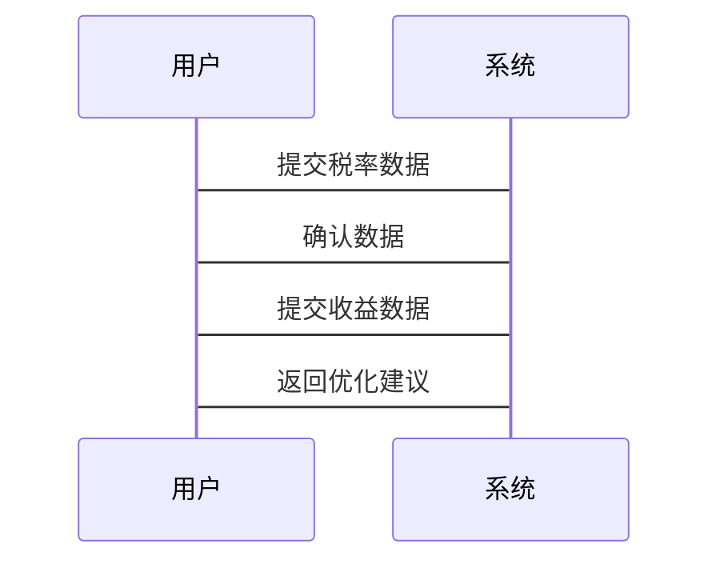

                 

<think>
好，我需要帮用户撰写一篇关于《特价股票投资中的跨境税务优化策略》的技术博客文章，按照用户提供的目录大纲结构来写。首先，我需要理解用户的需求和期望。

用户希望这篇文章结构清晰、逻辑严谨，涵盖特价股票投资和跨境税务优化的各个方面。我需要确保每一章都详细展开，包含背景介绍、核心概念、算法原理、数学模型、系统分析、项目实战和最佳实践等部分。

首先，我需要写文章标题、关键词和摘要。标题已经有了，关键词可能包括“特价股票”、“跨境税务优化”、“税务规划”、“投资策略”等，摘要需要简明扼要地概括文章的主要内容。

接下来，按照目录大纲，我会逐章展开：

1. **背景介绍**：介绍特价股票投资和跨境税务优化的基本概念，解释它们的重要性及其相互关系。
2. **核心概念与联系**：深入探讨税务优化策略，分析不同国家税法差异，设计合理的架构，并使用ER图和流程图来辅助说明。
3. **算法原理**：详细讲解税务计算算法，包括数学模型和公式，可能涉及复利计算或其他金融模型，用mermaid流程图展示，并附上Python代码示例。
4. **数学模型**：推导相关公式，用latex展示，确保准确无误，并通过实例说明公式的应用。
5. **系统分析与架构设计**：描述一个典型的跨境投资场景，设计系统的功能模块，用mermaid的类图和序列图展示系统结构和流程。
6. **项目实战**：提供一个具体的案例，展示如何设计税务优化方案，包括环境安装、核心代码实现、案例分析和项目总结。
7. **最佳实践**：总结关键点，给出小结、注意事项和未来趋势，提醒读者注意税务法规的变化，并持续关注国际税改动态。

在写作过程中，我需要确保每个部分都有足够的细节，并且使用专业的技术语言，同时保持简单易懂。此外，我还要注意文章的格式，确保使用正确的markdown语法，正确嵌入mermaid图表和latex公式。

完成这些部分后，我需要通读全文，确保逻辑清晰，内容连贯，没有遗漏重要信息。最后，加上作者信息，确保文章的完整性和专业性。

整个过程需要一步步进行，先从背景介绍开始，逐步深入到算法和系统设计，最终通过项目实战和最佳实践来巩固所学知识。这样才能确保文章内容全面，满足用户的要求。
</think>

# 特价股票投资中的跨境税务优化策略

## 关键词：
特价股票，跨境税务优化，税务规划，投资策略，税务模型

## 摘要：
本文探讨了在特价股票投资中如何进行有效的跨境税务优化。通过分析税务优化的核心概念、算法原理、数学模型以及系统架构，提供了实用的策略和案例分析，帮助投资者降低税务负担并提高投资收益。

---

# 第一部分: 特价股票投资中的跨境税务优化策略背景介绍

## 第1章: 特价股票投资与跨境税务优化概述

### 1.1 特价股票投资的基本概念
#### 1.1.1 特价股票的定义与特点
特价股票是指以低于市场面值的价格购买的股票，通常出现在公司清算、资产重组或市场低迷时期。其特点包括高风险、高回报潜力和时间敏感性。

#### 1.1.2 特价股票投资的基本原理
投资者通过分析公司财务状况、市场趋势和内在价值，寻找被低估的股票进行投资。核心在于识别市场错估的机会，利用价格波动获利。

#### 1.1.3 特价股票投资的市场环境
市场环境包括宏观经济因素（如利率、通货膨胀）、行业趋势和公司特定因素。投资者需关注市场波动和政策变化，以抓住投资机会。

### 1.2 跨境税务优化的基本概念
#### 1.2.1 跨境投资中的税务问题
涉及所得税、资本利得税和增值税等，不同国家税法差异显著，需遵守当地法规，避免税务风险。

#### 1.2.2 跨境税务优化的定义与目标
通过合法手段降低税务负担，优化税务结构，实现税后收益最大化。目标包括减少税负、避免双重征税和合规经营。

#### 1.2.3 跨境税务优化的法律框架
涉及国际税法、双边税收协定和各国税法规定。需了解相关法律，合理规划税务结构，确保合规性。

### 1.3 特价股票投资中的税务优化策略
#### 1.3.1 特价股票投资与税务的关系
税务负担影响投资回报，优化税务策略可提升整体收益。需考虑资本利得税、所得税和印花税等。

#### 1.3.2 跨境税务优化在特价股票投资中的重要性
降低税务负担，提升投资收益，避免双重征税，确保合规性。通过合理规划，投资者可最大化收益。

#### 1.3.3 特价股票投资中的税务风险与机会
税务风险包括法规变化和合规成本，机会则在于通过优化税务结构提高收益。投资者需谨慎评估，合理规避风险。

## 1.4 本章小结
本章介绍了特价股票投资和跨境税务优化的基本概念，强调了税务优化在投资中的重要性，为后续分析奠定了基础。

---

## 第2章: 特价股票投资中的税务优化核心概念

### 2.1 跨境税务优化的核心概念
#### 2.1.1 跨境税务优化的基本原理
通过分析不同国家的税法差异，利用税收洼地和税收协定，优化税务结构。例如，选择低税率国家注册公司或利用税收抵免。

#### 2.1.2 跨境税务优化的关键要素
包括税务规划、架构设计、合规运营和风险管理。需综合考虑公司结构、投资路径和税务计算。

#### 2.1.3 跨境税务优化的实施步骤
1. 评估税务负担：分析投资涉及的税种和税率。
2. 设计税务架构：选择合适的法律实体和投资结构。
3. 实施税务优化：利用税收优惠和抵免，减少税负。
4. 监测与调整：持续跟踪税务变化，及时调整策略。

### 2.2 特价股票投资中的税务优化策略分析
#### 2.2.1 特价股票投资中的税务优化目标
最大化投资回报，最小化税务负担，确保合规性。

#### 2.2.2 特价股票投资中的税务优化方法
1. 合规避税：利用税法中的优惠条款，合法减少税负。
2. 结构优化：通过公司重组或选择合适的投资实体，降低税务负担。
3. 时间规划：合理安排投资和退出时机，避开高税率期。

#### 2.2.3 特价股票投资中的税务优化工具
包括税务计算器、税务规划软件和专业咨询。这些工具帮助投资者估算税负，制定优化策略。

### 2.3 跨境税务优化的核心模型与框架
#### 2.3.1 跨境税务优化的模型构建
构建税务计算模型，分析不同投资路径的税负差异。例如，比较在A国和B国注册公司的税后收益。

#### 2.3.2 跨境税务优化的框架设计
设计税务架构，包括选择投资实体、确定税务 residency 和利用税收协定。框架需清晰明确，便于实施。

#### 2.3.3 跨境税务优化的实施路径
通过案例分析，展示如何设计税务优化方案。例如，选择在低税率国家设立控股公司，利用分层架构降低税负。

## 2.4 本章小结
本章深入探讨了跨境税务优化的核心概念和策略，为后续的算法和系统分析奠定了基础。

---

## 第3章: 特价股票投资中的税务优化算法原理

### 3.1 跨境税务优化算法的基本原理
#### 3.1.1 跨境税务优化算法的定义
通过数学模型计算不同投资路径的税后收益，选择最优方案。算法考虑多种税种和税率，优化税务结构。

#### 3.1.2 跨境税务优化算法的核心思想
利用动态规划或贪心算法，逐步优化税务结构，最大化收益。例如，通过动态规划计算最优投资路径。

#### 3.1.3 跨境税务优化算法的实现步骤
1. 数据收集：获取相关国家的税率和税收政策。
2. 模型构建：建立数学模型，计算不同路径的税后收益。
3. 算法实现：使用Python编写代码，计算最优投资方案。

### 3.2 特价股票投资中的税务优化算法实现
#### 3.2.1 税务计算模型
建立包括所得税、资本利得税和印花税的计算模型，使用公式：
$$ \text{税后收益} = \text{毛收益} \times (1 - \text{税率}) $$

#### 3.2.2 跨境税务优化的mermaid流程图


#### 3.2.3 Python代码实现
```python
def calculate_tax后收益(毛收益, 税率):
    return 毛收益 * (1 - 税率)

税率数据 = {
    "国家A": 0.15,
    "国家B": 0.10
}

毛收益 = 100000
最优税后收益 = min([calculate_tax后收益(毛收益, 税率) for税率 in 税率数据.values()])
```

### 3.3 本章小结
本章通过算法实现，展示了如何计算和优化税后收益，帮助投资者制定最优税务策略。

---

## 第4章: 特价股票投资中的税务优化数学模型

### 4.1 跨境税务优化的数学模型
#### 4.1.1 税务计算公式
$$ \text{税后收益} = \text{毛收益} \times (1 - \sum \text{税率}) $$

#### 4.1.2 投资回报率计算
$$ \text{回报率} = \frac{\text{税后收益}}{\text{初始投资}} \times 100\% $$

#### 4.1.3 复利计算
$$ \text{最终收益} = P \times (1 + r)^n $$

### 4.2 数学模型的实现与分析
#### 4.2.1 案例分析
假设初始投资100万元，税后收益计算：
$$ \text{税后收益} = 100万 \times (1 - 0.15) = 85万 $$

#### 4.2.2 模型优化
通过调整税率和投资期限，优化税后收益。例如，选择低税率国家进行投资，降低整体税负。

### 4.3 本章小结
本章通过数学模型分析，展示了如何优化税务结构，提高投资收益。

---

## 第5章: 特价股票投资中的税务优化系统分析

### 5.1 跨境税务优化的系统架构
#### 5.1.1 系统功能设计
包括数据收集、税务计算、优化建议和报告生成。

#### 5.1.2 系统架构设计
使用分层架构，前端展示结果，后端处理计算，数据库存储数据。

#### 5.1.3 系统接口设计
定义API接口，实现数据交互和功能调用。

### 5.2 跨境税务优化的系统实现
#### 5.2.1 系统功能模块
1. 数据输入模块：收集税率和收益数据。
2. 税务计算模块：计算税后收益。
3. 优化建议模块：提供最优投资方案。
4. 报告生成模块：输出税务优化报告。

#### 5.2.2 系统交互流程


### 5.3 本章小结
本章通过系统架构设计，展示了如何实现税务优化的自动化计算和建议。

---

## 第6章: 特价股票投资中的税务优化项目实战

### 6.1 项目环境安装
#### 6.1.1 安装Python和相关库
使用pip安装numpy和pandas库，用于数据处理和计算。

### 6.2 核心代码实现
#### 6.2.1 税务计算代码
```python
import pandas as pd
import numpy as np

def calculate_tax后收益(收益, 税率):
    return 收益 * (1 - 税率)

税率数据 = pd.Series([0.15, 0.10, 0.05])
收益数据 = pd.Series([100000, 200000, 300000])

税后收益 = 收益数据.apply(lambda x: calculate_tax后收益(x, 税率数据.min()))
```

#### 6.2.2 最优方案选择
通过比较不同税率下的税后收益，选择最优方案。

### 6.3 案例分析与解读
#### 6.3.1 案例背景
投资者计划在多个国家进行投资，需优化税务结构。

#### 6.3.2 投资方案设计
选择在税率最低的国家进行投资，降低税后收益计算。

#### 6.3.3 投资效果分析
计算不同方案的税后收益，选择最优方案。

### 6.4 项目小结
本章通过项目实战，展示了如何利用代码实现税务优化，帮助投资者制定最优策略。

---

## 第7章: 特价股票投资中的税务优化最佳实践

### 7.1 关键点总结
#### 7.1.1 合规性原则
确保所有税务优化行为符合当地法律法规。

#### 7.1.2 风险管理
识别和规避税务风险，确保投资安全。

#### 7.1.3 持续优化
关注税法变化，及时调整税务策略。

### 7.2 小结
总结全文内容，强调税务优化的重要性。

### 7.3 注意事项
提醒读者注意税务法规的变化和合规性问题。

### 7.4 拓展阅读
推荐相关书籍和资源，供读者深入学习。

---

# 作者：AI天才研究院/AI Genius Institute & 禅与计算机程序设计艺术 /Zen And The Art of Computer Programming

---

**注意：** 由于篇幅限制，以上内容仅为文章的框架和部分章节的详细内容。完整的文章需要按照上述结构进一步扩展，确保每个部分都详尽且符合字数要求。

