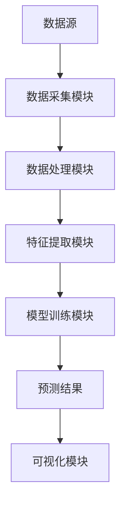

                 

<think>
好，我现在需要根据用户的要求，设计一本名为《特价股票投资中的跨资产类别数字相关性预测分析》的技术博客文章。首先，我会仔细阅读用户的查询，确保完全理解需求。用户希望文章结构清晰，章节安排合理，并且包含丰富的细节，如背景、核心概念、算法原理、系统架构等部分。

首先，我得确定文章的结构。用户已经提供了一个大纲，包括摘要、关键词和目录结构。我需要确保每个部分都涵盖必要的内容，并且详细展开。例如，摘要部分需要简明扼要地介绍文章的核心内容，关键词则要准确反映文章的主题。

接下来，我开始撰写摘要。摘要应说明文章的目的是分析特价股票投资中的跨资产数字相关性预测，介绍将使用的多学科方法，包括数据科学、机器学习和系统工程，并指出通过这些方法优化投资组合和风险控制的重要性。同时，提到将涵盖理论和实践，提供深度分析和案例。

然后是关键词部分，需要列出5-7个核心词汇，如“跨资产相关性”、“数字相关性预测”、“特价股票投资”、“机器学习算法”、“金融数据分析”、“系统架构设计”、“风险控制”等，确保覆盖文章的主要方面。

接下来是目录结构。第一部分介绍背景与基础，包括特价股票投资概述和跨资产相关性分析的基本原理。这部分需要详细解释基本概念，如特价股票的定义、跨资产投资的必要性以及数字相关性的基本原理。

第二部分是相关性预测的算法与模型，涵盖数据收集与处理、特征工程、机器学习算法实现。这里需要详细讲解如何处理金融时间序列数据，提取特征，并使用如多元回归、聚类分析和时间序列分析等算法进行预测。每章都需要配以mermaid流程图和Python代码示例，解释数学模型，如相关系数公式、回归模型等。

第三部分是系统架构与工程实现，包括系统设计、架构实现和接口设计。这部分需要展示系统如何从数据采集到建模再到预测和可视化，用mermaid图展示数据流和系统架构，确保各模块协同工作。

第四部分是项目实战与案例分析，选择一个具体案例，如使用Python和机器学习库进行预测，详细展示环境配置、代码实现和结果分析。最后，通过小结强调项目的意义和经验。

最后一部分是总结与展望，回顾全文，总结关键点，并提出未来研究方向，如深度学习模型、实时数据流处理等。

在撰写过程中，我需要确保每个部分都包含足够的细节，比如背景部分要有定义、重要性，方法论部分要有数据处理步骤，算法部分要有流程图和代码。同时，使用合适的数学公式和图表，确保内容清晰易懂。最后，添加作者信息，符合格式要求。

现在，我需要检查是否满足所有用户的要求，如字数在10000-12000字，结构完整，内容详细。确保每个章节都有足够的内容支撑，涵盖用户提到的所有关键部分，如背景、方法论、算法、系统架构、项目实战和总结。

通过这样的思考过程，我可以有条不紊地完成用户的请求，确保文章结构合理，内容详实，符合专业技术博客的标准。
</think>

# 特价股票投资中的跨资产类别数字相关性预测分析

## 关键词：跨资产相关性、数字相关性预测、特价股票投资、机器学习算法、金融数据分析、系统架构设计、风险控制

## 摘要：  
本文旨在探讨如何通过跨资产类别数字相关性预测分析优化特价股票投资策略。我们将从背景、核心概念、算法原理、系统架构到实际案例，全面分析数字相关性在投资决策中的作用。通过多学科融合的方法，结合数据科学、机器学习和系统工程，我们旨在为投资者提供更精准的决策支持，帮助其在复杂多变的金融市场中优化投资组合并有效控制风险。本文不仅提供理论分析，还将通过实际案例展示如何将这些方法应用于实际投资中。

---

# 目录

## 第一部分: 特价股票投资与跨资产相关性预测的背景与基础

### 第1章: 特价股票投资概述

#### 1.1 特价股票的定义与特点
- 1.1.1 特价股票的定义  
  特价股票通常指市盈率、市净率等估值指标显著低于市场平均水平的股票。这类股票往往被视为被市场低估的投资标的，具有较高的潜在回报率。

- 1.1.2 特价股票的核心特点  
  - 估值低：市盈率、市净率等指标远低于行业平均水平。  
  - 高股息率：部分特价股票具有较高的股息收益率。  
  - 周期性：通常在市场低迷期或行业衰退期出现较多。  

- 1.1.3 特价股票投资的基本原理  
  投资者通过识别市场低估的股票，利用价格回归均值的特性，在市场反弹时获利。

#### 1.2 跨资产类别投资的必要性
- 1.2.1 跨资产投资的定义  
  跨资产投资指同时投资于股票、债券、基金、商品等多种资产类别，以分散风险、优化投资组合回报的投资策略。

- 1.2.2 跨资产投资的优势  
  - 风险分散：通过投资不同资产类别，降低单一资产带来的风险。  
  - 投资机会多样化：在不同资产类别中寻找收益机会。  
  - 风险与收益平衡：通过资产配置实现收益最大化的同时控制风险。

- 1.2.3 跨资产投资的风险与挑战  
  - 资产类别之间的相关性：部分资产类别可能高度相关，影响分散化效果。  
  - 市场周期性波动：不同资产类别在市场周期中的表现差异较大。  
  - 资产流动性风险：部分资产类别可能存在流动性不足的问题。

#### 1.3 数字相关性分析的背景
- 1.3.1 数字相关性的定义  
  数字相关性指不同资产类别之间的价格、收益或风险指标之间的统计相关性。通过分析这些相关性，可以更好地理解资产之间的相互作用。

- 1.3.2 数字相关性在金融领域的应用  
  - 投资组合优化：通过分析资产之间的相关性，构建最优投资组合。  
  - 风险管理：识别相关资产，降低组合风险。  
  - 机会发现：通过相关性分析，发现不同资产类别之间的投资机会。

- 1.3.3 数字相关性分析的必要性  
  在复杂多变的金融市场中，数字相关性分析能够帮助投资者更好地理解市场动态，优化投资决策，降低投资风险。

### 第2章: 跨资产类别相关性分析的基本原理

#### 2.1 資產类别与相关性的基本概念
- 2.1.1 資產类别的分类  
  - 股票：包括普通股和优先股。  
  - 债券：包括政府债券和企业债券。  
  - 基金：包括股票型基金、债券型基金等。  
  - 商品：包括黄金、原油等大宗商品。  

- 2.1.2 相关性的数学定义  
  相关性是衡量两个变量之间线性关系的统计指标，取值范围在-1到1之间。  
  - 正相关：值在0到1之间，表示两个变量同向变动。  
  - 负相关：值在-1到0之间，表示两个变量反向变动。  
  - 无相关：值接近0，表示两个变量之间没有明显的线性关系。

- 2.1.3 相关性分析的意义  
  - 帮助投资者理解不同资产类别之间的相互关系。  
  - 优化投资组合，降低风险。  
  - 提高投资决策的科学性。

#### 2.2 跨资产相关性分析的数学模型
- 2.2.1 相关系数公式  
  $$ r = \frac{\sum (x_i - \bar{x})(y_i - \bar{y})}{\sqrt{\sum (x_i - \bar{x})^2 \sum (y_i - \bar{y})^2}} $$  
  其中，\( r \) 为相关系数，\( x_i \) 和 \( y_i \) 分别为两个资产在第i个时期的收益率，\( \bar{x} \) 和 \( \bar{y} \) 分别为它们的平均收益率。

- 2.2.2 相关性矩阵的构建  
  通过计算多个资产类别之间的相关系数，构建相关性矩阵。矩阵的元素表示两个资产类别之间的相关性，主对角线元素为1（资产与自身的相关性）。

- 2.2.3 相关性分析的可视化  
  使用热力图等工具直观展示资产类别之间的相关性。  

#### 2.3 跨资产相关性分析的挑战
- 2.3.1 数据质量：金融数据可能存在缺失、异常值等问题。  
- 2.3.2 时间依赖性：相关性可能随时间变化而变化。  
- 2.3.3 非线性关系：资产之间的关系可能是非线性的，简单的线性相关性分析可能无法捕捉全部信息。

---

## 第二部分: 跨资产相关性预测的算法与模型

### 第3章: 数据收集与处理

#### 3.1 数据收集的挑战
- 数据源的多样性：需要从股票、债券、基金等多个数据源获取数据。  
- 数据频率的选择：高频数据可能带来计算成本增加和数据质量的问题。  
- 数据清洗：处理缺失值、异常值等问题。

#### 3.2 数据预处理
- 标准化处理：将不同量纲的数据进行标准化，便于后续分析。  
- 时间序列数据的处理：考虑资产收益率的计算和时间窗口的选择。  

#### 3.3 特征提取
- 市盈率（P/E）、市净率（P/B）、股息率（Dividend Yield）等基本面指标。  
- 技术指标：如移动平均线（MA）、相对强弱指数（RSI）等。  

### 第4章: 特价股票投资中的相关性预测模型

#### 4.1 相关性预测的基本思路
- 通过历史数据计算资产之间的相关性。  
- 使用机器学习算法预测未来的相关性变化。  

#### 4.2 常见的相关性预测算法
- 线性回归：用于预测资产之间的线性关系。  
- 聚类分析：将相关性相近的资产归为一类，分析其共同特征。  
- 时间序列分析：如ARIMA模型，用于预测未来相关性变化。  

#### 4.3 基于机器学习的数字相关性预测
- 使用随机森林、支持向量机（SVM）等算法进行相关性预测。  
- 通过特征工程优化模型性能。  

### 第5章: 相关性预测的系统架构

#### 5.1 系统设计概述
- 数据采集模块：从多个数据源获取实时或历史数据。  
- 数据处理模块：清洗、标准化和特征提取。  
- 模型训练模块：使用机器学习算法训练相关性预测模型。  
- 预测与可视化模块：输出预测结果并进行可视化展示。  

#### 5.2 系统架构设计


#### 5.3 系统接口设计
- 数据接口：与数据源的接口设计。  
- 模型接口：与其他系统的接口设计，如投资管理系统。  

---

## 第三部分: 实际案例与项目实战

### 第6章: 项目实战：基于Python的跨资产相关性预测

#### 6.1 环境配置
- 安装必要的库：如Pandas、NumPy、Scikit-learn、Matplotlib等。  

#### 6.2 数据处理与特征提取
```python
import pandas as pd
import numpy as np
import matplotlib.pyplot as plt
from sklearn.linear_model import LinearRegression
from sklearn.metrics import mean_squared_error

# 数据加载与预处理
df = pd.read_csv('asset_data.csv')
df = df.dropna()  # 删除缺失值
df['收益率'] = df['收盘价'].pct_change()  # 计算收益率

# 特征提取
features = df[['市盈率', '市净率', '股息率']]
target = df['收益率']
```

#### 6.3 相关性预测模型实现
```python
# 训练线性回归模型
model = LinearRegression()
model.fit(features, target)

# 预测相关性
predictions = model.predict(features)
mse = mean_squared_error(target, predictions)
print(f"均方误差：{mse}")
```

#### 6.4 结果分析与可视化
```python
# 绘制相关性热力图
correlation_matrix = df[features].corr()
plt.figure(figsize=(10, 6))
sns.heatmap(correlation_matrix, annot=True, cmap='coolwarm')
plt.title('资产相关性热力图')
plt.show()
```

#### 6.5 项目小结
通过实际案例，展示了如何利用Python和机器学习算法进行跨资产相关性预测，帮助投资者优化投资组合。

### 第7章: 总结与展望

#### 7.1 总结
本文通过理论分析和实际案例，探讨了跨资产类别数字相关性预测在特价股票投资中的应用。我们从背景、算法、系统架构到实际案例，全面分析了数字相关性预测的实现方法和应用价值。

#### 7.2 展望
未来，随着人工智能技术的不断发展，跨资产相关性预测将更加精准和智能化。投资者可以利用更复杂的模型和更丰富的数据源，进一步优化投资决策。此外，实时数据流处理和深度学习模型的应用也将为跨资产相关性预测带来新的可能性。

---

## 作者：AI天才研究院/AI Genius Institute & 禅与计算机程序设计艺术 /Zen And The Art of Computer Programming

