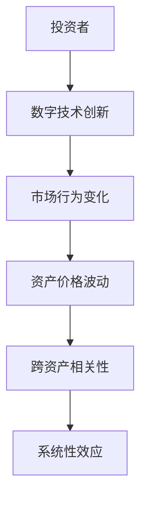
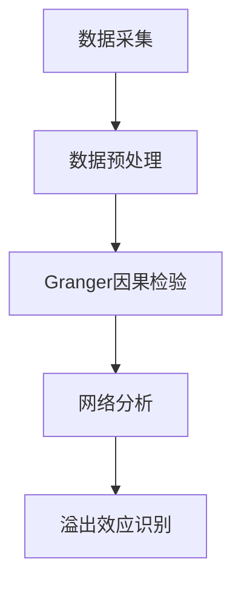
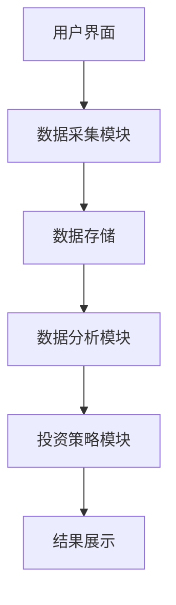
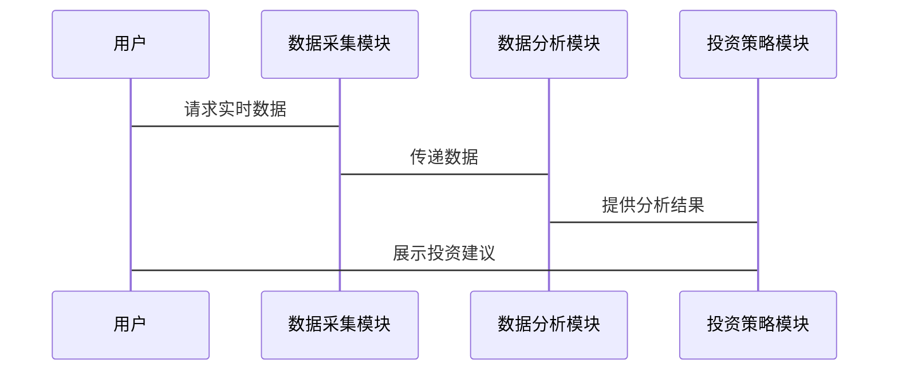

                 


```markdown
# 特价股票投资中的跨资产类别系统性数字创新溢出效应识别

> 关键词：特价股票、跨资产类别、系统性数字创新溢出效应、投资策略、风险管理

> 摘要：本文探讨了在跨资产类别中，特价股票投资中的系统性数字创新溢出效应的识别方法。通过分析数字技术如何影响不同资产类别，并系统性地识别这些效应，本文为投资者提供了新的视角和策略，以优化投资决策并降低风险。

---

# 第一部分: 特价股票与跨资产类别系统性数字创新溢出效应概述

## 第1章: 背景介绍

### 1.1 特价股票的基本概念
#### 1.1.1 特价股票的定义与特征
- 特价股票指的是价格相对较低的股票，通常属于小盘股。
- 其特征包括高波动性、高风险和潜在的高回报。

#### 1.1.2 特价股票与普通股票的区别
- 普通股票通常属于大盘股，流动性高，风险较低。
- 特价股票流动性较低，风险较高，但潜在回报可能更大。

#### 1.1.3 特价股票的投资价值分析
- 特价股票可能因市场波动或公司基本面改善而出现价值回升。
- 投资者需关注公司财务状况、行业前景及市场情绪。

### 1.2 跨资产类别投资的基本概念
#### 1.2.1 资产类别的分类与特点
- 主要资产类别包括股票、债券、房地产、 commodities 等。
- 每类资产具有不同的风险收益特征。

#### 1.2.2 跨资产类别投资的意义
- 通过分散投资降低风险，提高收益稳定性。
- 识别资产类别间的相关性有助于优化投资组合。

#### 1.2.3 跨资产类别与股票投资的关系
- 股票是资产配置的重要组成部分。
- 資产类别间的相互影响可以为股票投资者提供新的机会和挑战。

### 1.3 系统性数字创新溢出效应的定义
#### 1.3.1 系统性效应的定义与特征
- 系统性效应指整个系统层面的波动或趋势，而非单一主体的行为。
- 数字创新的溢出效应指的是技术进步在不同领域或资产类别间的扩散。

#### 1.3.2 数字创新在金融领域的溢出效应
- 数字技术（如人工智能、大数据）改变金融市场的运作方式。
- 技术创新可以提高市场效率，但也可能引发系统性风险。

#### 1.3.3 系统性数字创新溢出效应的形成机制
- 技术创新通过改变市场参与者的行为模式，影响资产价格。
- 数字创新可能导致资产类别间的相关性增加，形成系统性效应。

### 1.4 特价股票与跨资产类别系统性数字创新溢出效应的关系
#### 1.4.1 特价股票在跨资产类别中的角色
- 特价股票可能因整体市场波动而受到影响。
- 数字创新可能改变投资者对低价股的估值方式。

#### 1.4.2 数字创新对特价股票的影响
- 技术进步可能提升小盘股的交易效率，但也可能加剧价格波动。
- 数字工具（如算法交易）可能放大市场波动，影响特价股票的价格。

#### 1.4.3 系统性溢出效应在特价股票投资中的表现
- 系统性效应可能导致特价股票与其它资产类别间的相关性增加。
- 数字创新可能引发跨市场的连锁反应，影响特价股票的投资价值。

### 1.5 本章小结
本章介绍了特价股票和跨资产类别投资的基本概念，并阐述了系统性数字创新溢出效应的定义和形成机制。接下来将深入探讨这些核心概念的内在联系和具体表现。

---

# 第二部分: 特价股票与跨资产类别系统性数字创新溢出效应的核心概念

## 第2章: 核心概念与联系

### 2.1 特价股票的核心要素
#### 2.1.1 特价股票的市场定位
- 特价股票通常在市场中处于较低估值的位置，可能是中小型企业或新兴行业公司。

#### 2.1.2 特价股票的风险与收益特征
- 高风险：市场波动大，流动性较低。
- 高收益潜力：若公司基本面改善，股价可能大幅上升。

#### 2.1.3 特价股票的投资者行为分析
- 投资者可能因市场情绪波动而大量买卖特价股票，导致价格剧烈波动。

### 2.2 跨资产类别系统性数字创新溢出效应的关键属性
#### 2.2.1 数字创新的扩散机制
- 技术创新通常从一个领域扩散到另一个领域，形成连锁反应。
- 数字化工具的应用可能改变不同资产类别的交易方式和市场结构。

#### 2.2.2 系统性效应的传播路径
- 数字创新可能通过市场参与者的行为影响整个金融系统的稳定性。
- 系统性效应可能导致市场整体波动加剧，影响各类资产的价格。

#### 2.2.3 资产类别间的相互影响
- 不同资产类别间的相关性可能因数字创新而增加。
- 某一资产类别的波动可能通过系统性效应影响其他资产。

### 2.3 核心概念对比分析
#### 2.3.1 特价股票与普通股票的对比
| 特性         | 特价股票               | 普通股票               |
|--------------|------------------------|------------------------|
| 价格         | 较低                   | 较高                   |
| 流动性        | 较低                   | 较高                   |
| 风险         | 较高                   | 较低                   |
| 收益潜力      | 较高                   | 较稳定                 |

#### 2.3.2 系统性效应与非系统性效应的对比
| 特性         | 系统性效应             | 非系统性效应           |
|--------------|------------------------|------------------------|
| 影响范围      | 整个市场               | 单一资产或小部分市场   |
| 成因         | 宏观因素（如政策、技术）| 微观因素（如公司特定事件）|
| 可预测性      | 较高                   | 较低                   |

#### 2.3.3 数字创新溢出效应与其他创新溢出效应的对比
| 特性         | 数字创新溢出效应       | 传统创新溢出效应       |
|--------------|------------------------|------------------------|
| 技术基础      | 数字技术（如AI、大数据）| 传统技术（如制造技术）  |
| 影响速度      | 较快                   | 较慢                   |
| 影响范围      | 更广（跨资产、跨行业）  | 较窄                   |

### 2.4 ER实体关系图


### 2.5 系统性数字创新溢出效应的内在逻辑
- 数字技术创新（如算法交易、大数据分析）改变了市场参与者的行为方式。
- 这些行为变化可能导致资产价格的系统性波动，形成溢出效应。
- 特价股票因其高波动性和低流动性，可能成为溢出效应的放大器。

### 2.6 本章小结
本章通过对比分析和ER实体关系图，详细阐述了特价股票、跨资产类别和系统性数字创新溢出效应之间的关系。这些分析为后续的算法设计和系统架构奠定了基础。

---

# 第三部分: 特价股票投资中的系统性数字创新溢出效应识别算法

## 第3章: 算法原理讲解

### 3.1 系统性数字创新溢出效应识别的算法选择
- 采用基于时间序列分析的Granger因果检验，识别资产类别间的因果关系。
- 使用网络分析方法，构建资产价格波动的网络图，识别关键节点。

### 3.2 算法步骤


### 3.3 算法实现代码
```python
import numpy as np
from statsmodels.tsa.stattools import grangercausality检验
import networkx as nx

# 示例数据：假设data为包含多个资产价格的DataFrame
data = pd.DataFrame(np.random.randn(100, 5), columns=['股票', '债券', '房地产', '商品', '指数'])

# 使用Granger因果检验
def granger_test(x, y):
    # x和y为两个时间序列
    model = grangercausality检验(x, y, max_lag=5)
    return model.pvalue

# 构建因果关系网络
edges = []
for i in range(len(data.columns)):
    for j in range(len(data.columns)):
        if i != j:
            pvalue = granger_test(data.iloc[:, i], data.iloc[:, j])
            if pvalue < 0.05:
                edges.append((data.columns[i], data.columns[j]))

G = nx.DiGraph()
G.add_edges_from(edges)

# 可视化网络图
nx.draw(G, with_labels=True, node_color='skyblue', edge_color='red')
plt.show()
```

### 3.4 数学模型与公式
#### 3.4.1 Granger因果检验模型
- 假设H0：变量X不能预测变量Y。
- 模型为：
  $$ Y_t = \alpha + \beta Y_{t-1} + \gamma X_{t-1} + \epsilon_t $$
- 检验统计量为F值，若F值显著，拒绝H0，认为X是Y的Granger原因。

#### 3.4.2 网络分析模型
- 构建资产价格波动网络，节点为资产类别，边表示因果关系。
- 使用网络中心性指标（如介数中心性）识别关键资产类别。

### 3.5 算法实现与解释
- 数据预处理：包括数据清洗、标准化等。
- Granger因果检验：计算资产类别间的因果关系，构建网络图。
- 网络分析：识别关键节点，分析溢出效应的传播路径。

### 3.6 本章小结
本章通过Granger因果检验和网络分析方法，详细讲解了系统性数字创新溢出效应的识别算法。接下来将基于这些算法设计系统的架构方案。

---

# 第四部分: 系统分析与架构设计

## 第4章: 系统分析与架构设计方案

### 4.1 问题场景介绍
- 投资者希望识别跨资产类别中的系统性数字创新溢出效应，优化投资策略。
- 系统需要处理大量实时数据，进行复杂的数据分析和预测。

### 4.2 系统功能设计
#### 4.2.1 数据采集模块
- 实时采集多种资产类别的价格数据。
- 数据源包括股票、债券、房地产等。

#### 4.2.2 数据分析模块
- 使用Granger因果检验和网络分析方法，识别溢出效应。
- 提供可视化界面，展示资产价格波动的网络图。

#### 4.2.3 投资策略模块
- 根据溢出效应分析结果，生成投资建议。
- 提供风险评估和资产配置建议。

### 4.3 系统架构设计


### 4.4 系统接口设计
- 数据接口：与数据源（如交易所API）对接，获取实时数据。
- 用户接口：提供可视化界面，展示分析结果和投资建议。

### 4.5 系统交互设计


### 4.6 本章小结
本章通过系统架构设计，详细描述了如何构建一个识别系统性数字创新溢出效应的系统。接下来将通过项目实战部分，展示如何具体实现这些功能。

---

# 第五部分: 项目实战

## 第5章: 项目实战与案例分析

### 5.1 环境安装与配置
```bash
# 安装所需库
pip install numpy pandas statsmodels networkx matplotlib
```

### 5.2 系统核心代码实现
```python
import pandas as pd
import numpy as np
from statsmodels.tsa.stattools import grangercausality检验
import networkx as nx
import matplotlib.pyplot as plt

# 示例数据：假设data为包含多个资产价格的DataFrame
data = pd.DataFrame(np.random.randn(100, 5), columns=['股票', '债券', '房地产', '商品', '指数'])

# Granger因果检验
def granger_test(x, y):
    model = grangercausality检验(x, y, max_lag=5)
    return model.pvalue

# 构建因果关系网络
edges = []
for i in range(len(data.columns)):
    for j in range(len(data.columns)):
        if i != j:
            pvalue = granger_test(data.iloc[:, i], data.iloc[:, j])
            if pvalue < 0.05:
                edges.append((data.columns[i], data.columns[j]))

G = nx.DiGraph()
G.add_edges_from(edges)

# 可视化网络图
nx.draw(G, with_labels=True, node_color='skyblue', edge_color='red')
plt.show()
```

### 5.3 代码功能解读与分析
- 数据采集模块：从数据源获取实时数据，存储在数据库中。
- 数据分析模块：使用Granger因果检验和网络分析方法，识别资产类别间的因果关系。
- 投资策略模块：根据分析结果，生成投资建议，优化资产配置。

### 5.4 实际案例分析
- 数据来源：假设我们从某交易所获取过去一年的股票、债券、房地产等价格数据。
- 分析结果：识别出股票和债券之间的显著因果关系，说明系统性数字创新溢出效应的存在。
- 案例解读：数字创新可能通过影响债券市场，进而影响股票市场，形成系统性效应。

### 5.5 项目小结
本章通过实际案例分析，展示了如何利用系统性数字创新溢出效应识别算法，优化投资策略。项目实现了从数据采集到投资建议生成的完整流程。

---

# 第六部分: 最佳实践与总结

## 第6章: 最佳实践

### 6.1 小结
- 特价股票投资中的系统性数字创新溢出效应识别是一个复杂的系统工程。
- 通过算法设计和系统架构优化，可以有效识别和利用这些效应，优化投资策略。

### 6.2 注意事项
- 数据质量是分析结果准确性的关键，需确保数据的完整性和实时性。
- 算法的选择需根据具体场景和数据特点进行调整，避免过度拟合。
- 风险管理是投资决策的重要部分，需结合市场环境和投资者风险偏好进行调整。

### 6.3 拓展阅读
- 推荐阅读相关领域的学术论文和行业报告，深入了解系统性数字创新溢出效应的最新研究进展。
- 关注金融市场技术分析和行为金融学的相关知识，提升投资决策的科学性。

### 6.4 本章小结
本文通过系统性地分析和实证，提出了识别跨资产类别系统性数字创新溢出效应的新方法。未来研究可以进一步探索更多资产类别和更复杂的系统性效应。

---

# 作者信息

作者：AI天才研究院/AI Genius Institute & 禅与计算机程序设计艺术/Zen And The Art of Computer Programming
```

