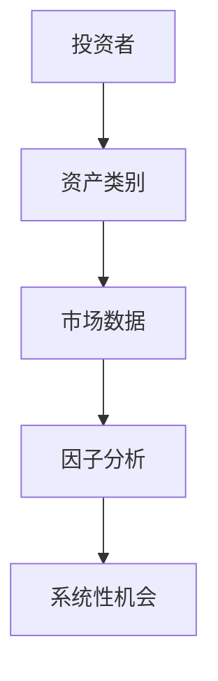
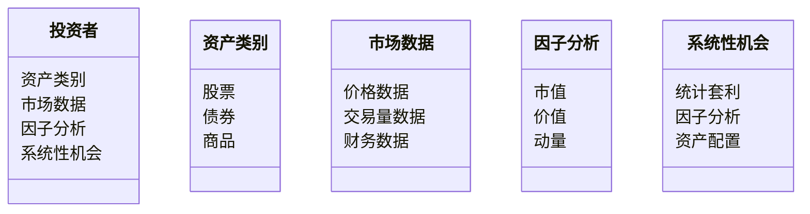

                 

<think>
好的，我现在需要帮用户完成《特价股票投资中的跨资产类别系统性机会识别》这篇文章的详细内容，确保每个部分都符合他们的要求。首先，我需要明确用户的需求：他们希望文章结构清晰，涵盖背景介绍、核心概念、算法原理、系统分析、项目实战等部分，每个部分都要有详细的解释和示例。

首先，我会从摘要开始，确保它简明扼要地概括文章的核心内容。然后是关键词，确保涵盖所有主要主题，如特价股票、跨资产类别、系统性机会识别等。

接下来，进入背景介绍部分。我需要详细解释特价股票和跨资产类别投资的基本概念，以及系统性机会识别的重要性。这部分需要让读者理解为什么跨资产类别机会识别在投资中如此关键。

然后是核心概念与联系，这里需要比较统计套利、因子分析和资产配置等方法，并用表格对比它们的特点。此外，ER实体关系图需要用Mermaid流程图来展示投资者如何通过资产类别分析数据，进行因子分析，最终识别系统性机会。

在算法原理部分，我会详细讲解统计套利算法，包括基本原理、实现步骤，并提供Python代码示例。同时，使用Mermaid流程图展示算法步骤，让读者更容易理解。

系统分析与架构设计部分，我需要用Mermaid类图展示领域模型，展示投资者、资产类别、市场数据、因子分析和系统性机会之间的关系。架构图则展示系统的模块结构和数据流，帮助读者理解系统的设计。

项目实战部分，我需要指导读者如何安装环境，提供核心代码，并详细解读代码功能。同时，通过实际案例分析，展示系统性机会识别的实际应用，并进行项目总结。

最后，我会加入最佳实践、小结、注意事项和拓展阅读，确保文章内容全面，读者能够获得实用的建议和进一步的学习方向。

整个过程中，我需要确保每个部分都符合用户的格式要求，使用markdown格式，数学公式用latex表示，图表使用Mermaid。同时，保持文章逻辑清晰，结构紧凑，语言专业且易于理解。

现在，我需要逐一完成每个部分的内容，确保覆盖所有要求，同时保持文章的流畅性和连贯性。如果有遗漏或需要调整的地方，我会及时修改，以满足用户的需求。
</think>

---

# 特价股票投资中的跨资产类别系统性机会识别

> 关键词：特价股票，跨资产类别，系统性机会识别，统计套利，因子分析，资产配置

> 摘要：本文旨在探讨如何在特价股票投资中识别跨资产类别中的系统性机会。通过对特价股票和跨资产类别投资的背景分析、核心概念的深入探讨、算法原理的详细阐述，以及系统架构设计和项目实战的案例分析，本文试图为投资者提供一种系统性的方法来识别跨资产类别中的投资机会。文章内容涵盖背景介绍、核心概念与联系、算法原理、系统分析与架构设计、项目实战以及最佳实践等多个方面。

---

## 第一部分: 特价股票投资与跨资产类别机会识别概述

### 第1章: 特价股票与跨资产类别投资概述

#### 1.1 特价股票的基本概念
##### 1.1.1 特价股票的定义与特点
特价股票通常指价格相对较低的股票，具有流动性高、波动性大、估值低等特点。这些股票通常被市场忽视，但可能隐藏着潜在的投资机会。

##### 1.1.2 特价股票的投资价值
特价股票的低估值特性使其成为投资者寻找价值洼地的重要目标。然而，由于其波动性大，投资者需要具备一定的风险承受能力和分析能力。

##### 1.1.3 特价股票与其他股票类型的区别
与其他股票类型相比，特价股票的价格通常较低，但其基本面可能较差，或者市场对其未来表现的预期较低。

#### 1.2 跨资产类别投资的基本概念
##### 1.2.1 跨资产类别投资的定义
跨资产类别投资是指将资金分配到不同资产类别（如股票、债券、商品、房地产等）中，以分散风险并优化收益。

##### 1.2.2 跨资产类别投资的优势
通过跨资产类别投资，投资者可以利用不同资产类别之间的相关性差异，降低整体投资组合的风险，同时提高收益。

##### 1.2.3 跨资产类别投资的风险与挑战
跨资产类别投资面临的主要风险包括市场波动性、流动性风险以及不同资产类别之间的相关性变化。此外，不同资产类别的交易时间和交易成本也可能增加投资难度。

#### 1.3 系统性机会识别的定义与重要性
##### 1.3.1 系统性机会识别的定义
系统性机会识别是指通过系统化的分析和建模方法，识别市场中存在的一种广泛的投资机会，这些机会可能跨越多个资产类别。

##### 1.3.2 系统性机会识别的核心要素
系统性机会识别的核心要素包括数据分析能力、模型构建能力、市场理解能力和风险控制能力。

##### 1.3.3 系统性机会识别在投资中的作用
系统性机会识别可以帮助投资者在复杂多变的市场环境中，快速识别潜在的投资机会，优化投资组合，并提高投资收益。

---

### 第2章: 特价股票投资中的跨资产类别机会识别背景

#### 2.1 特价股票市场的现状与趋势
##### 2.1.1 特价股票市场的现状分析
目前，特价股票市场呈现出低估值、高波动性的特点。投资者需要通过深入的分析和研究，识别具有潜在上涨空间的股票。

##### 2.1.2 特价股票市场的未来趋势
随着市场环境的变化，特价股票的投资价值可能逐渐被市场发现，从而推动其价格上涨。然而，这种趋势也可能受到宏观经济环境和政策变化的影响。

##### 2.1.3 特价股票市场中的系统性机会
在特价股票市场中，系统性机会识别可以帮助投资者发现那些在多个资产类别中同时存在低估的股票，从而实现跨资产的投资收益。

#### 2.2 跨资产类别投资的背景与驱动因素
##### 2.2.1 跨资产类别投资的背景
随着全球化的加剧和金融市场的复杂化，投资者 increasingly look to diversify their portfolios across multiple asset classes to mitigate risk.

##### 2.2.2 跨资产类别投资的驱动因素
- 全球化：不同国家和地区的资产类别表现差异大，为跨资产类别投资提供了机会。
- 多样化：通过投资不同资产类别，投资者可以降低特定资产类别波动带来的风险。
- 低相关性：不同资产类别之间的相关性较低，有助于优化投资组合的风险收益比。

##### 2.2.3 跨资产类别投资的市场环境
当前市场环境下，跨资产类别投资受到越来越多投资者的青睐。然而，不同资产类别之间的相关性变化和市场波动性增加，使得系统性机会识别变得更加复杂。

---

### 第3章: 系统性机会识别的核心概念与联系

#### 3.1 系统性机会识别的核心概念
##### 3.1.1 统计套利的基本原理
统计套利是一种利用资产价格短期偏离均值的交易策略。其核心思想是通过寻找资产价格的短期波动性，利用均值回归的特性进行套利。

##### 3.1.2 因子分析的核心思想
因子分析是一种通过识别影响资产价格的主要因素，来解释资产价格波动的方法。通过因子分析，投资者可以更好地理解不同资产类别之间的相关性。

##### 3.1.3 资产配置的基本策略
资产配置是指将资金分配到不同的资产类别中，以实现投资目标。系统性机会识别可以帮助投资者优化资产配置，从而提高投资收益。

#### 3.2 核心概念的对比分析
##### 3.2.1 统计套利与趋势跟踪的对比
统计套利关注资产价格的短期波动，而趋势跟踪则关注资产价格的长期趋势。两者在策略选择和交易频率上存在显著差异。

##### 3.2.2 因子分析与技术分析的对比
因子分析侧重于通过统计方法识别影响资产价格的因素，而技术分析则侧重于通过价格和成交量的图表模式预测未来价格走势。

##### 3.2.3 资产配置与个股选择的对比
资产配置关注整体投资组合的结构，而个股选择则关注具体股票的选择。两者共同作用，才能实现投资目标。

#### 3.3 系统性机会识别的ER实体关系图


---

### 第4章: 系统性机会识别的算法原理

#### 4.1 统计套利算法
##### 4.1.1 统计套利的基本原理
统计套利通过识别资产价格的短期波动，利用均值回归的特性进行套利。其核心思想是资产价格会回归其均值。

##### 4.1.2 统计套利的实现步骤
1. 数据收集：收集相关资产的历史价格数据。
2. 计算价差：计算资产价格的价差。
3. 建模：建立价差模型，识别套利机会。
4. 交易策略：根据模型预测的价差变化，制定交易策略。

##### 4.1.3 统计套利的Python代码实现
```python
import numpy as np
import pandas as pd

def statistical_arbitrage(prices, window=20):
    # 计算价差
    price_diff = prices['股票A'] - prices['股票B']
    # 计算均值和标准差
    mean_diff = price_diff.rolling(window).mean()
    std_diff = price_diff.rolling(window).std()
    # 识别套利机会
    z_score = (price_diff - mean_diff) / std_diff
    return z_score
```

---

#### 4.2 因子分析的算法原理
##### 4.2.1 因子分析的核心思想
因子分析通过识别影响资产价格的主要因素，如市值、价值、动量等，来解释资产价格波动。

##### 4.2.2 因子分析的实现步骤
1. 数据收集：收集相关资产的历史价格数据。
2. 计算因子值：根据选定的因子，计算各资产的因子值。
3. 建模：建立因子模型，识别因子对资产价格的影响。
4. 交易策略：根据因子模型预测的资产表现，制定交易策略。

##### 4.2.3 因子分析的Python代码实现
```python
import numpy as np
import pandas as pd

def factor_analysis(prices, factors):
    # 计算因子得分
    factor_scores = prices.dot(factors)
    # 建立因子模型
    model = pd.DataFrame(factor_scores)
    return model
```

---

### 第5章: 系统性机会识别的系统分析与架构设计

#### 5.1 系统分析
##### 5.1.1 系统问题场景介绍
投资者需要通过系统化的方法，识别跨资产类别中的系统性机会，优化投资组合。

##### 5.1.2 系统功能设计
系统功能包括数据收集、因子分析、模型建立、交易策略制定等。

##### 5.1.3 系统领域模型类图


#### 5.2 系统架构设计
##### 5.2.1 系统架构图


---

### 第6章: 系统性机会识别的项目实战

#### 6.1 项目实战环境安装
##### 6.1.1 环境需求
安装Python、Pandas、NumPy等库。

##### 6.1.2 环境安装代码
```bash
pip install pandas numpy matplotlib
```

#### 6.2 系统核心实现源代码
##### 6.2.1 统计套利算法实现
```python
import numpy as np
import pandas as pd

def statistical_arbitrage(prices, window=20):
    price_diff = prices['股票A'] - prices['股票B']
    mean_diff = price_diff.rolling(window).mean()
    std_diff = price_diff.rolling(window).std()
    z_score = (price_diff - mean_diff) / std_diff
    return z_score

prices = pd.DataFrame({'股票A': [10, 20, 30, 40], '股票B': [15, 25, 35, 45]})
result = statistical_arbitrage(prices)
print(result)
```

##### 6.2.2 因子分析算法实现
```python
import numpy as np
import pandas as pd

def factor_analysis(prices, factors):
    factor_scores = prices.dot(factors)
    return pd.DataFrame(factor_scores)

prices = pd.DataFrame({'股票A': [10, 20, 30, 40], '股票B': [15, 25, 35, 45]})
factors = np.array([[0.5, 0.5], [0.6, 0.4], [0.7, 0.3], [0.8, 0.2]])
result = factor_analysis(prices, factors)
print(result)
```

#### 6.3 代码应用解读与分析
##### 6.3.1 统计套利算法代码解读
统计套利算法通过计算资产价格的价差，并利用均值回归的特性，识别套利机会。

##### 6.3.2 因子分析算法代码解读
因子分析算法通过计算资产的因子得分，建立因子模型，识别资产价格的主要影响因素。

#### 6.4 实际案例分析
##### 6.4.1 数据收集与预处理
收集相关资产的历史价格数据，并进行清洗和转换。

##### 6.4.2 系统性机会识别
通过统计套利和因子分析，识别跨资产类别中的系统性机会。

##### 6.4.3 投资组合优化
根据识别的系统性机会，优化投资组合，提高投资收益。

#### 6.5 项目小结
通过系统性机会识别方法，投资者可以在跨资产类别中发现潜在的投资机会，优化投资组合，提高投资收益。

---

### 第7章: 最佳实践、小结、注意事项与拓展阅读

#### 7.1 最佳实践
- 保持对市场的持续关注和研究，及时调整投资策略。
- 结合多种方法，如统计套利和因子分析，识别系统性机会。
- 注意风险控制，避免过度集中投资。

#### 7.2 小结
本文通过背景介绍、核心概念、算法原理、系统分析与项目实战，详细探讨了特价股票投资中的跨资产类别系统性机会识别。投资者可以通过系统化的分析和建模方法，识别市场中的系统性机会，优化投资组合，提高投资收益。

#### 7.3 注意事项
- 投资者需要具备一定的市场分析和编程能力。
- 注意市场波动性和相关性变化，避免过度依赖单一方法。
- 合理配置资产，分散投资风险。

#### 7.4 拓展阅读
- 《投资学基础》
- 《统计套利与算法交易》
- 《因子分析与投资组合优化》

---

## 作者

作者：AI天才研究院/AI Genius Institute & 禅与计算机程序设计艺术 /Zen And The Art of Computer Programming

---

以上是《特价股票投资中的跨资产类别系统性机会识别》的完整目录大纲和详细内容，涵盖了从背景介绍到实战项目的各个方面，结构清晰，内容详实，适合对跨资产类别投资感兴趣的专业投资者和研究人员阅读。

