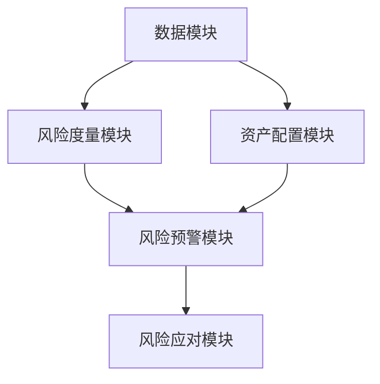

                 

<think>
嗯，用户希望我写一篇关于特价股票投资中的跨资产类别系统性风险管理的技术博客。首先，我需要理解用户的需求，他们想要一个结构清晰、内容深入的博客，涵盖背景、概念、模型、系统架构、实战和最佳实践。

我得先确定文章的关键词和摘要。关键词可能包括跨资产、系统性风险、风险管理模型等。摘要需要简明扼�地概括文章的核心内容。

接下来，按照用户提供的目录结构，我需要逐步展开每个部分。首先是背景介绍，包括特价股票投资、跨资产类别和系统性风险管理的重要性。这部分需要让读者明白为什么跨资产投资和风险管理是必要的。

然后是核心概念，详细解释系统性风险，与其他风险的区别，以及在跨资产中的具体表现。这部分需要清晰的定义和对比，帮助读者理解系统性风险的本质。

接下来是数学模型部分，重点介绍VaR和CVaR等风险度量方法，并通过公式和例子来解释它们的应用。这部分需要数学公式和实际案例，使读者能够理解如何计算和应用这些模型。

系统架构设计部分，我需要用Mermaid图展示数据流和模块结构，说明如何构建跨资产的风险管理系统。这部分需要逻辑清晰，模块分明，帮助读者理解整体架构。

项目实战部分，通过一个具体案例，从数据收集到模型实现，再到回测和优化，一步步展示如何构建风险管理模型。代码示例将帮助读者更好地理解和实现这些模型。

最后，最佳实践部分，总结前面的内容，强调风险管理的重要性，并提供进一步学习和实践的建议。这部分要实用，给出具体的注意事项和扩展资源。

在整个写作过程中，我需要确保内容详细、逻辑连贯，同时使用专业但易懂的语言。要满足字数要求，每个部分都要充分展开，避免遗漏重要细节。最终，文章末尾要加上作者信息，确保完整性和专业性。

总的来说，我需要一步步按照用户的要求，从背景到概念，从模型到系统，再到实战和总结，构建一篇全面而深入的技术博客，帮助读者全面理解特价股票投资中的跨资产类别系统性风险管理。
</think>

# 特价股票投资中的跨资产类别系统性风险管理

## 关键词：
跨资产类别，系统性风险管理，特价股票，VaR，CVaR，资产配置模型，风险度量

## 摘要：
本文详细探讨了特价股票投资中跨资产类别系统性风险管理的核心概念、数学模型、系统架构和实际应用。通过分析系统性风险的定义、来源和特征，结合VaR和CVaR等风险度量模型，提出了构建跨资产配置模型以分散系统性风险的方法。同时，本文通过实际案例展示了如何在不同资产类别间进行系统性风险管理，并总结了风险管理中的最佳实践和注意事项。

---

# 第一部分: 背景介绍

## 第1章: 特价股票投资的背景与意义

### 1.1 特价股票投资的定义与特点

#### 1.1.1 特价股票的定义
特价股票是指价格低于其内在价值，且具有较高潜在回报的股票。这类股票通常被市场低估，具有较大的上涨空间。

#### 1.1.2 特价股票投资的特点
- **低估值**：特价股票通常具有较低的市盈率、市净率等估值指标。
- **高潜力**：这类股票往往处于周期性底部或行业拐点，具有较高的上涨潜力。
- **风险较高**：特价股票的投资风险较大，需结合市场环境和公司基本面进行判断。

#### 1.1.3 特价股票投资的市场环境
- **市场周期**：在熊市或经济低迷时期，更多股票可能被低估，提供投资机会。
- **行业因素**：某些行业在特定市场环境下可能被低估，如科技、金融、能源等。
- **公司基本面**：公司财务状况、盈利能力、管理团队等因素影响股票估值。

### 1.2 跨资产类别投资的必要性

#### 1.2.1 跨资产类别投资的定义
跨资产类别投资是指将资金分配到不同资产类别（如股票、债券、商品、房地产等）中，以分散风险并优化投资组合回报。

#### 1.2.2 跨资产类别投资的优势
- **风险分散**：通过投资不同资产类别，可以降低单一资产类别带来的风险。
- **收益优化**：不同资产类别在不同经济周期下的表现不同，通过资产配置可以实现收益的多元化。
- **对冲风险**：跨资产类别投资可以通过对冲机制降低系统性风险。

#### 1.2.3 跨资产类别投资的挑战
- **复杂性**：不同资产类别的市场波动、流动性、税收等因素需要综合考虑。
- **相关性**：某些资产类别在特定市场环境下的相关性较高，可能无法有效分散风险。
- **管理难度**：跨资产类别投资需要专业的知识和经验，对投资者的管理水平要求较高。

### 1.3 系统性风险管理的重要性

#### 1.3.1 系统性风险的定义
系统性风险是指影响整个市场或经济体系的不确定性因素，如经济衰退、地缘政治冲突、政策变化等。

#### 1.3.2 系统性风险的来源
- **宏观经济因素**：经济衰退、通货膨胀、利率变化等。
- **市场因素**：市场恐慌、流动性危机、投资者情绪等。
- **政策因素**：政府政策变化、监管收紧等。

#### 1.3.3 系统性风险管理的意义
- **保护投资组合**：通过识别和量化系统性风险，投资者可以采取措施降低整体投资组合的风险。
- **提高收益稳定性**：系统性风险管理有助于在市场波动中保持投资组合的稳定性，从而提高长期收益。
- **优化资产配置**：通过系统性风险管理，投资者可以更好地进行资产配置，避免过度集中在高风险资产上。

---

# 第二部分: 系统性风险的核心概念与特征

## 第2章: 系统性风险的核心概念与特征

### 2.1 系统性风险的定义与分类

#### 2.1.1 系统性风险的定义
系统性风险是由于市场整体波动或外部环境变化引起的，影响所有资产或大部分资产的风险。

#### 2.1.2 系统性风险的分类
- **宏观经济系统性风险**：由经济衰退、通货膨胀、利率变化等宏观经济因素引起。
- **市场系统性风险**：由市场波动、投资者情绪、流动性危机等市场因素引起。
- **政策系统性风险**：由政府政策变化、监管收紧、法律法规变化等政策因素引起。

#### 2.1.3 系统性风险与其他风险的对比

| 风险类型         | 定义                                                                 | 影响范围             | 可分散性   |
|------------------|----------------------------------------------------------------------|----------------------|------------|
| 系统性风险       | 市场整体波动或外部环境变化引起的风险                                   | 影响整个市场或大部分资产 | 不可分散   |
| 非系统性风险     | 由特定资产或公司的独特因素引起的风险                                 | 影响特定资产或公司   | 可分散     |

### 2.2 跨资产类别中的系统性风险

#### 2.2.1 股票、债券、商品等资产类别的系统性风险
- **股票**：受宏观经济和市场情绪影响较大，波动性较高。
- **债券**：受利率变化和经济周期影响，但相对股票更稳定。
- **商品**：受供需关系、地缘政治和宏观经济因素影响，具有较高的波动性。

#### 2.2.2 跨资产类别中系统性风险的相互影响
- **市场波动的传导**：系统性风险可能从一个资产类别传导到另一个资产类别，如股票市场的下跌可能引发债券收益率的变化。
- **相关性变化**：不同资产类别在特定市场环境下的相关性可能增加，降低风险分散效果。
- **流动性危机**：系统性风险可能导致整个市场的流动性危机，影响所有资产类别的价格。

#### 2.2.3 系统性风险在不同市场周期的表现
- **牛市**：系统性风险较低，资产价格普遍上涨，但需警惕市场泡沫。
- **熊市**：系统性风险较高，资产价格普遍下跌，投资者需采取防御策略。
- **震荡市**：系统性风险较高，市场波动较大，需灵活调整资产配置。

---

# 第三部分: 系统性风险管理的数学模型与方法

## 第3章: 系统性风险管理的数学模型与方法

### 3.1 风险度量模型

#### 3.1.1 VaR（Value at Risk）模型

##### VaR模型的定义
VaR是指在一定置信水平下，投资组合在一定持有期内的最大可能损失。例如，95%置信水平下的1天VaR表示在95%的概率下，投资组合在1天内的最大损失。

##### VaR模型的计算公式
$$ \text{VaR} = \text{P}_{\alpha} \times \text{标准差} $$
其中，$$ \text{P}_{\alpha} $$ 是对应于置信水平 $$ \alpha $$ 的分位数。

##### VaR模型的优点
- 计算简单，易于理解和应用。
- 能够量化在特定置信水平下的潜在损失。

##### VaR模型的局限性
- 无法直接反映尾部风险（即极端损失的概率）。
- 依赖于假设资产收益服从正态分布，而实际市场中可能存在非正态分布。

#### 3.1.2 CVaR（Conditional Value at Risk）模型

##### CVaR模型的定义
CVaR是指在VaR的基础上，计算超过VaR值的平均损失，即在VaR之外的平均损失。

##### CVaR模型的计算公式
$$ \text{CVaR} = \frac{1}{1 - \alpha} \int_{\alpha}^{1} \text{VaR}(p) \, dp $$
其中，$$ \alpha $$ 是置信水平。

##### CVaR模型的优点
- 能够反映尾部风险，提供更全面的风险度量。
- 更适合用于风险管理和投资决策。

##### CVaR模型的局限性
- 计算复杂，需要进行蒙特卡洛模拟或历史数据分析。

#### 3.1.3 风险调整后的收益（RAROC）模型

##### RAROC模型的定义
RAROC（Risk-Adjusted Return on Capital）是指在考虑风险后的资本回报率。它将资产的风险与收益结合起来，衡量单位风险下的收益。

##### RAROC模型的计算公式
$$ \text{RAROC} = \frac{\text{净利润} - \text{预期损失}}{\text{监管资本}} $$

##### RAROC模型的优点
- 能够将风险与收益结合起来，提供全面的绩效评估。
- 适用于银行和金融机构的风险管理。

##### RAROC模型的局限性
- 计算复杂，需要准确估计预期损失和监管资本。

### 3.2 资产配置与风险分散

#### 3.2.1 资产配置的基本原理
资产配置是指将资金分配到不同资产类别或资产组合中，以实现风险和收益的平衡。常见的资产配置方法包括均值-方差优化、风险平价等。

#### 3.2.2 现代投资组合理论（MPT）的应用

##### MPT模型的定义
MPT是由哈里·马科维茨提出的，旨在通过优化资产组合的收益和风险，找到最优的投资组合。

##### MPT模型的优化目标
$$ \text{最小化方差} \quad \text{在给定收益下} $$
$$ \text{最大化收益} \quad \text{在给定风险下} $$

##### MPT模型的实现步骤
1. 确定可投资的资产类别及其历史收益率和波动率。
2. 计算资产之间的协方差矩阵。
3. 使用优化算法（如拉格朗日乘数法）求解最优资产组合。

#### 3.2.3 系统性风险的分散

##### 跨资产配置的优势
通过将资金分配到不同资产类别，可以降低系统性风险的影响。例如，股票和债券的收益通常呈现负相关性，可以在一定程度上分散系统性风险。

##### 跨资产配置的挑战
- 不同资产类别的相关性可能较高，无法有效分散系统性风险。
- 不同资产类别的流动性、税收、交易成本等因素需要综合考虑。

---

# 第四部分: 系统性风险管理的系统架构设计

## 第4章: 系统性风险管理的系统架构设计

### 4.1 系统性风险管理的流程

#### 4.1.1 数据收集
- 历史价格数据
- 宏观经济指标
- 政策变化
- 市场情绪指标

#### 4.1.2 风险识别
- 使用统计方法（如VaR、CVaR）识别系统性风险
- 分析资产之间的相关性
- 识别市场趋势和周期

#### 4.1.3 风险评估
- 计算系统性风险的潜在损失
- 评估不同资产类别的风险敞口
- 确定风险来源和影响程度

#### 4.1.4 风险应对
- 调整资产配置
- 使用对冲工具（如期货、期权）
- 制定风险管理策略

### 4.2 系统性风险管理的模块化架构

#### 4.2.1 数据模块
- 数据收集与清洗
- 数据存储与管理
- 数据分析与处理

#### 4.2.2 风险度量模块
- VaR和CVaR计算
- 资产相关性分析
- 系统性风险识别

#### 4.2.3 资产配置模块
- 资产组合优化
- 风险分散策略
- 资产配置调整

#### 4.2.4 风险预警模块
- 风险阈值设定
- 风险预警触发
- 风险报告生成

#### 4.2.5 系统性风险应对模块
- 对冲策略制定
- 资产调整建议
- 风险管理措施

### 4.3 系统性风险管理的系统架构图



---

# 第五部分: 项目实战

## 第5章: 跨资产类别系统性风险管理的项目实战

### 5.1 项目背景

#### 项目目标
通过跨资产类别投资，构建一个能够在不同市场环境下分散系统性风险的投资组合。

#### 项目范围
- 资产类别：股票、债券、商品
- 数据范围：过去5年历史数据
- 地域范围：全球主要市场

### 5.2 项目实施步骤

#### 5.2.1 环境配置

##### 安装必要的工具和库
- Python编程语言
- 数据分析库（Pandas、NumPy）
- 可视化库（Matplotlib、Seaborn）
- 风险管理库（PyPortfolioOpt）

#### 5.2.2 数据收集与处理

##### 数据收集
- 使用Yahoo Finance API获取历史价格数据
- 获取宏观经济指标（如GDP、利率）
- 获取市场情绪指标（如VIX指数）

##### 数据处理
- 数据清洗：处理缺失值、异常值
- 数据转换：标准化、归一化
- 数据存储：存储到数据库或CSV文件

#### 5.2.3 模型实现

##### 实现VaR模型
```python
import numpy as np
import pandas as pd

def calculate VaR(data, confidence_level=0.95):
    sorted_data = np.sort(data)
    index = int(len(sorted_data) * (1 - confidence_level))
    VaR = sorted_data[index]
    return VaR
```

##### 实现CVaR模型
```python
def calculate CVaR(data, confidence_level=0.95):
    sorted_data = np.sort(data)
    index = int(len(sorted_data) * (1 - confidence_level))
    CVaR = np.mean(sorted_data[index:])
    return CVaR
```

##### 资产配置优化
```python
from pypfolio import Portfolio

returns = pd.DataFrame(data)
port = Portfolio(returns)
port.optimize('risk')
optimal_weights = port.weights
```

#### 5.2.4 回测与优化

##### 回测步骤
- 使用历史数据回测模型
- 计算投资组合的收益和风险
- 比较不同资产配置策略的绩效

##### 优化策略
- 调整资产权重
- 优化风险度量模型参数
- 确定最优资产配置方案

#### 5.2.5 结果分析

##### 绩效评估
- 计算夏普比率、最大回撤、VaR等指标
- 比较不同资产配置策略的绩效

##### 模型优化
- 根据回测结果调整模型参数
- 优化资产配置策略
- 提高模型的准确性和稳定性

---

# 第六部分: 最佳实践与注意事项

## 第6章: 最佳实践与注意事项

### 6.1 系统性风险管理中的注意事项

#### 6.1.1 风险管理的重要性
- 系统性风险管理是投资成功的关键
- 忽视系统性风险可能导致重大损失

#### 6.1.2 模型的局限性
- 风险模型基于历史数据，无法完全预测未来
- 市场环境可能发生变化，需要动态调整模型

#### 6.1.3 数据的准确性
- 数据质量直接影响风险管理效果
- 需要确保数据的准确性和完整性

### 6.2 系统性风险管理的最佳实践

#### 6.2.1 定期回顾与调整
- 定期回顾市场环境和资产配置
- 根据市场变化调整风险管理策略

#### 6.2.2 使用多模型组合
- 结合VaR、CVaR等不同模型进行风险评估
- 采用多模型组合以提高准确性

#### 6.2.3 保持灵活性
- 根据市场变化灵活调整资产配置
- 及时应对系统性风险的变化

### 6.3 小结

#### 6.3.1 本文总结
本文详细探讨了特价股票投资中的跨资产类别系统性风险管理，提出了基于VaR、CVaR等模型的系统性风险管理方法，并通过实际案例展示了如何构建跨资产配置模型以分散系统性风险。

#### 6.3.2 未来研究方向
- 研究更复杂的系统性风险模型
- 探索人工智能在系统性风险管理中的应用
- 深入研究不同市场环境下跨资产配置的策略

---

# 作者：AI天才研究院/AI Genius Institute & 禅与计算机程序设计艺术 /Zen And The Art of Computer Programming

