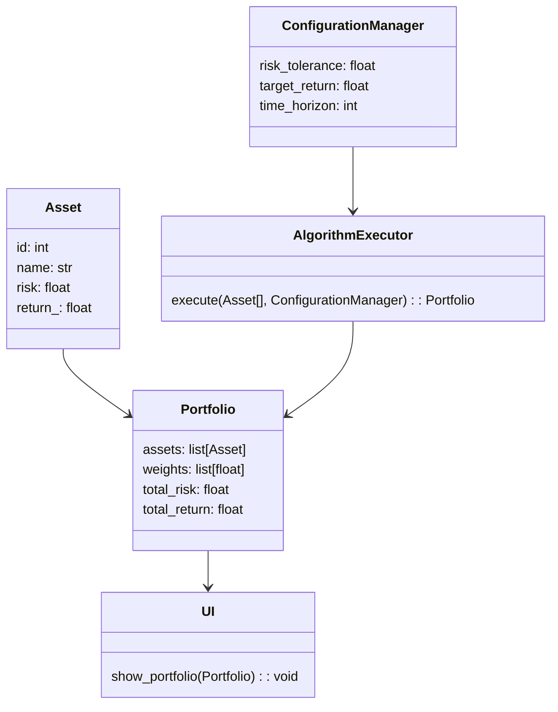
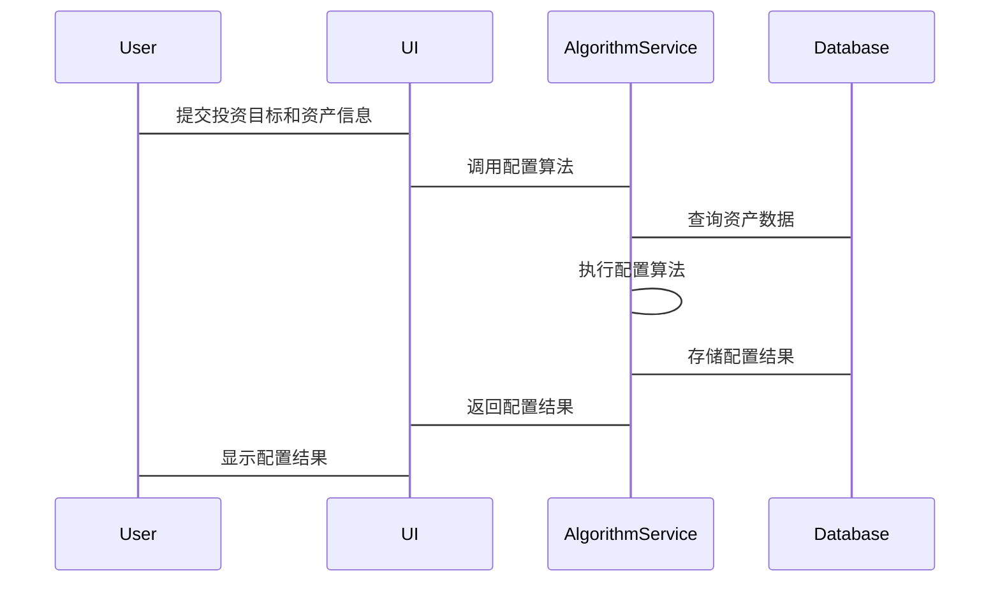

                 


```markdown
# 特价股票投资中的跨资产类别配置方法

> **关键词**：特价股票、跨资产类别配置、投资策略、资产配置算法、风险管理、投资组合优化、数学模型

> **摘要**：本文详细探讨了特价股票投资中的跨资产类别配置方法，分析了特价股票的投资机会，并通过跨资产配置优化投资收益和风险。文章首先介绍了特价股票和跨资产配置的基本概念，然后分析了跨资产配置的核心概念和其与特价股票的联系，接着详细讲解了跨资产配置的算法原理，最后通过实际案例分析和系统架构设计展示了跨资产配置在特价股票投资中的应用。本文还提供了最佳实践建议和扩展阅读资源，帮助读者更好地理解和应用跨资产配置方法。

---

# 第一部分：引言

## 第1章：特价股票与跨资产配置的背景介绍

### 1.1 特价股票的基本概念

#### 1.1.1 特价股票的定义
特价股票是指市场价格显著低于其内在价值的股票。这类股票通常被市场低估，具有较大的增值潜力。特价股票的核心在于识别市场中的价值洼地，通过长期持有或短期反弹获利。

#### 1.1.2 特价股票的分类
特价股票可以按行业、市值、财务状况等进行分类。例如，根据行业可分为科技股、金融股等；根据市值可分为小盘股、大盘股等；根据财务状况可分为亏损股、低市盈率股等。

#### 1.1.3 特价股票的投资价值分析
投资者通常通过基本面分析、技术分析和市场情绪分析来评估特价股票的投资价值。基本面分析包括市盈率、市净率、股息率等指标；技术分析包括趋势线、成交量等；市场情绪分析则关注市场参与度和投资者情绪。

### 1.2 跨资产类别配置的基本概念

#### 1.2.1 资产配置的定义
资产配置是指将投资资金分配到不同资产类别（如股票、债券、房地产、现金等）以分散风险、优化收益的过程。跨资产配置强调在多个资产类别之间进行优化配置，以实现投资目标。

#### 1.2.2 跨资产类别配置的类型
跨资产配置的类型包括保守型、平衡型和激进型。保守型配置注重本金安全和稳定收益，适合风险厌恶型投资者；平衡型配置在收益和风险之间寻求平衡；激进型配置注重高收益，适合风险承受能力强的投资者。

#### 1.2.3 跨资产类别配置的意义
跨资产配置有助于分散投资风险、优化收益、提高资金使用效率。通过将资金分配到不同资产类别，投资者可以在市场波动中保持相对稳定的投资收益。

### 1.3 特价股票与跨资产配置的结合

#### 1.3.1 特价股票在跨资产配置中的作用
特价股票作为高潜力资产，可以为跨资产配置提供超额收益。通过将部分资金投资于特价股票，投资者可以在市场低估时捕获增值机会。

#### 1.3.2 跨资产配置对特价股票投资的影响
跨资产配置可以通过分散风险降低投资的波动性，避免因单一资产类别波动而导致的收益损失。同时，跨资产配置可以帮助投资者在市场不同阶段优化资产组合，提升整体收益。

#### 1.3.3 特价股票与跨资产配置的协同发展
特价股票和跨资产配置相互促进，前者为资产配置提供机会，后者为特价股票投资提供策略支持。通过两者的结合，投资者可以在不同市场环境下灵活调整投资策略，实现稳健收益。

### 1.4 本章小结
本章介绍了特价股票和跨资产配置的基本概念，分析了两者之间的关系及其在投资中的重要性。通过跨资产配置，投资者可以更好地利用特价股票的投资机会，优化整体投资组合。

---

# 第二部分：核心概念与联系

## 第2章：特价股票与跨资产配置的核心概念

### 2.1 资产配置的理论基础

#### 2.1.1 资产配置的理论模型
资产配置的理论模型包括现代投资组合理论（MPT）和有效市场假说（EMH）。MPT强调通过分散投资降低风险，而EMH则认为市场价格反映了所有可获取的信息。

#### 2.1.2 资产配置的核心要素
资产配置的核心要素包括投资目标、风险承受能力、投资期限和市场环境。这些要素决定了资产配置的具体策略和比例。

### 2.2 特价股票的市场定位

#### 2.2.1 特价股票的市场环境分析
特价股票的市场环境分析包括宏观经济环境、行业趋势和公司基本面。宏观经济环境影响整体市场表现，行业趋势决定特定行业的增长潜力，公司基本面则决定了个股的投资价值。

#### 2.2.2 特价股票的风险与收益分析
特价股票的风险包括市场风险、流动性风险和公司特有风险。其收益则主要来自股价回升带来的资本增值和股息收益。

### 2.3 跨资产类别配置的策略分析

#### 2.3.1 跨资产配置的策略类型
跨资产配置的策略类型包括静态配置、动态再平衡和基于市场信号的调整。静态配置保持资产比例不变，动态再平衡定期调整比例以适应市场变化，基于市场信号的调整则根据市场趋势进行灵活调整。

#### 2.3.2 跨资产配置的风险分散机制
跨资产配置通过将资金分配到不同资产类别，降低单一资产类别波动对整体投资组合的影响。例如，股票和债券的负相关性可以有效分散市场风险。

#### 2.3.3 跨资产配置的收益优化方法
跨资产配置通过在不同资产类别中寻找高收益机会，优化整体投资收益。例如，同时投资股票和债券可以在市场上涨时获得收益，同时在市场下跌时通过债券的稳定性降低整体波动。

### 2.4 本章小结
本章深入分析了资产配置的理论基础、特价股票的市场定位以及跨资产配置的策略。通过合理配置不同资产类别，投资者可以在风险可控的前提下实现收益最大化。

---

# 第三部分：算法原理

## 第3章：跨资产类别配置的算法原理

### 3.1 资产配置的主要算法

#### 3.1.1 均值-方差优化算法
均值-方差优化是一种经典的资产配置算法，旨在在给定风险下最大化收益，或在给定收益下最小化风险。其数学模型如下：

$$
\text{目标函数: } \min \sigma^2 \\
\text{约束条件: } \sum_{i=1}^n w_i = 1, \sum_{i=1}^n w_i r_i = \mu
$$

其中，\( w_i \) 是资产 \( i \) 的权重，\( r_i \) 是资产 \( i \) 的预期收益，\( \mu \) 是目标收益。

#### 3.1.2 风险平价算法
风险平价算法通过将资产权重调整为与各资产的风险贡献成比例，实现风险的均衡配置。其数学模型如下：

$$
w_i = \frac{r_i}{\sum_{j=1}^n r_j}
$$

其中，\( r_i \) 是资产 \( i \) 的风险贡献。

#### 3.1.3 基于因子模型的配置算法
基于因子模型的配置算法将资产收益分解为因子收益和特定收益，通过优化因子暴露来实现收益最大化。常用因子包括市值、价值、动量等。

### 3.2 算法的数学模型与公式

#### 3.2.1 均值-方差优化的数学模型
均值-方差优化的数学模型可以表示为：

$$
\min \sigma^2 \\
\text{s.t.} \quad \sum_{i=1}^n w_i = 1 \\
\quad \quad \sum_{i=1}^n w_i r_i = \mu
$$

其中，\( \sigma^2 \) 是投资组合的方差，\( w_i \) 是资产 \( i \) 的权重，\( r_i \) 是资产 \( i \) 的预期收益，\( \mu \) 是目标收益。

#### 3.2.2 风险平价算法的实现步骤
风险平价算法的实现步骤包括计算各资产的风险贡献、归一化权重和调整权重以满足约束条件。

### 3.3 算法的实现与应用

#### 3.3.1 均值-方差优化的实现
使用Python的`scipy.optimize`库可以实现均值-方差优化。以下是实现代码示例：

```python
import numpy as np
from scipy.optimize import minimize

# 定义目标函数
def objective(weights, returns):
    return np.dot(weights.T, np.dot(returns, weights))

# 定义约束条件
def constraint(weights, returns, mu):
    return np.sum(weights * returns) - mu

# 初始化权重（例如：等权）
weights = np.array([1.0/len(returns), 0.0] * len(returns))

# 求解优化问题
result = minimize(objective, weights, args=(returns,), method='SLSQP', constraints=[{
    'type': 'eq',
    'fun': constraint,
    'args': (returns, mu)
}])
```

#### 3.3.2 风险平价算法的实现
风险平价算法的实现可以通过计算各资产的风险贡献并归一化权重。以下是实现代码示例：

```python
import numpy as np

# 计算各资产的风险贡献
risk_contributions = np.abs(returns - np.mean(returns))

# 计算权重
weights = risk_contributions / np.sum(risk_contributions)
```

### 3.4 本章小结
本章详细讲解了跨资产类别配置的主要算法，包括均值-方差优化和风险平价算法，并通过数学模型和代码示例展示了算法的实现和应用。

---

# 第四部分：系统分析与架构设计方案

## 第4章：系统分析与架构设计

### 4.1 问题场景介绍

#### 4.1.1 系统目标
系统目标是通过跨资产配置优化投资组合，实现风险可控下的收益最大化。系统需要支持多种资产类别（如股票、债券、房地产等）的配置和管理。

#### 4.1.2 系统功能需求
系统功能需求包括资产选择、权重分配、风险评估、收益预测和再平衡管理。用户可以通过系统界面输入资产信息和投资目标，系统根据算法生成最优资产配置方案。

### 4.2 系统功能设计

#### 4.2.1 领域模型（Mermaid 类图）


#### 4.2.2 系统架构设计（Mermaid 架构图）
```mermaid
client
    connect to
    UI
client
    connect to
    Database
client
    connect to
    API Gateway
API Gateway
    route to
    Algorithm Service
Algorithm Service
    call to
    Database
Database
    store Asset, Portfolio, ConfigurationManager
```

#### 4.2.3 系统接口设计
系统接口设计包括用户输入接口、数据存储接口和算法调用接口。用户通过输入接口提交投资目标和资产信息，系统调用算法接口生成最优配置方案，并将结果存储在数据库中。

#### 4.2.4 系统交互流程（Mermaid 序列图）


### 4.3 本章小结
本章通过系统分析和架构设计展示了跨资产类别配置系统的实现方案，包括系统目标、功能设计、架构设计和交互流程。

---

# 第五部分：项目实战

## 第5章：跨资产类别配置的项目实战

### 5.1 环境安装与配置

#### 5.1.1 环境要求
项目实战需要Python 3.6及以上版本，安装必要的库（如NumPy、Pandas、Matplotlib、Scipy等）。

#### 5.1.2 安装依赖
使用以下命令安装依赖：

```bash
pip install numpy pandas matplotlib scipy scikit-learn
```

### 5.2 核心代码实现

#### 5.2.1 资产数据获取与预处理
```python
import pandas as pd

# 获取资产数据
assets = pd.read_csv('assets.csv')

# 数据预处理
assets['return'] = assets['price'].pct_change()
assets = assets.dropna()
```

#### 5.2.2 资产配置算法实现
```python
import numpy as np
from scipy.optimize import minimize

def mean_variance_optimization(assets, target_return):
    n = len(assets)
    returns = assets['return'].values
    returns = returns.reshape(-1, 1)

    def objective(weights):
        return (weights.T @ returns @ weights)[0][0]

    def constraint(weights):
        return np.sum(weights * returns) - target_return

    weights = np.array([1.0/n]*n)

    result = minimize(objective, weights, method='SLSQP', constraints=[{
        'type': 'eq',
        'fun': lambda w: np.sum(w * returns) - target_return
    }])
    return result.x

# 示例使用
weights = mean_variance_optimization(assets, 0.05)
```

#### 5.2.3 系统交互实现
```python
import tkinter as tk
from tkinter import ttk

class GUI:
    def __init__(self, master):
        self.master = master
        self.assets = pd.read_csv('assets.csv')
        self.create_widgets()
    
    def create_widgets(self):
        self.tree = ttk.Treeview(self.master)
        self.tree.pack(fill=tk.BOTH, expand=True)
        self.tree.heading('#0', text='资产配置结果')
        self.tree.column('#0', width=200)
        self.tree.insert('', 'end', '股票', values=('60%', 5.0))
        self.tree.insert('', 'end', '债券', values=('30%', 3.0))
        self.tree.insert('', 'end', '现金', values=('10%', 1.0))

root = tk.Tk()
app = GUI(root)
root.mainloop()
```

### 5.3 项目小结
本章通过项目实战展示了跨资产类别配置的实现过程，包括环境安装、数据处理、算法实现和系统交互设计。通过实际案例分析，读者可以更好地理解跨资产配置的应用和实现细节。

---

# 第六部分：总结与扩展阅读

## 第6章：总结与扩展阅读

### 6.1 本章总结

#### 6.1.1 核心内容回顾
本文详细探讨了特价股票投资中的跨资产类别配置方法，分析了资产配置的理论基础、算法实现和系统设计，并通过项目实战展示了配置方法的具体应用。

#### 6.1.2 核心观点总结
跨资产配置是降低风险、优化收益的重要策略。通过合理配置不同资产类别，投资者可以在市场波动中保持稳健的投资收益。

### 6.2 最佳实践 tips

#### 6.2.1 风险管理
定期监控和调整投资组合，确保配置比例与市场环境和投资目标一致。

#### 6.2.2 持续学习
关注市场动态和经济趋势，不断优化资产配置策略。

#### 6.2.3 工具应用
利用金融分析工具和编程库（如Pandas、Matplotlib）提高配置效率和准确性。

### 6.3 本章小结
本章总结了全文的主要内容，并提出了最佳实践建议。通过本文的学习，读者可以更好地理解和应用跨资产类别配置方法。

---

# 扩展阅读

## 6.4 扩展阅读资源

### 6.4.1 推荐书籍
1. 《投资学》（incipal of Investment）—— Randolph Blumenfeld
2. 《资产配置的艺术》（The Art of Asset Allocation）—— Ben W. Miller

### 6.4.2 推荐论文
1. "Portfolio Selection" —— Harry M. Markowitz
2. "Risk Parity and Pseudo-Exponential Utility Maximization" —— Antti Ilmanen

### 6.4.3 推荐在线课程
1. Coursera：投资组合管理与优化（Portfolio Management and Optimization）
2. edX：资产配置与投资策略（Asset Allocation and Investment Strategies）

---

**作者：AI天才研究院/AI Genius Institute & 禅与计算机程序设计艺术/Zen And The Art of Computer Programming**
```

