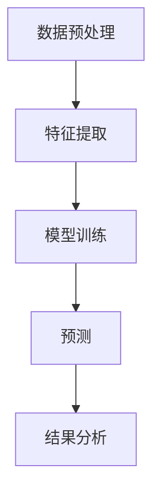
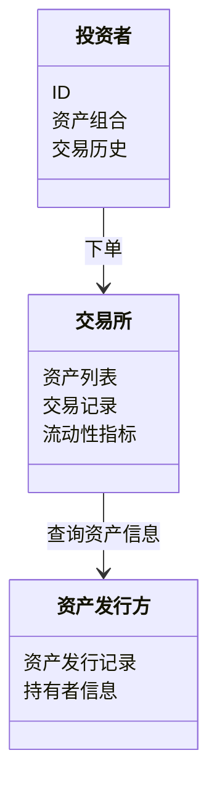
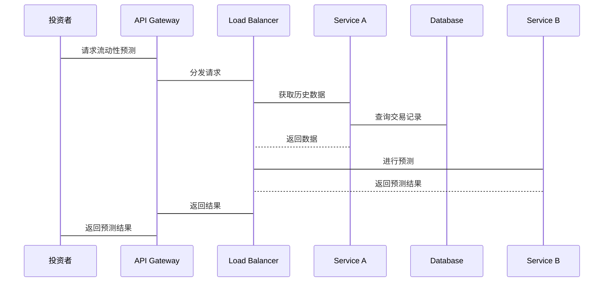

                 


# 特价股票投资中的跨链资产流动性预测分析

> **关键词**: 特价股票，跨链资产，流动性预测，时间序列分析，机器学习，区块链

> **摘要**: 本文探讨了在跨链资产流动性预测中的特价股票投资策略。通过分析跨链资产流动性的影响因素，结合时间序列分析和机器学习算法，提出了一种基于ARIMA和LSTM的预测模型。文章详细讲解了模型的数学原理、系统架构设计，并通过实际案例展示了预测结果。最后，本文总结了跨链资产流动性预测的关键点，为投资者提供了有益的指导。

---

# 第一部分: 特价股票投资与跨链资产流动性概述

## 第1章: 背景介绍

### 1.1 问题背景与定义

#### 1.1.1 传统股票投资中的流动性问题
在传统股票市场中，流动性是指资产在短时间内以合理价格买卖的能力。高流动性意味着买卖容易，价格波动小；低流动性则可能导致买卖价差大，交易成本高。对于特价股票（通常指价格较低的股票），流动性问题更为突出，因为这些股票通常交易量小，市场关注度低，价格波动大。

#### 1.1.2 跨链资产流动性的定义与特点
跨链资产流动性是指在不同区块链之间转移资产的能力。随着区块链技术的发展，跨链技术（如区块链互操作性）逐渐成熟，跨链资产流动性成为影响投资决策的重要因素。跨链流动性具有以下特点：
- **实时性**: 资产转移需要快速确认。
- **安全性**: 跨链交易需确保资产安全。
- **多样性**: 跨链资产可能涉及多种代币和资产类型。

#### 1.1.3 跨链资产流动性对特价股票投资的影响
在跨链环境下，特价股票的投资可能涉及多种资产类别（如代币、股权等）。跨链流动性的好坏直接影响投资组合的灵活性和收益。例如，如果某跨链资产流动性差，投资者可能难以及时卖出资产，导致投资损失。

### 1.2 跨链资产流动性的核心要素

#### 1.2.1 跨链资产流动性的核心概念
- **资产类型**: 包括股票、代币、NFT等。
- **交易速度**: 资产转移的确认时间。
- **交易费用**: 跨链交易的成本。
- **市场深度**: 市场上可交易的资产数量和价值。

#### 1.2.2 資產流动性的属性特征对比表

| 特性         | 高流动性资产       | 低流动性资产       |
|--------------|--------------------|--------------------|
| 交易速度      | 快                 | 慢                 |
| 交易费用      | 低                 | 高                 |
| 市场深度      | 深                 | 浅                 |
| 价格波动      | 小                 | 大                 |

#### 1.2.3 跨链资产流动性的ER实体关系图

```mermaid
er
    actor 投资者
    actor 交易所
    actor 资产发行方
    entity 资产
    entity 流动性
    entity 交易记录
    relationship 投资者 -[通过交易记录]-> 交易所
    relationship 交易所 -[监控]-> 流动性
    relationship 资产发行方 -[发行]-> 资产
```

---

## 第2章: 跨链资产流动性预测的算法原理

### 2.1 时间序列预测模型

#### 2.1.1 ARIMA模型原理
ARIMA（自回归积分滑动平均模型）是一种常用的时间序列预测方法。其基本原理如下：
- **自回归部分**: 使用过去的价值预测当前值。
- **滑动平均部分**: 使用过去的误差项预测当前值。
- **积分部分**: 对序列进行差分以消除趋势。

ARIMA模型的数学公式为：
$$ARIMA(p, d, q) = y_t = \phi_1 y_{t-1} + \dots + \phi_p y_{t-p} + \theta_1 \epsilon_{t-1} + \dots + \theta_q \epsilon_{t-q} + \epsilon_t$$

#### 2.1.2 LSTM网络原理
LSTM（长短期记忆网络）是一种基于深度学习的时间序列预测模型。其核心在于引入记忆单元，能够捕捉长期依赖关系。LSTM的结构包括输入门、遗忘门和输出门，公式如下：
$$f(x) = \text{ LSTM}(x, h_{t-1}, c_{t-1}) $$

#### 2.1.3 GARCH模型的应用
GARCH（广义自回归条件异方差模型）用于预测时间序列的波动性。其核心思想是将异方差性分解为自回归和滑动平均成分。

### 2.2 跨链数据特征提取

#### 2.2.1 数据预处理与特征工程
- **数据清洗**: 去除异常值和缺失值。
- **特征提取**: 提取交易量、价格波动、市场深度等特征。
- **标准化**: 对数据进行归一化处理。

#### 2.2.2 跨链交易数据的特征提取
- **交易频率**: 资产的交易次数。
- **交易量**: 每次交易的金额。
- **价格波动**: 资产价格的变化幅度。

#### 2.2.3 资产流动性的多维度分析
通过分析交易量、交易速度和市场深度，评估资产的流动性。

### 2.3 算法实现流程



### 2.4 数学模型与公式

#### 2.4.1 ARIMA模型公式
$$ARIMA(p, d, q) = y_t = \phi_1 y_{t-1} + \dots + \phi_p y_{t-p} + \theta_1 \epsilon_{t-1} + \dots + \theta_q \epsilon_{t-q} + \epsilon_t$$

#### 2.4.2 LSTM网络结构
$$f(x) = \text{ LSTM}(x, h_{t-1}, c_{t-1}) $$

---

## 第3章: 跨链资产流动性预测的系统分析与架构设计

### 3.1 问题场景介绍
跨链资产流动性预测需要考虑多个区块链网络的交互，涉及复杂的数据流和交易逻辑。

### 3.2 系统功能设计

#### 3.2.1 领域模型


#### 3.2.2 系统架构设计


### 3.3 系统接口设计

#### 3.3.1 API接口
- `/predict/liquidity`：接收资产信息，返回流动性预测结果。
- `/transaction/history`：获取交易历史数据。

#### 3.3.2 接口交互流程


---

## 第4章: 项目实战

### 4.1 环境安装

```bash
pip install numpy pandas scikit-learn keras tensorflow
```

### 4.2 核心代码实现

#### 4.2.1 数据加载与预处理

```python
import pandas as pd
import numpy as np

# 加载数据
data = pd.read_csv('liquidity_data.csv')

# 数据预处理
from sklearn.preprocessing import MinMaxScaler
scaler = MinMaxScaler()
data_scaled = scaler.fit_transform(data)
```

#### 4.2.2 模型训练与预测

```python
from keras.models import Sequential
from keras.layers import LSTM, Dense

# 构建LSTM模型
model = Sequential()
model.add(LSTM(50, input_shape=(1, 1)))
model.add(Dense(1))
model.compile(loss='mean_squared_error', optimizer='adam')

# 训练模型
model.fit(x_train, y_train, epochs=50, batch_size=32)

# 预测
y_pred = model.predict(x_test)
```

### 4.3 实际案例分析
通过实际数据进行预测，分析跨链资产流动性对投资决策的影响。

### 4.4 项目小结
总结项目实现的关键点和经验教训，强调模型优化和数据质量的重要性。

---

## 第5章: 最佳实践与总结

### 5.1 小结
跨链资产流动性预测对特价股票投资至关重要。通过结合传统时间序列模型和深度学习算法，可以提高预测精度。

### 5.2 注意事项
- 数据质量影响预测结果。
- 模型需要定期更新。
- 注意跨链交易的复杂性和风险。

### 5.3 拓展阅读
推荐相关书籍和论文，供读者深入学习。

---

**作者：AI天才研究院/AI Genius Institute & 禅与计算机程序设计艺术 /Zen And The Art of Computer Programming**

