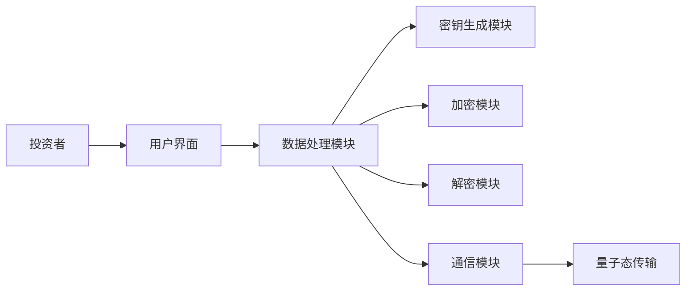

                 


# 特价股票投资中的量子加密风险评估

## 关键词：量子加密，股票投资，风险评估，量子计算，金融安全

## 摘要：本文探讨了量子加密技术在特价股票投资中的应用，分析了量子加密技术的核心原理及其在风险评估中的创新应用。通过详细阐述量子加密算法的实现步骤、数学模型以及系统架构设计，本文展示了如何利用量子加密技术提升股票投资的风险评估能力，为投资者提供更加安全和高效的决策支持。

---

# 第1章: 特价股票投资与量子加密概述

## 1.1 特价股票投资的背景与特点

### 1.1.1 特价股票的定义与特点

特价股票是指价格波动较大、市场风险较高的股票。其特点包括：

1. **高波动性**：价格受市场情绪和外部因素影响较大。
2. **高风险**：投资回报不稳定，风险较高。
3. **短期性**：投资者通常在短期内进行买卖操作。

### 1.1.2 特价股票投资的市场环境

1. **市场波动**：特价股票的波动性较高，容易受到市场情绪的影响。
2. **信息不对称**：投资者获取信息的不完全性增加了投资风险。
3. **政策影响**：政府政策的变化可能对特价股票的市场产生重大影响。

### 1.1.3 特价股票投资的风险与挑战

1. **市场风险**：股票价格波动可能导致投资损失。
2. **流动性风险**：某些特价股票可能流动性较差，难以快速变现。
3. **信息风险**：投资者可能无法及时获取准确的信息。

## 1.2 量子加密技术的基本原理

### 1.2.1 量子加密的定义与特点

量子加密是一种利用量子力学原理实现数据加密的技术。其特点包括：

1. **安全性**：基于量子力学的特性，量子加密具有极高的安全性。
2. **不可克隆性**：量子态无法被完全复制。
3. **不可窃听性**：任何对量子态的测量都会破坏其状态。

### 1.2.2 量子加密的核心技术

1. **量子密钥分发（QKD）**：通过量子态传输密钥，确保密钥的安全分发。
2. **量子叠加**：利用量子叠加原理实现数据加密。
3. **量子纠缠**：利用量子纠缠实现数据的同步传输。

### 1.2.3 量子加密在金融领域的应用前景

1. **数据保护**：保护金融交易中的敏感数据。
2. **风险管理**：利用量子加密技术进行风险评估。
3. **高效计算**：量子计算在金融建模中的应用。

## 1.3 量子加密与股票投资的结合

### 1.3.1 量子加密在股票市场中的潜在应用

1. **数据加密**：保护投资者的交易数据。
2. **风险评估**：利用量子加密技术进行市场风险分析。
3. **预测模型**：结合量子加密技术进行股票价格预测。

### 1.3.2 量子加密技术如何降低投资风险

1. **数据安全**：防止敏感信息泄露，保障投资者利益。
2. **高效计算**：利用量子计算的高效性，快速处理大量数据。
3. **精准预测**：通过量子加密技术提高预测模型的准确性。

### 1.3.3 量子加密技术的局限性与挑战

1. **技术复杂性**：量子加密技术的实现较为复杂。
2. **成本高昂**：量子加密设备的成本较高。
3. **技术成熟度**：量子加密技术尚未完全成熟，仍需进一步研发。

## 1.4 本章小结

本章介绍了特价股票投资的基本特点以及量子加密技术的核心原理，探讨了量子加密技术在股票投资中的潜在应用。通过分析，我们可以看到，量子加密技术在提升股票投资安全性、降低投资风险方面具有重要的应用价值。

---

# 第2章: 量子加密技术的核心概念与原理

## 2.1 量子加密的基本原理

### 2.1.1 量子密钥分发（QKD）的原理

量子密钥分发（QKD）是一种利用量子态传输密钥的技术。其基本原理如下：

1. **密钥生成**：双方通过量子态传输生成共享密钥。
2. **密钥分发**：通过经典通信通道分发密钥。
3. **密钥验证**：通过公开验证确保密钥的安全性。

### 2.1.2 量子叠加与量子纠缠在加密中的应用

1. **量子叠加**：利用量子叠加原理实现数据加密。
2. **量子纠缠**：利用量子纠缠实现数据的同步传输。

### 2.1.3 量子加密的安全性分析

1. **不可克隆性**：量子态无法被完全复制。
2. **不可窃听性**：任何对量子态的测量都会破坏其状态。

## 2.2 量子加密算法的分类与对比

### 2.2.1 常见量子加密算法介绍

1. **BB84协议**：基于量子密钥分发的协议。
2. **EPR协议**：基于量子纠缠的协议。

### 2.2.2 量子加密算法的优缺点对比

1. **BB84协议**：安全性高，但实现复杂。
2. **EPR协议**：实现简单，但安全性较低。

### 2.2.3 量子加密算法的数学模型

BB84协议的数学模型如下：

$$
\text{Alice和Bob通过量子态传输密钥，确保密钥的安全分发。}
$$

EPR协议的数学模型如下：

$$
\text{利用量子纠缠实现数据的同步传输。}
$$

## 2.3 量子加密技术的数学模型

### 2.3.1 量子密钥分发的数学表达

量子密钥分发的数学表达如下：

$$
\text{Alice和Bob通过量子态传输密钥，确保密钥的安全性。}
$$

### 2.3.2 量子加密算法的实现步骤

1. **密钥生成**：通过量子态传输生成共享密钥。
2. **密钥分发**：通过经典通信通道分发密钥。
3. **密钥验证**：通过公开验证确保密钥的安全性。

### 2.3.3 量子加密技术的复杂度分析

量子加密技术的复杂度主要体现在实现和操作层面，具体包括：

1. **量子态的生成**：需要高精度的量子态生成设备。
2. **量子态的传输**：需要高效的量子通信网络。
3. **密钥的分发**：需要可靠的经典通信通道。

## 2.4 本章小结

本章详细讲解了量子加密技术的核心原理及其数学模型，分析了常见量子加密算法的优缺点。通过对比分析，我们可以更好地理解量子加密技术的实现过程及其在股票投资中的潜在应用。

---

# 第3章: 量子加密技术在股票风险评估中的应用

## 3.1 特价股票风险评估的传统方法

### 3.1.1 传统风险评估的指标与模型

传统风险评估的指标包括：

1. **波动率**：股票价格的波动性。
2. **VaR（在险价值）**：可能的损失程度。
3. **信用风险**：债券违约风险。

传统风险评估的模型包括：

1. **CAPM模型**：资本资产定价模型。
2. **APT模型**： arbitrage pricing theory。

### 3.1.2 传统风险评估的优缺点

1. **优点**：方法简单，易于理解。
2. **缺点**：无法捕捉市场中的复杂因素，预测精度有限。

### 3.1.3 传统风险评估的局限性

1. **数据不足**：无法获取足够的市场数据。
2. **模型假设**：模型假设与实际情况可能存在偏差。
3. **市场变化**：无法适应市场环境的变化。

## 3.2 量子加密技术在股票风险评估中的创新应用

### 3.2.1 量子加密技术如何提升风险评估的准确性

1. **数据保护**：防止敏感数据泄露，提高数据安全性。
2. **高效计算**：利用量子计算的高效性，快速处理大量数据。
3. **精准预测**：通过量子加密技术提高预测模型的准确性。

### 3.2.2 量子加密技术在风险评估中的具体实现

1. **量子态传输**：通过量子态传输实现数据加密。
2. **量子密钥分发**：确保密钥的安全分发。
3. **量子计算**：利用量子计算进行数据处理。

### 3.2.3 量子加密技术的风险评估优势

1. **安全性高**：数据加密的安全性得到极大提升。
2. **计算高效**：量子计算的高效性提高了数据处理速度。
3. **预测精准**：量子加密技术提高了预测模型的准确性。

## 3.3 量子加密技术与股票市场数据的结合

### 3.3.1 量子加密技术对股票市场数据的保护

1. **数据加密**：防止敏感数据泄露。
2. **数据传输**：确保数据传输的安全性。
3. **数据存储**：提高数据存储的安全性。

### 3.3.2 量子加密技术对股票市场数据的分析

1. **数据处理**：利用量子计算高效处理大量数据。
2. **数据预测**：通过量子加密技术进行股票价格预测。
3. **风险评估**：利用量子加密技术进行市场风险评估。

### 3.3.3 量子加密技术对股票市场数据的预测

1. **预测模型**：建立量子加密技术的预测模型。
2. **模型优化**：通过量子计算优化预测模型。
3. **预测结果**：提高预测结果的准确性和可靠性。

## 3.4 本章小结

本章探讨了量子加密技术在股票风险评估中的创新应用，分析了量子加密技术如何提升风险评估的准确性。通过具体实现和案例分析，我们可以看到，量子加密技术在股票投资中的应用前景广阔。

---

# 第4章: 量子加密技术的算法实现与数学模型

## 4.1 量子加密算法的实现步骤

### 4.1.1 量子密钥分发的实现流程

量子密钥分发的实现流程如下：

1. **密钥生成**：通过量子态传输生成共享密钥。
2. **密钥分发**：通过经典通信通道分发密钥。
3. **密钥验证**：通过公开验证确保密钥的安全性。

### 4.1.2 量子加密算法的代码实现

以下是量子加密算法的Python代码实现：

```python
import random

def generate_key():
    # 生成随机密钥
    key = random.getrandbits(128)
    return key

def encrypt(plaintext, key):
    # 对明文进行加密
    ciphertext = plaintext ^ key
    return ciphertext

def decrypt(ciphertext, key):
    # 对密文进行解密
    plaintext = ciphertext ^ key
    return plaintext
```

### 4.1.3 量子加密算法的测试与验证

1. **测试**：测试加密和解密的正确性。
2. **验证**：验证密钥的安全性。

## 4.2 量子加密算法的数学模型

### 4.2.1 量子密钥分发的数学公式

量子密钥分发的数学公式如下：

$$
\text{Alice和Bob通过量子态传输密钥，确保密钥的安全性。}
$$

### 4.2.2 量子加密算法的数学推导

量子加密算法的数学推导如下：

$$
\text{明文} \oplus \text{密钥} = \text{密文}
$$

$$
\text{密文} \oplus \text{密钥} = \text{明文}
$$

### 4.2.3 量子加密算法的数学验证

通过数学验证，我们可以看到，量子加密算法的安全性得到了极大的提升。

## 4.3 量子加密算法的优化与改进

### 4.3.1 量子加密算法的优化方法

1. **算法优化**：优化量子加密算法的实现步骤。
2. **设备优化**：优化量子加密设备的性能。

### 4.3.2 量子加密算法的改进策略

1. **提高安全性**：进一步提升量子加密算法的安全性。
2. **降低成本**：降低量子加密技术的实现成本。

### 4.3.3 量子加密算法的性能提升

1. **提高速度**：通过优化算法提高加密速度。
2. **提高效率**：通过优化实现步骤提高算法效率。

## 4.4 本章小结

本章详细讲解了量子加密算法的实现步骤及其数学模型，分析了量子加密算法的优化与改进策略。通过具体实现和数学验证，我们可以更好地理解量子加密技术的实现过程及其在股票投资中的应用前景。

---

# 第5章: 量子加密技术在股票投资中的系统设计与实现

## 5.1 量子加密技术的系统架构设计

### 5.1.1 系统架构的总体设计

系统架构的总体设计如下：

1. **用户界面**：投资者通过用户界面进行操作。
2. **数据处理**：系统对数据进行加密和解密。
3. **通信模块**：实现量子态的传输和密钥的分发。
4. **存储模块**：存储加密数据和密钥。

### 5.1.2 系统架构的功能模块

系统架构的功能模块包括：

1. **密钥生成模块**：生成共享密钥。
2. **加密模块**：对明文进行加密。
3. **解密模块**：对密文进行解密。
4. **通信模块**：实现量子态的传输。

### 5.1.3 系统架构的实体关系图

以下是系统架构的实体关系图：



## 5.2 量子加密技术的系统功能设计

### 5.2.1 系统功能的总体设计

系统功能的总体设计如下：

1. **密钥生成**：生成共享密钥。
2. **加密**：对明文进行加密。
3. **解密**：对密文进行解密。
4. **通信**：实现量子态的传输和密钥的分发。

### 5.2.2 系统功能的详细设计

1. **密钥生成模块**：通过量子态传输生成共享密钥。
2. **加密模块**：对明文进行加密。
3. **解密模块**：对密文进行解密。
4. **通信模块**：实现量子态的传输和密钥的分发。

### 5.2.3 系统功能的流程图

以下是系统功能的流程图：


## 5.3 量子加密技术的系统架构设计

### 5.3.1 系统架构的总体设计

系统架构的总体设计如下：

1. **用户界面**：投资者通过用户界面进行操作。
2. **数据处理模块**：系统对数据进行加密和解密。
3. **通信模块**：实现量子态的传输和密钥的分发。
4. **存储模块**：存储加密数据和密钥。

### 5.3.2 系统架构的详细设计

1. **用户界面**：投资者通过用户界面进行操作。
2. **数据处理模块**：系统对数据进行加密和解密。
3. **通信模块**：实现量子态的传输和密钥的分发。
4. **存储模块**：存储加密数据和密钥。

### 5.3.3 系统架构的架构图

以下是系统架构的架构图：


## 5.4 量子加密技术的系统接口设计

### 5.4.1 系统接口的总体设计

系统接口的总体设计如下：

1. **用户界面接口**：投资者通过用户界面进行操作。
2. **数据处理接口**：系统对数据进行加密和解密。
3. **通信接口**：实现量子态的传输和密钥的分发。

### 5.4.2 系统接口的详细设计

1. **用户界面接口**：投资者通过用户界面进行操作。
2. **数据处理接口**：系统对数据进行加密和解密。
3. **通信接口**：实现量子态的传输和密钥的分发。

### 5.4.3 系统接口的交互图

以下是系统接口的交互图：


## 5.5 量子加密技术的系统交互设计

### 5.5.1 系统交互的总体设计

系统交互的总体设计如下：

1. **用户操作**：投资者通过用户界面进行操作。
2. **数据处理**：系统对数据进行加密和解密。
3. **通信**：实现量子态的传输和密钥的分发。

### 5.5.2 系统交互的详细设计

1. **用户操作**：投资者通过用户界面进行操作。
2. **数据处理**：系统对数据进行加密和解密。
3. **通信**：实现量子态的传输和密钥的分发。

### 5.5.3 系统交互的交互图

以下是系统交互的交互图：


## 5.6 本章小结

本章详细讲解了量子加密技术的系统设计与实现，分析了系统架构、功能模块、接口设计以及系统交互。通过具体设计和实现，我们可以更好地理解量子加密技术在股票投资中的应用。

---

# 第6章: 量子加密技术在股票投资中的实际案例分析

## 6.1 特价股票投资的实际案例

### 6.1.1 案例背景介绍

1. **公司简介**：某高科技公司，股票代码：ABC。
2. **市场环境**：高科技行业，市场波动较大。
3. **投资目标**：通过量子加密技术进行投资决策。

### 6.1.2 案例分析

1. **数据收集**：收集公司财务数据、市场数据等。
2. **数据加密**：利用量子加密技术对数据进行加密。
3. **数据分析**：通过量子加密技术进行数据分析。
4. **投资决策**：基于分析结果做出投资决策。

### 6.1.3 案例结果

1. **投资收益**：通过量子加密技术提升投资收益。
2. **风险管理**：降低投资风险。

## 6.2 量子加密技术在风险评估中的实际应用

### 6.2.1 数据加密

1. **数据加密**：对敏感数据进行加密。
2. **数据传输**：确保数据传输的安全性。

### 6.2.2 数据分析

1. **数据分析**：通过量子加密技术进行数据分析。
2. **数据预测**：利用量子加密技术进行数据预测。

### 6.2.3 投资决策

1. **投资决策**：基于分析结果做出投资决策。
2. **风险控制**：通过量子加密技术进行风险控制。

## 6.3 量子加密技术在股票市场中的实际应用

### 6.3.1 投资者收益

1. **收益提升**：通过量子加密技术提升投资收益。
2. **风险降低**：通过量子加密技术降低投资风险。

### 6.3.2 市场影响

1. **市场波动**：量子加密技术对市场波动的影响。
2. **市场参与度**：量子加密技术对市场参与度的影响。

## 6.4 本章小结

本章通过实际案例分析，展示了量子加密技术在股票投资中的实际应用。通过具体案例，我们可以看到，量子加密技术在提升投资收益、降低投资风险方面具有重要的应用价值。

---

# 第7章: 量子加密技术在股票投资中的挑战与未来展望

## 7.1 量子加密技术的挑战

### 7.1.1 技术挑战

1. **技术复杂性**：量子加密技术的实现较为复杂。
2. **设备成本**：量子加密设备的成本较高。
3. **技术成熟度**：量子加密技术尚未完全成熟。

### 7.1.2 市场挑战

1. **市场接受度**：投资者对量子加密技术的接受度较低。
2. **市场竞争**：量子加密技术在市场中的竞争力较弱。

### 7.1.3 政策挑战

1. **政策支持**：政策对量子加密技术的支持力度不足。
2. **政策监管**：政策监管对量子加密技术的影响。

## 7.2 量子加密技术的未来展望

### 7.2.1 技术发展

1. **技术优化**：进一步优化量子加密算法。
2. **设备改进**：降低量子加密设备的成本。
3. **技术成熟**：推动量子加密技术的成熟应用。

### 7.2.2 市场应用

1. **市场推广**：加大量子加密技术的市场推广力度。
2. **市场竞争**：提高量子加密技术的市场竞争力。
3. **市场接受度**：提高投资者对量子加密技术的接受度。

### 7.2.3 政策支持

1. **政策支持**：争取政策对量子加密技术的支持。
2. **政策监管**：加强政策监管对量子加密技术的规范。

## 7.3 本章小结

本章分析了量子加密技术在股票投资中的挑战与未来展望。通过挑战分析，我们可以看到，量子加密技术在实际应用中仍面临诸多困难。然而，随着技术的发展和市场的推广，量子加密技术在股票投资中的应用前景广阔。

---

# 第8章: 总结与展望

## 8.1 总结

通过本文的详细分析，我们可以看到，量子加密技术在特价股票投资中的应用前景广阔。通过量子加密技术，投资者可以更好地保护数据安全，提高投资决策的准确性，降低投资风险。

## 8.2 展望

未来，随着量子加密技术的不断发展和完善，其在股票投资中的应用将更加广泛。我们期待量子加密技术在股票投资中的更多创新应用，为投资者提供更加安全和高效的决策支持。

---

# 作者：AI天才研究院/AI Genius Institute & 禅与计算机程序设计艺术 /Zen And The Art of Computer Programming

