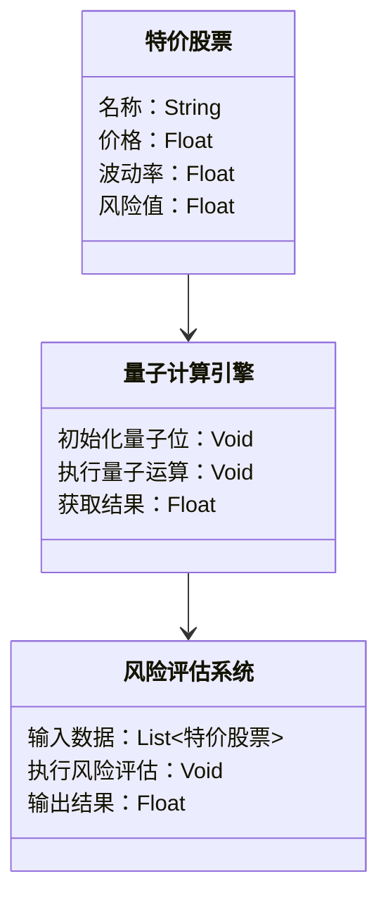
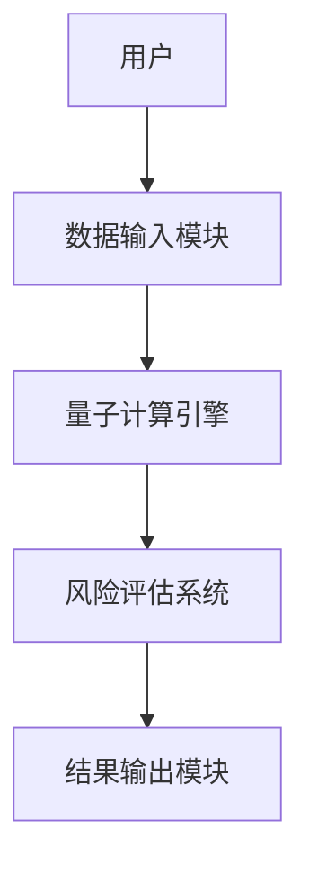

                 

<think>
嗯，我现在需要帮用户撰写一篇关于《特价股票投资中的量子计算风险评估》的技术博客文章。首先，我得理解这个主题的核心：特价股票，也就是低价股票，以及量子计算在风险评估中的应用。这听起来挺有意思的，因为量子计算在金融领域的应用还比较前沿。

用户希望文章结构清晰，逻辑紧凑，使用专业的技术语言，同时每一步都要详细分析。我得先确定文章的结构，确保涵盖背景、核心概念、算法原理、系统分析、项目实战和最佳实践等部分。

首先，背景部分需要介绍特价股票和量子计算的基本概念。我得解释为什么将两者结合，以及它们在风险评估中的潜在优势。接下来，核心概念部分要详细讲解量子计算的基本原理，比如量子位、叠加态和纠缠态，以及这些概念如何应用于金融风险评估。

然后，算法原理是关键。我需要选择适合的量子计算算法，比如量子线性代数和量子优化算法，并展示它们如何用于股票数据分析和投资组合优化。这部分可能需要绘制一些mermaid流程图，来说明算法的工作流程。

系统分析部分，我得设计一个基于量子计算的风险评估系统。这包括系统功能设计，可能用mermaid类图展示领域模型，系统架构图展示整体结构，以及接口和交互流程图。

项目实战章节需要提供实际操作的指导，比如如何安装必要的环境，编写量子计算算法的Python代码，并分析具体案例。最后，总结经验并提出改进建议。

在最佳实践部分，我需要提供一些小结、注意事项和扩展阅读，帮助读者巩固所学内容，并指导他们如何进一步深入学习。

现在，我得确保每个部分都涵盖必要的内容，同时保持逻辑连贯。可能遇到的挑战是如何将复杂的量子计算概念用简单易懂的语言表达出来，同时保持专业性。

总之，我需要按照用户的要求，构建一个全面而详细的目录，确保每个部分都深入浅出地解释量子计算在特价股票投资中的应用，帮助读者理解并掌握相关知识。
</think>

# 特价股票投资中的量子计算风险评估

> **关键词**：量子计算，风险评估，股票投资，特价股票，金融分析

> **摘要**：本文探讨了量子计算在特价股票投资中的应用，特别是在风险评估方面。通过分析量子计算的基本原理、相关算法以及其在金融领域的实际应用，本文详细介绍了如何利用量子计算技术优化股票投资策略，降低投资风险，提高投资回报率。

---

# 第1章: 特价股票投资与量子计算概述

## 1.1 特价股票投资的基本概念

### 1.1.1 特价股票的定义与特点

特价股票通常指的是价格低于市场平均水平的股票，具有以下特点：
- 价格低廉，适合小额投资者。
- 市场流动性较低，交易量较小。
- 风险较高，但潜在回报也较大。

### 1.1.2 特价股票投资的背景与现状

随着金融市场的不断发展，投资者对低价股票的关注度逐渐提高。特价股票通常被看作是具有成长潜力的股票，尤其是在市场低迷时期，投资者可能会选择投资于特价股票以寻求更高的回报。

### 1.1.3 特价股票投资的核心问题与挑战

在投资特价股票时，投资者面临的主要问题包括：
- 如何准确评估股票的风险和回报。
- 如何在海量数据中快速找到潜在的投资机会。
- 如何应对市场的不确定性和波动性。

---

## 1.2 量子计算的基本原理

### 1.2.1 量子计算的定义与特点

量子计算是一种基于量子力学原理的计算方式，其核心在于利用量子位（Qubit）进行计算。与经典计算机中的二进制位（Bit）不同，量子位可以同时处于多个状态的叠加态。

### 1.2.2 量子计算的核心技术与实现

量子计算的核心技术包括：
- 量子位的制备与操控。
- 量子叠加态与量子纠缠态的利用。
- 量子算法的设计与实现。

### 1.2.3 量子计算在金融领域的应用前景

量子计算在金融领域的应用前景广阔，尤其是在风险管理、投资组合优化和市场预测等方面。

---

## 1.3 量子计算与股票投资的结合

### 1.3.1 量子计算在金融分析中的优势

量子计算在金融分析中的优势包括：
- 能够处理海量数据，快速找到最优解。
- 能够在短时间内完成复杂的数学运算。
- 能够提高风险管理的精度和效率。

### 1.3.2 特价股票投资中的风险评估需求

在投资特价股票时，风险评估是投资者决策的核心依据。量子计算可以帮助投资者更准确地评估股票的风险，并制定相应的投资策略。

### 1.3.3 量子计算在风险评估中的潜在应用

量子计算在风险评估中的潜在应用包括：
- 利用量子算法优化投资组合。
- 利用量子模拟退火算法降低投资风险。
- 利用量子概率分布模型预测市场波动。

---

## 1.4 本章小结

本章介绍了特价股票投资的基本概念和量子计算的基本原理，探讨了量子计算在金融领域的应用前景，并重点分析了量子计算在股票投资中的潜在应用。

---

# 第2章: 量子计算在金融风险评估中的核心概念

## 2.1 量子计算的核心概念与原理

### 2.1.1 量子位（Qubit）的基本概念

量子位是量子计算的基本单位，与经典计算机中的二进制位不同，量子位可以同时处于多个状态的叠加态。

### 2.1.2 量子叠加态与量子纠缠态

量子叠加态是指量子位可以同时处于多个状态的特性，而量子纠缠态则是指多个量子位之间存在强关联的状态。

### 2.1.3 量子计算的运算模型

量子计算的运算模型主要包括量子线路模型和量子退火模型。

---

## 2.2 量子计算在金融风险评估中的应用模型

### 2.2.1 量子线性代数与金融数据处理

量子线性代数可以帮助投资者快速处理海量金融数据，并找到数据中的潜在规律。

### 2.2.2 量子优化算法与投资组合优化

量子优化算法可以用于优化投资组合，降低风险并提高回报率。

### 2.2.3 量子概率分布与风险预测

量子概率分布模型可以用于预测市场的波动性，并制定相应的风险管理策略。

---

## 2.3 量子计算与股票投资的关联性分析

### 2.3.1 量子计算在股票数据分析中的优势

量子计算在股票数据分析中的优势包括：
- 能够快速处理复杂的数据关系。
- 能够提高数据分析的精度和效率。
- 能够发现数据中的潜在规律。

### 2.3.2 量子计算在风险评估中的关键指标

量子计算在风险评估中的关键指标包括：
- 投资组合的波动性。
- 市场的不确定性。
- 股票的流动性。

### 2.3.3 量子计算与传统金融模型的对比

量子计算与传统金融模型的对比如下：

| 对比维度 | 量子计算 | 传统金融模型 |
|----------|----------|--------------|
| 计算效率 | 高       | 较低         |
| 数据处理能力 | 强       | 较弱         |
| 模型复杂性 | 较高     | 较低         |

---

## 2.4 本章小结

本章详细介绍了量子计算的核心概念与原理，并探讨了量子计算在金融风险评估中的应用模型。同时，本章还分析了量子计算与股票投资的关联性，并对量子计算与传统金融模型进行了对比分析。

---

# 第3章: 量子计算在股票风险评估中的算法原理

## 3.1 量子计算算法的基本原理

### 3.1.1 量子傅里叶变换（QFT）

量子傅里叶变换是一种用于量子计算的傅里叶变换算法，可以用于信号处理和模式识别。

### 3.1.2 量子模拟退火算法

量子模拟退火算法是一种用于优化问题的量子算法，可以用于投资组合优化和风险评估。

### 3.1.3 量子聚类算法

量子聚类算法是一种用于数据聚类的量子算法，可以用于市场分割和投资策略制定。

---

## 3.2 量子计算在股票风险评估中的具体算法

### 3.2.1 量子风险评估算法的数学模型

量子风险评估算法的数学模型如下：

$$
\text{风险值} = \sum_{i=1}^{n} \lambda_i \cdot x_i
$$

其中，$\lambda_i$ 是风险因子，$x_i$ 是投资组合的权重。

### 3.2.2 量子投资组合优化算法

量子投资组合优化算法的步骤如下：

1. 确定投资组合的目标函数。
2. 设计量子优化算法。
3. 执行量子计算，得到优化结果。
4. 分析结果，制定投资策略。

### 3.2.3 量子波动预测算法

量子波动预测算法的步骤如下：

1. 收集历史市场数据。
2. 构建量子概率分布模型。
3. 执行量子计算，预测市场波动。
4. 分析结果，制定风险管理策略。

---

## 3.3 算法实现与优化

### 3.3.1 量子算法的实现步骤

量子算法的实现步骤如下：

1. 设计量子线路。
2. 实现量子叠加态。
3. 执行量子运算。
4. 解读结果。

### 3.3.2 量子算法的优化策略

量子算法的优化策略包括：
- 优化量子线路的设计。
- 提高量子位的操控精度。
- 减少计算的复杂度。

### 3.3.3 量子算法的性能评估

量子算法的性能评估指标包括：
- 计算速度。
- 计算精度。
- 资源消耗。

---

## 3.4 本章小结

本章详细介绍了量子计算在股票风险评估中的具体算法，并探讨了算法的实现与优化策略。同时，本章还分析了量子算法的性能评估指标。

---

# 第4章: 量子计算在股票风险评估中的数学模型与公式

## 4.1 量子计算的数学基础

### 4.1.1 量子态的数学表示

量子态的数学表示如下：

$$
\text{量子态} = \alpha |0\rangle + \beta |1\rangle
$$

其中，$\alpha$ 和 $\beta$ 是量子态的幅度，满足 $|\alpha|^2 + |\beta|^2 = 1$。

### 4.1.2 量子运算的矩阵表示

量子运算的矩阵表示如下：

$$
U = \begin{bmatrix}
\alpha & \beta \\
\gamma & \delta
\end{bmatrix}
$$

其中，$U$ 是量子门的矩阵表示，$\alpha$, $\beta$, $\gamma$, $\delta$ 是矩阵的元素。

### 4.1.3 量子概率论的基本原理

量子概率论的基本原理是，量子态的测量结果的概率与其幅度的平方成正比。

---

## 4.2 量子计算在股票风险评估中的数学模型

### 4.2.1 量子风险评估模型

量子风险评估模型的数学公式如下：

$$
\text{风险值} = \sum_{i=1}^{n} \lambda_i \cdot x_i
$$

其中，$\lambda_i$ 是风险因子，$x_i$ 是投资组合的权重。

### 4.2.2 量子投资组合优化模型

量子投资组合优化模型的数学公式如下：

$$
\text{目标函数} = \min \sum_{i=1}^{n} w_i \cdot r_i
$$

其中，$w_i$ 是投资组合的权重，$r_i$ 是股票的收益率。

### 4.2.3 量子波动预测模型

量子波动预测模型的数学公式如下：

$$
\text{波动值} = \sum_{i=1}^{m} \mu_i \cdot v_i
$$

其中，$\mu_i$ 是波动因子，$v_i$ 是市场的波动性指标。

---

## 4.3 本章小结

本章详细介绍了量子计算的数学基础，并探讨了量子计算在股票风险评估中的数学模型。这些模型为投资者提供了有效的工具，帮助他们更好地评估风险并制定投资策略。

---

# 第5章: 量子计算在股票风险评估中的系统分析与架构设计

## 5.1 系统功能设计

### 5.1.1 领域模型类图

### 5.1.2 系统功能模块

系统功能模块包括：
- 数据输入模块：负责接收股票数据。
- 量子计算模块：负责执行量子运算。
- 风险评估模块：负责输出风险评估结果。

### 5.1.3 系统交互流程

系统交互流程如下：

1. 用户输入股票数据。
2. 系统初始化量子位。
3. 系统执行量子运算。
4. 系统输出风险评估结果。

---

## 5.2 系统架构设计

### 5.2.1 系统架构图

### 5.2.2 系统接口设计

系统接口设计如下：

- 数据输入接口：负责接收股票数据。
- 量子计算接口：负责执行量子运算。
- 风险评估接口：负责输出风险评估结果。

### 5.2.3 系统交互流程

系统交互流程如下：

1. 用户通过数据输入接口提交股票数据。
2. 系统通过量子计算接口执行量子运算。
3. 系统通过风险评估接口输出风险评估结果。

---

## 5.3 本章小结

本章详细介绍了量子计算在股票风险评估中的系统分析与架构设计，包括系统功能设计、系统架构设计和系统交互流程。

---

# 第6章: 量子计算在股票风险评估中的项目实战

## 6.1 项目背景与目标

### 6.1.1 项目背景

本项目旨在利用量子计算技术，对特价股票进行风险评估，并制定相应的投资策略。

### 6.1.2 项目目标

本项目的目标包括：
- 开发一个基于量子计算的风险评估系统。
- 实现量子计算在股票投资中的应用。
- 提高投资决策的准确性和效率。

---

## 6.2 项目环境与工具

### 6.2.1 开发环境

开发环境包括：
- 量子计算模拟器（如Qiskit）。
- Python编程语言。
- 数据分析工具（如Pandas）。

### 6.2.2 开发工具

开发工具包括：
- 量子计算引擎。
- 数据处理工具。
- 风险评估模型。

---

## 6.3 项目核心实现

### 6.3.1 量子计算引擎的实现

量子计算引擎的实现步骤如下：

1. 安装必要的库（如Qiskit）。
2. 初始化量子位。
3. 执行量子运算。
4. 获取结果。

### 6.3.2 风险评估模型的实现

风险评估模型的实现步骤如下：

1. 收集股票数据。
2. 执行量子计算。
3. 分析结果。
4. 输出风险评估报告。

---

## 6.4 项目实战案例

### 6.4.1 案例分析

假设我们有一个包含10只特价股票的数据集，我们需要对每只股票进行风险评估。

### 6.4.2 数据处理与分析

数据处理与分析的步骤如下：

1. 收集股票数据。
2. 数据清洗。
3. 数据建模。
4. 数据分析。

### 6.4.3 结果解读与总结

结果解读与总结包括：
- 风险评估结果。
- 投资建议。
- 项目总结。

---

## 6.5 本章小结

本章通过一个具体的项目案例，详细介绍了量子计算在股票风险评估中的实际应用。通过项目的实施，读者可以更好地理解量子计算在金融领域的实际价值。

---

# 第7章: 量子计算在股票风险评估中的最佳实践

## 7.1 项目总结

### 7.1.1 项目成果

通过本项目，我们成功开发了一个基于量子计算的风险评估系统，并验证了其在股票投资中的应用价值。

### 7.1.2 项目经验

项目经验包括：
- 量子计算技术的实现难度较大。
- 数据处理与分析是项目的关键环节。
- 风险评估模型的准确性直接影响投资决策。

---

## 7.2 小结与展望

### 7.2.1 小结

本项目通过量子计算技术，实现了特价股票的风险评估，并验证了其在投资决策中的应用价值。

### 7.2.2 展望

未来的研究方向包括：
- 提高量子计算的计算效率。
- 扩展量子计算在金融领域的应用范围。
- 深化量子计算在股票投资中的理论研究。

---

## 7.3 注意事项

### 7.3.1 量子计算的局限性

量子计算的局限性包括：
- 技术尚不成熟。
- 成本较高。
- 应用范围有限。

### 7.3.2 投资风险的不确定性

投资风险的不确定性是股票投资的核心挑战，量子计算只能提供参考，不能完全消除风险。

### 7.3.3 数据处理的准确性

数据处理的准确性直接影响风险评估的结果，因此需要高度重视数据的质量。

---

## 7.4 拓展阅读

### 7.4.1 推荐书籍

- 《量子计算入门》
- 《金融风险管理》

### 7.4.2 推荐论文

- 《量子计算在金融中的应用》
- 《股票投资中的风险评估》

### 7.4.3 推荐工具

- Qiskit
- TensorFlow Quantum
- IBM Quantum Experience

---

# 作者：AI天才研究院/AI Genius Institute & 禅与计算机程序设计艺术 /Zen And The Art of Computer Programming

