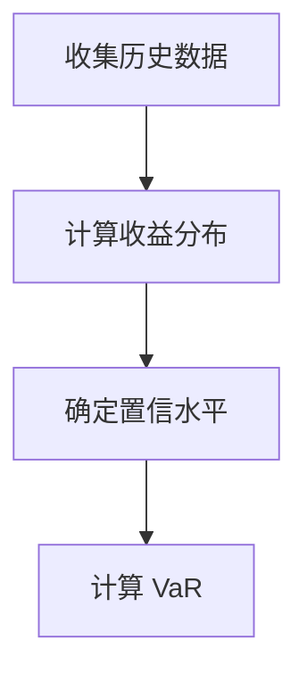
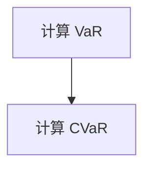
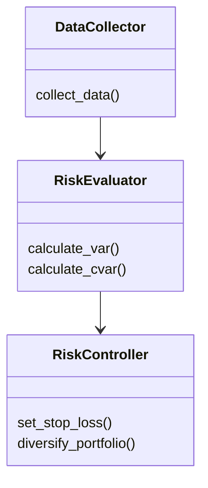
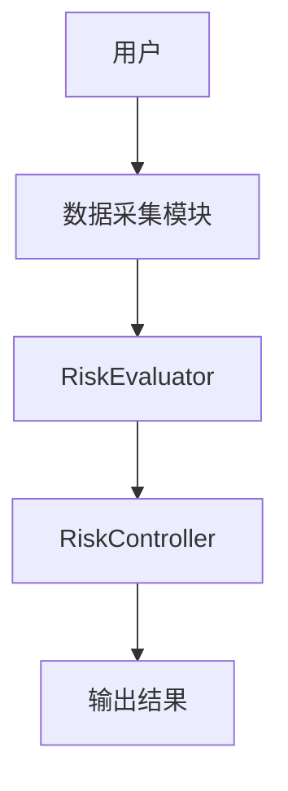
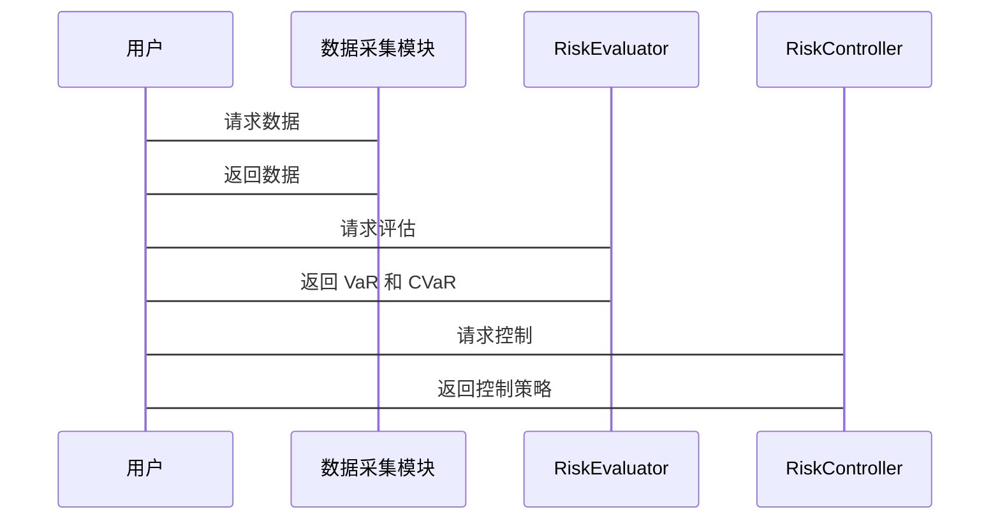

                 

<think>
好，我现在需要帮助用户撰写一篇关于《特价股票投资中的风险管理》的技术博客文章。首先，我得理解用户的需求。用户希望这篇文章结构清晰，逻辑严密，内容深入，能够帮助读者理解风险管理在特价股票投资中的重要性。

我先看看用户提供的目录结构。文章分为六个部分，每个部分都有详细的章节和小节。我需要按照这个结构来撰写内容，确保每个部分都涵盖必要的信息。

第一部分是引言，我需要介绍特价股票投资和风险管理的基本概念，以及它们之间的关系。这部分要吸引读者，让他们明白为什么风险管理在特价股票投资中如此重要。

接下来是核心概念与风险管理原理。我需要详细讲解风险的类型、评估指标和管理策略。这部分可能需要一些图表，比如风险类型对比表和风险管理框架的流程图，帮助读者更好地理解。

第三部分是算法与数学模型。这里我要介绍VaR和CVaR这两种风险评估模型，用Mermaid流程图展示计算过程，并提供Python代码示例。这部分需要详细解释数学公式，确保读者能够理解如何应用这些模型。

然后是系统设计与架构。我需要设计一个风险管理系统的架构图，包括功能模块和接口设计。使用Mermaid绘制类图和序列图，展示系统各部分之间的交互。

接下来是项目实战，我需要一个具体的投资案例分析。从数据收集、清洗、建模到结果分析，每个步骤都要详细说明，并提供代码示例。这能让读者实际操作，理解如何在实战中应用风险管理策略。

最后是最佳实践与总结。我需要总结风险管理的关键点，给出投资策略建议，并提醒读者注意的事项。这部分还要推荐一些进一步阅读的资料，帮助读者深入学习。

在撰写过程中，我要确保语言简洁明了，避免过于技术化的术语，同时保持专业性。每个章节的小节要详细，涵盖必要的内容，确保读者能够一步步理解风险管理在特价股票投资中的应用。

现在，我需要将这些思考转化为实际的文章内容。首先是摘要，简明扼要地概括文章的核心内容。然后是关键词，列出文章的核心主题，便于读者快速查找。

接下来按照目录结构，逐一撰写每个章节的内容。每个部分都要详细展开，确保覆盖所有关键点。同时，使用图表和代码示例，增强文章的可读性和实用性。

在完成初稿后，我需要检查文章的逻辑是否清晰，内容是否完整，以及是否符合用户的所有要求。确保每个部分都符合字数要求，结构合理，没有遗漏重要信息。

最后，加上作者信息，使文章显得专业且完整。整个过程需要细致耐心，确保最终的文章能够满足用户的需求，帮助读者全面理解并有效应用风险管理在特价股票投资中的策略。
</think>

# 特价股票投资中的风险管理

> 关键词：特价股票，风险管理，投资策略，风险评估，风险控制

> 摘要：本文深入探讨了特价股票投资中的风险管理策略，分析了风险管理的核心概念、算法原理、系统设计与项目实战，并总结了最佳实践。通过详细的数学模型和实际案例，本文为投资者提供了如何在特价股票投资中有效管理风险的指导。

---

## 第1章: 特价股票投资与风险管理引言

### 1.1 特价股票投资的基本概念

#### 1.1.1 特价股票的定义
特价股票是指价格低于其内在价值或市场平均水平的股票。这类股票通常被市场低估，具有较大的上涨潜力。

#### 1.1.2 特价股票投资的基本原理
特价股票投资基于价值投资理念，寻找被市场低估的股票进行投资，期望在价格回归合理价值时获得收益。

#### 1.1.3 特价股票与普通股票的区别
- **价格差异**：特价股票价格通常低于市场平均水平，而普通股票价格较为合理。
- **风险差异**：特价股票风险较高，但潜在收益也更大。
- **投资策略**：特价股票投资需要更严格的风险管理，而普通股票投资相对稳定。

### 1.2 风险管理在投资中的重要性

#### 1.2.1 风险管理的基本概念
风险管理是指识别、评估和应对投资中的潜在风险，以减少损失并提高投资回报。

#### 1.2.2 风险管理在股票投资中的作用
- **降低损失**：通过风险控制措施，减少投资损失。
- **提高收益**：通过合理分散风险，提高整体投资收益。
- **增强信心**：良好的风险管理策略可以提升投资者信心。

#### 1.2.3 特价股票投资中的风险管理特点
- **高波动性**：特价股票价格波动较大，风险管理尤为重要。
- **高杠杆性**：投资者可能使用杠杆放大收益，但也增加了风险。
- **市场周期性**：特价股票往往在市场低迷时出现，投资者需应对周期性风险。

---

## 第2章: 风险管理的核心概念与原理

### 2.1 风险的类型与特征

#### 2.1.1 市场风险
市场风险是指整体市场波动对股票价格的影响，包括经济周期、政策变化等因素。

#### 2.1.2 个股风险
个股风险是指特定股票因公司基本面变化或市场情绪波动而带来的价格波动风险。

#### 2.1.3 时间风险
时间风险是指投资的时间跨度对股票价格的影响，长期投资通常更稳定，但短期内波动较大。

#### 2.1.4 流动性风险
流动性风险是指投资者在短期内无法以合理价格买卖股票的风险。

### 2.2 风险评估的核心指标

#### 2.2.1 β系数
β系数衡量股票价格相对于市场指数的波动性，β > 1 表示股票波动性高于市场，β < 1 表示波动性低于市场。

$$ β = \frac{cov(r_i, r_m)}{var(r_m)} $$

其中，$r_i$ 是股票的超额收益，$r_m$ 是市场指数的超额收益。

#### 2.2.2 夏普比率
夏普比率衡量投资组合在承担单位风险时的超额收益。

$$ \text{夏普比率} = \frac{E(r_p) - r_f}{\sigma_p} $$

其中，$E(r_p)$ 是投资组合的预期收益，$r_f$ 是无风险利率，$\sigma_p$ 是投资组合的收益标准差。

#### 2.2.3 凸性与风险调整后的收益
凸性衡量投资组合的非线性收益，风险调整后的收益考虑了投资组合的风险。

### 2.3 风险管理的基本原理

#### 2.3.1 风险的量化方法
- **VaR（在险价值）**：VaR 是在给定置信水平下，投资组合可能的最大损失。
- **CVaR（条件在险价值）**：CVaR 是 VaR 的平均损失，考虑了尾部风险。

#### 2.3.2 风险与收益的平衡
投资者需要在风险和收益之间找到平衡点，避免过度冒险或保守。

#### 2.3.3 风险分散化原理
通过投资多种股票或资产类别，分散个股风险，降低整体投资组合的波动性。

---

## 第3章: 特价股票投资中的风险管理策略

### 3.1 风险控制的三要素

#### 3.1.1 风险识别
识别潜在风险因素，如市场波动、公司基本面变化等。

#### 3.1.2 风险评估
量化风险程度，使用数学模型如VaR、CVaR等进行评估。

#### 3.1.3 风险应对
制定应对策略，如设置止损点、分散投资等。

### 3.2 风险控制的具体方法

#### 3.2.1 设置止损点
在投资组合中设定止损点，当股价下跌至一定程度时自动卖出，避免更大损失。

#### 3.2.2 分散投资
通过投资多只股票或不同行业的股票，降低个股风险。

#### 3.2.3 定期评估与调整
定期重新评估投资组合，根据市场变化调整持仓，优化风险收益比。

---

## 第4章: 风险管理的数学模型与算法

### 4.1 VaR 模型

#### 4.1.1 VaR 的计算步骤
1. 收集历史价格数据。
2. 计算收益分布。
3. 确定置信水平。
4. 计算 VaR。

#### 4.1.2 VaR 的 Mermaid 流程图



#### 4.1.3 Python 实现
```python
import numpy as np

def calculate_var(returns, confidence_level=0.95):
    sorted_returns = np.sort(returns)
    alpha = int(len(sorted_returns) * (1 - confidence_level))
    var = sorted_returns[alpha]
    return var
```

### 4.2 CVaR 模型

#### 4.2.1 CVaR 的计算步骤
1. 计算 VaR。
2. 计算 VaR 以上的平均损失。

#### 4.2.2 CVaR 的 Mermaid 流程图



#### 4.2.3 Python 实现
```python
def calculate_cvar(returns, confidence_level=0.95):
    var = calculate_var(returns, confidence_level)
    cvar = np.mean(returns[returns <= var])
    return cvar
```

---

## 第5章: 系统设计与架构方案

### 5.1 系统功能设计

#### 5.1.1 功能模块
- 数据采集模块：收集股票价格数据。
- 风险评估模块：计算VaR、CVaR等风险指标。
- 风险控制模块：制定和执行风险管理策略。

#### 5.1.2 领域模型类图



### 5.2 系统架构设计

#### 5.2.1 系统架构图



### 5.3 系统接口设计

#### 5.3.1 输入接口
- 数据接口：接收股票价格数据。
- 参数接口：接收风险管理参数。

#### 5.3.2 输出接口
- 风险报告：输出VaR、CVaR等指标。
- 控制信号：输出风险管理策略执行信号。

### 5.4 系统交互序列图



---

## 第6章: 项目实战与案例分析

### 6.1 环境安装与数据收集

#### 6.1.1 环境安装
- 安装 Python 和必要的库（如 numpy、pandas、scipy）。
- 安装 Mermaid 图形库（可选）。

#### 6.1.2 数据收集
使用 pandas 下载历史股票数据。

```python
import pandas as pd
import yfinance as yf

# 下载苹果股票数据
data = yf.download('AAPL', start='2020-01-01', end='2023-12-31')
```

### 6.2 风险评估与分析

#### 6.2.1 计算 VaR 和 CVaR

```python
import numpy as np

def calculate_var(returns, confidence_level=0.95):
    sorted_returns = np.sort(returns)
    alpha = int(len(sorted_returns) * (1 - confidence_level))
    var = sorted_returns[alpha]
    return var

def calculate_cvar(returns, confidence_level=0.95):
    var = calculate_var(returns, confidence_level)
    cvar = np.mean(returns[returns <= var])
    return cvar

# 计算苹果股票的 VaR 和 CVaR
returns = data['Adj Close'].pct_change().dropna()
var = calculate_var(returns)
cvar = calculate_cvar(returns)
```

### 6.3 风险管理策略实现

#### 6.3.1 设置止损点

```python
def set_stop_loss(price, var):
    stop_loss_price = price * (1 - (var / 100))
    return stop_loss_price
```

#### 6.3.2 分散投资

```python
import numpy as np

def diversify_portfolio(prices, num_portfolios=100, portfolio_size=10):
    portfolios = []
    for _ in range(num_portfolios):
        selected = np.random.choice(prices, portfolio_size)
        portfolios.append(selected)
    return portfolios
```

### 6.4 案例分析

#### 6.4.1 案例背景
假设投资者选择投资苹果公司股票，历史数据从2020年1月1日至2023年12月31日。

#### 6.4.2 数据清洗与处理
- 计算股票收益率。
- 填补缺失值。

#### 6.4.3 风险评估与策略制定
- 计算 VaR 和 CVaR。
- 设置止损点。
- 分散投资组合。

#### 6.4.4 结果分析
通过 VaR 和 CVaR 分析，投资者可以了解潜在风险，并根据止损点和分散投资策略优化投资组合。

---

## 第7章: 最佳实践与总结

### 7.1 风险管理的关键点
- **量化风险**：使用 VaR 和 CVaR 等指标量化潜在损失。
- **分散投资**：通过投资多样化降低个股风险。
- **动态调整**：定期评估并调整风险管理策略。

### 7.2 投资策略建议
- **设定止损点**：避免重大损失。
- **分散投资组合**：降低整体投资风险。
- **关注市场周期**：在市场低迷时寻找特价股票。

### 7.3 注意事项
- **市场风险**：宏观经济因素可能影响整体市场。
- **流动性风险**：确保资金流动性，避免无法及时变现。
- **信息风险**：依赖及时准确的信息进行决策。

### 7.4 拓展阅读
- 《风险管理与投资组合》
- 《金融工程中的数学模型》
- 《价值投资实战策略》

---

## 作者：AI天才研究院/AI Genius Institute & 禅与计算机程序设计艺术/Zen And The Art of Computer Programming

---

这篇文章从理论到实践，全面分析了特价股票投资中的风险管理策略，结合数学模型和实际案例，为投资者提供了实用的指导。

