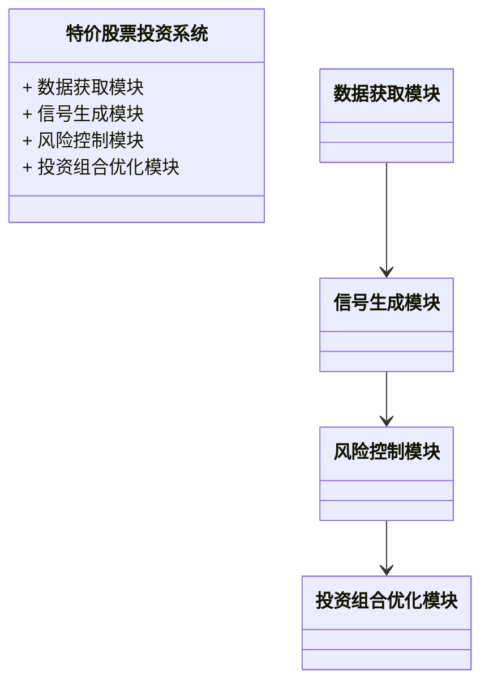

                 


# 特价股票投资的资金分配策略

> 关键词：特价股票，资金分配，投资策略，风险管理，系统架构

> 摘要：本文详细探讨了特价股票投资的资金分配策略，从背景介绍、核心概念、算法原理到系统架构、项目实战、案例分析以及风险管理，全面解析如何在特价股票市场中进行有效的资金分配，以实现投资收益最大化。通过理论分析和实践案例，本文为投资者提供了科学的资金分配方法和风险管理策略。

---

# 第一部分: 特价股票投资与资金分配策略概述

## 第1章: 特价股票投资的背景与基础

### 1.1 特价股票的定义与特点

#### 1.1.1 特价股票的定义
特价股票通常指那些市场价格远低于其内在价值的股票，这些股票可能因为市场波动、公司困境或被市场忽视而价格被低估。特价股票的核心特征是价格与价值的不匹配，为投资者提供了潜在的高回报机会。

#### 1.1.2 特价股票的核心特点
- **低估值**：市场价格显著低于账面价值或行业平均水平。
- **高波动性**：价格波动较大，容易受到市场情绪的影响。
- **高风险**：由于价格低廉，可能隐藏着较高的风险，如公司基本面恶化或行业政策变化。

#### 1.1.3 特价股票与普通股票的区别
- 投资逻辑：普通股票注重长期成长，特价股票注重短期价值修复。
- 风险特征：普通股票风险相对较低，特价股票风险较高。
- 投资策略：普通股票适合长期持有，特价股票适合短期操作。

### 1.2 资金分配策略的基本概念

#### 1.2.1 资金分配的定义
资金分配策略是指将可用资金分配到不同的资产或投资标的上的方法，旨在在风险可控的前提下实现收益最大化。

#### 1.2.2 资金分配的核心原则
- **分散投资**：避免将所有资金投入单一股票或资产，降低风险。
- **风险控制**：根据市场情况动态调整资金分配比例，避免过度集中。
- **收益最大化**：在风险可控的前提下，追求最高投资收益。

#### 1.2.3 资金分配与投资收益的关系
资金分配策略直接影响投资组合的收益和风险。合理的资金分配能够平衡风险与收益，避免因过度集中而面临高额损失，同时抓住市场机会实现收益增长。

### 1.3 特价股票投资的市场环境分析

#### 1.3.1 特价股票市场的现状
- 市场上存在大量低价股票，尤其在新兴市场或经济不景气时期。
- 投资者对特价股票的关注度较高，但竞争激烈。

#### 1.3.2 市场波动对资金分配的影响
- 市场波动可能导致特价股票价格大幅波动，影响资金分配策略的实施。
- 需要根据市场环境动态调整资金分配比例。

#### 1.3.3 特价股票投资的风险与机会
- **风险**：公司基本面恶化、市场波动、流动性风险。
- **机会**：低估股票的价值回归、市场反弹带来的收益。

### 1.4 本章小结
本章介绍了特价股票的定义、特点以及资金分配策略的基本概念，分析了市场环境对资金分配的影响。接下来将深入探讨资金分配策略的核心原理和实现方法。

---

# 第二部分: 特价股票投资的资金分配策略

## 第2章: 资产配置与资金分配原理

### 2.1 资产配置的基本原理

#### 2.1.1 资产配置的定义
资产配置是指将资金分配到不同资产类别（如股票、债券、现金等）中，以分散风险并优化收益。

#### 2.1.2 资产配置的核心要素
- **资产类别**：股票、债券、现金等。
- **风险偏好**：根据投资者的风险承受能力调整资产比例。
- **投资目标**：收益目标、流动性需求等。

#### 2.1.3 资产配置与风险控制的关系
合理的资产配置能够有效分散风险，避免因单一资产波动导致整体投资组合受损。

### 2.2 资金分配的数学模型

#### 2.2.1 资金分配的线性模型
线性模型假设资产回报与风险呈线性关系，常用CAPM模型进行分析。

##### CAPM模型公式
$$ E(r_i) = r_f + β_i (E(r_m) - r_f) $$

其中：
- \( E(r_i) \)：资产i的预期回报率
- \( r_f \)：无风险利率
- \( β_i \)：资产i的贝塔系数
- \( E(r_m) \)：市场预期回报率

#### 2.2.2 资金分配的非线性模型
非线性模型考虑资产回报的非线性关系，常用现代投资组合理论（MPT）进行优化。

##### MPT优化公式
$$ \text{min} \left( \sigma^2 \right) \text{ s.t. } \sum w_i = 1 $$

其中：
- \( \sigma^2 \)：投资组合的方差（风险）
- \( w_i \)：资产i的投资比例

#### 2.2.3 模型优缺点比较
- **线性模型**：简单易懂，适用于市场波动较小的情况，但可能忽略非线性关系。
- **非线性模型**：更准确反映市场实际，但计算复杂，需要更多数据支持。

### 2.3 动态资金分配策略

#### 2.3.1 动态资金分配的定义
动态资金分配是指根据市场环境变化实时调整资金分配比例，以适应市场波动。

#### 2.3.2 动态分配的实现步骤
1. **市场分析**：判断市场趋势和波动性。
2. **风险评估**：评估各资产的风险水平。
3. **调整比例**：根据分析结果动态调整资金分配。

---

# 第三部分: 系统架构与项目实战

## 第3章: 系统架构设计与实现

### 3.1 系统功能设计

#### 3.1.1 领域模型设计
使用Mermaid类图展示系统各模块之间的关系。



### 3.2 系统架构设计

#### 3.2.1 系统架构图
使用Mermaid架构图展示系统整体结构。


### 3.3 项目实战

#### 3.3.1 环境安装
- **工具**：Python、Pandas、NumPy、Matplotlib
- **安装命令**：
  ```bash
  pip install pandas numpy matplotlib
  ```

#### 3.3.2 核心代码实现

##### 数据获取模块
```python
import pandas as pd

def get_data(tickers):
    data = []
    for ticker in tickers:
        df = pd.read_csv(f'data/{ticker}.csv')
        data.append(df)
    return pd.concat(data)
```

##### 信号生成模块
```python
import pandas as pd

def generate_signals(data):
    signals = pd.DataFrame()
    signals['buy_signal'] = data['close'].shift(1) < data['close']
    signals['sell_signal'] = data['close'].shift(1) > data['close']
    return signals
```

##### 风险控制模块
```python
import numpy as np

def risk_management(positions):
    # 计算波动率
    volatility = np.std(positions)
    # 动态调整头寸
    adjusted_positions = positions / (1 + volatility)
    return adjusted_positions
```

#### 3.3.3 实际案例分析
- 案例：投资组合中分配30%资金到特价股票，其余分配到债券和现金。
- 分析：根据市场波动调整分配比例，降低风险。

---

# 第四部分: 风险管理与案例分析

## 第4章: 风险管理策略

### 4.1 风险识别与评估
- **市场风险**：市场波动对投资组合的影响。
- **流动性风险**：资产变现能力不足的风险。

### 4.2 风险控制措施
- **止损策略**：设定止损点，避免亏损过大。
- **分散投资**：避免过度集中，降低风险。

### 4.3 动态风险管理
- **实时监控**：随时关注市场变化，及时调整策略。
- **情景分析**：模拟不同市场环境下的风险表现。

## 第5章: 案例分析与总结

### 5.1 案例分析
- 案例一：某投资者将50%资金投入特价股票，40%投入债券，10%持有现金。
- 案例二：市场波动加剧，投资者调整分配比例为30%股票，60%债券，10%现金。

### 5.2 经验总结
- 动态调整资金分配比例，根据市场环境变化及时应对。
- 严格执行风险管理策略，避免重大损失。

---

# 第五部分: 总结与展望

## 第6章: 总结与展望

### 6.1 总结
本文详细探讨了特价股票投资的资金分配策略，从理论分析到系统实现，为投资者提供了科学的资金分配方法。通过动态调整资金分配比例和严格的风险管理，投资者可以在特价股票市场中实现稳健收益。

### 6.2 展望
未来，随着人工智能和大数据技术的发展，资金分配策略将更加智能化和个性化。投资者可以利用技术手段优化决策，提高投资效率。

---

# 作者：AI天才研究院/AI Genius Institute & 禅与计算机程序设计艺术 /Zen And The Art of Computer Programming

---

**注意**：以上文章是根据用户提供的思考过程和要求生成的示例，具体内容需要根据实际情况进一步补充和完善。

