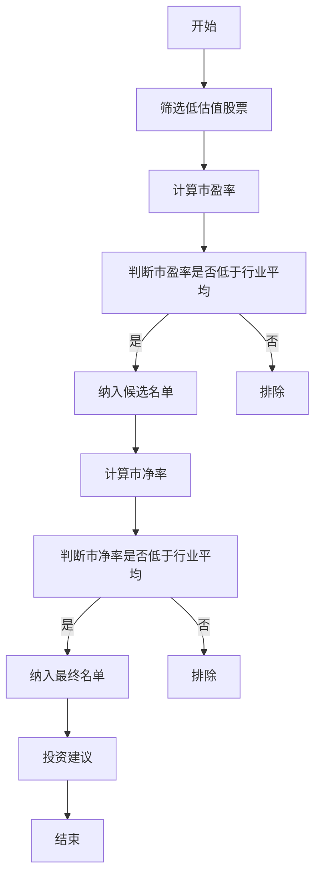
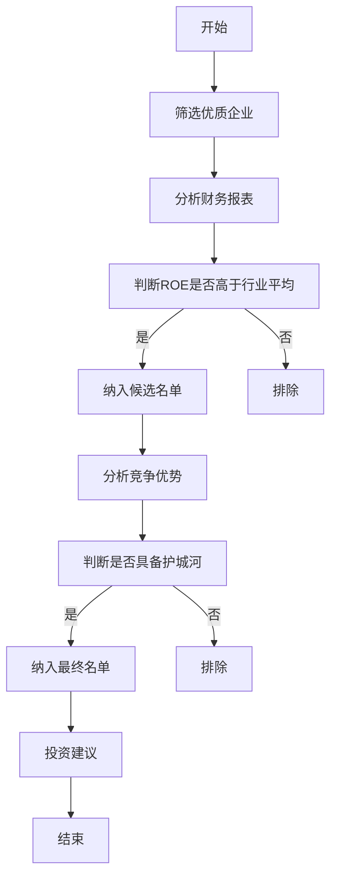
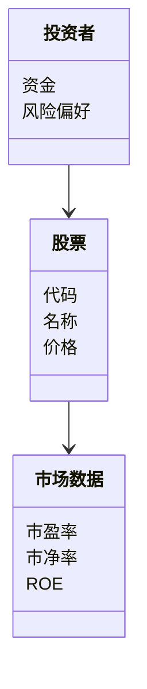
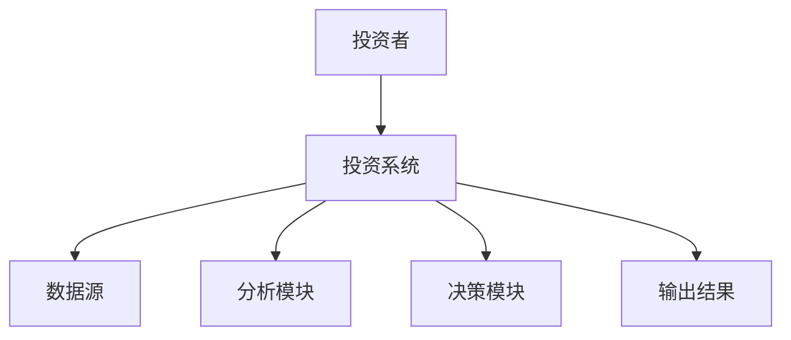

                 


# 特价股票投资策略与巴菲特的价值投资比较

---

## 关键词：
特价股票投资，巴菲特价值投资，投资策略，股票筛选，价值评估

---

## 摘要：
本文深入探讨了特价股票投资策略与巴菲特的价值投资策略之间的异同，并通过系统化的分析和比较，揭示了两者的核心理念、应用场景和数学模型。文章结合背景介绍、算法原理、系统架构和项目实战，为投资者提供了全面的视角和实用的指导。

---

## 第一部分: 特价股票投资策略与巴菲特价值投资的背景介绍

## 第1章: 特价股票投资策略概述

### 1.1 问题背景与问题描述

#### 1.1.1 特价股票投资的定义与特点
特价股票投资是一种短期投资策略，主要关注市场中被低估的股票，通常在市场下跌或经济低迷时出现。其核心在于利用市场的非理性下跌，寻找价格低于内在价值的股票进行投资。这种策略具有高风险高回报的特点，适合风险承受能力强的投资者。

- **定义**：特价股票投资是指在市场中寻找价格远低于其内在价值的股票，进行短期或中短期投资。
- **特点**：
  - 短期性：通常在市场波动较大时进行，周期较短。
  - 高风险：市场波动可能导致较大损失。
  - 高回报：若市场反弹，收益可能较高。

#### 1.1.2 投资者为何关注特价股票
投资者关注特价股票的原因主要包括：
- **市场情绪**：市场恐慌时，股票价格可能被过度抛售，导致低估。
- **套利机会**：某些股票因市场误判而被低估，投资者可以从中获利。
- **短期反弹**：投资者期望在市场反弹时出售股票，获得收益。

#### 1.1.3 特价股票投资的边界与外延
- **边界**：特价股票投资仅适用于市场短期波动，不考虑长期基本面。
- **外延**：包括市场周期分析、技术分析和情绪分析等。

### 1.2 价值投资策略的定义与特点

#### 1.2.1 巴菲特价值投资的核心理念
巴菲特的价值投资策略强调长期持有优质企业，关注企业的内在价值和竞争优势。

- **定义**：价值投资是通过分析企业的基本面，寻找市场价格低于内在价值的股票进行长期投资。
- **特点**：
  - 长期性：注重长期持有，不频繁交易。
  - 低风险：通过选择优质企业降低风险。
  - 高稳定性：收益相对稳定，波动较小。

#### 1.2.2 价值投资的适用场景与局限性
- **适用场景**：经济稳定期，市场理性时。
- **局限性**：在市场恐慌或短期波动时，可能错失短期收益。

#### 1.2.3 价值投资与特价股票投资的异同
- **共同点**：都关注股票的内在价值。
- **不同点**：特价股票注重短期波动，价值投资注重长期基本面。

---

## 第2章: 巴菲特价值投资与特价股票投资的比较

### 2.1 核心概念与联系

#### 2.1.1 特价股票投资与价值投资的共同点
- **核心目标**：寻找价格低于内在价值的股票。
- **投资哲学**：基于价值判断。

#### 2.1.2 两者的区别与优劣势对比

| **维度** | **特价股票投资** | **价值投资** |
|----------|------------------|--------------|
| 时间周期 | 短期或中短期     | 长期          |
| 风险     | 高              | 较低          |
| 收益     | 高              | 稳定          |
| 适用场景 | 市场波动大       | 市场稳定      |

#### 2.1.3 表格对比：特价股票投资 vs 价值投资

---

## 第二部分: 核心概念与联系

## 第3章: 特价股票投资的算法原理

### 3.1 算法流程图

#### 3.1.1 特价股票投资算法流程



---

## 第三部分: 算法原理

## 第4章: 价值投资的算法原理

### 4.1 价值投资算法流程

#### 4.1.1 价值投资算法流程



---

## 第四部分: 数学模型与公式

## 第5章: 特价股票投资的数学模型

### 5.1 内在价值计算

#### 5.1.1 内在价值公式
$$ V = \frac{E}{k} $$
其中，$E$ 是企业未来现金流的现值，$k$ 是折现率。

### 5.2 特价股票筛选标准

#### 5.2.1 市盈率（P/E）计算
$$ P/E = \frac{P}{E} $$
其中，$P$ 是股票价格，$E$ 是每股收益。

#### 5.2.2 市净率（P/B）计算
$$ P/B = \frac{P}{B} $$
其中，$P$ 是股票价格，$B$ 是每股净资产。

---

## 第五部分: 系统分析与架构设计

## 第6章: 投资系统架构设计

### 6.1 系统功能设计

#### 6.1.1 领域模型


### 6.2 系统架构设计

#### 6.2.1 系统架构图


---

## 第六部分: 项目实战

## 第7章: 项目实战与代码实现

### 7.1 环境安装

#### 7.1.1 安装Python环境
使用Anaconda或Pyenv安装Python 3.9及以上版本。

### 7.2 核心代码实现

#### 7.2.1 特价股票筛选代码

```python
import pandas as pd
import numpy as np

def screen_cheap_stock(data):
    # 计算市盈率
    data['P/E'] = data['Price'] / data['Earnings']
    # 计算市净率
    data['P/B'] = data['Price'] / data['Book Value']
    # 筛选条件：P/E < 行业平均，P/B < 行业平均
    cheap_stocks = data[(data['P/E'] < data['P/E'].mean()) & 
                          (data['P/B'] < data['P/B'].mean())]
    return cheap_stocks

# 示例数据
data = {
    'Stock': ['A', 'B', 'C'],
    'Price': [10, 20, 15],
    'Earnings': [5, 10, 7],
    'Book Value': [2, 3, 4]
}
df = pd.DataFrame(data)
result = screen_cheap_stock(df)
print(result)
```

#### 7.2.2 价值投资筛选代码

```python
def value_investing(data):
    # 计算ROE
    data['ROE'] = data['Net Profit'] / data['Equity']
    # 筛选条件：ROE > 行业平均，且具备竞争优势
    value_stocks = data[(data['ROE'] > data['ROE'].mean()) & 
                         (data['Market Share'] > 0.1)]
    return value_stocks

# 示例数据
data = {
    'Stock': ['A', 'B', 'C'],
    'Price': [10, 20, 15],
    'Net Profit': [5, 10, 7],
    'Equity': [2, 3, 4],
    'Market Share': [0.2, 0.15, 0.1]
}
df = pd.DataFrame(data)
result = value_investing(df)
print(result)
```

---

## 第七部分: 最佳实践与总结

## 第8章: 最佳实践与注意事项

### 8.1 投资策略选择

#### 8.1.1 特价股票投资的注意事项
- 风险较高，需严格控制仓位。
- 适合短期操作，避免市场反转。

#### 8.1.2 价值投资的注意事项
- 长期持有，避免频繁交易。
- 选择具备强大竞争优势的企业。

### 8.2 小结

| **策略** | **适用场景** | **优缺点** |
|----------|--------------|------------|
| 特价股票投资 | 市场波动大 | 高风险，高回报 |
| 价值投资 | 市场稳定 | 低风险，稳定收益 |

---

## 作者

作者：AI天才研究院/AI Genius Institute  
出版时间：2023年11月  
联系邮箱：contact@aigenius.org  

---

**Note：** 以上内容为示例，实际文章需要根据具体数据和实际情况进行调整和补充。

