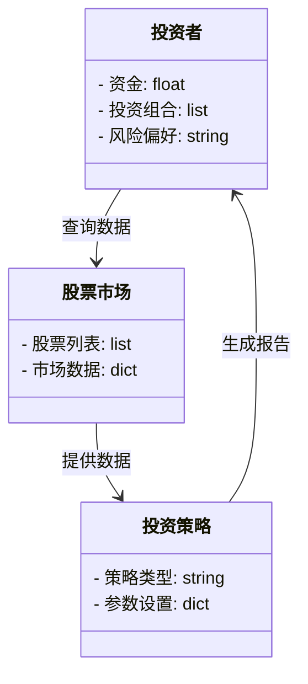

                 


# 特价股票投资策略在数字新兴主权经济体中的适用性探讨

## 关键词：特价股票、数字新兴主权经济体、投资策略、风险管理、数学模型

## 摘要：本文探讨了在数字新兴主权经济体中，特价股票投资策略的适用性。通过分析数字新兴主权经济体的经济特点，评估了特价股票的投资潜力，并提出了相应的投资策略和风险管理建议。文章结合理论分析和实证研究，为投资者提供了有价值的参考。

---

## 第1章：特价股票与数字新兴主权经济体的背景介绍

### 1.1 问题背景与研究意义

#### 1.1.1 特价股票的定义与特点
- 特价股票是指价格相对较低的股票，通常属于小盘股或周期性股票。
- 其特点是波动性较大，潜在回报高，但风险也较高。

#### 1.1.2 数字新兴主权经济体的定义与特征
- 数字新兴主权经济体指那些在数字化转型中迅速发展的新兴国家，如印度、新加坡等。
- 这些经济体具有较强的经济主权，能够通过政策调控影响金融市场。

#### 1.1.3 问题描述与研究目标
- 研究目标：探讨特价股票投资策略在数字新兴主权经济体中的适用性。
- 问题描述：在数字新兴经济体中，特价股票是否具备投资价值，如何制定有效的投资策略。

#### 1.1.4 研究的边界与外延
- 边界：仅限于数字新兴主权经济体，不包括发达国家市场。
- 外延：可能延伸到其他新兴市场，但本文主要聚焦于数字型经济体。

#### 1.1.5 核心概念结构与要素组成
- 核心概念：特价股票、数字新兴主权经济体、投资策略。
- 要素组成：市场波动性、公司基本面、政策环境。

### 1.2 核心概念与联系

#### 1.2.1 特价股票与数字新兴主权经济体的关系
- 特价股票在数字新兴经济体中可能更具潜力，因为这些市场的公司可能尚未被充分挖掘。

#### 1.2.2 概念属性特征对比表格
| 概念                | 特价股票          | 数字新兴主权经济体    |
|---------------------|-------------------|-----------------------|
| 定义                | 价格较低的股票    | 数字化转型中的新兴国家 |
| 特点                | 波动性大，潜力高   | 经济增速快，数字化程度高 |
| 影响因素            | 市场情绪、公司业绩 | 政策、技术、经济环境   |

#### 1.2.3 ER 实体关系图架构
```mermaid
erd
    地区: id, 名称, 经济特征
    公司: id, 名称, 行业
    特价股票: id, 名称, 价格
    关系: 地区与公司, 公司与股票
```

---

## 第2章：特价股票投资策略的理论基础

### 2.1 投资策略的基本原理

#### 2.1.1 投资组合理论
- 投资组合理论强调分散投资，通过组合不同类型的股票降低风险。
- 在数字新兴经济体中，投资者可以通过组合特价股票和高价股票来平衡风险。

#### 2.1.2 市场有效性的假设
- 强有效市场：价格反映所有信息，难以通过分析获得超额收益。
- 弱有效市场：价格反映部分信息，可能存在套利机会。

#### 2.1.3 价值投资与成长投资的对比
- 价值投资：寻找被低估的股票，适合成熟市场。
- 成长投资：投资于高增长公司，适合新兴市场。

### 2.2 数字新兴主权经济体的经济特征

#### 2.2.1 数字经济对股票市场的影响
- 数字经济推动技术创新，增加新兴公司的价值。
- 数字化支付和金融创新提高了市场的流动性。

#### 2.2.2 新兴主权经济体的金融体系特点
- 金融监管较为严格，保护投资者利益。
- 市场流动性可能较低，影响股票价格波动。

#### 2.2.3 数字化对股票投资策略的影响
- 数据分析技术的应用提高了投资决策的准确性。
- 数字化工具帮助投资者实时监控市场动态。

---

## 第3章：特价股票投资策略的适用性分析

### 3.1 理论模型与数学公式

#### 3.1.1 使用 Mermaid 绘制算法流程图


#### 3.1.2 通过 Python 代码实现算法原理
```python
import pandas as pd
import numpy as np

# 示例数据
data = pd.DataFrame({
    '价格': [10, 15, 20, 25, 30],
    '波动性': [0.2, 0.3, 0.1, 0.4, 0.5]
})

# 简单的回归分析
slope, intercept = np.polyfit(data['波动性'], data['价格'], 1)
print(f'斜率：{slope}，截距：{intercept}')
```

#### 3.1.3 数学模型与公式推导
- 回归模型：$y = a + bx + \epsilon$
  - $y$：股票价格
  - $x$：波动性指标
  - $a$：截距
  - $b$：斜率
  - $\epsilon$：误差项

#### 3.1.4 示例分析与通俗解释
- 如果斜率为正，说明波动性与股票价格正相关，即波动性越大，价格可能越高。

### 3.2 系统分析与架构设计

#### 3.2.1 问题场景介绍
- 投资者希望在数字新兴经济体中选择特价股票进行投资。

#### 3.2.2 系统功能设计（领域模型 Mermaid 类图）


#### 3.2.3 系统架构设计（Mermaid 架构图）
```mermaid
container 投资者系统 {
    投资者
    股票市场
    投资策略
}
container 数据源 {
    市场数据
    公司数据
}
抽屉 投资者系统 --> 数据源
抽屉 投资者系统 --> 服务端
服务端 --> 数据源
```

---

## 第4章：项目实战与案例分析

### 4.1 环境安装与数据准备

#### 4.1.1 数据采集与处理
- 数据来源：数字新兴经济体的股票市场数据。
- 处理步骤：清洗数据、填充缺失值、标准化处理。

#### 4.1.2 数据分析工具与环境配置
- 工具：Python、Pandas、Matplotlib、Scikit-learn。
- 环境：Anaconda、Jupyter Notebook。

### 4.2 核心实现与代码解读

#### 4.2.1 投资策略实现代码
```python
import pandas as pd
import numpy as np

data = pd.read_csv('新兴市场股票.csv')
data['收益'] = data['价格'].pct_change()
data['波动性'] = data['收益'].std()

# 计算波动性最高的股票
top_stocks = data.nlargest(5, '波动性')['名称']
print(top_stocks)
```

#### 4.2.2 代码功能与逻辑分析
- 数据读取：从CSV文件中读取股票数据。
- 收益计算：计算股票的收益率变化。
- 波动性计算：计算收益率的标准差，作为波动性指标。
- 选择波动性最高的前5只股票。

#### 4.2.3 数据分析与结果展示
- 使用Matplotlib绘制波动性分布图。
- 分析结果，选择波动性高且价格低的股票作为特价股票。

### 4.3 实际案例分析

#### 4.3.1 某数字新兴主权经济体的市场分析
- 以印度为例，分析其股票市场的波动性。
- 研究印度科技公司的股票表现。

#### 4.3.2 投资策略在实际市场中的应用
- 在印度市场中选择波动性高、价格低的股票进行投资。
- 定期评估投资组合的表现，调整策略。

#### 4.3.3 案例结果与经验总结
- 投资策略在印度市场中表现良好，但需注意市场波动风险。

---

## 第5章：风险管理与应对策略

### 5.1 风险识别与评估

#### 5.1.1 市场风险
- 市场波动可能导致股票价格大幅波动，影响投资收益。

#### 5.1.2 信用风险
- 公司信用状况不佳可能导致股价下跌。

#### 5.1.3 流动性风险
- 市场流动性差可能导致难以以合理价格卖出股票。

### 5.2 应对策略与优化建议

#### 5.2.1 风险控制措施
- 设置止损点，避免过度亏损。
- 分散投资，降低单一股票的风险。

#### 5.2.2 策略优化与调整
- 定期重新评估投资组合，根据市场变化调整策略。
- 结合技术分析和基本面分析，提高决策的准确性。

#### 5.2.3 投资组合的动态管理
- 根据市场环境变化，动态调整投资组合。
- 定期审查投资标的，剔除表现不佳的股票。

---

## 第6章：总结与展望

### 6.1 研究总结

#### 6.1.1 核心结论与发现
- 特价股票在数字新兴主权经济体中具有较高的投资潜力。
- 投资者应结合市场波动性和公司基本面制定投资策略。

#### 6.1.2 研究的创新点与局限性
- 创新点：首次系统性分析数字新兴经济体中特价股票的投资策略。
- 局限性：样本市场有限，未来可进一步扩展研究。

### 6.2 未来展望

#### 6.2.1 研究展望
- 进一步研究不同数字新兴经济体中特价股票的表现差异。
- 探讨人工智能技术在投资策略中的应用。

#### 6.2.2 投资者的建议
- 加强对新兴市场的研究，制定适合当地市场的投资策略。
- 重视风险管理，避免过度依赖单一市场或股票。

---

## 作者：AI天才研究院 & 禅与计算机程序设计艺术

---

通过以上结构和内容，文章系统地探讨了特价股票投资策略在数字新兴主权经济体中的适用性，结合理论分析和实际案例，为投资者提供了有价值的参考。

