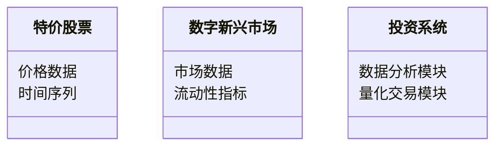
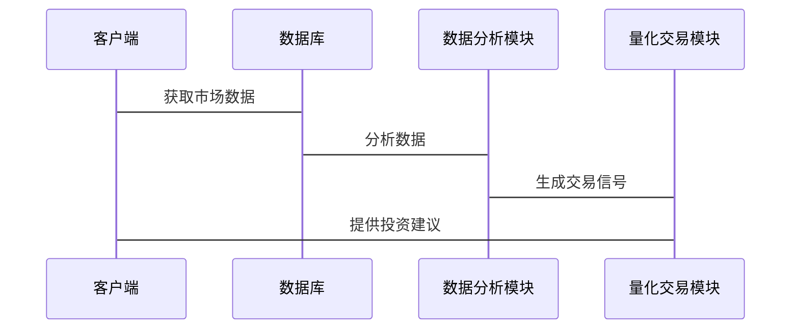

                 

<think>
嗯，用户希望我设计一本名为《特价股票投资策略在数字新兴市场中的适用性探讨》的书籍目录大纲。首先，我需要理解这本书的主题和目标读者。特价股票投资策略可能指的是在新兴市场中利用价格波动进行投资的策略，而数字新兴市场可能指的是那些快速发展的、依赖数字技术的新兴经济体。

接下来，我需要考虑这本书的结构。通常，技术书籍会分为几个主要部分，比如背景介绍、核心概念、算法原理、系统分析、项目实战等。根据用户提供的示例，目录需要细化到三级，并且包含特定的内容，比如背景介绍、核心概念、算法原理、系统架构、项目实战等。

首先，背景介绍部分应该涵盖特价股票投资的基本概念、数字新兴市场的特点，以及两者结合的背景。然后，核心概念部分需要详细解释特价股票和数字新兴市场的定义、特点，以及它们之间的联系。这部分可能需要使用对比表格和ER图来展示。

接下来是算法部分，可能需要介绍量化交易的算法，比如移动平均线、相对强弱指数等，以及如何在新兴市场中应用这些算法。这部分需要用mermaid流程图来展示算法的步骤，并用Python代码实现，同时给出数学公式，比如移动平均线的计算公式。

然后是系统分析与架构设计，这部分需要描述投资系统如何在数字新兴市场中运作，包括系统功能设计、架构图、接口设计和交互序列图。这部分可能需要使用mermaid来绘制类图和架构图。

项目实战部分需要包括环境安装、代码实现、案例分析等。例如，如何在Python中实现一个简单的量化交易策略，并分析实际案例，看看该策略在新兴市场中的表现如何。

最后，最佳实践、小结、注意事项和拓展阅读等内容也是必要的，帮助读者更好地理解和应用这些策略。

现在，我需要将这些思考转化为目录大纲。确保每个部分都细化到三级，并且包含所有必要的内容。同时，注意不要超过2000字的总字数限制。

可能的结构如下：

第一部分：背景与概念

## 第1章：特价股票投资策略概述

### 1.1 特价股票的基本概念
#### 1.1.1 定义
#### 1.1.2 分类与特点
#### 1.1.3 投资原理

### 1.2 数字新兴市场的特点
#### 1.2.1 定义
#### 1.2.2 特点
#### 1.2.3 与传统市场的区别

### 1.3 特价股票与数字新兴市场的结合
#### 1.3.1 机遇
#### 1.3.2 数字技术的影响
#### 1.3.3 可行性

## 第2章：核心概念

### 2.1 特价股票投资策略的分类
#### 2.1.1 基于价格波动的策略
#### 2.1.2 基于市场情绪的策略
#### 2.1.3 基于技术分析的策略

### 2.2 数字新兴市场中的投资策略
#### 2.2.1 数据驱动策略
#### 2.2.2 量化交易策略
#### 2.2.3 风险管理策略

### 2.3 特价股票与数字新兴市场的核心联系
#### 2.3.1 数据分析的应用
#### 2.3.2 数字技术对流动性的提升
#### 2.3.3 数字化工具的作用

第二部分：数学模型与算法

## 第3章：特价股票价格预测的数学模型

### 3.1 时间序列分析模型
### 3.2 机器学习模型
### 3.3 统计套利模型

## 第4章：量化交易算法的设计与实现

### 4.1 移动平均线算法
### 4.2 相对强弱指数算法
### 4.3 市场中性算法

### 4.4 数学公式与流程图
#### 4.4.1 移动平均线的计算公式
$$ MA = \frac{P_1 + P_2 + \dots + P_n}{n} $$

第三部分：系统架构与设计

## 第5章：系统分析与架构设计

### 5.1 问题场景介绍
### 5.2 系统功能设计
#### 5.2.1 领域模型


### 5.3 系统架构设计


### 5.4 系统接口设计
#### 5.4.1 API接口
#### 5.4.2 数据接口

### 5.5 系统交互设计


第四部分：项目实战

## 第6章：项目实战

### 6.1 环境安装
#### 6.1.1 安装Python
#### 6.1.2 安装相关库

### 6.2 核心代码实现
#### 6.2.1 移动平均线算法的Python实现
```python
import pandas as pd

def calculate_ma(data, window):
    return data['close'].rolling(window).mean()
```

### 6.3 案例分析
#### 6.3.1 数据分析与可视化
#### 6.3.2 实验结果与分析
#### 6.3.3 结果讨论

第五部分：总结与展望

## 第7章：总结与展望

### 7.1 最佳实践
#### 7.1.1 数据分析的重要性
#### 7.1.2 风险管理的策略
#### 7.1.3 技术应用的建议

### 7.2 小结
#### 7.2.1 核心内容回顾
#### 7.2.2 未来展望

### 7.3 注意事项
#### 7.3.1 数据质量的重要性
#### 7.3.2 技术局限性
#### 7.3.3 市场风险提示

### 7.4 拓展阅读
#### 7.4.1 相关书籍推荐
#### 7.4.2 学术论文推荐
#### 7.4.3 在线资源推荐

## 附录

### 附录A：术语表
### 附录B：代码库地址
### 附录C：数据来源说明
### 附录D：致谢

## 参考文献

## 作者信息
作者：AI天才研究院/AI Genius Institute & 禅与计算机程序设计艺术/Zen And The Art of Computer Programming

这个目录大纲确保了每个部分都有详细的内容，涵盖了背景、核心概念、算法、系统架构和项目实战，同时包括总结和展望。每个章节都有明确的标题和子标题，使用三级结构，便于读者理解和导航。

