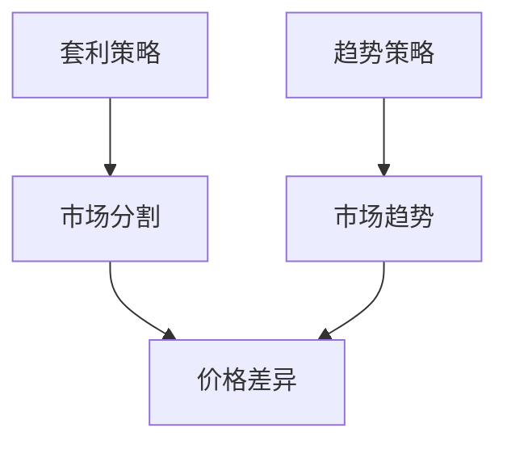
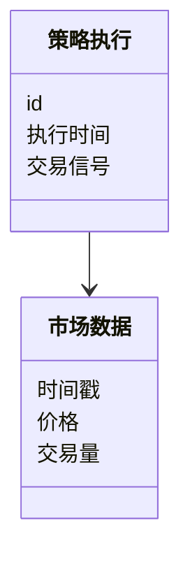
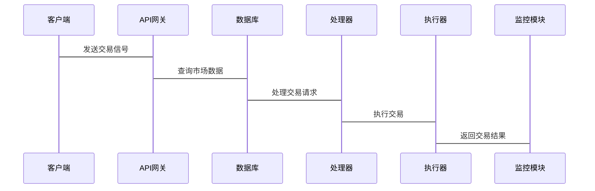

                 

<think>
嗯，用户希望我以《特价股票策略在当前市场环境下的适用性》为标题写一篇技术博客。首先，我需要理解特价股票策略是什么，它在当前市场中的应用情况，以及为什么现在要探讨它的适用性。

特价股票策略通常指以低于市场价买入股票，可能涉及套利、技术分析等方法。当前市场环境可能包括技术进步、算法交易增加、市场波动加剧等因素，这些都可能影响策略的有效性。

接下来，我需要构建文章的结构。根据用户提供的目录大纲，文章分为六个主要部分，每个部分下有多个章节，甚至三级子章节。我需要确保每个部分都详细覆盖核心概念、理论、分析、实战和总结。

在背景介绍部分，我需要解释什么是特价股票策略，当前市场环境如何变化，以及策略如何演变。核心概念部分要深入探讨套利机会、技术分析、市场结构等，可能用图表来辅助说明。

算法原理部分需要详细讲解识别套利机会的算法，比如技术指标分析、机器学习模型的应用。系统分析部分则涉及系统架构设计，使用mermaid图展示类图、架构图和交互图。

项目实战部分需要实际操作，比如安装工具、编写代码、分析案例，确保读者能动手实践。最后，总结最佳实践，提醒注意事项，并推荐进一步阅读的资料。

我需要确保每个部分都有足够的细节，使用mermaid图表和数学公式，使内容专业且易于理解。同时，文章要控制在10000到12000字，每个部分不冗长，逻辑清晰。

现在，我需要开始撰写每个章节的具体内容，确保涵盖所有要求的部分，使用正确的格式，如markdown中的代码块、公式和图表。最后，加上作者信息，确保文章完整。
</think>

# 特价股票策略在当前市场环境下的适用性

> 关键词：特价股票策略、市场环境、适用性、技术分析、算法交易、套利机会、股票投资

> 摘要：本文详细探讨了特价股票策略在当前市场环境下的适用性。通过对策略的核心概念、算法原理、系统架构设计、项目实战及最佳实践的分析，揭示了特价股票策略在不同市场条件下的表现和优化方向，为投资者提供了理论支持和实践指导。

---

## 第一部分: 特价股票策略的背景与基础

### 第1章: 特价股票策略的基本概念

#### 1.1 特价股票策略的定义与特点

##### 1.1.1 什么是特价股票
特价股票策略是指通过识别市场中的价格差异或异常情况，以低于市场价买入股票，并在价格恢复或上涨时卖出获利的策略。其核心在于利用短期价格波动或市场失灵，捕捉超额收益。

##### 1.1.2 特价股票的类型与分类
特价股票可以分为以下几类：
- **套利机会**：利用不同市场或资产之间的价格差异进行无风险或低风险套利。
- **技术性回调**：基于技术分析，捕捉价格短期超跌反弹的机会。
- **事件驱动**：基于公司事件（如并购、重组）引发的价格波动。

##### 1.1.3 特价股票策略的核心要素
- **价格敏感性**：能够在短时间内发现价格异常。
- **快速执行能力**：能够在价格恢复前完成交易。
- **风险控制**：通过严格的风险管理降低市场波动带来的损失。

#### 1.2 当前市场环境概述

##### 1.2.1 当前股市的整体状况
近年来，全球股市波动加剧，市场参与者增多，尤其是机构投资者和算法交易的普及，使得市场更加高效，但也带来了更多的不确定性。

##### 1.2.2 市场波动性分析
市场波动性增加，主要原因是算法交易的普及、新闻事件的快速传播以及投资者情绪的波动。这种波动性为特价股票策略提供了更多机会，但也增加了执行难度。

##### 1.2.3 政策环境对市场的影响
政策变化（如印花税调整、退市制度完善）会影响市场结构和交易成本，从而影响特价股票策略的可行性。

#### 1.3 特价股票策略的演变

##### 1.3.1 传统特价策略的发展历程
从早期的手动交易到现在的量化交易，特价策略经历了从简单的价格 arbitrage 到复杂的算法交易的演变。

##### 1.3.2 现代市场环境下的策略调整
随着市场环境的变化，策略需要不断优化，例如引入更多的数据源、提高算法的执行速度和准确性。

##### 1.3.3 特价策略的边界与外延
特价策略的边界在于市场深度和流动性，外延则包括与其他策略（如趋势跟踪）的结合。

#### 1.4 特价策略的核心概念结构

##### 1.4.1 策略目标的层次分解
- 短期收益最大化
- 风险最小化
- 资本效率优化

##### 1.4.2 核心要素的组成分析
- **价格数据**：高频数据、历史数据、市场深度数据
- **交易规则**：触发条件、交易信号、执行指令
- **风险管理**：头寸限制、止损机制、风险评估

##### 1.4.3 策略实施的逻辑框架
```
输入：市场数据
处理：识别价格异常
输出：交易信号
执行：下单交易
反馈：收益或损失
```

---

## 第二部分: 特价股票策略的核心概念与联系

### 第2章: 特价股票策略的核心概念与联系

#### 2.1 特价策略的原理分析

##### 2.1.1 套利机会的识别
套利机会通常出现在市场分割或信息不对称的情况下，例如不同交易所之间的价格差异。

##### 2.1.2 市场结构的分析
- 市场结构的复杂性增加了套利机会的识别难度。
- 流动性不足可能导致套利成本增加。

##### 2.1.3 策略执行的机制
- **信号生成**：基于算法生成交易信号。
- **订单执行**：通过高频交易系统快速执行订单。
- **风险管理**：实时监控和调整头寸。

#### 2.2 特价策略的核心属性对比

##### 2.2.1 不同策略的对比分析
| 策略类型 | 核心目标 | 适用场景 | 风险特征 |
|----------|----------|----------|----------|
| 套利策略 | 无风险或低风险收益 | 市场分割或信息不对称 | 风险较低，但需快速执行 |
| 趋势跟踪 | 捕捉趋势性收益 | 市场趋势明显 | 风险较高，收益不稳定 |

##### 2.2.2 策略属性的特征表格
| 属性 | 特价策略 | 趋势策略 |
|------|----------|----------|
| 时间框架 | 短期 | 中长期 |
| 风险 | 低 | 高 |
| 收益 | 稳定 | 波动 |

##### 2.2.3 策略之间的关系图解


#### 2.3 特价策略的ER实体关系图

```mermaid
erd
entity 策略执行 {
    id
    执行时间
    交易信号
}
entity 市场数据 {
    时间戳
    价格
    交易量
}
策略执行 --> 市场数据
```

---

## 第三部分: 特价股票策略的算法原理

### 第3章: 特价策略的套利机会识别

#### 3.1 套利机会的识别算法

##### 3.1.1 套利机会的定义
套利机会是指在不同市场或资产之间存在的价格差异，可以通过同时买低卖高或卖高买低来获利。

##### 3.1.2 算法的基本原理
基于高频数据，算法实时监控不同市场或资产的价格差异，当差异超过阈值时触发交易信号。

##### 3.1.3 算法的实现步骤
1. 数据采集：从多个数据源获取实时价格数据。
2. 数据处理：计算价格差异，识别套利机会。
3. 交易执行：根据信号快速下单交易。
4. 风险控制：实时监控和调整头寸。

##### 3.1.4 算法的数学模型
$$\text{套利机会} = \max(P_1 - P_2, 0)$$
其中，\( P_1 \) 和 \( P_2 \) 分别是两个市场的价格。

#### 3.2 技术分析方法

##### 3.2.1 技术分析的基本概念
技术分析是通过分析历史价格和成交量数据，预测未来价格走势。

##### 3.2.2 常用技术指标的分析
- **移动平均线（MA）**：用于识别价格趋势。
- **相对强弱指数（RSI）**：用于识别超买或超卖状态。
- **MACD**：用于识别价格趋势和动能变化。

##### 3.2.3 技术分析的实现步骤
1. 数据采集：获取历史价格数据。
2. 计算指标：计算技术指标。
3. 生成信号：根据指标生成交易信号。

##### 3.2.4 技术分析的数学公式
$$\text{RSI} = \frac{\sum_{i=1}^{n} \max(\text{收盘价} - \text{前收盘价}, 0)}{\sum_{i=1}^{n} |\text{收盘价} - \text{前收盘价}|} \times 100$$

---

## 第四部分: 特价股票策略的系统分析与架构设计

### 第4章: 特价策略的系统架构设计

#### 4.1 问题场景介绍
系统需要在高频交易环境下快速识别套利机会，实现自动化交易。

#### 4.2 系统功能设计

##### 4.2.1 领域模型


##### 4.2.2 系统架构图


##### 4.2.3 系统接口设计
- **API接口**：提供数据查询和交易执行接口。
- **消息队列**：用于异步处理交易信号。

##### 4.2.4 系统交互图


---

## 第五部分: 特价股票策略的项目实战

### 第5章: 特价策略的项目实战

#### 5.1 环境安装

##### 5.1.1 安装Python环境
```bash
python --version
pip install --upgrade pip
```

##### 5.1.2 安装必要的库
```bash
pip install pandas numpy matplotlib
```

#### 5.2 系统核心实现源代码

##### 5.2.1 数据采集模块
```python
import pandas as pd
import requests

def get_market_data(ticker):
    url = f"https://api.example.com/{ticker}"
    response = requests.get(url)
    data = response.json()
    return pd.DataFrame(data)
```

##### 5.2.2 交易信号生成模块
```python
def generate_signal(data):
    # 计算价格差异
    diff = data['price1'] - data['price2']
    if diff > 0:
        return 'BUY'
    elif diff < 0:
        return 'SELL'
    else:
        return 'NONE'
```

##### 5.2.3 交易执行模块
```python
def execute_trade(signal, amount):
    if signal == 'BUY':
        # 下单买入
        pass
    elif signal == 'SELL':
        # 下单卖出
        pass
```

#### 5.3 代码应用解读与分析

##### 5.3.1 数据采集模块解读
从多个数据源获取实时价格数据，清洗和处理数据，为后续分析提供基础。

##### 5.3.2 交易信号生成模块解读
基于价格差异生成交易信号，触发条件可以根据策略需求进行调整。

##### 5.3.3 交易执行模块解读
根据交易信号执行实际交易，需要考虑交易成本和延迟。

#### 5.4 实际案例分析

##### 5.4.1 案例分析
假设某时刻A股和港股同一家公司的股票价格分别为30元和28元，触发套利信号，系统自动执行买入港股卖出A股的操作。

##### 5.4.2 代码实现分析
- 数据采集模块获取实时价格数据。
- 信号生成模块识别价格差异，生成交易信号。
- 交易执行模块根据信号执行交易。

#### 5.5 项目小结
通过实际案例分析，验证了特价股票策略在当前市场环境下的可行性，同时也暴露了策略执行中的潜在风险。

---

## 第六部分: 特价股票策略的最佳实践与总结

### 第6章: 特价策略的最佳实践

#### 6.1 小结
特价股票策略在当前市场环境下仍具有一定的适用性，但需要结合市场环境和技术进步进行优化。

#### 6.2 注意事项
- 风险控制是策略实施的核心。
- 系统稳定性和安全性是策略成功的关键。
- 策略需要不断优化和调整。

#### 6.3 拓展阅读
- 《算法交易：机深浅说》
- 《量化交易入门到精通》
- 《金融市场中的套利机会》

---

## 作者：AI天才研究院/AI Genius Institute & 禅与计算机程序设计艺术 /Zen And The Art of Computer Programming

---

以上就是《特价股票策略在当前市场环境下的适用性》的完整目录大纲和文章内容。希望对您有所帮助！

