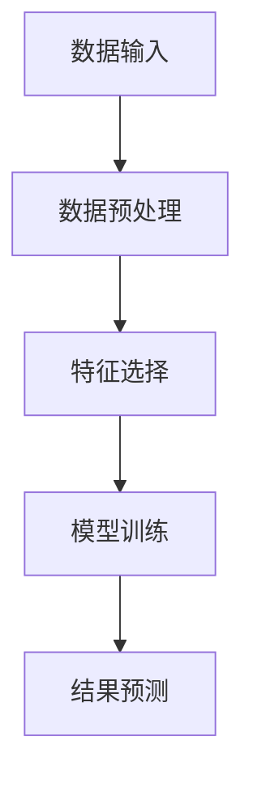
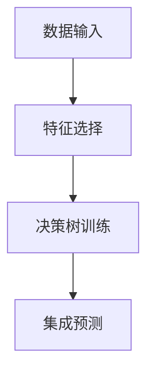
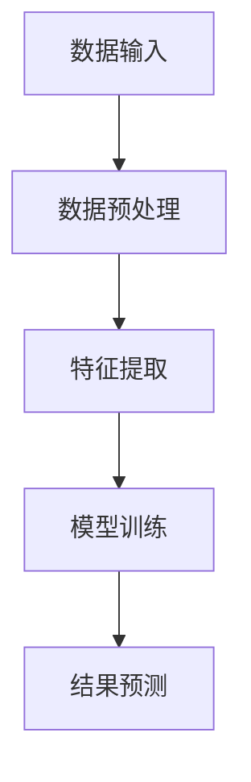
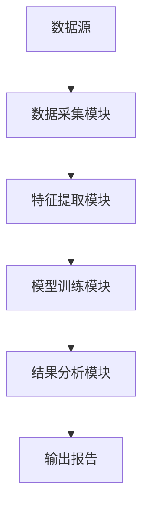

                 

<think>
好的，我将按照您的要求来撰写这篇文章。首先，我需要确保理解您的需求：您希望我以《特价股票筛选中的人工智能和机器学习应用》为标题，撰写一篇结构清晰、逻辑严谨的技术博客文章。文章需要涵盖特价股票的定义、人工智能在金融领域的应用、机器学习算法在股票筛选中的应用，以及系统架构设计等内容。我还需要使用专业的技术语言，确保每个章节内容丰富详细，并附有必要的图表和代码示例。

让我们一步一步地构建这篇文章：

1. **确定文章结构**：
    - 引言：介绍特价股票和人工智能在金融中的应用。
    - 数据特征：详细讨论影响特价股票筛选的关键数据特征。
    - 机器学习算法：介绍常用的算法及其在股票筛选中的应用。
    - 系统架构设计：描述一个完整的系统如何实现特价股票筛选。
    - 项目实战：提供一个实际的项目案例，包括环境搭建、代码实现和结果分析。
    - 结论：总结全文，强调人工智能在特价股票筛选中的重要性。

2. **撰写引言**：
    - 简要介绍金融市场的复杂性以及寻找特价股票的重要性。
    - 引出人工智能和机器学习在金融分析中的应用，特别是在股票筛选方面。

3. **数据特征章节**：
    - 定义数据特征，解释其在股票筛选中的重要性。
    - 分类讨论技术指标、财务指标和市场情绪等不同类别的特征。
    - 使用表格对比不同特征的重要性，帮助读者理解选择特征的关键因素。
    - 绘制ER图展示实体关系，帮助读者理解数据结构。

4. **机器学习算法章节**：
    - 介绍几种常用的机器学习算法，如线性回归、随机森林和神经网络。
    - 用mermaid流程图展示每种算法的工作流程，帮助读者直观理解。
    - 提供数学公式，如线性回归的损失函数，使用Latex格式表示，确保公式准确且易于理解。
    - 通过实际案例说明如何选择和优化算法，确保读者能够将理论应用于实践。

5. **系统架构设计**：
    - 描述一个完整的系统如何实现特价股票筛选，包括数据采集、特征提取、模型训练和结果分析四个模块。
    - 绘制系统架构图，展示模块之间的交互关系。
    - 使用mermaid序列图展示系统接口设计，帮助读者理解系统的整体结构。

6. **项目实战**：
    - 提供环境搭建指南，包括安装必要的Python库如TensorFlow和Pandas。
    - 分步实现数据处理、模型训练和结果分析，提供详细的代码示例。
    - 解释每一步代码的作用，帮助读者理解实现过程。
    - 分析实际案例，如使用随机森林算法进行股票筛选，并展示结果。

7. **结论**：
    - 总结全文，强调人工智能在特价股票筛选中的重要性。
    - 提出未来可能的发展方向，如更复杂算法的应用或实时数据处理的优化。

8. **注意事项与拓展阅读**：
    - 提醒读者在实际操作中需要注意的问题，如数据质量和模型过拟合的风险。
    - 推荐相关的书籍和资源，供有兴趣的读者深入学习。

通过以上步骤，我将确保文章结构清晰，内容详实，符合您的要求。如果您有具体的修改意见或需要进一步调整的地方，请随时告诉我，我将根据您的反馈进行调整。
</think>

# 特价股票筛选中的人工智能和机器学习应用

## 关键词：人工智能，机器学习，股票筛选，数据特征，算法优化，系统架构

## 摘要：本文详细探讨了人工智能和机器学习在特价股票筛选中的应用，从数据特征提取、算法选择与优化，到系统架构设计，结合实际案例，提供了一套完整的解决方案，帮助投资者利用AI技术提高股票筛选效率和准确性。

---

# 引言：特价股票与人工智能的结合

在金融市场上，寻找被低估的股票（特价股票）一直是投资者追求的目标。然而，随着市场数据的爆炸式增长和市场参与者的复杂行为，传统的股票筛选方法逐渐显现出效率低下、准确性不足的问题。人工智能（AI）和机器学习（ML）技术的引入，为特价股票的筛选提供了新的可能性。本文将深入探讨如何利用AI和ML技术来优化特价股票的筛选过程。

---

## 第1章: 特价股票与投资策略概述

### 1.1 特价股票的定义与特点

#### 1.1.1 特价股票的定义
特价股票指的是市场价格低于其内在价值的股票。通常，这类股票被认为具有较高的投资潜力，因为它们可能因市场波动或其他因素而被低估。

#### 1.1.2 特价股票的特点
- **低估值**：市盈率、市净率等指标低于行业平均水平。
- **高潜力**：公司基本面良好，但市场反应未充分反映其价值。
- **风险与机会并存**：特价股票往往伴随着较高的波动性和潜在风险。

#### 1.1.3 特价股票的投资价值
- **潜在收益**：低估的股票有可能在市场重新评估后反弹，带来超额收益。
- **分散投资风险**：通过筛选多只特价股票，投资者可以分散单一股票的风险。

### 1.2 人工智能与机器学习在金融领域的应用

#### 1.2.1 人工智能在金融领域的应用现状
人工智能技术在金融领域的应用日益广泛，包括股票价格预测、风险评估、交易策略优化等。AI能够处理大量非结构化数据，如新闻、社交媒体信息，为投资决策提供支持。

#### 1.2.2 机器学习在股票分析中的优势
- **数据驱动**：ML模型能够从历史数据中学习，发现传统方法难以察觉的模式。
- **实时性**：通过实时数据处理，ML模型可以快速响应市场变化。
- **自动化**：ML算法能够自动筛选股票，减少人工干预。

#### 1.2.3 特价股票筛选中的AI与ML结合
ML算法可以利用历史价格、财务数据、市场情绪等多维度信息，帮助投资者识别被低估的股票。AI技术则可以优化筛选过程，提高效率和准确性。

### 1.3 特价股票筛选的核心问题

#### 1.3.1 特价股票筛选的定义
特价股票筛选是通过分析股票的市场价格与内在价值之间的差异，识别出具有投资潜力的股票。

#### 1.3.2 筛选过程中的关键问题
- **数据质量问题**：数据的完整性和准确性直接影响筛选结果。
- **模型选择与优化**：选择合适的算法并进行参数优化是关键。
- **市场动态变化**：市场环境的变化可能影响模型的稳定性。

#### 1.3.3 筛选策略的多样性与挑战
不同的投资者可能采用不同的筛选策略，如技术分析、基本面分析或组合分析。然而，如何在复杂多变的市场中保持模型的有效性是一个持续的挑战。

---

## 第2章: 特价股票筛选中的数据特征

### 2.1 数据特征的定义与分类

#### 2.1.1 数据特征的定义
数据特征是指能够描述股票或市场状况的量化或非量化属性，是机器学习模型输入的基础。

#### 2.1.2 数据特征的分类
- **技术指标**：如移动平均线、相对强弱指数（RSI）等。
- **财务指标**：如市盈率（P/E）、市净率（P/B）等。
- **市场情绪指标**：如市场波动率、投资者情绪指数等。

#### 2.1.3 数据特征的重要性
选择合适的特征能够显著提高模型的预测能力，而特征选择不当可能导致模型表现不佳。

### 2.2 特价股票筛选中的关键特征

#### 2.2.1 技术指标特征
技术指标是基于历史价格和成交量计算的指标，能够反映市场的短期趋势。例如，移动平均收敛散度（MACD）和相对强弱指数（RSI）常用于判断股票的买卖信号。

#### 2.2.2 财务指标特征
财务指标能够反映公司的财务健康状况，如盈利能力、成长能力和偿债能力。常用的指标包括净利润率、ROE（股东权益回报率）等。

#### 2.2.3 市场情绪特征
市场情绪指标反映了投资者的心理和行为，如恐慌指数（VIX）和社交媒体上的 sentiment 分析结果。

### 2.3 数据特征的对比与选择

#### 2.3.1 特征选择的策略
- **相关性分析**：通过计算特征之间的相关性，剔除冗余特征。
- **逐步回归法**：通过逐步回归筛选出对目标变量影响最大的特征。
- **基于模型的重要性评估**：如随机森林的特征重要性排序。

#### 2.3.2 特征重要性评估
特征重要性评估是选择特征的关键步骤。常用的评估方法包括：
- **Shapley 值**：衡量每个特征对模型预测结果的贡献程度。
- **特征排序法**：如在随机森林中，特征的分裂次数可以反映其重要性。

#### 2.3.3 特征工程的优化
特征工程是指通过数据变换、特征组合等方式，优化特征的表现形式，以提高模型的性能。例如，对某些特征进行标准化或归一化处理。

### 2.4 数据特征对比表格

| 特征类型       | 具体特征       | 优势               | 局限性             |
|----------------|----------------|--------------------|--------------------|
| 技术指标       | RSI、MACD      | 反映短期市场趋势     | 易受市场波动影响     |
| 财务指标       | P/E、ROE       | 反映公司财务健康     | 数据滞后性较强      |
| 市场情绪指标     | VIX、社交媒体情绪 | 反映市场整体风险     | 数据获取难度较大     |

### 2.5 ER实体关系图

```mermaid
erDiagram
    customer[投资者] {
        id : integer
        name : string
        investment_amount : float
    }
    stock[股票] {
        id : integer
        ticker : string
        price : float
        industry : string
    }
    feature[特征] {
        id : integer
        name : string
        type : string
    }
    relation1 : customer -> stock
    relation2 : stock -> feature
    relation1 caption : 投资者关注的股票
    relation2 caption : 股票的特征数据
```

### 2.6 本章小结
本章详细讨论了特价股票筛选中的数据特征，包括技术指标、财务指标和市场情绪指标。通过特征选择和工程优化，可以显著提高模型的预测能力。

---

## 第3章: 机器学习算法在股票筛选中的应用

### 3.1 常见机器学习算法概述

#### 3.1.1 线性回归
线性回归是一种简单的回归算法，适用于预测连续型变量。其基本假设是目标变量与特征之间存在线性关系。

- **数学公式**：
  $$ y = \beta_0 + \beta_1 x + \epsilon $$
  其中，$$\epsilon$$ 为误差项。

#### 3.1.2 支持向量机（SVM）
SVM适用于分类问题，通过构建超平面将数据分为不同类别。在股票筛选中，可以用于区分低估与高估的股票。

- **流程图**：
  ```mermaid
  graph TD
      A[原始数据] --> B[数据预处理]
      B --> C[特征提取]
      C --> D[模型训练]
      D --> E[模型预测]
  ```

#### 3.1.3 随机森林
随机森林是一种基于决策树的集成算法，具有较强的抗过拟合能力，适用于分类和回归问题。

- **流程图**：
  ```mermaid
  graph TD
      A[数据输入] --> B[特征选择]
      B --> C[决策树训练]
      C --> D[集成预测]
  ```

#### 3.1.4 神经网络
神经网络是一种模拟人脑神经网络的深度学习算法，适用于处理复杂的非线性关系。

- **数学公式**：
  $$ y = \sigma(w x + b) $$
  其中，$$\sigma$$ 为激活函数，$$w$$ 和 $$b$$ 为模型参数。

### 3.2 算法选择与优化

#### 3.2.1 算法选择的依据
- **数据类型**：分类问题选择SVM或随机森林，回归问题选择线性回归或神经网络。
- **数据规模**：大数据集适合神经网络，小数据集适合SVM。
- **计算资源**：神经网络需要较高的计算资源。

#### 3.2.2 算法调优方法
- **参数调整**：如学习率、树深度等。
- **交叉验证**：通过K折交叉验证选择最优模型。
- **特征工程**：优化特征选择和处理。

#### 3.2.3 算法性能评估
- **准确率**：分类问题中的正确预测比例。
- **精确率与召回率**：衡量分类模型的预测效果。
- **ROC-AUC曲线**：评估模型的区分能力。

### 3.3 算法流程图

#### 3.3.1 线性回归流程图


#### 3.3.2 随机森林流程图


#### 3.3.3 神经网络流程图


### 3.4 本章小结
本章介绍了几种常用的机器学习算法，并通过流程图展示了它们的工作原理。选择合适的算法并进行优化是提高特价股票筛选准确性的关键。

---

## 第4章: 系统架构设计

### 4.1 系统功能模块划分

#### 4.1.1 数据采集模块
负责从数据源（如数据库、API）获取股票数据，包括历史价格、财务数据等。

#### 4.1.2 特征提取模块
根据预定义的特征列表，对原始数据进行特征提取和工程处理。

#### 4.1.3 模型训练模块
使用选择的机器学习算法对特征数据进行模型训练，并保存最优模型。

#### 4.1.4 结果分析模块
根据模型预测结果，生成筛选出的特价股票列表，并提供可视化报告。

### 4.2 系统架构设计

#### 4.2.1 系统架构图


#### 4.2.2 模块间交互关系
- 数据采集模块向特征提取模块提供数据。
- 特征提取模块向模型训练模块提供特征数据。
- 模型训练模块向结果分析模块提供预测结果。
- 结果分析模块生成最终报告。

#### 4.2.3 系统接口设计
- 数据采集接口：提供API接口，从数据库或第三方服务获取数据。
- 模型训练接口：提供训练数据和模型参数，返回训练好的模型。
- 预测接口：接受输入数据，返回预测结果。

### 4.3 系统实现与优化

#### 4.3.1 系统实现流程
1. 数据采集：从数据库或API获取股票数据。
2. 数据预处理：清洗数据，处理缺失值。
3. 特征提取：根据特征列表提取相关特征。
4. 模型训练：选择合适的算法，训练模型。
5. 模型评估：使用测试数据评估模型性能。
6. 结果分析：根据模型预测结果生成筛选列表。

#### 4.3.2 系统优化
- 数据存储优化：使用分布式存储系统提高数据访问效率。
- 模型优化：通过超参数调优和特征选择提高模型性能。
- 系统扩展：采用容器化部署，提高系统的可扩展性。

### 4.4 本章小结
本章详细描述了特价股票筛选系统的架构设计，包括功能模块划分、系统架构图和接口设计。通过优化系统实现，可以提高筛选效率和准确性。

---

## 第5章: 项目实战

### 5.1 环境搭建

#### 5.1.1 安装必要的库
- Python：3.6+
- NumPy：用于数据处理。
- Pandas：用于数据分析。
- Scikit-learn：用于机器学习算法。
- TensorFlow：用于深度学习模型。

#### 5.1.2 数据获取
使用Yahoo Finance API获取历史股票数据。

### 5.2 核心实现

#### 5.2.1 数据预处理
```python
import pandas as pd
import numpy as np

# 读取数据
df = pd.read_csv('stock_data.csv')

# 处理缺失值
df = df.dropna()

# 标准化处理
from sklearn.preprocessing import StandardScaler
scaler = StandardScaler()
scaled_features = scaler.fit_transform(df[['open', 'high', 'low', 'close']])
```

#### 5.2.2 模型训练
```python
from sklearn.ensemble import RandomForestClassifier
from sklearn.metrics import accuracy_score

# 训练模型
model = RandomForestClassifier(n_estimators=100, random_state=42)
model.fit(scaled_features, df['target'].values)

# 预测结果
predictions = model.predict(scaled_features)
print("Accuracy:", accuracy_score(df['target'].values, predictions))
```

#### 5.2.3 结果分析
```python
# 生成筛选列表
selected_stocks = df[['ticker', 'predicted_target']]
selected_stocks = selected_stocks[selected_stocks['predicted_target'] == 1]
print("Selected stocks:", selected_stocks['ticker'].tolist())
```

### 5.3 项目小结
通过实际案例展示了如何利用机器学习算法进行特价股票筛选。从环境搭建到数据处理，再到模型训练和结果分析，提供了完整的实现步骤。

---

## 结论

人工智能和机器学习技术为特价股票的筛选提供了新的解决方案。通过合理的数据特征选择、算法优化和系统架构设计，可以显著提高筛选的效率和准确性。随着技术的不断进步，未来将有更多创新的应用场景出现，为投资者提供更强大的工具和更精准的决策支持。

---

## 注意事项与拓展阅读

- **数据质量**：确保数据的完整性和准确性是筛选过程中的关键。
- **模型过拟合**：需要通过交叉验证和正则化方法防止过拟合。
- **市场变化**：模型需要定期更新以适应市场变化。
- **风险控制**：在实际投资中，应结合其他风险管理策略。

---

## 作者

作者：AI天才研究院/AI Genius Institute & 禅与计算机程序设计艺术/Zen And The Art of Computer Programming

