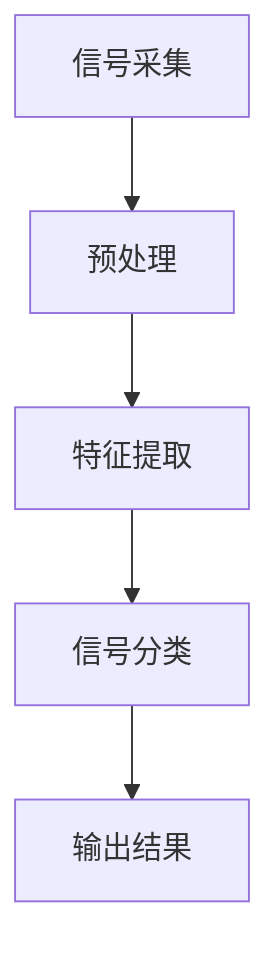
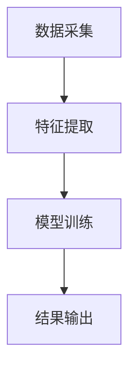

                 


# 特价股票筛选中的脑机接口技术应用前景

> 关键词：脑机接口技术（BCI）、股票筛选、人工智能、信号处理、机器学习、金融投资、神经科学

> 摘要：本文探讨了脑机接口技术在特价股票筛选中的应用前景，从背景介绍、核心概念、算法原理、系统架构到项目实战，系统地分析了脑机接口技术如何助力投资者在股票市场中捕捉低估机会。文章结合理论与实践，详细阐述了脑机接口技术在股票筛选中的潜力与挑战，为投资者和科技从业者提供了深度的见解。

---

## 第一部分：背景介绍

### 第1章：问题背景与描述

#### 1.1 股票筛选的背景

股票筛选是金融投资中的核心任务之一。投资者通过筛选股票，寻找那些价格低于其内在价值的股票，即所谓的“特价股票”。传统的股票筛选方法依赖于市场数据、财务指标和技术分析，但这些方法往往难以捕捉投资者的心理因素和情绪波动。特别是在市场波动剧烈的情况下，投资者的决策往往受到情绪和潜意识的影响，而这些因素在传统分析中难以量化。

#### 1.2 脑机接口技术的背景

脑机接口（Brain-Computer Interface，BCI）是一种将人脑的神经信号直接与计算机或其他设备进行交互的技术。通过采集和分析大脑活动（如 EEG 信号），脑机接口能够解读人类的意图、情绪和认知状态。近年来，随着神经科学和人工智能技术的进步，脑机接口技术在医疗、教育、娱乐和金融等领域展现出巨大潜力。

#### 1.3 脑机接口技术在股票筛选中的问题解决

将脑机接口技术应用于股票筛选，可以通过分析投资者的心理状态和情绪变化，提供更深层次的决策支持。例如，当投资者在筛选股票时，BCI 可以实时捕捉其大脑活动，识别潜在的投资偏好和情绪波动，从而帮助投资者发现市场中的低估机会。

---

## 第二部分：核心概念与联系

### 第2章：脑机接口技术的核心原理

#### 2.1 脑机接口技术的核心概念

脑机接口技术的核心原理是通过采集和分析大脑神经信号，将其转化为可被计算机理解和使用的信号。常见的脑机接口技术包括：

- **EEG（脑电图）**：通过头皮电极采集大脑皮层的电信号。
- **fMRI（功能性磁共振成像）**：通过磁共振技术观察大脑血流变化。
- **EMG（肌电图）**：通过传感器采集肌肉活动信号。

#### 2.2 脑机接口技术与股票筛选的联系

脑机接口技术可以通过以下方式与股票筛选结合：

1. **情绪识别**：通过分析投资者的情绪状态（如焦虑、兴奋），识别市场中的非理性行为。
2. **认知分析**：通过解读投资者的注意力和决策过程，辅助判断股票的价值。
3. **实时反馈**：通过脑机接口提供实时的市场信息反馈，优化投资者的决策过程。

---

## 第三部分：算法原理讲解

### 第3章：脑机接口技术的算法原理

#### 3.1 脑机接口信号处理算法

脑机接口技术的核心是信号处理算法。以下是常见的信号处理步骤：

1. **信号采集与预处理**：
   - 采集 EEG 信号。
   - 去除噪声（如工频噪声、肌电噪声）。

2. **特征提取**：
   - 使用小波变换提取 EEG 信号的时频特征。
   - 计算功率谱密度（PSD）和频带功率。

3. **信号分类**：
   - 使用机器学习算法（如 SVM、随机森林）对 EEG 信号进行分类。

#### 3.2 算法流程图



---

## 第四部分：系统分析与架构设计

### 第4章：系统架构设计

#### 4.1 问题场景介绍

在股票筛选中，投资者需要实时分析市场数据和自身情绪状态。通过脑机接口技术，可以实时捕捉投资者的注意力和情绪变化，辅助做出更明智的投资决策。

#### 4.2 系统功能设计

以下是系统的功能模块：

1. **数据采集模块**：采集投资者的 EEG 信号。
2. **特征提取模块**：提取 EEG 信号的特征。
3. **模型训练模块**：训练分类模型。
4. **结果输出模块**：输出筛选结果。

#### 4.3 系统架构图



---

## 第五部分：项目实战

### 第5章：项目实战与案例分析

#### 5.1 环境安装

安装必要的库：

```bash
pip install numpy matplotlib scikit-learn mne
```

#### 5.2 核心代码实现

以下是脑机接口信号处理的 Python 代码：

```python
import numpy as np
from scipy import signal
import matplotlib.pyplot as plt

# 模拟 EEG 信号
fs = 250  # 采样频率
t = np.linspace(0, 1, fs)
signal_eeg = np.sin(2 * np.pi * 50 * t)  # 模拟 EEG 信号

# 添加噪声
noise = np.random.normal(0, 0.5, fs)
signal_eeg += noise

# 预处理
# 带通滤波
from scipy.signal import butterworth
b, a = butterworth(2, [30, 50], 'bandpass', fs=fs)
filtered_signal = signal.lfilter(b, a, signal_eeg)

# 特征提取
# 计算功率谱密度
f, psd = signal.welch(filtered_signal, fs)

# 绘制 PSD 图
plt.figure(figsize=(10, 6))
plt.semilogy(f, psd)
plt.title('PSD of EEG Signal')
plt.xlabel('Frequency (Hz)')
plt.ylabel('PSD (dB)')
plt.show()
```

#### 5.3 案例分析

通过上述代码，我们可以提取 EEG 信号的特征，并结合机器学习算法（如随机森林）进行分类。最终输出筛选结果，帮助投资者发现市场中的低估机会。

---

## 第六部分：最佳实践与总结

### 第6章：总结与展望

#### 6.1 小结

脑机接口技术在特价股票筛选中的应用前景广阔。通过实时捕捉投资者的心理状态和情绪变化，可以帮助投资者做出更明智的投资决策。

#### 6.2 注意事项

- 投资者需谨慎使用脑机接口技术，避免过度依赖。
- 技术仍处于发展阶段，需进一步验证其有效性。

#### 6.3 未来展望

未来，随着脑机接口技术和人工智能的进步，股票筛选将更加智能化和个性化。投资者可以通过脑机接口技术，实现更精准的市场分析和投资决策。

---

## 作者信息

作者：AI天才研究院/AI Genius Institute & 禅与计算机程序设计艺术 /Zen And The Art of Computer Programming

---

以上是《特价股票筛选中的脑机接口技术应用前景》的完整目录大纲和文章内容。

