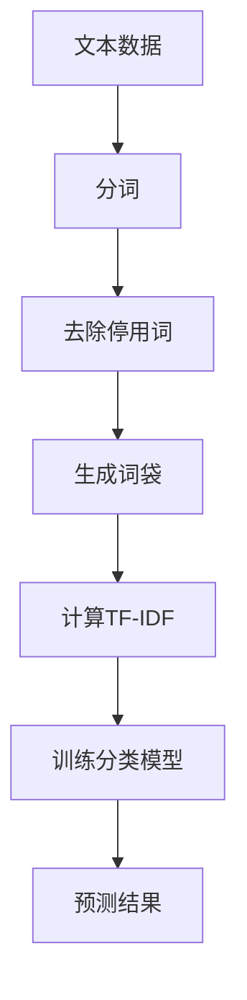
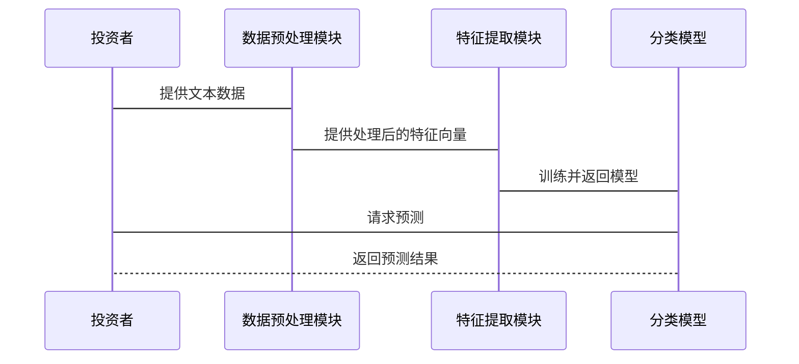

                 


# 特价股票筛选中的自然语言处理模型应用

---

## 关键词：
- 自然语言处理
- 特价股票筛选
- 文本挖掘
- 情感分析
- 金融时间序列

---

## 摘要：
本文探讨自然语言处理（NLP）技术在特价股票筛选中的应用。通过分析市场新闻、社交媒体等文本数据，NLP能够提取影响股价的关键信息，帮助投资者做出更明智的决策。文章系统介绍了NLP的核心原理、算法模型，结合股票筛选的具体场景，展示了如何构建NLP驱动的股票筛选系统，并通过实际案例验证其有效性。

---

## 第1章：背景介绍

### 1.1 特价股票筛选的背景与重要性
- **1.1.1 特价股票的定义**：指低于市场价或内在价值的股票，具有较高的投资潜力。
- **1.1.2 筛选的重要性**：及时发现潜在投资机会，降低投资风险。
- **1.1.3 NLP的应用背景**：金融市场的文本数据（如新闻、财报）对股价有显著影响，NLP可从中提取有用信息。

### 1.2 自然语言处理的基本概念
- **1.2.1 定义**：研究如何让计算机理解、处理和生成人类语言的技术。
- **1.2.2 核心任务**：文本分类、情感分析、实体识别等。
- **1.2.3 在金融领域的应用**：情绪分析、新闻摘要、风险预警等。

### 1.3 本章小结
本章介绍了特价股票筛选的背景及其对投资者的重要性，以及自然语言处理在金融领域的潜力。

---

## 第2章：核心概念与联系

### 2.1 NLP的核心原理
- **2.1.1 语言模型**：通过统计或深度学习方法生成符合人类语言的文本。
- **2.1.2 文本预处理**：分词、去停用词、句法分析等。
- **2.1.3 常见算法**：TF-IDF、Word2Vec、BERT等。

### 2.2 特价股票筛选的关键要素
- **2.2.1 特价股票的特征**：低估值、高成长性等。
- **2.2.2 市场情绪**：投资者情绪影响股价波动。
- **2.2.3 文本数据的作用**：新闻、社交媒体数据对股价预测至关重要。

### 2.3 NLP与股票筛选的结合
- **2.3.1 文本数据的处理**：利用NLP提取关键词、主题。
- **2.3.2 情感分析的应用**：判断市场情绪对股价的影响。
- **2.3.3 实体关系图（ER图）**：展示文本数据与股票的关系。

### 2.4 核心概念对比
- **2.4.1 NLP与传统金融分析的对比**：基于数据量、实时性等。
- **2.4.2 ER图展示**：文本数据与股票实体的关系。

---

## 第3章：NLP算法原理

### 3.1 文本预处理与特征提取
- **3.1.1 文本清洗**：去除噪声、特殊符号。
- **3.1.2 分词**：使用jieba等工具进行分词。
- **3.1.3 词袋模型与TF-IDF**：
  - TF-IDF公式：$$TF-IDF(t, d) = TF(t, d) \times \log\left(\frac{N}{DF(t)}\right)$$
  - 示例：计算关键词的重要性。

### 3.2 文本分类与情感分析
- **3.2.1 情感分析模型**：基于SVM或深度学习模型。
- **3.2.2 分类流程图**：数据预处理→特征提取→模型训练→分类预测。

### 3.3 算法流程图
- 使用Mermaid绘制NLP处理流程图：



---

## 第4章：系统分析与架构设计

### 4.1 系统功能设计
- **4.1.1 领域模型类图**：展示系统的主要组件和交互。
- **4.1.2 系统架构图**：展示分层结构，包括数据层、业务逻辑层、表现层。

### 4.2 系统架构
- **4.2.1 数据预处理模块**：清洗和分词。
- **4.2.2 特征提取模块**：生成TF-IDF向量。
- **4.2.3 模型训练模块**：训练分类器。
- **4.2.4 接口设计**：API供其他系统调用。

### 4.3 交互流程图
- 使用Mermaid绘制交互流程图：



---

## 第5章：项目实战

### 5.1 环境安装
- 安装Python、scikit-learn、jieba等库。

### 5.2 核心代码实现
```python
import jieba
from sklearn.feature_extraction.text import TfidfVectorizer
from sklearn.svm import SVC

# 文本数据预处理
def preprocess(text):
    words = jieba.lcut(text)
    return ' '.join(words)

# 特征提取与模型训练
vectorizer = TfidfVectorizer()
X = vectorizer.fit_transform(corpus)
model = SVC()
model.fit(X.toarray(), labels)

# 预测
test_text = "公司业绩超预期"
test_vec = vectorizer.transform([test_text])
print(model.predict(test_vec.toarray()))
```

### 5.3 代码解读与分析
- **preprocess**：使用jieba进行分词。
- **vectorizer**：生成TF-IDF特征向量。
- **model**：训练SVM分类器。
- **预测**：输入文本，返回分类结果。

### 5.4 实际案例分析
- 以某公司财报为例，分析模型如何预测其股价走势。

### 5.5 项目小结
总结项目实现过程，强调NLP在股票筛选中的实际应用价值。

---

## 第6章：应用案例与效果评估

### 6.1 应用案例
- 利用NLP模型分析社交媒体情绪，预测某科技股的股价波动。

### 6.2 效果评估
- 准确率、召回率等指标评估模型性能。

### 6.3 对投资决策的影响
- NLP如何帮助投资者捕捉市场情绪，优化投资策略。

---

## 第7章：总结与展望

### 7.1 全文总结
回顾文章内容，强调NLP在特价股票筛选中的重要性。

### 7.2 未来展望
- 深度学习模型的应用潜力。
- 实时数据流处理的挑战与机遇。

---

## 作者：AI天才研究院 & 禅与计算机程序设计艺术

---

通过以上大纲和详细内容，您可以撰写一篇结构清晰、内容详实的技术博客文章，全面展示自然语言处理在特价股票筛选中的应用。

