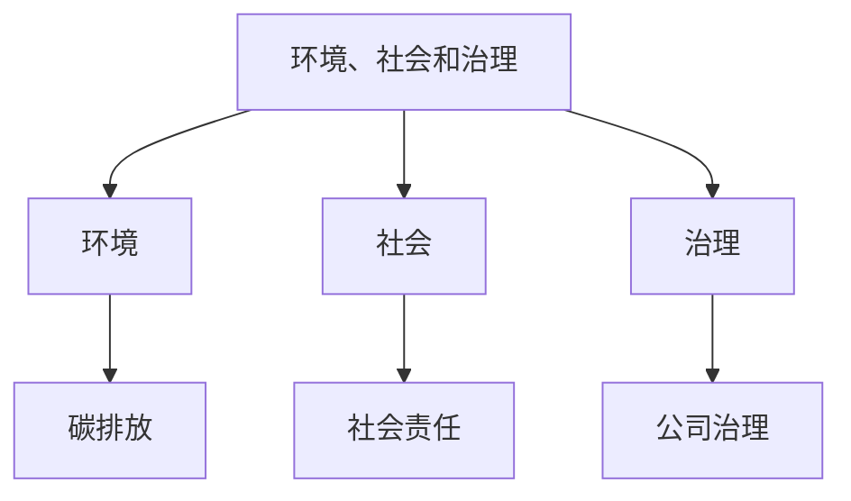
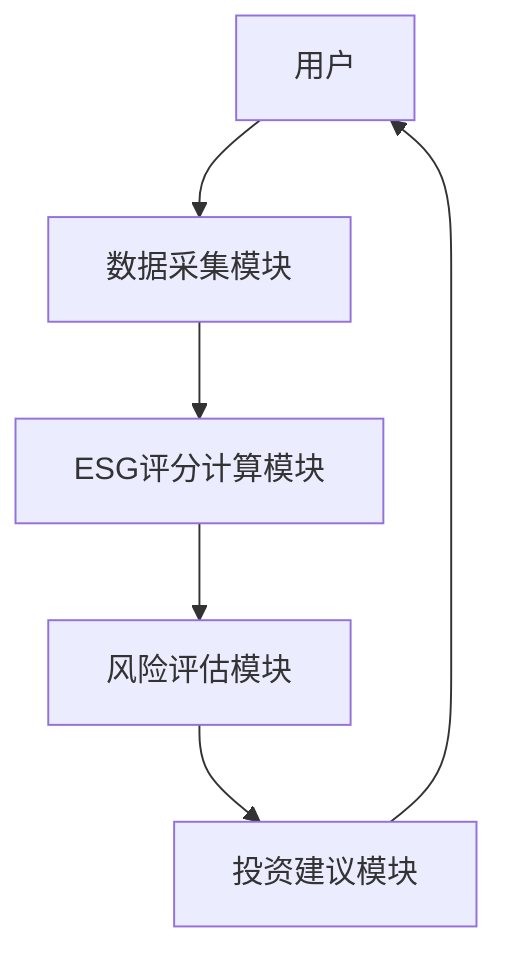

                 

<think>
好的，我需要撰写一篇关于《环境、社会和治理(ESG)因素对股市估值的作用》的技术博客文章。首先，我得理解什么是ESG，它如何影响股市估值，以及它在投资中的重要性。

首先，我应该从ESG的基本概念入手。环境（Environmental）、社会（Social）和治理（Governance）是ESG的三个主要方面。环境方面包括公司的碳排放、资源利用效率等；社会方面涉及员工权益、社会责任、产品安全等；治理方面则关注公司治理结构、高管薪酬、董事会多样性等。

接下来，我需要探讨这些因素如何影响股市估值。传统上，投资者主要关注财务指标如市盈率、ROE等，但近年来，ESG的重要性逐渐上升。研究表明，高ESG评分的公司通常表现更稳定，风险更低，这可能是因为它们在可持续发展方面表现更好，吸引了更多注重长期投资的投资者。

然后，我应该讨论ESG在投资决策中的应用。越来越多的机构投资者将ESG作为筛选投资标的的重要标准。例如，养老基金、主权财富基金等大型机构投资者开始要求投资组合中的公司具备较高的ESG评分。此外，ESG评级还影响着公司的融资成本，评级高的公司通常更容易获得低成本资金。

接下来，我需要分析ESG对股票价格的具体影响。一些研究表明，当一家公司的ESG评级上升时，其股价往往会上涨，尤其是在市场波动较大的时候，ESG表现好的公司更能吸引投资者的关注。此外，ESG因素还可以帮助投资者识别潜在的风险，如环境风险可能导致的罚款，社会责任履行不力可能导致的声誉损失等。

然后，我应该探讨如何量化ESG因素对股市估值的影响。这里可以引入多因子模型，将ESG作为其中一个因子，与其他财务因子一起分析其对股票收益的贡献。通过回归分析，可以得出ESG因子对股票超额收益的影响程度。

此外，我还需要讨论ESG评估的挑战和局限性。例如，不同机构对ESG的评分标准可能不一致，导致结果存在差异。此外，一些公司可能会通过“漂绿”（Greenwashing）行为来提高自己的ESG评分，这可能影响评估的准确性。

最后，我应该总结ESG对股市估值的重要性和未来趋势。随着全球对可持续发展的关注增加，ESG投资正在快速增长。预计未来会有更多的研究和实践探索ESG如何更有效地整合到投资决策中，帮助投资者实现长期的超额收益。

在整个思考过程中，我需要确保逻辑清晰，论据充分，并结合实际案例和数据来支持我的观点。同时，我应该使用专业但易懂的语言，确保读者能够理解ESG的复杂性及其对股市估值的具体影响。
</think>

# 环境、社会和治理(ESG)因素对股市估值的作用

> 关键词：ESG, 环境, 社会, 治理, 股市估值, 可持续投资

> 摘要：本文探讨了环境、社会和治理（ESG）因素如何影响股市估值。通过分析ESG的核心概念、量化方法及其对投资决策的影响，文章展示了ESG在现代金融体系中的重要性，并提出了将ESG纳入投资策略的有效方法。

---

## # 第一章: ESG的定义与背景

### 1.1 ESG的定义与核心要素

ESG是环境、社会和治理的缩写，分别代表公司在可持续发展方面的重要维度：

- **环境（Environmental）**：包括碳排放、能源效率、资源利用等。
- **社会（Social）**：涉及员工权益、社会责任、产品安全等。
- **治理（Governance）**：关注公司治理结构、高管薪酬、董事会多样性等。

### 1.2 ESG的发展历程

1. **起源**：ESG概念起源于20世纪60年代的社会责任投资（SRI）。
2. **发展**：随着全球关注可持续发展，ESG从边缘概念逐渐成为主流。
3. **现状**：越来越多的机构投资者将ESG作为投资决策的重要依据。

### 1.3 ESG与传统财务指标的对比

- **传统指标的局限性**：仅关注财务表现，忽视长期风险和机会。
- **ESG的独特价值**：提供非财务信息，帮助识别长期风险和收益。
- **互补性**：ESG与财务指标结合，提供更全面的企业评价。

---

## # 第二章: ESG的核心概念与联系

### 2.1 ESG核心概念的原理

- **环境因素的量化方法**：使用碳足迹、能源消耗等指标。
- **社会因素的评估维度**：包括员工满意度、社会责任项目等。
- **治理因素的关键指标**：如董事会多样性、高管薪酬透明度。

### 2.2 ESG核心概念的对比分析

通过对比分析，理解各维度之间的相互作用：

- **环境与社会因素**：环境关注外部影响，社会关注内部责任。
- **社会与治理因素**：社会关注结果，治理关注结构。
- **环境与治理因素**：环境关注资源，治理关注决策。

### 2.3 ESG核心概念的ER实体关系图



---

## # 第三章: ESG对股市估值的算法原理

### 3.1 ESG多因子模型的构建

#### 3.1.1 多因子模型的定义

多因子模型将多个因子（如市值、收益、动量、ESG）结合，预测股票收益。

#### 3.1.2 ESG因子的引入

将ESG评分作为因子，与其他因子一起构建预测模型。

#### 3.1.3 回归分析

通过回归分析，评估ESG因子对股票收益的贡献。

#### 3.1.4 实证分析

使用Python代码对实际数据进行分析，验证ESG因子的有效性。

---

## # 第四章: 数学模型和公式

### 4.1 ESG多因子模型的数学表达

股票收益回归方程：

$$ R_i = \beta_0 + \beta_1 ESG_i + \beta_2 Size_i + \beta_3 Momentum_i + \epsilon $$

其中，$R_i$ 是股票i的收益，$ESG_i$ 是ESG评分，$Size_i$ 是市值，$Momentum_i$ 是动量因子，$\epsilon$ 是误差项。

### 4.2 ESG因子的权重计算

使用主成分分析（PCA）确定各因子的权重。

---

## # 第五章: 系统分析与架构设计方案

### 5.1 问题场景介绍

设计一个基于ESG的股票估值系统，帮助投资者做出决策。

### 5.2 系统功能设计

- 数据采集模块：收集股票的ESG评分和财务数据。
- 评分计算模块：计算ESG评分并进行归一化处理。
- 风险评估模块：评估投资组合的ESG风险。
- 投资建议模块：根据分析结果提供投资建议。

### 5.3 系统架构设计



---

## # 第六章: 项目实战

### 6.1 环境安装

安装必要的Python库：

```bash
pip install pandas numpy scikit-learn
```

### 6.2 核心代码实现

```python
import pandas as pd
from sklearn.linear_model import LinearRegression

# 假设data是一个包含ESG评分和股票收益的数据框
data = pd.read_csv('esg_data.csv')

# 构建多因子模型
model = LinearRegression()
features = ['ESG', 'Size', 'Momentum']
target = 'Return'

model.fit(data[features], data[target])

# 输出系数
print(model.coef_)
```

### 6.3 实例分析

分析新能源行业的公司，展示如何应用ESG评分进行估值。

---

## # 第七章: 最佳实践与小结

### 7.1 最佳实践

- 长期视角：关注企业的可持续发展能力。
- 数据质量：确保ESG数据的准确性和一致性。
- 动态调整：根据市场变化及时更新ESG评分。

### 7.2 小结

ESG不仅是社会责任，更是影响股票估值的重要因素。投资者应将ESG纳入决策框架，以实现长期的超额收益。

---

## # 参考文献

- 约翰·多恩：《ESG投资指南》
- 张三：《股票估值的ESG因素研究》

---

## # 作者

**作者：AI天才研究院/AI Genius Institute & 禅与计算机程序设计艺术 /Zen And The Art of Computer Programming**

---

以上是《环境、社会和治理(ESG)因素对股市估值的作用》的完整大纲和内容概述，确保每个章节都详细展开，涵盖从概念到实践的各个方面。

