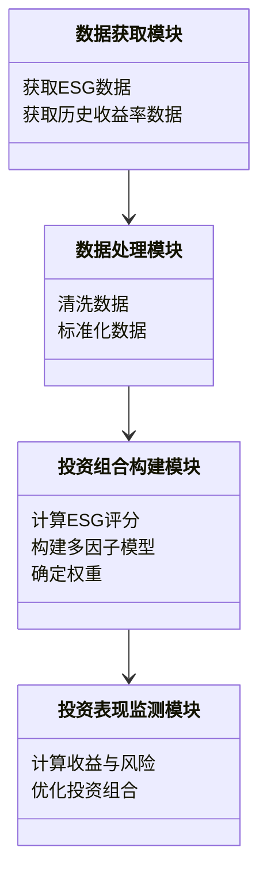
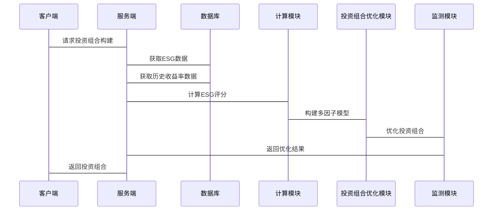

                 


# 《珍妮·沙德洛的可持续价值投资：ESG因素的整合》

**关键词**：可持续价值投资、ESG因素、环境、社会、治理、投资策略、风险管理

**摘要**：本文深入探讨了珍妮·沙德洛在可持续价值投资中的创新方法，重点分析了ESG（环境、社会、治理）因素的整合及其对投资决策的深远影响。文章详细解释了ESG的核心概念、整合的数学模型、系统架构，并通过实际案例展示了如何在投资中应用这些因素，以实现长期价值和风险管理。

---

# 第一部分: 可持续价值投资的背景与意义

## 第1章: 可持续价值投资的背景与概念

### 1.1 ESG因素的定义与内涵

#### 1.1.1 环境（Environmental）因素
环境因素关注企业在资源使用、碳排放、污染治理等方面的表现。以下是环境因素的关键指标：
- **资源使用效率**：企业是否有效利用自然资源。
- **碳排放**：企业温室气体排放量及其减少策略。
- **污染控制**：企业是否采取措施减少污染物排放。

#### 1.1.2 社会（Social）因素
社会因素关注企业在员工权益、社区参与、产品安全等方面的表现。以下是社会因素的关键指标：
- **员工权益**：员工的工资、工作条件和职业发展机会。
- **社区参与**：企业对社区的贡献，如教育、医疗和基础设施建设。
- **产品安全**：产品是否符合安全标准，对消费者的影响。

#### 1.1.3 治理（Governance）因素
治理因素关注企业在公司治理结构、透明度和合规性方面的表现。以下是治理因素的关键指标：
- **董事会结构**：董事会是否多元化，是否有独立董事。
- **透明度**：企业信息披露的及时性和完整性。
- **合规性**：企业是否遵守法律法规，避免重大违规行为。

### 1.2 ESG整合的背景与意义

#### 1.2.1 全球可持续发展的趋势
随着全球气候变化加剧，社会不平等和企业治理问题日益突出，投资者开始关注企业的长期可持续性。ESG整合不仅是对环境和社会负责，也是企业长期价值的体现。

#### 1.2.2 投资者对ESG的关注
越来越多的投资者意识到，ESG因素能够帮助识别企业的潜在风险和机会。例如，高碳排放企业可能面临政策风险，而员工权益保障良好的企业可能更具竞争力。

#### 1.2.3 ESG整合对企业的长期价值
通过整合ESG因素，企业可以提高声誉、降低风险、吸引可持续投资者，从而实现长期的财务回报和社会价值。

### 1.3 可持续价值投资的目标与挑战

#### 1.3.1 可持续价值投资的目标
可持续价值投资的目标是通过整合ESG因素，优化投资组合的风险调整后收益，同时推动社会和环境的可持续发展。

#### 1.3.2 ESG整合的主要挑战
- **数据获取难度**：ESG数据的质量和一致性问题。
- **计算复杂性**：整合ESG因素需要复杂的计算和模型。
- **市场认知不足**：部分投资者对ESG因素的重要性认识不足。

#### 1.3.3 解决方案与未来展望
通过技术创新和数据共享，可以解决ESG数据问题。同时，教育和宣传可以提高投资者对ESG因素的认识。未来，ESG整合将成为投资决策的核心部分，推动全球经济的可持续发展。

---

# 第二部分: ESG因素的核心概念与联系

## 第2章: ESG因素的核心概念与联系

### 2.1 ESG因素的核心概念

#### 2.1.1 环境因素的核心概念
环境因素关注企业在运营过程中对环境的影响。例如，某制造企业通过采用绿色技术减少碳排放，展示了其在环境方面的努力。

#### 2.1.2 社会因素的核心概念
社会因素关注企业在社会中的责任和影响。例如，某科技公司通过支持社区教育项目，展示了其在社会方面的贡献。

#### 2.1.3 治理因素的核心概念
治理因素关注企业的管理结构和决策过程。例如，某公司通过多元化董事会和独立董事，展示了其在治理方面的透明度和责任感。

### 2.2 ESG因素的属性特征对比

| **因素** | **属性**           | **描述**                                                                 |
|----------|------------------|--------------------------------------------------------------------------|
| 环境     | 资源使用效率       | 企业是否有效利用自然资源。                                             |
|          | 碳排放            | 企业温室气体排放量及其减少策略。                                       |
| 社会     | 员工权益          | 员工的工资、工作条件和职业发展机会。                                   |
|          | 社区参与          | 企业对社区的贡献，如教育、医疗和基础设施建设。                         |
| 治理     | 董事会结构        | 董事会是否多元化，是否有独立董事。                                     |
|          | 透明度            | 企业信息披露的及时性和完整性。                                       |

### 2.3 ESG因素的ER实体关系图

```mermaid
erDiagram
    actor 投资者 {
        <属性> 投资目标
        <属性> 风险偏好
    }
    actor 企业 {
        <属性> 环境表现
        <属性> 社会责任
        <属性> 治理结构
    }
    relation "评估" {
        投资者 --> 企业 : 评估企业ESG表现
    }
```

---

# 第三部分: 可持续价值投资的算法原理

## 第3章: 可持续价值投资的算法原理

### 3.1 多因子模型的原理

#### 3.1.1 多因子模型的定义
多因子模型是通过多个因子（如市场因子、规模因子、价值因子等）来解释股票收益的模型。在ESG整合中，我们添加ESG因子作为额外的因子。

#### 3.1.2 多因子模型的构建
以下是多因子模型的构建步骤：
1. 收集股票的历史收益率数据。
2. 收集相关的因子数据，包括ESG因子。
3. 使用回归分析确定每个因子的权重。
4. 构建投资组合，优化风险调整后的收益。

#### 3.1.3 多因子模型的优缺点
- **优点**：能够解释更多的收益来源，提高模型的准确性。
- **缺点**：需要大量的数据和复杂的计算，可能导致过拟合。

### 3.2 ESG因子的权重分配

#### 3.2.1 ESG因子权重的计算方法
ESG因子的权重可以通过回归分析或基于专家判断的方法确定。以下是回归分析的步骤：
1. 收集股票的ESG评分和历史收益率数据。
2. 使用回归模型确定ESG因子对收益的贡献。
3. 根据贡献程度确定权重。

#### 3.2.2 ESG因子权重的优化策略
为了优化权重，可以使用均值-方差优化或风险中性优化方法。以下是均值-方差优化的步骤：
1. 确定目标函数，如最大化收益或最小化风险。
2. 确定约束条件，如权重之和为1。
3. 使用优化算法求解最优权重。

### 3.2.3 代码实现与解读

#### 代码实现
```python
import pandas as pd
import numpy as np
from sklearn.linear_model import LinearRegression

# 假设我们有ESG评分和历史收益率数据
esg_scores = pd.read_csv('esg_scores.csv')
returns = pd.read_csv('returns.csv')

# 合并数据
data = pd.concat([esg_scores, returns], axis=1)

# 训练线性回归模型
model = LinearRegression()
model.fit(esg_scores[['环境', '社会', '治理']], returns['收益'])

# 输出系数
print('环境因子的系数:', model.coef_[0])
print('社会因子的系数:', model.coef_[1])
print('治理因子的系数:', model.coef_[2])
```

#### 代码解读
上述代码使用线性回归模型来确定ESG因子对收益的贡献。系数值越大，说明该因子对收益的影响越大。通过这些系数，可以初步确定每个因子的权重。

---

## 第4章: 可持续价值投资的系统架构设计

### 4.1 问题场景介绍
我们假设一个投资机构希望基于ESG因素构建一个可持续价值投资系统。系统需要实现以下功能：
1. 收集和处理ESG数据。
2. 计算ESG评分。
3. 构建投资组合。
4. 监测投资表现。

### 4.2 系统功能设计

#### 4.2.1 领域模型（Mermaid类图）


### 4.3 系统架构设计

#### 4.3.1 系统架构图（Mermaid架构图）


### 4.4 系统接口设计

#### 4.4.1 接口描述
- **API接口**：客户端通过API调用服务端接口。
- **数据库接口**：服务端与数据库交互，获取ESG数据和历史收益率数据。
- **计算接口**：计算模块调用优化算法，构建投资组合。

### 4.5 系统交互流程

#### 4.5.1 交互流程图（Mermaid序列图）


---

## 第5章: 可持续价值投资的项目实战

### 5.1 环境因子分析

#### 5.1.1 代码实现
```python
import pandas as pd
import matplotlib.pyplot as plt

# 假设我们有环境因子数据和历史收益率数据
环境因子 = pd.read_csv('环境因子.csv')
returns = pd.read_csv('returns.csv')

# 绘制环境因子与收益的关系图
plt.scatter(环境因子['碳排放'], returns['收益'])
plt.xlabel('碳排放')
plt.ylabel('收益')
plt.title('环境因子与收益的关系')
plt.show()
```

#### 5.1.2 代码解读
上述代码绘制了碳排放与收益的关系图，可以帮助我们识别环境因子对收益的影响。如果高碳排放企业收益较低，说明环境因子对企业收益有负面影响。

### 5.2 社会因子案例分析

#### 5.2.1 代码实现
```python
import pandas as pd
import statsmodels.api as sm

# 假设我们有社会因子数据和历史收益率数据
社会因子 = pd.read_csv('社会因子.csv')
returns = pd.read_csv('returns.csv')

# 使用多元线性回归模型分析社会因子对收益的影响
model = sm.OLS(returns['收益'], sm.add_constant(社会因子[['员工权益', '社区参与']]))
result = model.fit()
print(result.summary())
```

#### 5.2.2 代码解读
上述代码使用多元线性回归模型分析员工权益和社会参与对收益的影响。结果中的系数和p值可以帮助我们确定社会因子对收益的具体影响。

### 5.3 治理因子案例分析

#### 5.3.1 代码实现
```python
import pandas as pd
import numpy as np
from sklearn.linear_model import LinearRegression

# 假设我们有治理因子数据和历史收益率数据
治理因子 = pd.read_csv('治理因子.csv')
returns = pd.read_csv('returns.csv')

# 使用线性回归模型分析治理因子对收益的影响
model = LinearRegression()
model.fit(治理因子[['董事会结构', '透明度']], returns['收益'])

print('董事会结构的系数:', model.coef_[0])
print('透明度的系数:', model.coef_[1])
```

#### 5.3.2 代码解读
上述代码通过线性回归模型分析治理因子对收益的影响。系数值越大，说明该因子对收益的影响越大。

---

## 第6章: 可持续价值投资的总结与展望

### 6.1 总结
通过整合ESG因素，可持续价值投资不仅能够优化投资组合的风险调整后收益，还能够推动社会和环境的可持续发展。本文详细介绍了ESG的核心概念、整合的数学模型、系统架构，并通过实际案例展示了如何在投资中应用这些因素。

### 6.2 投资建议
投资者在进行可持续价值投资时，应选择那些在ESG方面表现良好的企业。同时，应关注企业的长期价值和风险，避免短期波动的影响。

### 6.3 注意事项
- **数据质量**：确保ESG数据的准确性和一致性。
- **模型选择**：根据实际情况选择合适的模型和方法。
- **风险管理**：定期监测和调整投资组合，降低潜在风险。

### 6.4 未来展望
随着技术的进步和数据的丰富，可持续价值投资将更加精准和高效。未来，我们可以利用人工智能和大数据技术，进一步优化ESG因子的整合和投资组合的构建。

---

# 作者：AI天才研究院/AI Genius Institute & 禅与计算机程序设计艺术 /Zen And The Art of Computer Programming

---

**感谢您的阅读！**

