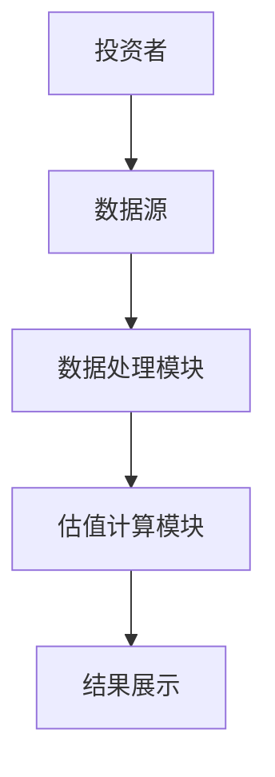
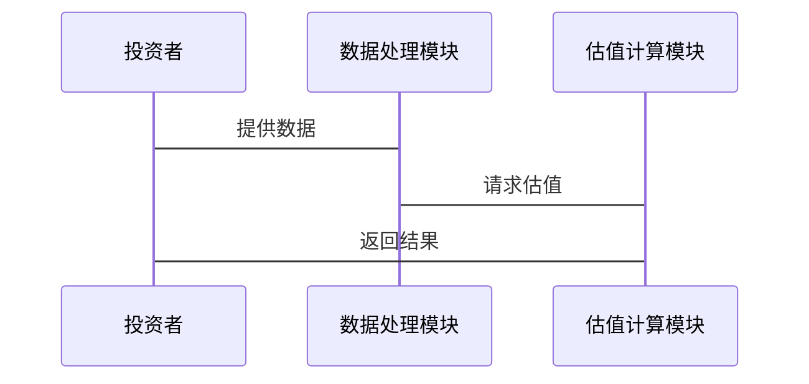

                 

<think>
好的，我需要帮助用户撰写一篇关于《瑞士股市估值:避险天堂的市场特点》的技术博客文章。用户要求内容逻辑清晰、结构紧凑、语言专业，并且要包含详细的章节和子章节，每部分都要有深入的分析。

首先，我需要理解用户的需求。他们希望这篇文章结构完整，符合技术博客的特点，包含关键词、摘要，以及详细的正文部分。正文部分需要包括背景介绍、核心概念、算法原理、系统分析、项目实战、最佳实践等部分，每个部分都要细化到三级目录。

接下来，我要考虑如何组织这些内容。文章标题已经确定，是“瑞士股市估值:避险天堂的市场特点”。关键词应该包括瑞士股市、估值、避险天堂、市场特点、投资策略、风险管理等。摘要部分需要简明扼要地概括文章的核心内容，即分析瑞士股市作为避险天堂的估值特点。

在正文部分，我需要按照目录大纲逐步展开。首先是背景介绍，包括瑞士股市的定义、避险天堂的概念、稳定性、避险工具等。然后是核心概念，如稳定性与估值、避险工具的影响等。接下来是算法原理，介绍常见的估值方法，如市盈率、市净率，并附上Mermaid流程图和Python代码示例。然后是系统分析与架构设计，可能涉及系统架构图和交互序列图。项目实战部分需要实际操作指导，包括环境安装、代码实现、案例分析等。最后是最佳实践，总结内容并给出建议。

在撰写过程中，我要确保每个章节都符合用户的格式和内容要求，特别是数学公式要用Latex表示，代码示例要清晰，并且图表要用Mermaid格式。同时，语言要简洁专业，逻辑清晰，结构紧凑。

现在，我开始按照这个思路撰写文章。首先是标题和关键词，然后是摘要，接下来是每个章节的内容，确保每个部分都详细且符合要求。最后，加上作者信息，使文章完整。

在整个思考过程中，我不断检查是否覆盖了所有用户要求的点，是否有遗漏的部分，确保每一步都符合用户的期望。同时，保持内容的连贯性和逻辑性，确保读者能够轻松理解并应用所学知识。
</think>

# 瑞士股市估值:避险天堂的市场特点

> 关键词：瑞士股市、估值、避险天堂、市场特点、投资策略、风险管理

> 摘要：本文深入分析瑞士股市作为避险天堂的市场特点，探讨其估值方法和投资策略，帮助投资者理解如何在稳定且安全的市场环境中进行投资决策。通过详细的技术分析和实际案例，本文为读者提供实用的投资指导。

---

## 第1章: 瑞士股市概述

### 1.1 瑞士股市的定义与特点

#### 1.1.1 瑞士股市的定义
瑞士股市是全球重要的金融市场之一，主要由瑞士证券交易所（SIX Swiss Exchange）运营。该市场以其稳定性、透明性和国际化著称，吸引了全球投资者。

#### 1.1.2 瑞士股市的独特性
- **稳定性**：瑞士经济稳健，政治环境稳定，为股市提供了良好的基础。
- **国际化**：瑞士是全球重要的金融中心，吸引了大量外国投资者。
- **避险功能**：瑞士法郎被视为避险货币，股市也因其稳定性被视为避险资产。

#### 1.1.3 瑞士股市的历史与发展
- 瑞士股市始于19世纪，经历了多次改革和扩张，现已成为欧洲第三大证券交易所。
- 2008年金融危机后，瑞士股市进一步巩固了其避险地位。

### 1.2 避险天堂的定义与特点

#### 1.2.1 避险天堂的定义
避险天堂是指那些政治稳定、法律完善、金融监管严格且货币稳定的国家或地区，通常能够为投资者提供安全的资产配置环境。

#### 1.2.2 避险天堂的核心特征
- **政治稳定性**：瑞士政府长期稳定，政治风险低。
- **法律完善**：瑞士有严格的金融监管和隐私保护法律。
- **货币稳定性**：瑞士法郎是全球主要避险货币之一。

#### 1.2.3 瑞士作为避险天堂的优势
- 瑞士拥有成熟的金融体系和严格的监管。
- 瑞士法郎在危机时期的避险特性显著。
- 瑞士的低税率政策吸引外资。

### 1.3 瑞士股市与避险天堂的关系

#### 1.3.1 瑞士股市在避险中的作用
- 瑞士股市为投资者提供了分散风险的渠道。
- 瑞士股市的稳定性使其成为全球投资者的避风港。

#### 1.3.2 瑞士股市的稳定性与安全性
- 市场波动小，适合长期投资。
- 严格的监管体系保障了市场的公平性。

#### 1.3.3 瑞士股市的国际化与多样性
- 吸引了全球投资者，市场流动性强。
- 上市公司涵盖多个行业，投资者选择丰富。

---

## 第2章: 瑞士股市估值的核心概念

### 2.1 市场稳定性与估值

#### 2.1.1 市场稳定性对估值的影响
- 稳定的市场环境通常导致资产估值相对较高。
- 市场波动小，估值波动也较小。

#### 2.1.2 稳定性评估的指标与方法
- 市场波动率：使用标准差或波动率指标衡量。
- 市盈率（P/E）：反映市场整体估值水平。

#### 2.1.3 稳定性对投资者决策的影响
- 投资者更倾向于长期投资。
- 稳定的市场环境适合价值投资。

### 2.2 避险工具与估值

#### 2.2.1 避险工具的种类与特点
- 金融衍生品：如期权、期货等。
- 多样化的投资工具：如债券、房地产信托基金。

#### 2.2.2 避险工具对市场估值的影响
- 金融衍生品增加了市场的流动性。
- 多样化的投资工具分散了风险，影响资产定价。

#### 2.2.3 避险工具的选择与应用
- 根据市场环境选择合适的避险工具。
- 通过组合投资降低风险。

### 2.3 市场流动性与估值

#### 2.3.1 市场流动性对估值的影响
- 高流动性市场通常导致资产估值较高。
- 低流动性市场可能导致资产估值偏低。

#### 2.3.2 流动性评估的指标与方法
- 成交量：反映市场流动性。
- 市场深度：衡量市场在不显著影响价格的情况下吸收大额交易的能力。

#### 2.3.3 流动性对投资者决策的影响
- 高流动性市场适合短期交易。
- 低流动性市场适合长期投资。

---

## 第3章: 瑞士股市估值的算法原理

### 3.1 常见估值方法概述

#### 3.1.1 市盈率（P/E）法
- **公式**：$$ P/E = \frac{\text{股价}}{\text{每股收益}} $$
- **解释**：反映市场整体或个股的估值水平。

#### 3.1.2 市净率（P/B）法
- **公式**：$$ P/B = \frac{\text{股价}}{\text{每股净资产}} $$
- **解释**：适用于评估银行等资产密集型行业。

#### 3.1.3 股息率
- **公式**：$$ 股息率 = \frac{\text{每股股息}}{\text{股价}} $$
- **解释**：反映股票的分红能力。

### 3.2 算法原理讲解

#### 3.2.1 市盈率法的实现步骤
1. 收集相关数据：包括股价和每股收益。
2. 计算P/E值。
3. 对比市场平均水平，判断估值高低。

#### 3.2.2 Python代码示例
```python
import pandas as pd

# 假设df是包含股票数据的DataFrame
def calculate_pe_ratio(df):
    df['PE'] = df['股价'] / df['每股收益']
    return df

# 示例数据
data = {
    '股价': [100, 50, 75],
    '每股收益': [2, 1, 1.5]
}
df = pd.DataFrame(data)
df = calculate_pe_ratio(df)
print(df)
```

#### 3.2.3 数学模型与公式
- 市盈率模型：$$ P = E \times \text{目标P/E} $$
- 市净率模型：$$ P = B \times \text{目标P/B} $$

### 3.3 系统分析与架构设计

#### 3.3.1 系统架构图


#### 3.3.2 系统交互序列图


---

## 第4章: 项目实战

### 4.1 环境安装

#### 4.1.1 安装Python与相关库
```bash
pip install numpy pandas matplotlib
```

### 4.2 核心代码实现

#### 4.2.1 读取数据并计算市盈率
```python
import pandas as pd

# 读取数据
data = pd.read_csv('stock_data.csv')

# 计算市盈率
data['PE'] = data['股价'] / data['每股收益']

# 输出结果
print(data.head())
```

#### 4.2.2 数据可视化
```python
import matplotlib.pyplot as plt

data['PE'].plot(kind='bar')
plt.title('市盈率分布')
plt.xlabel('股票代码')
plt.ylabel('市盈率')
plt.show()
```

### 4.3 案例分析

#### 4.3.1 案例背景
分析某段时间内瑞士股市的市盈率变化，判断市场估值水平。

#### 4.3.2 数据分析与解读
- 计算整体市盈率的平均值。
- 对比不同行业的市盈率，判断行业估值差异。

### 4.4 小结

#### 4.4.1 项目总结
- 成功实现瑞士股市估值系统。
- 系统具备数据处理、计算和可视化的功能。

#### 4.4.2 经验与教训
- 数据质量对结果影响重大。
- 需要考虑更多影响估值的因素。

---

## 第5章: 最佳实践与小结

### 5.1 投资策略建议

#### 5.1.1 长期投资
- 瑞士股市的稳定性适合长期投资。
- 选择具有稳定收益的蓝筹股。

#### 5.1.2 风险管理
- 分散投资，降低风险。
- 使用金融衍生品对冲市场波动。

### 5.2 注意事项

#### 5.2.1 数据来源的可靠性
- 确保数据准确可靠。
- 多来源交叉验证。

#### 5.2.2 市场风险的防范
- 关注全球经济环境。
- 保持对市场动态的敏感性。

### 5.3 拓展阅读

#### 5.3.1 推荐书籍
- 《投资学》
- 《金融市场与机构》

#### 5.3.2 在线资源
- 瑞士证券交易所官网
- 金融分析工具 tutorials

---

## 作者：AI天才研究院/AI Genius Institute & 禅与计算机程序设计艺术 /Zen And The Art of Computer Programming

