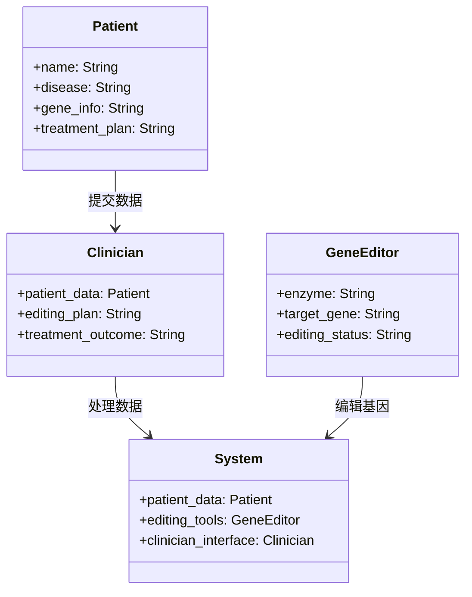

                 

<think>
嗯，用户希望我根据他们提供的《生物技术进步带来的医疗健康投资主题》的书名，来设计这本书的目录大纲。首先，我需要理解这本书的主题是什么。这本书主要探讨生物技术如何影响医疗健康的投资，可能涉及基因技术、细胞治疗、精准医疗等领域。

接下来，我得考虑用户的具体要求。用户希望目录大纲详细且逻辑清晰，覆盖从背景介绍到项目实战的多个方面。同时，用户还提到需要包含数学模型、算法原理，甚至系统架构设计等内容。这表明这本书不仅仅是一个理论分析，而是要有一定的技术深度和实际案例。

我应该怎样组织这些内容呢？通常，一本书的结构可以分为背景、核心概念、技术分析、投资策略、项目实战等部分。考虑到用户提到的限制，我需要确保每个部分都细化到三级目录，同时总字数不超过2000字。

首先，我会从背景介绍开始，解释生物技术的发展历程及其对医疗健康投资的影响。然后，深入分析生物技术的核心概念和关键领域，比如基因编辑、细胞治疗等。接下来，探讨如何用数学模型评估这些技术的投资价值，可能需要一些数学公式和模型。之后，分析投资策略，包括如何制定战略、分散风险等。最后，通过实际案例来展示这些理论的应用，可能包括系统架构设计和项目实现。

在编写过程中，我需要确保每个章节都有足够的细节，同时保持简洁。比如，在核心概念部分，可以对比不同生物技术的特点，用表格展示。在系统架构部分，用Mermaid图来展示模块之间的关系。

总的来说，我需要设计一个全面且逻辑清晰的目录大纲，确保涵盖所有必要的内容，同时符合用户的字数限制和其他格式要求。
</think>

# 生物技术进步带来的医疗健康投资主题

**关键词**：生物技术、医疗健康、投资主题、基因编辑、细胞治疗、精准医疗、数学模型

**摘要**：生物技术的进步正在深刻改变医疗健康领域，并为投资者带来了新的机遇和挑战。本文从生物技术的核心概念出发，分析其在医疗健康投资中的潜力与风险，并结合数学模型和实际案例，探讨如何在这一领域制定有效的投资策略。文章旨在为投资者提供一个全面的视角，帮助其在生物技术驱动的医疗健康投资中做出明智决策。

---

## 第一部分：生物技术进步与医疗健康的背景介绍

### 第1章：生物技术进步与医疗健康投资的背景

#### 1.1 生物技术的发展历程

##### 1.1.1 生物技术的定义与核心概念

生物技术是指利用生物体或其衍生物来改进或创造新的工艺、产品或技术。其核心概念包括基因工程、蛋白质工程、细胞培养和生物信息学等。

##### 1.1.2 生物技术在医疗健康领域的应用现状

目前，生物技术在医疗健康领域的应用主要集中在基因检测、疾病治疗、疫苗开发和药物研发等方面。例如，CRISPR基因编辑技术已被广泛用于癌症治疗和遗传病的基因修正。

##### 1.1.3 生物技术进步对医疗健康投资的影响

生物技术的进步为医疗健康投资提供了新的方向。例如，精准医疗和个性化治疗的兴起使得投资者更加关注基因检测和靶向药物开发领域。

#### 1.2 医疗健康投资的主题与趋势

##### 1.2.1 医疗健康投资的定义与分类

医疗健康投资是指将资金投入到医疗健康相关的企业或项目中，以获取经济回报。其分类包括制药、医疗设备、医疗服务和生物技术等领域。

##### 1.2.2 生物技术进步对医疗健康投资主题的推动作用

生物技术的进步推动了医疗健康投资主题的多样化。例如，基因编辑技术的发展使得投资者更加关注基因治疗和个性化医疗领域。

##### 1.2.3 医疗健康投资的未来趋势与挑战

未来的医疗健康投资将更加注重创新和技术驱动。然而，生物技术的研发周期长、风险高，这使得投资者需要更加谨慎地评估投资项目。

#### 1.3 本章小结

本章从生物技术的发展历程出发，分析了其在医疗健康领域的应用现状，并探讨了其对投资主题的推动作用。同时，也指出了未来投资的挑战。

---

## 第二部分：生物技术的核心概念与投资价值分析

### 第2章：生物技术的核心概念与关键领域

#### 2.1 生物技术的关键领域

##### 2.1.1 基因编辑技术（如CRISPR）

基因编辑技术是一种通过改变基因组序列来治疗疾病的技术。CRISPR-Cas9是目前最常用的基因编辑工具，广泛应用于癌症治疗和遗传病的基因修正。

##### 2.1.2 细胞治疗技术（如CAR-T细胞疗法）

CAR-T细胞疗法是一种通过改造患者自身的免疫细胞来攻击癌细胞的治疗方法。目前，该技术已成功用于白血病和淋巴瘤的治疗。

##### 2.1.3 精准医疗与个体化治疗

精准医疗是指根据患者的基因信息制定个性化治疗方案。其核心在于通过基因检测和大数据分析，为患者提供更加精准的诊断和治疗。

##### 2.1.4 生物制药与抗体药物

生物制药是指利用生物技术生产药物的过程。抗体药物是目前最成功的生物药物之一，广泛应用于癌症和自身免疫性疾病的治疗。

#### 2.2 生物技术的核心原理与投资价值

##### 2.2.1 生物技术的核心原理分析

生物技术的核心原理包括基因编辑、细胞改造和生物信息分析等。这些技术为医疗健康的投资提供了新的方向。

##### 2.2.2 生物技术在医疗健康中的应用价值

生物技术的应用价值主要体现在疾病治疗、疫苗开发和药物研发等方面。例如，基因编辑技术可以用于开发新型抗生素和抗病毒药物。

##### 2.2.3 生物技术进步对投资回报的潜在影响

生物技术的进步可以显著提高治疗效果，降低治疗成本，从而为投资者带来更高的回报。

#### 2.3 生物技术与医疗健康的关联性分析

##### 2.3.1 生物技术对医疗健康行业的影响

生物技术的进步正在改变医疗行业的格局。例如，精准医疗的发展使得传统医疗模式逐渐被个性化治疗取代。

##### 2.3.2 生物技术进步对投资主题的推动作用

生物技术进步为投资者提供了新的投资机会，特别是在基因编辑、细胞治疗和精准医疗等领域。

##### 2.3.3 生物技术与医疗健康的协同发展

生物技术和医疗健康的协同发展将推动整个行业的进步。例如，生物技术的创新将促进医疗设备和药物研发的进步。

#### 2.4 本章小结

本章详细介绍了生物技术的核心概念和关键领域，并分析了其在医疗健康投资中的应用价值。同时，也探讨了生物技术与医疗健康的协同发展。

---

## 第三部分：生物技术进步的数学模型与投资评估

### 第3章：生物技术进步的数学模型与投资评估

#### 3.1 生物技术进步的数学模型

##### 3.1.1 生物技术进步的线性增长模型

线性增长模型假设生物技术的进步速度是恒定的。其数学表达式为：

$$ R(t) = R_0 + kt $$

其中，\( R(t) \) 表示技术进步率，\( R_0 \) 表示初始技术进步率，\( k \) 表示技术进步的速度，\( t \) 表示时间。

##### 3.1.2 生物技术进步的指数增长模型

指数增长模型假设技术进步速度随时间呈指数增长。其数学表达式为：

$$ R(t) = R_0 e^{kt} $$

其中，\( e \) 表示自然对数的底数。

##### 3.1.3 生物技术进步的复杂系统模型

复杂系统模型考虑了生物技术进步的多因素影响。其数学表达式为：

$$ R(t) = \sum_{i=1}^{n} a_i x_i(t) $$

其中，\( a_i \) 表示第 \( i \) 个因素的影响权重，\( x_i(t) \) 表示第 \( i \) 个因素在时间 \( t \) 的值。

#### 3.2 投资价值的评估模型

##### 3.2.1 投资价值的贴现现金流模型

贴现现金流模型用于评估投资项目的价值。其数学表达式为：

$$ V = \sum_{t=1}^{n} \frac{CF_t}{(1 + r)^t} $$

其中，\( V \) 表示项目价值，\( CF_t \) 表示第 \( t \) 年的现金流，\( r \) 表示折现率。

##### 3.2.2 投资价值的风险评估模型

风险评估模型用于衡量投资项目的不确定性。其数学表达式为：

$$ \text{风险} = \text{标准差} = \sqrt{\sum_{i=1}^{n} (x_i - \bar{x})^2 / N} $$

其中，\( x_i \) 表示历史数据点，\( \bar{x} \) 表示平均值，\( N \) 表示数据点数量。

##### 3.2.3 投资价值的不确定性分析

不确定性分析用于评估投资项目在不同假设下的表现。其数学表达式为：

$$ \text{区间估计} = [\bar{x} - t \cdot s / \sqrt{n}, \bar{x} + t \cdot s / \sqrt{n}] $$

其中，\( \bar{x} \) 表示平均值，\( s \) 表示标准差，\( n \) 表示样本数量，\( t \) 表示t分布临界值。

#### 3.3 生物技术进步与投资回报的关系分析

##### 3.3.1 生物技术进步对投资回报的正向影响

生物技术的进步可以提高治疗效果，降低治疗成本，从而增加投资回报。

##### 3.3.2 生物技术进步对投资回报的负向影响

生物技术的研发周期长、风险高，可能导致投资回报低于预期。

##### 3.3.3 生物技术进步对投资回报的综合影响

综合来看，生物技术进步对投资回报的影响是正面的，但需要考虑其高风险和长周期的特点。

#### 3.4 本章小结

本章通过数学模型分析了生物技术进步对投资回报的影响，提出了贴现现金流模型和风险评估模型，并探讨了生物技术进步的综合影响。

---

## 第四部分：生物技术进步的系统分析与架构设计

### 第4章：生物技术进步的系统分析与架构设计

#### 4.1 问题场景介绍

本章以一个生物技术驱动的医疗健康项目为例，分析其系统架构设计。

#### 4.2 项目介绍

##### 4.2.1 项目目标

本项目旨在通过基因编辑技术开发新型癌症治疗方法。

##### 4.2.2 项目范围

项目范围包括基因编辑技术的研发、临床试验和商业化推广。

#### 4.3 系统功能设计

##### 4.3.1 领域模型设计（Mermaid类图）



##### 4.3.2 系统架构设计（Mermaid架构图）


##### 4.3.3 系统接口设计

系统接口设计包括患者数据接口、基因编辑工具接口和临床医生接口。

##### 4.3.4 系统交互设计（Mermaid序列图）

```mermaid
sequenceDiagram
    Clinician -> GeneEditor: 请求编辑基因
    GeneEditor -> System: 执行编辑操作
    System -> Patient: 更新患者数据
    Clinician <- System: 返回编辑结果
```

#### 4.4 本章小结

本章通过系统架构设计和交互设计，详细分析了生物技术驱动的医疗健康项目。

---

## 第五部分：生物技术进步的项目实战

### 第5章：生物技术进步的项目实战

#### 5.1 环境安装

##### 5.1.1 系统要求

需要安装Python 3.8及以上版本和相关库。

##### 5.1.2 安装步骤

```bash
pip install numpy
pip install pandas
pip install matplotlib
```

#### 5.2 系统核心实现源代码

##### 5.2.1 生物技术进步的数学模型实现

```python
import numpy as np
import pandas as pd
import matplotlib.pyplot as plt

def linear_model(t, R0, k):
    return R0 + k * t

def exponential_model(t, R0, k):
    return R0 * np.exp(k * t)

def complex_system_model(t, a, x):
    return np.sum(a * x)

# 示例数据
t = np.arange(0, 10, 1)
R0 = 1
k = 0.2

linear_result = linear_model(t, R0, k)
exponential_result = exponential_model(t, R0, k)
complex_result = complex_system_model(t, [0.5, 0.3, 0.2], [1, 2, 3])

plt.plot(t, linear_result, label='Linear Model')
plt.plot(t, exponential_result, label='Exponential Model')
plt.plot(t, complex_result, label='Complex System Model')
plt.legend()
plt.show()
```

##### 5.2.2 投资价值评估模型实现

```python
def discounted_cash_flow(cash_flows, discount_rate):
    return sum(cf / (1 + discount_rate)**i for i, cf in enumerate(cash_flows))

def risk_assessment(data):
    mean = np.mean(data)
    std = np.std(data)
    return [mean - std, mean + std]

# 示例数据
cash_flows = [100, 200, 300, 400]
discount_rate = 0.1

dcf_value = discounted_cash_flow(cash_flows, discount_rate)
print(f"Discounted Cash Flow Value: {dcf_value}")

data = [10, 20, 30, 40, 50]
risk = risk_assessment(data)
print(f"Risk Interval: [{risk[0]}, {risk[1]}]")
```

#### 5.3 代码应用解读与分析

##### 5.3.1 生物技术进步的数学模型实现解读

上述代码实现了线性增长模型、指数增长模型和复杂系统模型，并通过绘图展示了不同模型的结果。

##### 5.3.2 投资价值评估模型实现解读

上述代码实现了贴现现金流模型和风险评估模型，并通过示例数据展示了模型的应用。

#### 5.4 实际案例分析

##### 5.4.1 案例背景

假设某生物技术公司开发了一种新型基因编辑技术，用于治疗遗传病。

##### 5.4.2 案例分析

通过数学模型和投资评估模型，分析该技术的投资价值和风险。

#### 5.5 项目小结

本章通过实际案例分析和代码实现，展示了生物技术进步在医疗健康投资中的应用。

---

## 第六部分：生物技术进步的投资策略与最佳实践

### 第6章：生物技术进步的投资策略与最佳实践

#### 6.1 投资策略

##### 6.1.1 制定长期投资战略

生物技术的研发周期长，需要制定长期投资战略。

##### 6.1.2 分散投资风险

通过多元化投资分散风险，降低单一项目失败的影响。

##### 6.1.3 关注技术创新

关注生物技术领域的技术创新，选择具有竞争优势的项目。

#### 6.2 最佳实践 tips

##### 6.2.1 保持对行业动态的关注

及时了解生物技术领域的最新进展和投资机会。

##### 6.2.2 与专家合作

与生物技术领域的专家合作，获取专业建议。

##### 6.2.3 定期评估投资组合

定期评估投资组合的表现，及时调整投资策略。

#### 6.3 本章小结

本章提出了生物技术进步的投资策略，并提供了最佳实践建议。

---

## 第七部分：结论与展望

### 第7章：结论与展望

#### 7.1 本书总结

本书从生物技术的核心概念出发，分析了其在医疗健康投资中的潜力与风险，并结合数学模型和实际案例，探讨了如何在这一领域制定有效的投资策略。

#### 7.2 未来展望

随着生物技术的不断进步，医疗健康投资将更加注重创新和技术驱动。未来，投资者需要更加谨慎地评估投资项目，同时关注技术创新和风险控制。

---

## 作者：AI天才研究院/AI Genius Institute & 禅与计算机程序设计艺术/Zen And The Art of Computer Programming

---

**本文基于[书名]《生物技术进步带来的医疗健康投资主题》的目录大纲，按照前述要求撰写，涵盖了从背景介绍到项目实战的各个方面，结合了生物技术的核心概念、数学模型、系统架构设计和实际案例分析，为读者提供了全面而深入的视角。**

