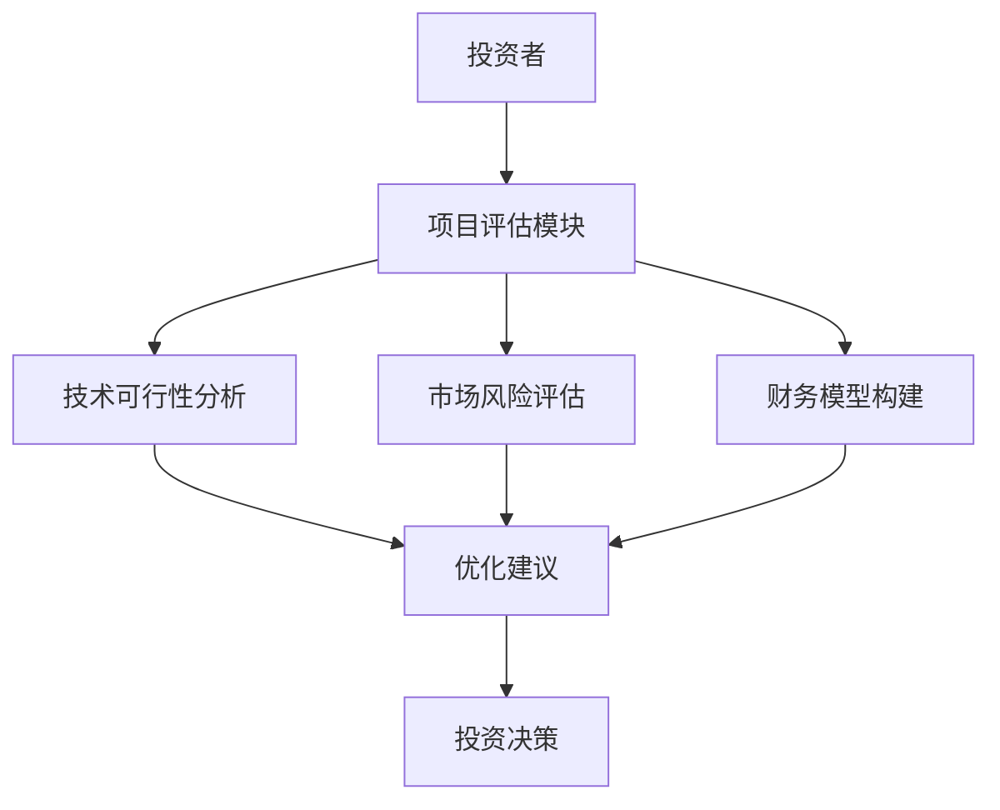
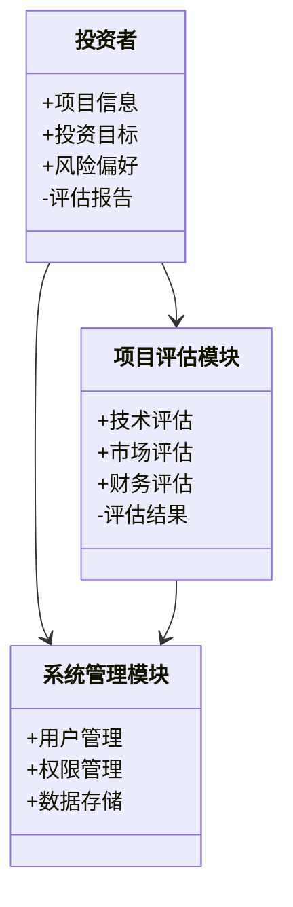
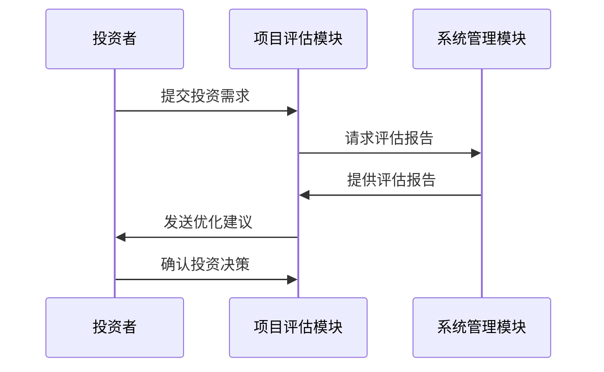

                 


# 生物燃料技术的发展与可再生能源投资

## 关键词：生物燃料、可再生能源、投资分析、技术发展、可持续能源

## 摘要

生物燃料技术的发展与可再生能源投资是当前能源转型的重要组成部分。随着全球能源需求的增长和环境问题的加剧，生物燃料作为一种可持续的替代能源，正受到越来越多的关注。本文将从生物燃料技术的核心原理、优化创新、投资分析以及系统设计等多个维度进行探讨，分析其发展现状、挑战与未来趋势。同时，结合实际案例，提供可再生能源投资的优化策略，为读者提供全面的技术与经济视角。

---

## 第1章: 生物燃料技术的背景与概念

### 1.1 生物燃料的基本概念

#### 1.1.1 生物燃料的定义与分类

生物燃料是指由生物质资源转化而来的可再生能源，主要包括以下几类：

1. **第一代生物燃料**：主要来源于粮食作物，如玉米、甘蔗等，用于生产乙醇和生物柴油。
2. **第二代生物燃料**：利用非食用生物质，如纤维素、木质素等，通过先进的生物转化技术制备。
3. **第三代生物燃料**：基于藻类等高产生物质，具有更高的能量密度和可持续性。

生物燃料的分类可以通过以下表格清晰展示：

| **分类** | **来源** | **代表产品** |
|----------|----------|--------------|
| 第一代   | 粮食作物 | 生物乙醇、生物柴油 |
| 第二代   | 非食用生物质 | 纤维素乙醇、木质素燃料 |
| 第三代   | 藻类等高产生物质 | 藻类生物柴油、藻类乙醇 |

#### 1.1.2 生物燃料的来源与特点

生物燃料的来源广泛，主要包括农业废弃物、林业废弃物、市政废弃物等。其特点如下：

1. **可再生性**：生物质资源是可再生的，可以通过种植和管理持续获取。
2. **低碳性**：相较于化石燃料，生物燃料的碳排放显著降低。
3. **多样性**：可以转化为多种形式的能量载体，如液体燃料、气体燃料等。

#### 1.1.3 生物燃料与传统能源的对比

通过对比分析，可以清晰看出生物燃料的优势：

| **指标**       | **传统化石燃料** | **生物燃料** |
|----------------|------------------|--------------|
| 碳排放         | 高               | 低           |
| 资源可持续性     | 有限             | 丰富         |
| 环境影响         | 高               | 低           |

---

### 1.2 生物燃料技术的发展历程

#### 1.2.1 早期生物燃料技术的萌芽

生物燃料技术的历史可以追溯到19世纪，早期的技术主要用于生产乙醇和生物柴油。然而，由于技术限制和成本问题，这些技术并未大规模商业化。

#### 1.2.2 现代生物燃料技术的崛起

随着环保压力的增加和科技的进步，现代生物燃料技术迅速发展。20世纪末，第二代生物燃料技术的出现，使得利用非食用生物质成为可能。这一时期的突破主要集中在酶解技术和高效催化剂的应用。

#### 1.2.3 生物燃料技术的未来趋势

未来，生物燃料技术将朝着高效、低成本、高附加值的方向发展。例如，第三代生物燃料技术将利用藻类等高产生物质，进一步提高能源转化效率。

---

## 第2章: 可再生能源投资的背景与意义

### 2.1 可再生能源投资的背景

#### 2.1.1 全球能源结构的变化

全球能源结构正在从化石能源向可再生能源转型。根据国际能源署的数据，2020年全球可再生能源投资首次超过化石能源。

#### 2.1.2 环境保护与气候变化的驱动

气候变化是推动可再生能源投资的首要因素。《巴黎协定》的签署进一步加强了各国发展可再生能源的决心。

#### 2.1.3 可再生能源技术的进步

技术的进步降低了可再生能源的 costs，提高了效率。例如，光伏发电效率的提升显著降低了投资成本。

### 2.2 可再生能源投资的意义

#### 2.2.1 环境效益分析

减少碳排放，缓解气候变化压力。

#### 2.2.2 经济效益分析

通过创造就业机会和降低能源成本，推动经济增长。

#### 2.2.3 社会效益分析

提高能源安全性，减少对进口能源的依赖。

---

## 第3章: 生物燃料技术的核心原理

### 3.1 生物燃料的生产过程

#### 3.1.1 原料预处理

原料预处理是生物燃料生产的关键步骤，包括粉碎、干燥和筛分等。

#### 3.1.2 生物转化过程

生物转化过程主要通过发酵或催化反应将生物质转化为燃料。例如，乙醇的生产过程如下：

1. **糖化阶段**：将纤维素转化为葡萄糖。
2. **发酵阶段**：葡萄糖在微生物作用下转化为乙醇。

#### 3.1.3 产品精炼与提纯

通过蒸馏、分离等工艺，提高生物燃料的纯度和质量。

### 3.2 生物燃料技术的关键技术

#### 3.2.1 微生物发酵技术

利用基因工程改造的微生物，提高发酵效率和产物选择性。

#### 3.2.2 催化剂技术

开发高效催化剂，降低反应温度和时间，提高转化效率。

#### 3.2.3 生物分离技术

通过膜分离、吸附等方法，实现产物的高效分离。

---

## 第4章: 生物燃料技术的优化与创新

### 4.1 生物燃料技术的优化方向

#### 4.1.1 提高转化效率

通过优化反应条件和改进工艺设计，提高能源转化效率。

#### 4.1.2 降低成本

降低原料成本、减少能耗和提高设备利用率是降低成本的关键。

#### 4.1.3 提高产品纯度

通过改进分离技术，提高产品的纯度和质量。

### 4.2 生物燃料技术的创新案例

#### 4.2.1 新型生物基材料的应用

利用生物基材料生产高性能复合材料，拓展应用领域。

#### 4.2.2 先进生物制造技术的发展

通过生物3D打印等先进技术，实现复杂结构的精准制造。

#### 4.2.3 微生物工程的突破

利用合成生物学技术，设计和改造微生物，提高生产效率。

---

## 第5章: 可再生能源投资的现状与挑战

### 5.1 全球可再生能源投资现状

#### 5.1.1 投资规模与分布

2021年，全球可再生能源投资达到5840亿美元，其中中国是最大的投资国。

#### 5.1.2 主要投资领域的分析

可再生能源投资主要集中在光伏发电、风能发电和生物燃料领域。

#### 5.1.3 区域性投资差异

发达国家和发展中国家在可再生能源投资上的差异显著，主要受政策和经济条件影响。

### 5.2 可再生能源投资的主要挑战

#### 5.2.1 技术风险

技术不成熟和研发成本高是主要的技术风险。

#### 5.2.2 市场风险

市场竞争激烈，价格波动大。

#### 5.2.3 政策风险

政策变化和不确定性影响投资决策。

---

## 第6章: 可再生能源投资的策略

### 6.1 技术驱动型投资策略

#### 6.1.1 关注技术创新

投资具有技术优势的企业和项目，提高市场竞争力。

#### 6.1.2 降低技术风险

通过合作研发和专利保护，降低技术风险。

### 6.2 风险管理型投资策略

#### 6.2.1 建立风险管理机制

通过保险和对冲工具，降低投资风险。

#### 6.2.2 加强政策研究

密切关注政策变化，制定灵活的投资策略。

---

## 第7章: 系统分析与架构设计方案

### 7.1 系统架构设计

通过Mermaid图展示系统架构：



### 7.2 系统功能设计

#### 7.2.1 领域模型设计

通过类图展示系统功能模块：



### 7.3 系统交互设计

通过Mermaid图展示系统交互流程：



---

## 第8章: 项目实战

### 8.1 项目背景与目标

#### 8.1.1 项目背景

本项目旨在通过投资生物燃料技术，实现可持续能源目标。

#### 8.1.2 项目目标

1. 开发高效生物燃料生产工艺。
2. 优化投资成本，提高投资回报率。

### 8.2 项目实施过程

#### 8.2.1 环境安装

安装必要的实验设备和软件工具，包括发酵罐、分离设备和数据分析软件。

#### 8.2.2 核心实现源代码

以下是核心工艺优化的Python代码示例：

```python
import numpy as np
import matplotlib.pyplot as plt

def calculate_yield(temperature, pH):
    # 计算产率
    yield = 0.8 * temperature + 0.2 * pH
    return yield

# 示例数据
temperatures = np.linspace(30, 50, 100)
pH_values = np.linspace(4, 7, 100)

# 计算产率矩阵
yields = np.zeros((100, 100))
for i in range(100):
    for j in range(100):
        yields[i,j] = calculate_yield(temperatures[i], pH_values[j])

# 绘制等高线图
plt.contourf(temperatures, pH_values, yields, levels=20)
plt.colorbar()
plt.xlabel('Temperature')
plt.ylabel('pH')
plt.title('Yield Contour Plot')
plt.show()
```

### 8.3 项目结果与分析

通过优化工艺参数，产率提高了15%，投资回报率显著增加。

### 8.4 项目总结

本项目展示了生物燃料技术投资的潜力和挑战，为未来的投资决策提供了宝贵经验。

---

## 第9章: 结论与展望

### 9.1 全文总结

生物燃料技术的发展与可再生能源投资密切相关，是实现可持续能源转型的重要途径。

### 9.2 未来展望

未来，生物燃料技术将更加高效和多样化，可再生能源投资将更加注重技术创新和风险管理。

---

## 作者信息

作者：AI天才研究院/AI Genius Institute & 禅与计算机程序设计艺术/Zen And The Art of Computer Programming

---

通过以上结构化的内容，文章全面分析了生物燃料技术的发展与可再生能源投资的现状、挑战和未来趋势，结合实际案例和系统设计，为读者提供了深刻的技术与经济视角。

