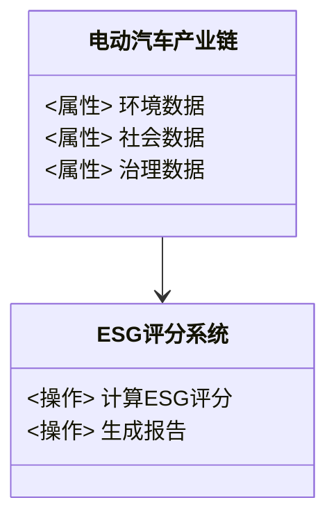

                 


# 电动汽车产业链的ESG投资机会分析

## 关键词
电动汽车产业链, ESG投资, 可持续发展, 环境影响, 社会责任, 公司治理

## 摘要
本文分析了电动汽车产业链中的环境、社会和治理因素，探讨了ESG投资的机会与挑战。通过详细分析产业链各环节的ESG影响，构建了评分模型，并提出了投资策略，帮助投资者抓住ESG带来的价值。

---

# 第一部分: 电动汽车产业链的ESG投资背景与核心概念

## 第1章: 电动汽车产业链的背景与发展趋势

### 1.1 电动汽车产业链的定义与结构

#### 1.1.1 电动汽车产业链的定义
电动汽车产业链由上游（原材料）、中游（电池、电机等）和下游（整车、充电设施）构成，涵盖从生产到使用的全生命周期。

#### 1.1.2 产业链的上游、中游、下游结构
- **上游**: 矿产资源（锂、镍）、电池材料。
- **中游**: 电池生产、电机制造。
- **下游**: 整车制造、充电站。

#### 1.1.3 产业链的核心驱动因素
技术进步、政策支持和市场需求推动产业发展。

### 1.2 ESG投资的定义与重要性

#### 1.2.1 ESG的定义与内涵
ESG关注环境、社会和治理因素，帮助评估企业非财务表现。

#### 1.2.2 ESG投资的核心理念
通过整合ESG因素，降低风险，提升长期收益。

#### 1.2.3 ESG在投资中的作用与价值
ESG投资有助于优化投资组合，提高抗风险能力。

### 1.3 电动汽车产业链与ESG投资的结合

#### 1.3.1 电动汽车产业的可持续发展趋势
电动化减少碳排放，符合全球环保目标。

#### 1.3.2 ESG投资在电动汽车产业链中的必要性
产业链涉及高污染和劳动问题，ESG可降低风险。

#### 1.3.3 产业链各环节的ESG影响分析
- 环境: 上游资源开采的环境影响。
- 社会: 下游充电设施的社会效益。
- 治理: 中游企业的管理效率。

---

## 第2章: 电动汽车产业链的ESG核心概念与联系

### 2.1 ESG核心概念的原理分析

#### 2.1.1 环境（E）的内涵与外延
环境因素包括碳排放、资源消耗，影响企业的长期成本。

#### 2.1.2 社会（S）的内涵与外延
社会因素关注劳工权益和社区影响，关系到企业的社会形象。

#### 2.1.3 治理（G）的内涵与外延
治理因素涉及公司治理结构和风险管理，影响企业的稳定性和透明度。

### 2.2 ESG核心概念的对比分析

#### 2.2.1 环境、社会、治理的对比表格

| 因素 | 环境（E） | 社会（S） | 治理（G） |
|------|------------|------------|------------|
| 关注点 | 碳排放、资源 | 劳工权益、社区 | 股东结构、管理层 |
| 影响 | 环境风险 | 社会责任 | 治理效率 |

#### 2.2.2 产业链各环节的ESG属性特征

- 上游: 高环境影响，需关注资源开采的可持续性。
- 中游: 高治理要求，需优化生产流程。
- 下游: 高社会影响，需提升充电设施的公平性。

#### 2.2.3 ESG核心概念的ER实体关系图

```mermaid
erDiagram
    actor 投资者 {
        <属性> 环境影响
        <属性> 社会影响
        <属性> 治理结构
    }
    actor 电动汽车产业链 {
        <属性> 上游资源
        <属性> 中游制造
        <属性> 下游应用
    }
    investor o-[:评估]{ESG评分}
    ESG评分 --> 产业链环节
```

### 2.3 ESG核心概念的系统架构设计



---

## 第3章: 电动汽车产业链的ESG评分模型与算法

### 3.1 ESG评分模型的原理

#### 3.1.1 ESG评分模型的输入与输出
- 输入: 各环节的ESG指标。
- 输出: 综合ESG评分。

#### 3.1.2 ESG评分的核心算法
加权评分法，根据各维度的重要性分配权重。

#### 3.1.3 ESG评分的权重分配
- 环境: 40%
- 社会: 30%
- 治理: 30%

### 3.2 ESG评分算法的数学模型

#### 3.2.1 ESG评分的公式推导
$$ ESG\_score = 0.4E + 0.3S + 0.3G $$

#### 3.2.2 ESG评分的计算流程

1. 收集各环节的ESG指标。
2. 计算各维度评分。
3. 加权求和，得到总分。

#### 3.2.3 ESG评分的验证与优化
通过历史数据验证模型准确性，调整权重以优化结果。

### 3.3 ESG评分算法的实战应用

#### 3.3.1 算法实现的Python代码

```python
def calculate_esg_score(e, s, g, alpha=0.4, beta=0.3):
    return alpha * e + beta * s + (1 - alpha - beta) * g

# 示例数据
e = 80
s = 70
g = 85
score = calculate_esg_score(e, s, g)
print(f"ESG评分: {score}")
```

#### 3.3.2 代码应用解读与分析
根据输入的E、S、G评分，计算加权总分，帮助投资者评估企业。

#### 3.3.3 实际案例分析
分析某电池制造商的ESG评分，识别潜在投资机会。

---

## 第4章: 电动汽车产业链的ESG投资策略与实践

### 4.1 ESG投资策略的制定

#### 4.1.1 投资目标与范围
根据ESG评分，选择高评分企业。

#### 4.1.2 投资组合的优化
平衡不同环节的ESG表现，分散风险。

### 4.2 ESG投资策略的实施步骤

#### 4.2.1 数据收集与分析
收集产业链各环节的ESG数据，进行对比分析。

#### 4.2.2 风险评估与管理
识别潜在风险，制定应对措施。

### 4.3 ESG投资策略的实战应用

#### 4.3.1 投资组合的构建
选择上游、中游、下游的高ESG企业。

#### 4.3.2 投资组合的优化
动态调整投资组合，跟踪ESG表现。

#### 4.3.3 投资组合的监控与评估
定期评估投资效果，优化策略。

---

## 第5章: 电动汽车产业链的ESG投资未来趋势与挑战

### 5.1 未来趋势分析

#### 5.1.1 技术进步的影响
新技术将降低环境影响，提升治理效率。

#### 5.1.2 政策变化的影响
政府政策将推动ESG投资的发展。

#### 5.1.3 市场趋势的影响
ESG投资将吸引更多资本，推动产业发展。

### 5.2 未来挑战分析

#### 5.2.1 技术与政策的不确定性
技术瓶颈和政策变化可能影响投资回报。

#### 5.2.2 数据与信息的不透明
部分企业ESG数据披露不完整，影响评估。

#### 5.2.3 全球化与本地化的冲突
全球化产业链与本地政策的协调问题。

### 5.3 应对策略与建议

#### 5.3.1 加强数据分析能力
利用大数据技术提升ESG评估的准确性。

#### 5.3.2 加强政策研究
及时跟踪政策变化，调整投资策略。

#### 5.3.3 加强国际合作
推动全球ESG标准的统一，降低风险。

---

# 结语

电动汽车产业链的ESG投资具有广阔前景，但也面临挑战。投资者需结合技术、政策和市场趋势，制定科学的投资策略，抓住ESG带来的投资机会。

---

# 作者

作者：AI天才研究院/AI Genius Institute & 禅与计算机程序设计艺术 /Zen And The Art of Computer Programming

---

# 参考文献

（此处列出相关的学术论文、书籍和报告等参考文献。）

