                 

<think>
嗯，用户现在需要一篇关于《知识图谱在金融实体关系挖掘中的应用》的技术博客文章，而且已经给出了详细的目录大纲。用户希望我按照这个大纲来撰写内容，每章都详细展开，确保每部分都有足够的深度和清晰的逻辑。

首先，我应该先理解每一章的内容。第一章是背景和概念，我需要解释知识图谱的基本概念，以及它在金融领域的具体应用。要确保这部分内容浅显易懂，适合技术读者理解。

接下来是第二章，关于知识图谱的结构和建模。这里需要详细讨论实体识别、关系抽取以及属性处理的技术，可能还需要一些表格和ER图来帮助理解。

第三章涉及算法原理，尤其是CRF和LSTM的应用。我需要用数学公式和Python代码来解释这些算法，同时用实例来说明它们在实体识别和关系抽取中的应用。

第四章则是语义网络分析，这部分比较复杂，需要讲解图结构分析、语义相似度计算以及推理算法。我可能需要用一些图表来展示这些过程，帮助读者更好地理解。

第五章是系统分析与架构设计，这部分需要分析项目背景，设计系统功能，可能还要用到领域模型和架构图。接口和交互设计也是关键，可能需要用序列图来展示。

项目实战部分需要指导读者如何安装环境，编写核心代码，并通过案例分析来巩固所学内容。最后，总结最佳实践，包括小结、注意事项和拓展阅读，帮助读者进一步深入。

总的来说，我需要确保每部分内容详实，逻辑清晰，并且符合用户的技术背景。同时，使用吸引人的章节标题，保持文章结构紧凑，语言专业但易懂。现在，我应该按照这个思路，逐一撰写每章内容，确保涵盖所有必要的细节和实例。
</think>

# 知识图谱在金融实体关系挖掘中的应用

---

## 关键词：
知识图谱、实体关系挖掘、金融领域、自然语言处理、深度学习、图结构、语义网络

---

## 摘要：
知识图谱是一种通过结构化数据和语义网络来表示知识的图谱，其在金融领域的实体关系挖掘中具有重要的应用价值。本文从知识图谱的基本概念出发，详细探讨了其在金融实体关系挖掘中的核心算法、系统架构及应用场景。通过分析实体识别、关系抽取、语义相似度计算等关键步骤，结合深度学习和自然语言处理技术，展示了知识图谱如何在金融领域构建高效的知识网络，并为金融风险控制、智能投资决策等提供支持。本文还通过实际案例分析，展示了知识图谱在金融实体关系挖掘中的具体应用，并提出了未来的研究方向。

---

## 第1章: 知识图谱的背景与概念

### 1.1 知识图谱的定义与核心概念
知识图谱是一种以图结构形式表示知识的网络，由实体（节点）、关系（边）和属性（节点的附加信息）构成。实体可以是具体的金融主体（如公司、机构、金融产品等），关系描述了实体之间的关联（如“属于”、“投资”、“控股”等），属性则进一步丰富了实体的语义信息（如公司成立时间、注册资本等）。

#### 图1-1: 知识图谱的基本结构
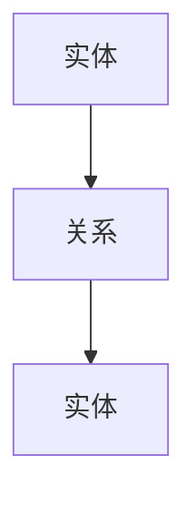

### 1.2 金融实体关系挖掘的背景与意义
金融领域的数据具有复杂性、多样性和动态性特点。实体关系挖掘的目标是从非结构化文本（如新闻、报告、公告等）中提取实体及其关系，构建金融知识图谱。这种图谱能够帮助金融机构进行风险评估、投资决策、合规监管等。

#### 图1-2: 金融实体关系挖掘的应用场景
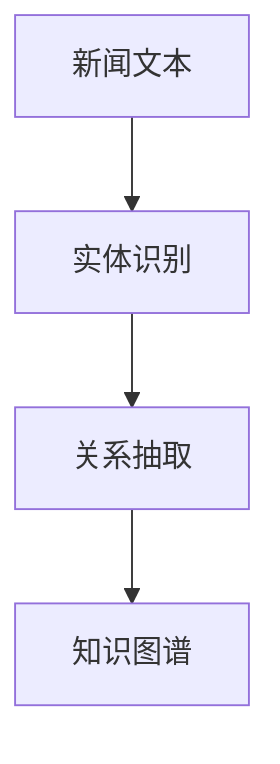

### 1.3 本章小结
本章介绍了知识图谱的基本概念及其在金融领域的应用场景，为后续章节奠定了理论基础。

---

## 第2章: 知识图谱的结构与建模

### 2.1 知识图谱的结构化建模
知识图谱的建模过程包括实体识别、关系抽取和属性扩展三个主要步骤。

#### 表2-1: 实体与关系的对比
| 属性 | 实体 | 关系 |
|------|------|------|
| 定义 | 具体的概念或对象 | 描述实体之间关联的语义关系 |
| 示例 | 公司、机构、金融产品 | 投资、控股、并购 |

#### 图2-1: 实体关系的ER图
```mermaid
erd
    Customer (客户)
    Company (公司)
    Investment (投资关系)
    customer -> investment: 投资于
    company -> investment: 被投资
```

### 2.2 知识图谱的语义网络表示
知识图谱通过图结构表示实体之间的语义关系，支持复杂的语义查询和推理。例如，可以通过图遍历算法计算实体之间的相似度或关联性。

#### 图2-2: 知识图谱的语义网络
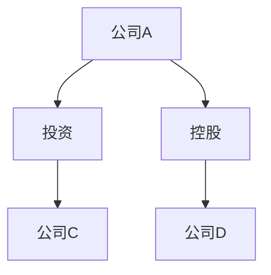

### 2.3 知识图谱的构建流程与挑战
构建知识图谱需要处理数据来源多样、实体歧义、关系复杂等挑战。通过预处理、清洗和特征提取，可以提高实体识别和关系抽取的准确性。

#### 图2-3: 知识图谱构建流程
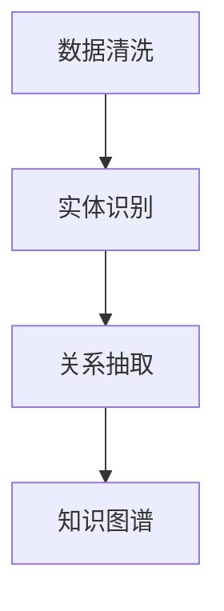

---

## 第3章: 实体识别与关系抽取的核心算法

### 3.1 实体识别算法原理
实体识别是通过自然语言处理技术从文本中提取特定实体的过程。常用算法包括基于规则的识别、统计学习模型（如CRF）和深度学习模型（如LSTM）。

#### 图3-1: 基于CRF的实体识别流程
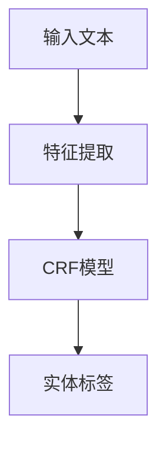

#### 代码示例
```python
import numpy as np
from sklearn_crfsuite import CRF

# 示例数据
X = [...]  # 特征向量
y = [...]  # 标签

# 模型训练
model = CRF()
model.fit(X, y)

# 预测
test_X = [...]  # 测试数据
test_y = model.predict(test_X)
```

### 3.2 关系抽取算法原理
关系抽取旨在识别文本中实体之间的关系。常用算法包括基于规则的抽取、统计学习模型（如CRF）和深度学习模型（如RCNN）。

#### 图3-2: 基于RCNN的关系抽取流程
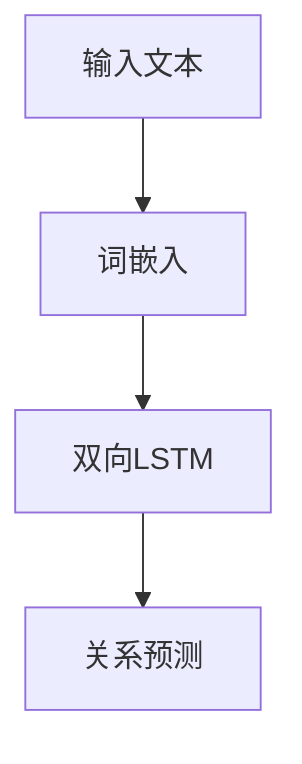

#### 代码示例
```python
import tensorflow as tf
from tensorflow.keras import layers

# 示例数据
input_text = Input(shape=(None,))  # 输入文本
embedding = layers.Embedding(...)(input_text)
 lstm_forward = layers.LSTM(...)(embedding)
 lstm_backward = layers.LSTM(...)(embedding[::-1])
 merged = layers.concatenate([lstm_forward, lstm_backward])
 dense = layers.Dense(2, activation='softmax')(merged)

model = Model(inputs=input_text, outputs=dense)
model.compile(...)
model.fit(...)
```

### 3.3 算法实现的Python代码示例
- 实体识别的CRF模型实现
- 关系抽取的RCNN模型实现

---

## 第4章: 知识图谱的语义网络分析

### 4.1 知识图谱的图结构分析
知识图谱的图结构分析包括网络特征提取（如度分布、路径长度）和可视化探索。

#### 图4-1: 知识图谱的可视化
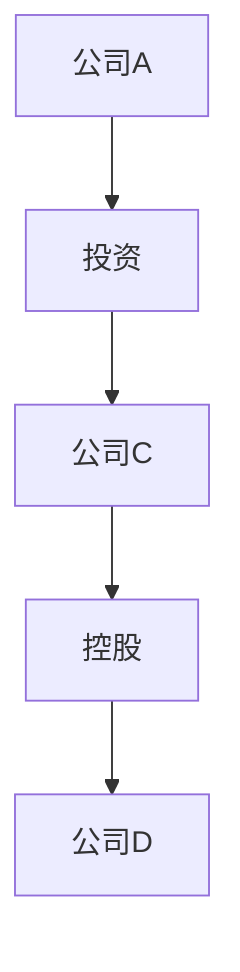

### 4.2 知识图谱的语义相似度计算
语义相似度计算可以通过向量空间模型（如Word2Vec）或知识图谱中的路径相似性来实现。

#### 图4-2: 语义相似度计算流程
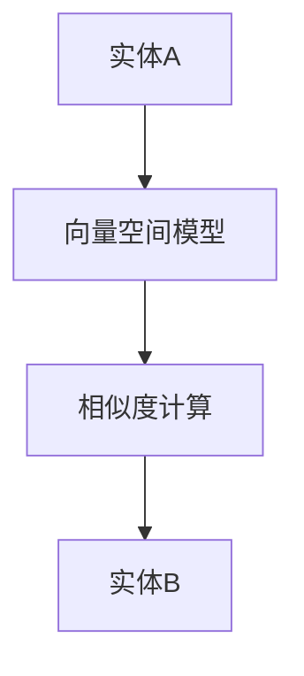

### 4.3 知识图谱的推理与应用
知识图谱支持基于规则的推理（如RDFS、OWL）和基于深度学习的推理（如Graph Neural Networks）。

#### 图4-3: 基于GNN的推理流程
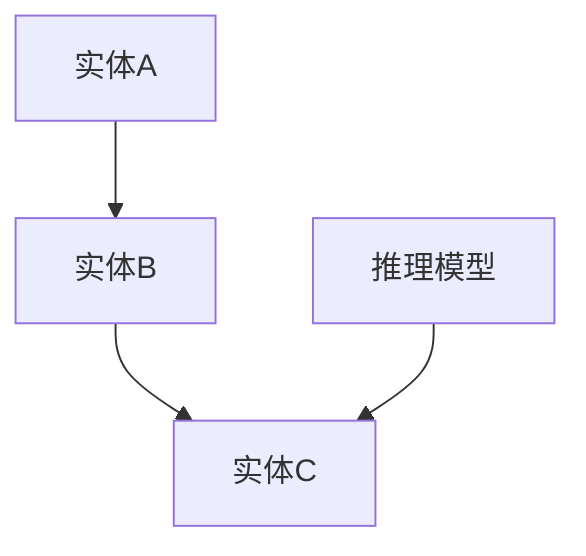

---

## 第5章: 金融实体关系挖掘系统分析

### 5.1 项目背景与目标
本项目旨在构建一个金融知识图谱，支持金融实体的识别、关系抽取和语义分析。

#### 图5-1: 项目功能模块
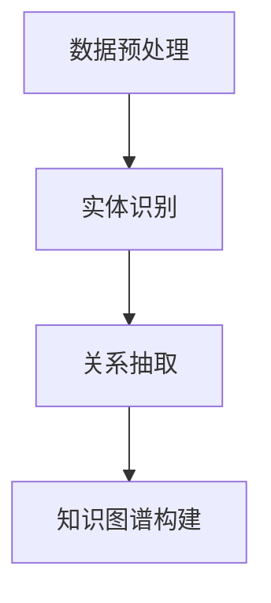

### 5.2 系统架构设计
系统架构包括数据层、算法层、知识图谱层和应用层。

#### 图5-2: 系统架构图


### 5.3 系统接口与交互设计
系统接口包括数据接口、算法接口和知识图谱接口。

#### 图5-3: 系统交互流程
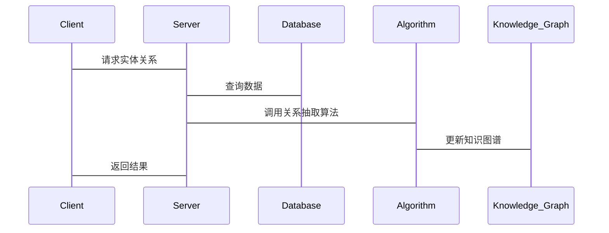

---

## 第6章: 项目实战与案例分析

### 6.1 环境安装与配置
- 安装Python、TensorFlow、CRF等依赖库
- 数据预处理与清洗

### 6.2 核心代码实现
- 实体识别的CRF模型实现
- 关系抽取的RCNN模型实现

### 6.3 案例分析与结果展示
- 实体识别结果展示
- 关系抽取结果展示
- 知识图谱构建与可视化

### 6.4 项目小结
总结项目实现的关键步骤和成果。

---

## 第7章: 最佳实践与未来展望

### 7.1 小结
总结本文的主要内容和研究成果。

### 7.2 注意事项
- 数据质量对实体识别和关系抽取的影响
- 知识图谱的动态更新与维护
- 模型的可解释性和鲁棒性

### 7.3 拓展阅读
推荐相关领域的优秀书籍和论文。

---

## 作者：AI天才研究院/AI Genius Institute & 禅与计算机程序设计艺术 /Zen And The Art of Computer Programming

