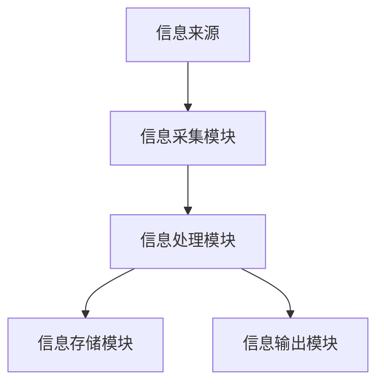

                 


# 确认偏误：如何避免选择性接受信息

> 关键词：确认偏误, 信息处理, 认知偏差, 算法推荐, 系统设计

> 摘要：确认偏误是指人们倾向于寻找和接受与自己已有观点一致的信息，而忽略或排斥相反的信息。本文从确认偏误的定义、背景、核心概念、算法原理、系统设计、项目实战等方面，详细探讨了如何识别和避免确认偏误，并提出了相应的解决方案和最佳实践。

---

## 第一部分：确认偏误的背景与概念

### 第1章：确认偏误的定义与背景

#### 1.1 确认偏误的定义
确认偏误（Confirmation Bias）是指人们在处理信息时，倾向于寻找、解释和记住与自己已有观点、信念或假设一致的信息，而忽略或排斥与之不一致的信息。这种偏误会影响我们的决策、判断和学习过程，尤其是在信息爆炸的时代，确认偏误可能导致片面的认知和错误的决策。

#### 1.2 确认偏误的背景
在当今信息爆炸的时代，每天都有海量的信息涌入我们的视野。人们每天接触的信息量巨大，但注意力和认知资源是有限的，因此大脑倾向于优先处理与已有认知相符的信息，以减少认知负荷。然而，这种倾向可能导致以下问题：
- **信息过滤泡**：人们只关注与自己观点一致的信息，导致视野受限。
- **决策失误**：基于片面信息做出的决策可能偏离事实。
- **社会对立**：不同观点的人群因缺乏信息交流而产生对立。

---

### 第2章：确认偏误的核心概念

#### 2.1 确认偏误的核心要素
确认偏误的核心在于信息的选择性处理，具体表现为以下几点：
- **信息选择性接受**：人们倾向于接受与自己观点一致的信息，而忽略相反的信息。
- **信息选择性解释**：人们倾向于用自己的已有认知来解释新信息，忽略或歪曲与已有观点不一致的细节。
- **信息选择性记忆**：人们更容易记住与自己观点一致的信息，而遗忘或扭曲与之不一致的记忆。

#### 2.2 确认偏误与其他认知偏误的联系
确认偏误与其他认知偏误密切相关，例如：
- **选择性注意**：人们更关注与自己观点一致的刺激，而忽略其他信息。
- **从众心理**：人们倾向于接受多数人的观点，以减少与群体的冲突。
- **自我一致性偏误**：人们倾向于维持自我形象和一致性，从而影响信息处理。

---

## 第二部分：确认偏误的算法原理与系统设计

### 第3章：确认偏误的数学模型与算法原理

#### 3.1 确认偏误的信息处理模型
确认偏误的信息处理模型可以分为以下步骤：
1. **信息接收**：接收外部信息。
2. **信息筛选**：根据已有认知筛选信息。
3. **信息解释**：用自己的已有认知解释信息。
4. **信息存储**：将信息存储为记忆或知识。

#### 3.2 确认偏误的数学模型
确认偏误的数学模型可以通过概率和逻辑推理来描述。例如，假设一个人已有某种观点，其接受新信息的概率与信息与已有观点的一致性成正比：
$$ P(\text{接受信息}) = \frac{\text{信息与已有观点的一致性}}{\text{信息的总可能性}} $$

---

### 第4章：确认偏误的系统分析与架构设计

#### 4.1 系统功能设计
为了应对确认偏误，我们可以设计一个信息过滤系统，其核心功能包括：
- **信息采集**：从多个来源采集信息。
- **信息处理**：对信息进行筛选、解释和存储。
- **信息输出**：将处理后的信息呈现给用户。

#### 4.2 系统架构设计
以下是信息过滤系统的架构图（使用Mermaid）：



---

## 第三部分：确认偏误的项目实战

### 第5章：确认偏误的项目实战

#### 5.1 项目背景与目标
本项目旨在设计一个信息过滤系统，用于减少确认偏误的影响。项目目标包括：
- 提供多角度的信息来源。
- 帮助用户识别和避免确认偏误。

#### 5.2 核心代码实现
以下是信息过滤算法的Python代码示例：

```python
def confirmation_bias_filter(user_preferences, new_info):
    # 根据用户偏好筛选信息
    filtered_info = []
    for info in new_info:
        if info['content'] aligns_with(user_preferences):
            filtered_info.append(info)
    return filtered_info
```

---

### 第6章：确认偏误的最佳实践与小结

#### 6.1 避免确认偏误的策略
- **多角度获取信息**：主动接触不同观点。
- **培养批判性思维**：质疑自己的观点。
- **信息验证**：通过多方验证信息的真实性。

#### 6.2 确认偏误的注意事项
- **信息来源的可靠性**：确保信息来源的多样性和可靠性。
- **信息处理的透明性**：让用户了解信息处理的过程。
- **信息接受的客观性**：尽量保持客观，避免主观臆断。

---

## 结语

确认偏误是人类信息处理中的常见问题，但通过了解其原理、设计合理的系统和采用科学的策略，我们可以有效减少其影响。希望本文能帮助读者更好地理解和应对确认偏误，提升信息处理的客观性和全面性。

---

作者：AI天才研究院/AI Genius Institute & 禅与计算机程序设计艺术 /Zen And The Art of Computer Programming

