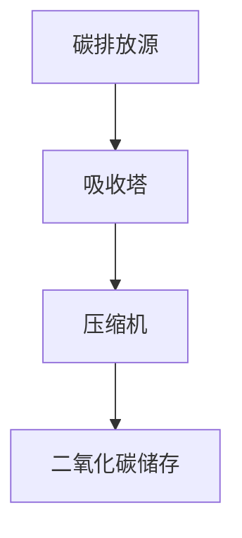
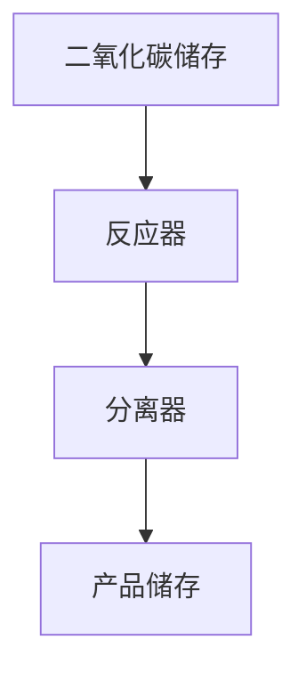
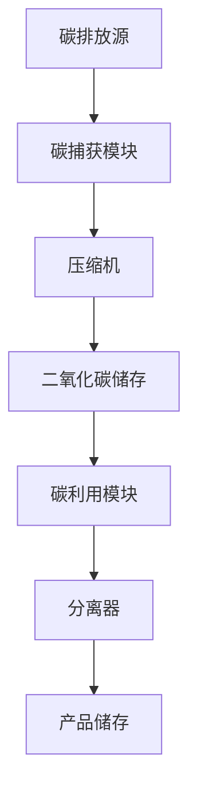

                 


# 碳捕获与利用技术的经济可行性分析

> 关键词：碳捕获、碳利用、经济可行性、碳中和、技术创新  
> 摘要：本文深入探讨碳捕获与利用技术的经济可行性，分析其技术原理、成本构成、经济效益及优化策略，结合实际案例，为实现碳中和目标提供经济可行的技术路径。

---

## 第1章 碳捕获与利用技术的背景介绍

### 1.1 碳捕获技术的背景与问题背景

#### 1.1.1 全球气候变化与碳排放问题
全球气候变化是21世纪最严峻的环境问题之一，主要由温室气体排放引起。二氧化碳作为主要的温室气体，其过度排放导致全球变暖、极端天气频发等严重后果。国际社会通过《巴黎协定》设定目标，要求在21世纪末将全球平均气温升幅控制在1.5°C以内。然而，传统的减碳方式（如减少化石能源使用）难以满足目标，因此需要探索新的技术手段。

#### 1.1.2 碳捕获技术的提出与目标
碳捕获技术作为一种新兴的环境技术，旨在通过物理、化学或生物方法从排放源中捕获二氧化碳，避免其进入大气层。其目标是实现碳中和，即通过捕获和利用二氧化碳，抵消人类活动产生的碳排放。

#### 1.1.3 碳捕获技术的边界与外延
碳捕获技术的边界主要集中在二氧化碳的捕获阶段，而其外延则延伸至二氧化碳的运输、储存和利用。本文重点关注捕获与利用两个环节的经济可行性。

---

### 1.2 碳利用技术的发展与现状

#### 1.2.1 碳利用技术的核心概念
碳利用技术将捕获的二氧化碳转化为高附加值的产品，如化学品、燃料、建筑材料等。通过这种方式，二氧化碳不再是废物，而是成为一种资源，具有显著的环境和经济双重效益。

#### 1.2.2 碳利用技术的分类与特点
碳利用技术主要分为三类：
1. **化学利用**：将二氧化碳转化为尿素、碳酸盐等化学品。
2. **燃料利用**：将二氧化碳转化为甲醇、乙醇等燃料。
3. **材料利用**：将二氧化碳用于生产水泥、塑料等建筑材料。

每种技术都有其独特的优势和局限性，具体取决于应用场景和技术成熟度。

#### 1.2.3 碳利用技术的典型应用场景
碳利用技术已在多个领域得到应用，例如：
- **化工行业**：生产尿素、碳酸盐等化学品。
- **能源行业**：生产合成燃料。
- **建筑材料行业**：生产低碳水泥。

---

## 第2章 碳捕获与利用技术的核心概念与联系

### 2.1 碳捕获与利用技术的核心原理

#### 2.1.1 碳捕获技术的基本原理
碳捕获技术主要包括吸收法、吸附法和膜分离法。吸收法利用化学反应捕获二氧化碳，吸附法通过物理吸附材料捕获气体，膜分离法则通过选择性透过膜实现分离。

#### 2.1.2 碳利用技术的基本原理
碳利用技术通常涉及化学反应或生物转化。例如，二氧化碳加氢反应生成甲醇（CH₃OH），化学方程式为：
$$ \text{CO}_2 + 3\text{H}_2 \rightarrow 2\text{H}_2\text{O} + \text{CH}_3\text{OH} $$

#### 2.1.3 碳捕获与利用技术的协同效应
碳捕获与利用技术的协同效应体现在资源优化和成本降低上。通过捕获的二氧化碳直接用于生产高附加值产品，可以减少储存成本，同时创造经济收益。

---

### 2.2 碳捕获与利用技术的核心要素对比

#### 2.2.1 碳捕获与利用技术的属性特征对比
| **技术属性** | **碳捕获技术** | **碳利用技术** |
|--------------|----------------|----------------|
| **目标**     | 捕获二氧化碳    | 利用二氧化碳    |
| **成本**     | 较高           | 中等           |
| **技术成熟度 | 较低           | 中等           |

#### 2.2.2 碳捕获与利用技术的ER实体关系图

```mermaid
erd
    actor 碳排放源
    actor 碳捕获技术
    actor 碳利用技术
    database 碳排放数据库
    database 碳利用产品
    碳捕获技术 --> 碳排放数据库
    碳利用技术 --> 碳利用产品
```

---

## 第3章 碳捕获与利用技术的经济可行性分析方法

### 3.1 碳捕获与利用技术的成本构成

#### 3.1.1 碳捕获技术的成本分析
碳捕获技术的成本主要包括设备投资、运营成本和维护费用。假设一个中型碳捕获设施的总成本为：
$$ \text{总成本} = \text{设备投资} + \text{运营成本} + \text{维护费用} $$

#### 3.1.2 碳利用技术的成本分析
碳利用技术的成本主要包括原材料、能源消耗和人工成本。例如，生产甲醇的成本模型为：
$$ \text{总成本} = 1.5 \times \text{CO}_2 \text{成本} + 0.8 \times \text{氢气成本} $$

#### 3.1.3 综合成本模型
综合成本模型考虑碳捕获和利用的双重因素：
$$ \text{总成本} = \text{捕获成本} + \text{利用成本} - \text{收益} $$

---

### 3.2 碳捕获与利用技术的经济效益评估

#### 3.2.1 经济收益模型
经济收益模型主要考虑产品的市场价格和产量。例如，甲醇的收益模型为：
$$ \text{总收益} = \text{产量} \times \text{市场价格} $$

#### 3.2.2 经济效益评估指标
常用的经济效益指标包括投资回报率（ROI）、净现值（NPV）和内部收益率（IRR）。

#### 3.2.3 经济可行性分析方法
通过对比总成本和总收益，判断项目的经济可行性。例如：
$$ \text{净收益} = \text{总收益} - \text{总成本} $$

---

## 第4章 碳捕获与利用技术的经济影响因素

### 4.1 碳捕获与利用技术的成本降低策略

#### 4.1.1 技术创新对成本的影响
技术创新可以显著降低碳捕获与利用技术的成本。例如，新型吸附材料的应用可以减少设备投资和运营成本。

#### 4.1.2 规模效应与成本优化
规模化生产可以带来成本优势，例如：
$$ \text{单位成本} = \frac{\text{总成本}}{\text{产量}} $$

#### 4.1.3 政策支持与成本分担
政府补贴和税收优惠政策可以降低企业的成本负担，例如：
$$ \text{补贴后成本} = \text{总成本} \times (1 - \text{补贴率}) $$

---

### 4.2 碳捕获与利用技术的市场价值评估

#### 4.2.1 碳利用产品的市场需求
随着环保政策的加强，市场对低碳产品的需求不断增加。例如，低碳水泥的需求年增长率预计为5%。

#### 4.2.2 碳捕获与利用技术的市场竞争力
通过技术创新和成本优化，碳捕获与利用技术可以与其他减排技术（如风能、太阳能）形成互补，提高市场竞争力。

---

## 第5章 碳捕获与利用技术的系统分析与架构设计

### 5.1 系统功能设计

#### 5.1.1 碳捕获模块
碳捕获模块负责捕获二氧化碳，主要包括吸收塔、吸附床和压缩机。系统架构图如下：



#### 5.1.2 碳利用模块
碳利用模块将捕获的二氧化碳转化为高附加值产品，主要包括反应器和分离器。系统架构图如下：



### 5.2 系统架构设计

#### 5.2.1 系统架构图
整个系统的架构图如下：



---

## 第6章 碳捕获与利用技术的项目实战

### 6.1 环境安装

#### 6.1.1 工具安装
需要安装以下工具：
- Python 3.x
- Mermaid
- LaTeX

#### 6.1.2 核心代码实现
以下是碳捕获与利用技术的经济分析模型的Python代码：

```python
import numpy as np

# 碳捕获成本参数
cost_capturing = 100  # 美元/吨
cost_utilization = 50  # 美元/吨
revenue = 150  # 美元/吨

# 计算净收益
net_profit = revenue - (cost_capturing + cost_utilization)
print(f"每吨二氧化碳的净收益为：${net_profit}")
```

---

## 第7章 碳捕获与利用技术的最佳实践

### 7.1 关键点总结
- 碳捕获与利用技术是实现碳中和的重要手段。
- 经济可行性是技术推广的核心因素。
- 技术创新和政策支持是降低成本的关键。

### 7.2 注意事项
- 在实际应用中，需综合考虑技术、经济和环境因素。
- 确保碳利用产品的市场需求稳定。

### 7.3 拓展阅读
推荐阅读以下书籍和论文：
- 《碳中和技术路线图》
- 《碳捕获与利用的经济分析》

---

## 作者

作者：AI天才研究院 & 禅与计算机程序设计艺术

---

以上是《碳捕获与利用技术的经济可行性分析》的完整目录和内容概要。通过以上分析，我们可以清晰地看到碳捕获与利用技术的经济潜力及其在实现碳中和目标中的重要性。

