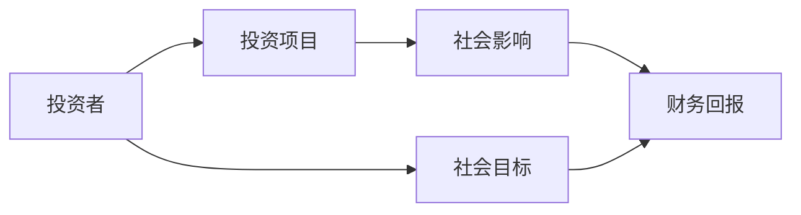
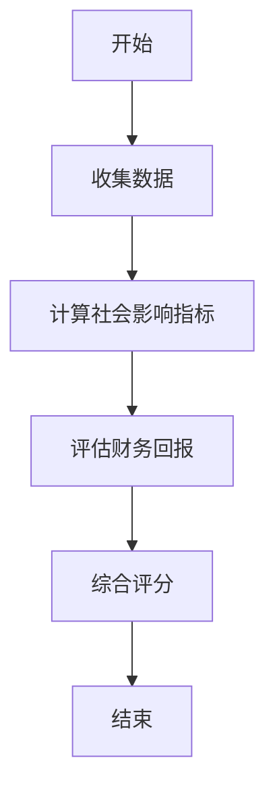

                 

<think>
好的，我需要帮助用户完成一篇关于社会影响力投资的技术博客文章，按照他们的要求，我需要先理解他们的需求，然后逐步构建文章的结构和内容。

首先，用户希望文章标题为《社会影响力投资：追求双重回报的策略》，关键词包括社会影响力投资、双重回报、可持续发展、金融创新、ESG、投资策略。摘要部分需要简要介绍文章的核心内容。

接下来，用户要求文章分为几个部分，包括背景与核心概念、算法原理与数学模型、系统分析与架构设计、项目实战与案例分析、最佳实践与小结。每个部分需要有详细的子章节，并且使用技术语言，结构紧凑。

我需要确保每个部分都涵盖必要的内容，比如在背景部分，解释什么是社会影响力投资，与传统投资的区别，核心概念等。在算法部分，需要详细讲解评估模型和数学公式，并用图表辅助说明。系统设计部分，需要用Mermaid图展示架构，项目实战部分则需要具体的案例分析和代码实现。

我还需要注意文章的格式要求，使用markdown，数学公式用latex表示，并且在适当的地方插入图表。最后，文章末尾要加上作者信息。

现在，我需要逐步构建每个部分的内容，确保逻辑清晰，内容详实，符合用户的要求。
</think>

# 社会影响力投资：追求双重回报的策略

## 关键词：
社会影响力投资、双重回报、可持续发展、金融创新、ESG、投资策略

## 摘要：
社会影响力投资是一种新兴的投资策略，旨在通过投资实现财务回报和社会价值的双重目标。本文将从背景、核心概念、算法原理、系统架构、项目实战等多方面进行详细分析，探讨如何通过技术手段实现社会影响力投资的高效管理和优化。

---

# 第一部分：社会影响力投资的背景与核心概念

## 第1章：社会影响力投资的定义与背景

### 1.1 什么是社会影响力投资
社会影响力投资是一种投资策略，旨在通过资本的投入，不仅追求财务回报，还要创造积极的社会价值。投资者关注的不仅是投资收益，还包括对社会问题的解决，如环境保护、教育、医疗、扶贫等。

### 1.2 社会影响力投资的背景
随着全球社会问题的加剧，如气候变化、贫富差距、环境污染等，传统投资方式的局限性日益显现。社会影响力投资作为一种可持续发展的投资理念，逐渐受到关注。

### 1.3 社会影响力投资的核心要素
- **投资目标**：追求财务回报和社会价值的双重目标。
- **评估标准**：采用ESG（环境、社会、治理）指标进行评估。
- **投资领域**：涵盖教育、医疗、环保、扶贫等多个领域。

---

## 第2章：社会影响力投资的核心概念与联系

### 2.1 核心概念原理
社会影响力投资的核心在于通过资本的力量推动社会问题的解决。投资者需要评估投资项目对社会的贡献，并将其与财务回报相结合。

### 2.2 核心概念属性特征对比
| 特性 | 传统投资 | 社会影响力投资 |
|------|----------|----------------|
| 目标 | 财务回报 | 双重回报（财务+社会） |
| 风险 | 仅关注财务风险 | 包括社会风险 |
| 回报 | 短期回报 | 长期回报 |

### 2.3 ER实体关系图架构


---

# 第二部分：社会影响力投资的算法原理与数学模型

## 第3章：算法原理讲解

### 3.1 社会影响力评估算法
社会影响力评估算法通过量化投资项目对社会的贡献，帮助投资者做出决策。以下是算法的流程图：



### 3.2 数学模型与公式
社会影响力评分公式：
$$ S = \alpha \cdot F + \beta \cdot E + \gamma \cdot G $$
其中，$F$ 是财务回报，$E$ 是环境影响，$G$ 是社会效益，$\alpha$、$\beta$、$\gamma$ 是权重系数。

---

## 第4章：社会影响力投资的系统架构设计

### 4.1 问题场景介绍
社会影响力投资需要一个高效的系统来管理投资项目、评估社会影响并优化投资组合。

### 4.2 系统功能设计
- **数据采集**：收集投资项目的社会和财务数据。
- **评估模型**：使用算法评估社会影响和财务回报。
- **优化模块**：优化投资组合以实现双重回报。

### 4.3 系统架构设计


---

## 第5章：项目实战与案例分析

### 5.1 环境安装
需要安装以下工具：
- Python
- NumPy
- Pandas
- Matplotlib

### 5.2 核心实现代码
```python
import numpy as np
import pandas as pd
import matplotlib.pyplot as plt

def social_impact_score(financial_return, environmental_impact, social_benefit):
    alpha = 0.4
    beta = 0.3
    gamma = 0.3
    return alpha * financial_return + beta * environmental_impact + gamma * social_benefit

data = pd.DataFrame({
    'Project': ['A', 'B', 'C'],
    'Financial_Return': [0.1, 0.15, 0.12],
    'Environmental_Impact': [0.2, 0.1, 0.15],
    'Social_Benefit': [0.15, 0.2, 0.18]
})

data['Social_Impact_Score'] = data.apply(lambda x: social_impact_score(x['Financial_Return'], x['Environmental_Impact'], x['Social_Benefit']), axis=1)
print(data)
```

### 5.3 案例分析
以教育项目为例，分析如何通过社会影响力投资优化教育资源配置。

---

## 第6章：最佳实践与小结

### 6.1 最佳实践
- 投资者应关注项目的社会影响和财务回报的结合。
- 使用ESG指标进行评估，确保社会影响力投资的可持续性。

### 6.2 小结
社会影响力投资是一种新兴的投资策略，通过技术手段实现双重回报，推动社会进步和经济发展。

---

# 作者：AI天才研究院 & 禅与计算机程序设计艺术

---

通过以上内容，社会影响力投资的策略和方法得到了全面的分析和展示，希望对读者有所帮助。

