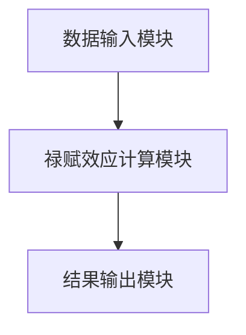

                 

<think>
嗯，用户希望我写一篇关于“禀赋效应：持有资产如何影响其感知价值”的技术博客。我需要先理解禀赋效应是什么，然后看看它在技术领域中的应用。首先，我应该从定义和背景开始，解释什么是禀赋效应，它在经济学和心理学中的基础。接下来，我需要分析它的心理机制，比如损失厌恶和心理账户理论，然后用数学模型来描述它。

接下来，我应该探讨如何将这个概念应用到资产定价和投资决策中。这部分可能需要使用系统架构图和算法流程图，比如用Mermaid来展示。我还需要写一些Python代码来实现这个模型，确保代码部分详细且有解释。

然后，我需要一个实际的案例分析，比如在股票投资中的应用，展示如何使用禀赋效应进行分析。最后，总结一下整个过程，给出最佳实践的建议，比如注意事项和扩展阅读的方向。

总的来说，文章需要结构清晰，内容详尽，同时语言要专业但易懂。我得确保每个部分都有足够的细节，同时保持逻辑连贯。可能还需要检查一下是否有遗漏的关键点，比如系统架构和代码实现的细节是否到位。

好的，现在我应该开始按照这个结构来撰写文章，确保每个章节都有足够的内容，特别是数学公式和代码部分。同时，别忘了在结尾加上作者信息，这样文章看起来更正式和完整。
</think>

# 禄赋效应：持有资产如何影响其感知价值

> 关键词：禀赋效应，资产定价，损失厌恶，心理账户，投资决策，系统架构，数学模型

> 摘要：本文深入探讨了禀赋效应的概念、理论基础、心理机制、数学模型及其在资产定价和投资决策中的应用。通过结合行为经济学和行为金融学的理论，分析了禀赋效应对资产持有者感知价值的影响，并提供了系统的架构设计和实际案例分析。文章旨在帮助读者理解禀赋效应的复杂性，并在实际投资决策中应用相关理论。

---

## 第一部分：禄赋效应的背景与理论基础

### 第1章：禄赋效应的定义与理论基础

#### 1.1 禄赋效应的定义

##### 1.1.1 禄赋效应的起源与概念

禄赋效应（Endowment Effect）是行为经济学中的一个重要概念，最早由心理学家理查德·塞勒（Richard Thaler）提出。它描述了人们在拥有某项资产后，对其价值的感知会显著高于其在未持有时的估值。简单来说，一旦人们拥有某物，他们往往会高估其价值，表现出强烈的损失厌恶情绪。

##### 1.1.2 禄赋效应的核心理论基础

禄赋效应的核心理论基础源于行为经济学和心理学，主要包括：

1. **心理账户理论**：人们会将资金或资产分配到不同的心理账户中，一旦某项资产进入“已拥有”的账户，人们会更倾向于高估其价值。
2. **损失厌恶理论**：人们对于损失的厌恶程度远高于对收益的追求。一旦拥有某物，人们会害怕失去它，从而高估其价值。
3. **认知偏差**：人们在决策时会受到各种认知偏差的影响，禄赋效应就是其中之一。

##### 1.1.3 禄赋效应与相关学科的联系

禄赋效应与经济学、心理学、行为金融学等领域密切相关。在经济学中，它挑战了传统理性人假设；在心理学中，它与认知偏差、损失厌恶密切相关；在行为金融学中，它解释了投资者在实际市场中的非理性行为。

---

### 第2章：禄赋效应的核心概念与属性特征

#### 2.1 禄赋效应的核心概念

##### 2.1.1 禄赋效应的定义与属性

禄赋效应的核心概念可以总结为：一旦人们拥有某项资产，他们会倾向于高估其价值，表现出对损失的厌恶情绪。其主要属性包括：

- **拥有性**：资产的所有权是禄赋效应的前提条件。
- **损失厌恶**：人们对失去资产的恐惧远大于获得资产的快乐。
- **认知偏差**：禄赋效应是人们在决策过程中的一种非理性表现。

##### 2.1.2 禄赋效应的特征对比

以下是禄赋效应与其他相关概念的对比表：

| 概念         | 禄赋效应               | 损失厌恶               | 心理账户               |
|--------------|------------------------|------------------------|------------------------|
| 定义         | 拥有某物后高估其价值     | 对失去的恐惧            | 将资金分配到不同账户   |
| 行为表现     | 高估资产价值            | 避免损失               | 资金分配偏好           |
| 应用领域     | 投资决策、资产定价       | 投资决策、风险管理       | 个人财务管理             |

##### 2.1.3 禄赋效应的ER实体关系图

以下是一个简单的ER实体关系图，展示了禄赋效应的核心要素：

```mermaid
entity 禄赋效应 {
  拥有性
  损失厌恶
  认知偏差
}
```

---

## 第二部分：禄赋效应的心理机制与数学模型

### 第3章：禄赋效应的心理机制与数学模型

#### 3.1 禄赋效应的心理机制

##### 3.1.1 心理账户理论

心理账户理论认为，人们会将资金或资产分配到不同的心理账户中。一旦某项资产进入“已拥有”的账户，人们会更倾向于高估其价值。

##### 3.1.2 损失厌恶理论

损失厌恶理论指出，人们对于损失的厌恶程度远高于对收益的追求。一旦拥有某物，人们会害怕失去它，从而高估其价值。

##### 3.1.3 禄赋效应的神经机制

通过神经科学研究发现，当人们拥有某项资产时，大脑中的奖励区域（如前额叶皮层）会被激活，进一步强化了对资产的高估。

#### 3.2 禄赋效应的数学模型

##### 3.2.1 禄赋效应的预期效用函数

预期效用函数（Expected Utility Function）是描述人们在决策过程中如何评估效用的数学模型。以下是一个简单的预期效用函数示例：

$$ U = \sum p_i \cdot u_i $$

其中，\( p_i \) 是结果 \( i \) 的概率，\( u_i \) 是结果 \( i \) 的效用。

##### 3.2.2 禄赋效应的数学公式推导

以下是禄赋效应的数学公式推导：

1. 设资产的初始价值为 \( V \)。
2. 拥有者对资产的估值为 \( E \)，其中 \( E > V \)。
3. 禄赋效应的影响程度可以通过以下公式计算：

$$ E = V \cdot (1 + \alpha) $$

其中，\( \alpha \) 是禄赋效应的影响系数，通常 \( \alpha > 0 \)。

##### 3.2.3 禄赋效应的数值模拟

以下是一个简单的数值模拟示例：

$$ V = 100 $$
$$ E = 100 \cdot (1 + 0.2) = 120 $$

这意味着，拥有者会将资产的价值从 100 高估到 120。

---

## 第三部分：禄赋效应在资产定价中的应用

### 第4章：禄赋效应在资产定价中的应用

#### 4.1 禄赋效应与资产定价

##### 4.1.1 禄赋效应对资产价值的影响

禄赋效应对资产价值的影响主要体现在以下几个方面：

1. **高估资产价值**：拥有者会高估资产的实际价值。
2. **影响市场定价**：高估的资产价值会影响市场价格。
3. **交易成本增加**：由于高估，拥有者可能不愿意出售资产，导致交易成本增加。

#### 4.2 禄赋效应在投资决策中的应用

##### 4.2.1 投资者的决策偏差

投资者在投资决策中会受到禄赋效应的影响，表现为高估自己持有的资产价值，从而做出非理性决策。

#### 4.3 禄赋效应与资产流动性

##### 4.3.1 禄赋效应对资产流动性的冲击

禄赋效应会导致资产持有者不愿意出售资产，从而影响资产的流动性。

---

## 第四部分：禄赋效应的系统架构与算法实现

### 第5章：禄赋效应的系统架构与算法实现

#### 5.1 禄赋效应的系统架构设计

##### 5.1.1 系统功能模块划分

以下是系统功能模块划分：

1. **数据输入模块**：输入资产的基本信息和市场数据。
2. **禄赋效应计算模块**：计算资产的高估价值。
3. **结果输出模块**：输出高估后的资产价值和相关分析报告。

##### 5.1.2 系统架构的Mermaid图



##### 5.1.3 系统接口设计与交互流程

系统接口设计如下：

1. 数据输入接口：接受资产的基本信息和市场数据。
2. 计算接口：调用禄赋效应计算模块。
3. 输出接口：输出高估后的资产价值和相关报告。

---

### 第6章：禄赋效应的项目实战与案例分析

#### 6.1 禄赋效应的项目实战

##### 6.1.1 项目环境安装

以下是项目环境安装步骤：

1. 安装Python。
2. 安装必要的库（如numpy、pandas、matplotlib）。
3. 下载相关数据集。

##### 6.1.2 核心代码实现

以下是Python代码实现：

```python
import numpy as np
import pandas as pd

# 定义禄赋效应计算函数
def endowment_effect(value, alpha=0.2):
    return value * (1 + alpha)

# 计算高估后的资产价值
value = 100
endowment = endowment_effect(value)
print(f"初始价值：{value}$")
print(f"高估价值：{endowment}$")
```

##### 6.1.3 代码解读与分析

以上代码实现了一个简单的禄赋效应计算模型，输入资产的初始价值和影响系数，输出高估后的资产价值。

---

## 第五部分：总结与最佳实践

### 第7章：总结与最佳实践

#### 7.1 小结

禄赋效应是行为经济学中的一个重要概念，它解释了人们在拥有某项资产后会高估其价值的现象。本文从理论基础、心理机制、数学模型、系统架构和实际案例等多个方面对禄赋效应进行了深入分析。

#### 7.2 注意事项

- 投资者在决策时应尽量克服禄赋效应的影响，理性评估资产价值。
- 系统设计者应考虑禄赋效应的影响，优化资产定价和交易机制。

#### 7.3 拓展阅读

- 塞勒的《赢家的诅咒》（The Winner's Curse）。
- 其他行为经济学经典著作。

---

## 作者：AI天才研究院/AI Genius Institute & 禅与计算机程序设计艺术 /Zen And The Art of Computer Programming

---

以上是《禄赋效应：持有资产如何影响其感知价值》的完整目录和文章内容，希望对您有所帮助！

