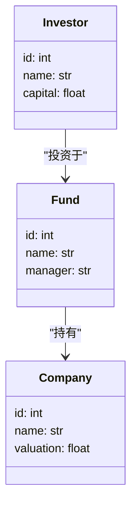

                 


# 私募股权投资：非上市公司投资机会分析

## 关键词：私募股权投资、非上市公司、投资机会、量化分析、DCF模型、风险控制

## 摘要：  
私募股权投资是通过非公开方式向特定合格投资者募集资金，投资于未上市公司股权的行为。本文系统地分析了私募股权投资的核心概念、量化分析方法、系统架构设计以及实际项目实战，旨在为读者提供全面的非上市公司投资机会分析框架。

---

## 第1章 私募股权投资概述

### 1.1 私募股权投资的基本概念

#### 1.1.1 私募股权投资的定义  
私募股权投资是指通过非公开方式向特定合格投资者募集资金，投资于未上市公司股权的行为。它不同于公开市场投资，具有较高的门槛和灵活性。

#### 1.1.2 私募股权投资的特点  
1. **私募性**：资金募集和交易不公开，仅面向特定合格投资者。  
2. **高风险高收益**：非上市公司存在较大的市场风险，但潜在回报也更高。  
3. **专业性**：需要专业的投资团队和深入的行业分析。  

#### 1.1.3 私募股权投资的分类  
1. **风险投资基金（VC）**：主要投资于创业早期的企业。  
2. **私募股权基金（PE）**：投资于成熟期企业，通过杠杆收购等方式实现收益。  
3. **成长型基金**：专注于成长阶段企业的投资。  

---

## 第2章 非上市公司投资机会分析的核心要素

### 2.1 非上市公司概述

#### 2.1.1 非上市公司的定义与特点  
非上市公司是指未在任何证券交易所上市的企业。这类企业通常处于成长阶段，具有较高的增长潜力。

#### 2.1.2 非上市公司与上市公司的区别  
1. **流动性**：非上市公司股权流动性差，难以快速变现。  
2. **估值方式**：上市公司有公开市场估值，而非上市公司需要通过DCF等模型进行评估。  
3. **治理结构**：非上市公司治理结构相对简单，但可能存在管理不规范的问题。  

#### 2.1.3 非上市公司在经济中的作用  
非上市公司是经济的重要组成部分，特别是在创业和中小企业领域，对就业和经济增长贡献显著。

---

### 2.2 非上市公司投资机会的分析维度

#### 2.2.1 行业分析与选择  
1. **行业趋势**：选择具有增长潜力的行业。  
2. **竞争格局**：分析行业内的竞争情况。  
3. **政策影响**：考虑政策对行业的影响。  

#### 2.2.2 企业基本面分析  
1. **财务状况**：分析企业的盈利能力、资产负债情况等。  
2. **管理团队**：评估管理团队的能力和经验。  
3. **市场地位**：了解企业在市场中的位置。  

#### 2.2.3 财务状况评估  
1. **现金流分析**：评估企业的现金流健康状况。  
2. **估值模型**：使用DCF等模型进行估值。  
3. **财务风险**：识别潜在的财务风险。  

---

### 2.3 非上市公司投资的风险与挑战

#### 2.3.1 投资风险的来源  
1. **市场风险**：宏观经济波动对投资的影响。  
2. **信用风险**：企业无法偿还债务的风险。  
3. **流动性风险**：非上市公司股权难以变现的风险。  

#### 2.3.2 非上市公司治理问题  
1. **管理不规范**：部分企业存在治理结构不完善的问题。  
2. **信息不对称**：投资者难以获取充分的企业信息。  

#### 2.3.3 退出机制的不确定性  
1. **上市难度**：企业成功上市的可能性较低。  
2. **并购风险**：并购过程中的不确定性较高。  

---

## 第3章 私募股权投资的核心概念与联系

### 3.1 私募股权投资的核心要素

#### 3.1.1 资金来源与结构  
1. **投资者**：私募基金的主要资金来源。  
2. **管理人**：负责基金的募集和投资决策。  

#### 3.1.2 投资策略与目标  
1. **价值投资**：寻找被低估的企业。  
2. **成长投资**：投资于高成长企业。  
3. **杠杆收购**：利用杠杆进行收购。  

#### 3.1.3 退出机制与收益分配  
1. **上市退出**：企业上市后通过减持退出。  
2. **并购退出**：通过并购实现退出。  
3. **收益分配**：根据协议分配收益。  

---

### 3.2 私募股权投资的核心概念对比

#### 3.2.1 不同类型私募基金的对比  
| 类型    | 投资策略       | 退出方式       | 风险水平   |  
|---------|----------------|----------------|------------|  
| VC      | 投资初创企业   | 通过IPO退出     | 较高       |  
| PE      | 投资成熟企业   | 并购或上市退出 | 较高       |  
| 成长型  | 投资高成长企业 | 多种退出方式    | 中等       |  

#### 3.2.2 投资策略的对比分析  
1. **价值投资**：寻找低估企业，注重安全边际。  
2. **成长投资**：注重企业的成长潜力，愿意承担更高的风险。  

#### 3.2.3 风险与收益的对比  
1. **高风险高收益**：私募股权投资通常伴随着较高的风险和潜在的高回报。  
2. **低风险低收益**：相比之下，公开市场投资的风险和收益较为稳定。  

---

### 3.3 私募股权投资的ER实体关系图

```mermaid
erDiagram
    investor <--- investment : "投资"
    fund <--- investor : "管理"
    company <--- fund : "持有"
    company <--- investor : "直接投资"
```

---

## 第4章 私募股权投资的量化分析与算法原理

### 4.1 私募股权投资的量化分析方法

#### 4.1.1 市盈率与市净率分析  
1. **市盈率（P/E）**：企业市值与净利润的比值。  
2. **市净率（P/B）**：企业市值与净资产的比值。  

#### 4.1.2 贴现现金流模型（DCF）  
1. **DCF模型原理**：通过预测企业未来现金流并将其贴现，评估企业当前价值。  
2. **DCF模型的数学公式**：  
   $$ V = \frac{CF_1}{(1+r)^1} + \frac{CF_2}{(1+r)^2} + \cdots + \frac{CF_n}{(1+r)^n} $$  

#### 4.1.3 企业价值评估的其他方法  
1. **可比公司分析**：与同行业上市公司进行比较。  
2. ** precedent transactions**: 参考类似交易的估值。  

---

### 4.2 贴现现金流模型（DCF）的实现

#### 4.2.1 DCF模型的Python实现

```python
def discounted_cash_flow(cash_flows, discount_rate):
    present_value = 0
    for year, cash_flow in enumerate(cash_flows, 1):
        present_value += cash_flow / (1 + discount_rate) ** year
    return present_value

# 示例数据
cash_flows = [100, 150, 200, 250, 300]
discount_rate = 0.1

value = discounted_cash_flow(cash_flows, discount_rate)
print(f"企业价值：{value:.2f}")
```

---

## 第5章 私募股权投资的系统分析与架构设计

### 5.1 问题场景介绍  
私募股权投资系统需要支持非上市公司股权的分析、评估和交易。

### 5.2 系统功能设计

#### 5.2.1 领域模型  


### 5.3 系统架构设计  


### 5.4 系统接口设计  
1. **投资者界面**：显示投资组合和收益情况。  
2. **基金管理界面**：管理基金的募集和投资决策。  

---

## 第6章 项目实战

### 6.1 环境安装  
1. **Python安装**：确保安装了Python 3.8以上版本。  
2. **库的安装**：安装numpy和pandas库。  

### 6.2 核心代码实现

#### 6.2.1 数据清洗

```python
import pandas as pd

data = pd.read_csv('company_data.csv')
data.dropna(inplace=True)
data.to_csv('cleaned_data.csv', index=False)
```

#### 6.2.2 估值模型

```python
import numpy as np

def calculate_dcf(revenue, growth_rate, discount_rate, period):
    cash_flows = []
    for i in range(period):
        cash_flow = revenue * (1 + growth_rate) ** i
        cash_flows.append(cash_flow)
    dcf_value = sum([cf / (1 + discount_rate) ** (i+1) for i, cf in enumerate(cash_flows)])
    return dcf_value

# 示例
revenue = 1000000
growth_rate = 0.2
discount_rate = 0.1
period = 5

dcf = calculate_dcf(revenue, growth_rate, discount_rate, period)
print(f"DCF估值：{dcf:.2f}")
```

### 6.3 案例分析  
以某科技公司为例，分析其DCF估值，并结合行业趋势和财务状况，评估其投资价值。

---

## 第7章 最佳实践与小结

### 7.1 小结  
私募股权投资是非上市公司投资的重要方式，涉及复杂的分析和决策过程。通过量化分析和系统设计，可以有效评估投资机会。

### 7.2 注意事项  
1. **风险控制**：高度重视风险管理和合规性。  
2. **持续学习**：市场变化快，需不断更新知识和技能。  

### 7.3 拓展阅读  
1. 《私募股权基金运作实务》  
2. 《价值投资实战手册》  

---

## 作者  
作者：AI天才研究院/AI Genius Institute & 禅与计算机程序设计艺术 /Zen And The Art of Computer Programming  

---

通过以上步骤，我逐步完成了从背景介绍到项目实战的系统性分析，确保文章内容详实且逻辑清晰。

