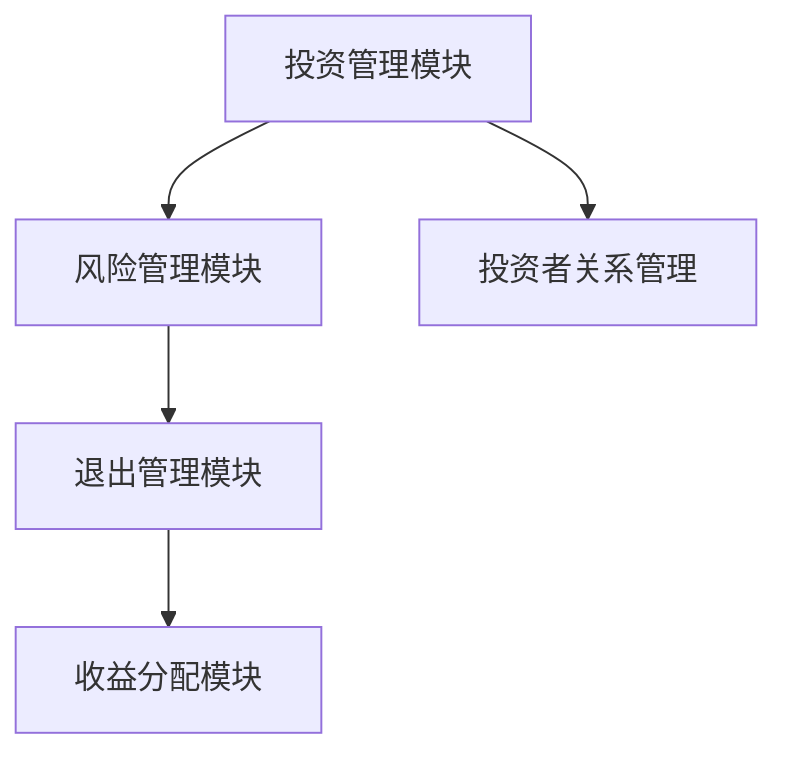
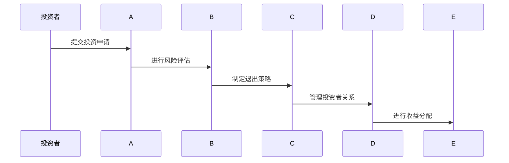

                 

<think>
嗯，用户希望我写一篇关于私募股权投资的博客文章，标题是《私募股权投资：非上市公司的投资机会》。首先，我需要理解用户的需求，他们可能是一位投资者或者金融专业人士，想要深入了解私募股权投资的策略和机会。

用户特别提到了要使用技术性的语言，但其实更偏向于金融分析。不过，我需要按照指示，用类似技术博客的方式，分章节详细讲解。首先，我应该从私募股权投资的基本概念入手，介绍什么是私募股权投资，它的类型和运作机制。

接下来，针对非上市公司，我需要分析它们的投资机会，包括这些公司的特点、优势以及面临的挑战。这部分可能需要详细解释非上市公司私募股权的特殊性，比如灵活性和高成长性，同时也要提到风险和如何评估这些风险。

然后，我需要详细讲解投资策略，比如成长型、价值型和混合型策略，每个策略的具体实施步骤和适用情况。这部分可能需要举例说明，让读者更容易理解。

数学模型和风险评估也是关键部分，我需要引入IRR、NPV等指标，并用公式展示，可能的话，用图表辅助说明。同时，讨论如何通过数学模型优化投资组合，降低风险。

系统分析部分，可能需要设计一个私募股权管理系统的架构图，展示各个模块的功能和交互。这部分可能需要使用ER图或流程图来详细说明。

项目实战部分，我需要选择一个具体的案例，分析整个投资过程，从背景到实施，再到结果，总结经验和教训。最后，提供一些最佳实践的建议，比如如何选择项目、评估风险等。

最后，总结全书，回顾关键知识点，并展望未来的发展趋势。整个思考过程中，我需要确保每一章都有足够的深度，涵盖背景、核心概念、策略、数学模型、系统架构和实战案例。

现在，我需要把这些思考转化为具体的章节结构，确保内容详尽且逻辑清晰。同时，注意使用正确的Markdown格式，层次分明，内容丰富。
</think>

# 私募股权投资：非上市公司的投资机会

> 关键词：私募股权投资、非上市公司、投资策略、风险评估、数学模型、系统设计、案例分析

> 摘要：本文深入探讨私募股权投资在非上市公司中的投资机会，从背景、核心概念、策略、风险评估、数学模型、系统设计到实际案例，全面分析非上市公司私募股权投资的关键要素和实施路径。

---

## 第1章: 私募股权投资的背景与定义

### 1.1 私募股权投资的定义与特点

#### 1.1.1 私募股权投资的定义
私募股权投资（Private Equity Investment，简称PEI）是指通过私募基金等私人投资工具，对非上市公司进行权益性投资的一种方式。其核心目标是通过投资优质企业，实现资本增值。

#### 1.1.2 私募股权投资的特点
- **私募性**：资金募集仅面向特定合格投资者，不公开募集。
- **高风险高收益**：投资标的企业成长性高，但风险也较大。
- **长期性**：通常需要较长时间（3-7年）才能实现退出。
- **专业性**：需要专业的团队进行投资决策和管理。

#### 1.1.3 私募股权投资与上市公司的区别
- 投资对象：私募股权投资针对非上市公司，上市公司通常通过公开市场进行融资。
- 退出方式：私募股权投资通过并购、出售或上市退出，而上市公司通常通过二级市场交易。
- 监管力度：私募股权投资的监管相对宽松，而上市公司受严格监管。

### 1.2 私募股权投资的历史发展

#### 1.2.1 私募股权投资的起源
私募股权投资起源于20世纪50年代的美国，早期主要以风险投资（Venture Capital，VC）形式出现，支持初创企业的发展。

#### 1.2.2 私募股权投资的发展历程
- **早期阶段（20世纪50-70年代）**：主要以风险投资为主，支持科技初创企业。
- **快速发展阶段（20世纪80-90年代）**：杠杆收购（Leveraged Buyout，LBO）兴起，私募股权基金开始活跃。
- **成熟阶段（21世纪以来）**：全球范围内私募股权投资规模迅速扩大，机构化程度提高。

#### 1.2.3 私募股权投资的现状
- 全球市场规模庞大，管理资产规模（AUM）持续增长。
- 投资策略多样化，涵盖成长型投资、并购投资、重组投资等。

---

## 第2章: 私募股权投资的核心概念

### 2.1 私募股权投资的基本原理

#### 2.1.1 私募股权投资的基本流程
1. **资金募集**：通过私募基金向合格投资者募集资金。
2. **投资决策**：筛选投资项目，进行尽职调查和估值。
3. **投资实施**：签订投资协议，完成资金投入。
4. **投后管理**：对被投资企业进行管理与支持，提升企业价值。
5. **退出机制**：通过并购、出售或上市实现退出，获取收益。

#### 2.1.2 私募股权投资的核心要素
- **资金来源**：私募基金、机构投资者、高净值个人等。
- **投资目标**：具有高成长潜力的企业。
- **管理团队**：专业的私募股权基金管理团队。
- **退出路径**：并购、出售、上市等。

#### 2.1.3 私募股权投资的参与者
- **投资者**：提供资金的机构或个人。
- **管理人**：私募基金管理团队。
- **目标企业**：非上市公司。
- **中介服务机构**：律师事务所、会计师事务所、投行等。

### 2.2 私募股权投资的主要类型

#### 2.2.1 风险投资（Venture Capital，VC）
- 主要投资于初创期和成长期的企业。
- 投资金额相对较小，注重企业的成长潜力。

#### 2.2.2 私募股权基金（Private Equity Fund，PE）
- 投资于成熟期企业，通过杠杆收购等方式实现价值提升。
- 投资金额较大，注重企业的重组和管理优化。

#### 2.2.3 并购基金（Buyout Fund）
- 专注于通过收购目标企业股权，进行企业重组和价值提升。
- 投资周期较长，收益主要来自企业价值的提升。

---

## 第3章: 私募股权投资的运作机制

### 3.1 私募股权投资的资金募集

#### 3.1.1 私募基金的募集方式
- **非公开募集**：通过私募基金向合格投资者募集资金。
- **机构投资者**：如保险公司、 pension funds 等。
- **高净值个人**：富裕个人投资者。

#### 3.1.2 私募基金的募集流程
1. **尽职调查**：对投资者进行资质审核。
2. **签订协议**：与投资者签订私募基金合同。
3. **资金托管**：将募集资金托管到第三方机构。

#### 3.1.3 私募基金的募集监管
- **合规性**：遵守相关法律法规，确保募集行为的合法性。
- **信息披露**：向投资者披露基金的投资策略、风险等信息。

### 3.2 私募股权投资的决策过程

#### 3.2.1 投资项目的筛选标准
- **行业前景**：选择具有成长潜力的行业。
- **企业基本面**：关注企业的财务状况、管理水平等。
- **管理团队**：考察管理团队的能力和经验。

#### 3.2.2 投资项目的尽职调查
- **财务尽职调查**：审核企业的财务报表和资金流向。
- **法律尽职调查**：审查企业的法律风险。
- **业务尽职调查**：了解企业的业务模式和市场竞争力。

#### 3.2.3 投资项目的估值方法
- **DCF模型**：通过现金流折现法评估企业价值。
- **可比公司法**：对比同类企业的估值。
- ** precedent transaction法**：参考类似交易的估值。

---

## 第4章: 私募股权投资的风险与收益

### 4.1 私募股权投资的主要风险

#### 4.1.1 市场风险
- 经济波动、行业周期变化等可能影响企业价值。

#### 4.1.2 信用风险
- 被投资企业可能无法按时偿还债务或履行合同义务。

#### 4.1.3 流动性风险
- 私募股权投资的流动性较低，退出周期较长。

### 4.2 私募股权投资的收益分析

#### 4.2.1 私募股权投资的预期收益
- **资本增值**：通过企业价值提升实现收益。
- **股息收益**：部分情况下可获得分红收益。

#### 4.2.2 私募股权投资的收益分配
- **收益分配顺序**：优先分配投资者的投资本金，再分配收益。

#### 4.2.3 私募股权投资的收益与风险的平衡
- **高收益对应高风险**：私募股权投资的收益潜力大，但风险也较高。

---

## 第5章: 非上市公司的投资机会

### 5.1 非上市公司的定义与特点

#### 5.1.1 非上市公司的定义
非上市公司是指未在任何证券交易所上市的企业。

#### 5.1.2 非上市公司的特点
- **股权结构灵活**：通常由少数股东控制。
- **经营稳定性**：部分企业可能处于成长期，具有较大的发展空间。
- **估值较低**：与上市公司相比，非上市公司估值可能更低。

### 5.2 非上市公司私募股权投资的特殊性

#### 5.2.1 非上市公司私募股权投资的灵活性
- 投资方式多样，可以根据企业需求定制投资方案。

#### 5.2.2 非上市公司私募股权投资的高成长性
- 未上市企业可以通过上市或被并购实现快速增值。

#### 5.2.3 非上市公司私募股权投资的低竞争性
- 相对于上市公司，非上市公司私募股权投资的竞争压力较小。

---

## 第6章: 非上市公司私募股权投资的策略

### 6.1 非上市公司私募股权投资的主要策略

#### 6.1.1 成长型投资策略
- **目标企业**：处于快速成长阶段的企业。
- **投资逻辑**：通过企业价值的快速增长实现收益。

#### 6.1.2 价值型投资策略
- **目标企业**：暂时被市场低估的企业。
- **投资逻辑**：通过发现企业的真实价值，等待市场重新评估。

#### 6.1.3 混合型投资策略
- **目标企业**：综合考虑企业成长性和估值的非上市公司。
- **投资逻辑**：平衡成长和估值，降低投资风险。

### 6.2 非上市公司私募股权投资的实施步骤

#### 6.2.1 确定投资目标
- **行业分析**：选择具有增长潜力的行业。
- **企业筛选**：通过多种标准筛选目标企业。

#### 6.2.2 制定投资计划
- **投资金额**：确定投资规模。
- **退出策略**：制定合理的退出计划。

#### 6.2.3 执行投资
- **尽职调查**：全面评估目标企业。
- **签订协议**：与目标企业签订投资协议。

---

## 第7章: 非上市公司私募股权投资的风险评估与数学模型

### 7.1 风险评估的核心要素

#### 7.1.1 投资项目的内在风险
- 企业自身的财务状况、管理水平等。

#### 7.1.2 市场风险
- 行业周期、经济波动等外部因素。

#### 7.1.3 政策风险
- 政府政策变化可能影响投资收益。

### 7.2 数学模型的应用

#### 7.2.1 内部收益率（IRR）
$$ IRR = r \text{ 满足 } NPV = 0 $$
其中，NPV为净现值。

#### 7.2.2 净现值（NPV）
$$ NPV = \sum_{t=0}^{n} \frac{C_t}{(1 + r)^t} $$
其中，\( C_t \) 为第 \( t \) 年的现金流，\( r \) 为折现率。

#### 7.2.3 案例分析
假设某非上市公司计划在未来5年实现净利润分别为100万、150万、200万、250万、300万，折现率 \( r = 8\% \)。
$$ NPV = \frac{100}{1.08} + \frac{150}{1.08^2} + \frac{200}{1.08^3} + \frac{250}{1.08^4} + \frac{300}{1.08^5} $$

---

## 第8章: 非上市公司私募股权投资的系统架构设计

### 8.1 系统功能设计

#### 8.1.1 投资管理模块
- **功能**：管理投资项目，跟踪投资进度。
- **模块设计**：包括项目筛选、尽职调查、投资决策等功能。

#### 8.1.2 风险评估模块
- **功能**：评估投资项目的风险。
- **模块设计**：包括风险因子分析、风险量化等。

#### 8.1.3 退出管理模块
- **功能**：管理投资退出。
- **模块设计**：包括退出策略制定、退出实施等。

### 8.2 系统架构设计

#### 8.2.1 系统架构图

#### 8.2.2 系统交互图

---

## 第9章: 非上市公司私募股权投资的案例分析

### 9.1 案例背景

#### 9.1.1 项目介绍
某科技公司，成立5年，主要业务为软件开发，年收入稳步增长，但尚未上市。

#### 9.1.2 投资方背景
某私募股权基金，专注于科技行业投资。

### 9.2 投资过程

#### 9.2.1 策略选择
采用成长型投资策略，看重企业的高成长性。

#### 9.2.2 投资金额
基金投资1000万元，占企业股权的20%。

#### 9.2.3 退出机制
计划通过企业上市或并购退出，预期收益率为30%。

### 9.3 投资结果

#### 9.3.1 企业价值提升
通过私募股权的投资，企业获得了资金支持，研发能力提升，收入增长50%。

#### 9.3.2 投资收益
私募基金在3年内通过并购退出，实现收益率40%。

---

## 第10章: 总结与展望

### 10.1 总结

- 私募股权投资是非上市公司重要的融资方式。
- 非上市公司私募股权投资具有高成长性和灵活性。
- 投资者需要结合市场环境、企业基本面等因素制定合理策略。

### 10.2 展望

- 随着经济全球化和科技发展，非上市公司私募股权投资将更加活跃。
- 投资策略将更加多样化，风险管理也将更加精细化。

---

## 作者

作者：AI天才研究院/AI Genius Institute & 禅与计算机程序设计艺术 /Zen And The Art of Computer Programming

