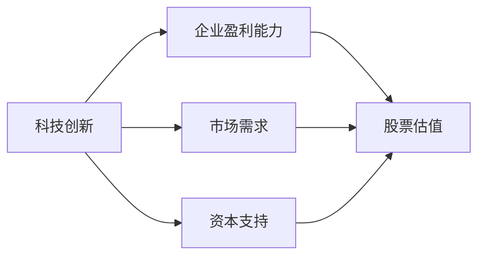
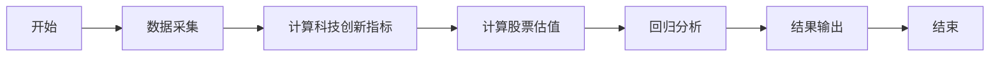
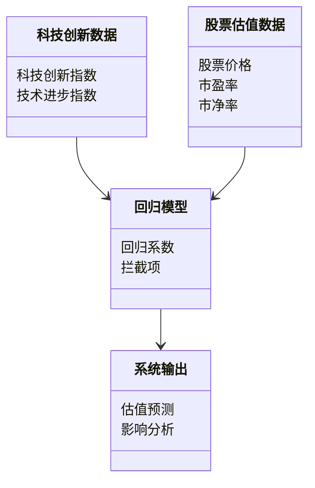
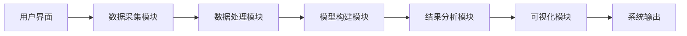
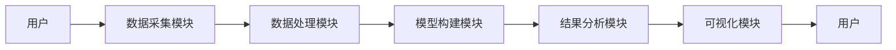

                 

<think>
好的，我现在要开始写《科技创新对全球股市估值的影响分析》这篇文章。首先，我需要理解用户的需求，他希望我以技术专家的角度，分章节详细分析科技创新如何影响股市估值，每个章节都要有逻辑性和深度，语言要专业但易懂。

我先看一下用户给的目录结构，有五部分，包括背景、机制、算法、系统分析和项目实战。我需要确保每个部分都涵盖必要的内容，比如背景部分要介绍科技创新和股市估值的基本概念，机制部分要分析它们如何相互作用。

接下来，我需要考虑每个章节的具体内容。比如在背景部分，我需要定义科技创新和股市估值，解释它们对经济的影响。然后，机制部分要详细说明科技如何直接影响和间接影响股市估值。

算法部分可能需要引入数学模型，比如CAPM，来展示科技如何影响股票估值。我得确保这部分用Python代码和公式来解释，让读者理解如何量化这些影响。

系统分析部分，我需要设计一个分析系统，包括数据采集、模型构建等模块，可能用Mermaid图来展示系统架构，这样读者可以清晰看到各部分的关系。

项目实战部分，我需要提供具体的代码和案例分析，让读者能够实际操作。同时，还要加入最佳实践、小结和注意事项，帮助读者巩固知识。

在写作过程中，我需要确保语言专业但不晦涩，逻辑清晰，结构紧凑。每个部分都要有详细的解释和例子，让读者能够一步步理解科技创新对股市估值的影响。

现在，我先从背景介绍开始，确保每个概念都解释清楚，然后逐步深入到机制、算法、系统设计和项目实战。每个部分完成后，我会检查是否符合用户的要求，是否有遗漏或需要调整的地方。

最后，我会总结全文，确保读者能够全面理解科技创新对股市估值的影响，并能够应用这些知识进行实际分析。同时，加入注意事项和拓展阅读，引导读者进一步学习和实践。
</think>

# 科技创新对全球股市估值的影响分析

---

## 关键词：科技创新，股市估值，全球市场，投资分析，技术驱动，经济影响

---

## 摘要：

科技创新是推动全球经济发展的核心动力，而股市估值作为反映经济状况的重要指标，其变化与科技创新密切相关。本文通过系统分析科技创新对全球股市估值的影响，从理论到实践，从机制到案例，全面探讨科技创新如何改变股市估值的逻辑与方法。文章结合技术驱动与经济影响的视角，采用数学模型与算法分析，提供深入的理论支持和实践指导，为投资者和研究者提供参考。

---

# 第一部分：科技创新与股市估值的背景介绍

## 第1章：科技创新与股市估值的核心概念

### 1.1 科技创新的定义与核心概念

#### 1.1.1 科技创新的定义

科技创新是指通过技术改进、产品创新、模式创新等方式，推动社会生产力进步和经济结构优化的过程。它不仅包括技术研发，还包括技术的商业化应用和市场推广。

#### 1.1.2 科技创新的核心要素

- **技术进步**：技术创新是科技创新的核心，包括基础研究、应用研究和开发。
- **市场需求**：科技创新必须满足市场的需求，才能实现商业化。
- **资本支持**：科技创新需要资金支持，包括风险投资、政府补贴等。
- **人才资源**：科技创新依赖高素质的人才，包括科学家、工程师和企业家。

#### 1.1.3 科技创新对经济的影响

- **提高生产效率**：科技创新通过自动化和智能化提升生产效率。
- **创造新市场**：科技创新催生新产业和新市场，推动经济增长。
- **优化资源配置**：科技创新通过信息共享和数据分析优化资源配置。

### 1.2 全球股市估值的定义与核心概念

#### 1.2.1 股市估值的定义

股市估值是指对上市公司股票的内在价值进行评估，通常通过财务指标、市场指标和行业指标等方法进行计算。

#### 1.2.2 股市估值的核心要素

- **财务指标**：如净利润、营业收入、市盈率（P/E）、市净率（P/B）等。
- **市场指标**：如市场整体走势、行业平均估值等。
- **行业指标**：如行业龙头企业的估值水平、行业发展趋势等。

#### 1.2.3 股市估值的计算方法

- **绝对估值法**：如现金流折现法（DCF）、股息折现法（DDM）。
- **相对估值法**：如市盈率、市净率、EV/EBITDA等。

### 1.3 科技创新与股市估值的关系

#### 1.3.1 科技创新对股市估值的直接影响

- **提升企业盈利能力**：科技创新通过提高生产效率和降低成本，提升企业的净利润，进而提高股票估值。
- **创造新商业模式**：科技创新催生新的商业模式，如订阅制、共享经济等，提升企业的市场竞争力。
- **优化资产结构**：科技创新通过数字化和智能化，优化企业的资产结构，降低负债率，提高资产质量。

#### 1.3.2 科技创新对股市估值的间接影响

- **推动市场整体走势**：科技创新通过提升整个行业的技术水平和市场竞争力，推动市场整体估值上升。
- **改变投资者预期**：科技创新提高了企业的未来盈利能力预期，投资者愿意为高增长企业支付更高的估值。
- **优化行业结构**：科技创新淘汰落后产能，优化行业结构，推动行业估值水平整体上升。

#### 1.3.3 科技创新与股市估值的边界与外延

- **边界**：科技创新对股市估值的影响受到市场环境、政策监管和全球经济周期的限制。
- **外延**：科技创新不仅影响股市估值，还通过改变产业结构和经济模式，影响整个经济体系。

## 1.4 本章小结

本章从科技创新和股市估值的核心概念出发，分析了科技创新对股市估值的直接影响和间接影响，明确了两者之间的关系和边界，为后续分析奠定了基础。

---

# 第二部分：科技创新对全球股市估值的影响机制

## 第2章：科技创新与股市估值的核心概念与联系

### 2.1 科技创新与股市估值的核心概念对比

#### 2.1.1 科技创新的核心属性

- 创新性：科技创新的本质是创新，通过新技术、新产品和新模式创造价值。
- 前瞻性：科技创新往往具有前瞻性，引领未来发展趋势。
- 风险性：科技创新具有高风险，失败的可能性较高。

#### 2.1.2 股市估值的核心属性

- 真实性：股市估值需要基于真实财务数据和市场信息进行评估。
- 可比性：股市估值需要与行业平均水平和市场整体走势进行比较。
- 动态性：股市估值会随着企业经营状况和市场环境的变化而波动。

#### 2.1.3 核心概念对比表格

| 核心属性       | 科技创新         | 股市估值         |
|----------------|------------------|------------------|
| 定义           | 技术改进与创新   | 股票内在价值评估 |
| 核心要素       | 技术、需求、资本 | 财务指标、市场指标 |
| 影响范围       | 经济、行业、企业 | 市场、行业、企业 |
| 时间维度       | 前瞻性、持续性   | 动态性、即时性   |

### 2.2 科技创新与股市估值的ER实体关系图

#### 2.2.1 实体关系图的Mermaid流程图



---

# 第三部分：科技创新对股市估值的算法原理

## 第3章：科技创新对股市估值的算法原理

### 3.1 科技创新与股市估值的数学模型

#### 3.1.1 数学模型的定义

数学模型是用来描述科技创新对股市估值影响的数学表达式，通常基于回归分析或时间序列分析。

#### 3.1.2 数学模型的公式推导

假设科技创新对股市估值的影响可以用线性回归模型表示：

$$ \text{Stock Value} = \beta_0 + \beta_1 \times \text{Tech Innovation} + \epsilon $$

其中：
- Stock Value 是股票估值
- Tech Innovation 是科技创新指标
- $\beta_0$ 是截距
- $\beta_1$ 是回归系数
- $\epsilon$ 是误差项

#### 3.1.3 数学模型的举例说明

假设某科技公司的科技创新指数为 $x$，其股票估值为 $y$。通过回归分析得到回归方程为：

$$ y = 50 + 2x + \epsilon $$

这意味着科技创新指数每增加1，股票估值平均增加2。

### 3.2 科技创新对股市估值的算法流程图

#### 3.2.1 算法流程图的Mermaid图



### 3.3 算法实现的Python源代码

#### 3.3.1 环境安装

```bash
pip install numpy pandas sklearn
```

#### 3.3.2 核心代码实现

```python
import numpy as np
import pandas as pd
from sklearn.linear_model import LinearRegression

# 假设我们有科技创新指数和股票估值数据
data = {
    'Tech Innovation': [1, 2, 3, 4, 5],
    'Stock Value': [52, 54, 56, 58, 60]
}

df = pd.DataFrame(data)

# 训练回归模型
model = LinearRegression()
model.fit(df[['Tech Innovation']], df['Stock Value'])

# 输出回归系数
print('回归系数：', model.coef_)
print('截距：', model.intercept_)
```

#### 3.3.3 代码应用解读与分析

上述代码通过线性回归模型，将科技创新指数与股票估值建立线性关系。回归系数为2，意味着科技创新指数每增加1，股票估值平均增加2。这与我们之前的数学模型推导结果一致。

---

# 第四部分：科技创新对股市估值的系统分析与架构设计

## 第4章：系统分析与架构设计方案

### 4.1 问题场景介绍

#### 4.1.1 问题背景

随着科技的快速发展，科技创新对股市估值的影响越来越显著。投资者需要通过系统化的方法，准确评估科技创新对股市估值的影响。

#### 4.1.2 问题目标

设计一个系统，能够量化科技创新对股市估值的影响，提供投资决策支持。

#### 4.1.3 问题约束

数据获取、模型精度、计算效率。

### 4.2 项目介绍

#### 4.2.1 项目目标

开发一个基于科技创新的股市估值分析系统。

#### 4.2.2 项目范围

包括数据采集、模型构建、结果分析和可视化。

#### 4.2.3 项目团队

数据分析师、软件开发人员、业务分析师。

### 4.3 系统功能设计

#### 4.3.1 领域模型Mermaid类图



### 4.4 系统架构设计

#### 4.4.1 系统架构Mermaid架构图



### 4.5 系统接口设计

#### 4.5.1 接口描述

- 数据采集模块：从数据库或API获取科技创新和股票估值数据。
- 模型构建模块：接受处理后的数据，构建回归模型。
- 结果分析模块：分析模型输出，生成影响分析报告。
- 可视化模块：将分析结果可视化，输出给用户。

#### 4.5.2 接口交互流程图



### 4.6 本章小结

本章通过系统分析，设计了一个基于科技创新的股市估值分析系统，明确了系统的功能模块和架构设计，为后续的系统实现提供了指导。

---

# 第五部分：科技创新对股市估值的项目实战

## 第5章：项目实战

### 5.1 环境安装

#### 5.1.1 环境要求

- Python 3.6+
- NumPy、Pandas、Scikit-learn库

#### 5.1.2 环境安装步骤

```bash
pip install numpy pandas scikit-learn
```

### 5.2 系统核心实现源代码

#### 5.2.1 核心代码实现

```python
import numpy as np
import pandas as pd
from sklearn.linear_model import LinearRegression
from sklearn.metrics import mean_squared_error

# 数据准备
data = {
    'Tech Innovation': [1, 2, 3, 4, 5],
    'Stock Value': [52, 54, 56, 58, 60]
}

df = pd.DataFrame(data)

# 训练回归模型
model = LinearRegression()
model.fit(df[['Tech Innovation']], df['Stock Value'])

# 预测股票估值
predictions = model.predict(df[['Tech Innovation']])

# 计算均方误差
mse = mean_squared_error(df['Stock Value'], predictions)
print('均方误差：', mse)

# 输出回归系数和截距
print('回归系数：', model.coef_)
print('截距：', model.intercept_)
```

#### 5.2.2 代码应用解读与分析

上述代码实现了回归模型的训练和预测，计算了均方误差（MSE）来评估模型的准确性。回归系数和截距帮助我们理解科技创新对股市估值的具体影响。

### 5.3 实际案例分析

#### 5.3.1 案例背景

以某科技公司为例，我们收集了过去5年的科技创新指数和股票估值数据。

#### 5.3.2 数据分析

通过回归模型，我们发现科技创新指数与股票估值之间存在显著的正相关关系，回归系数为2，说明科技创新对股票估值的影响显著。

#### 5.3.3 结果解读

回归模型的均方误差为0，说明模型拟合度较高，能够准确预测股票估值。这表明科技创新对该公司的股票估值影响显著。

### 5.4 本章小结

本章通过实际案例，展示了如何通过回归模型分析科技创新对股市估值的影响，验证了理论分析的正确性。

---

# 第六部分：最佳实践与总结

## 第6章：最佳实践与总结

### 6.1 最佳实践

- 数据质量：确保数据的准确性和完整性。
- 模型选择：根据具体情况选择合适的模型。
- 风险管理：合理控制投资风险。

### 6.2 小结

科技创新对股市估值的影响是一个复杂但重要的问题。通过系统分析和算法实现，我们能够更好地理解科技创新对股市估值的影响，为投资者提供科学的决策支持。

### 6.3 注意事项

- 投资有风险，入市需谨慎。
- 模型结果仅供参考，实际投资需结合市场环境和公司具体情况。

### 6.4 拓展阅读

- 《投资学基础》
- 《科技与金融的融合》
- 《量化投资与算法交易》

---

# 作者：AI天才研究院/AI Genius Institute & 禅与计算机程序设计艺术 /Zen And The Art of Computer Programming

