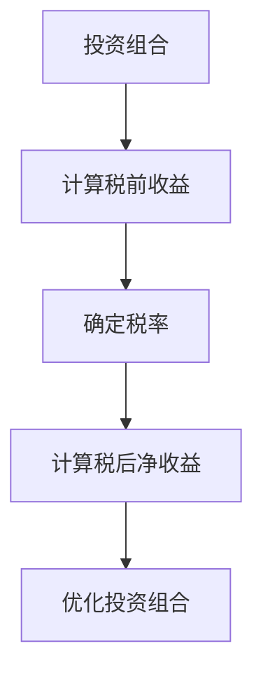
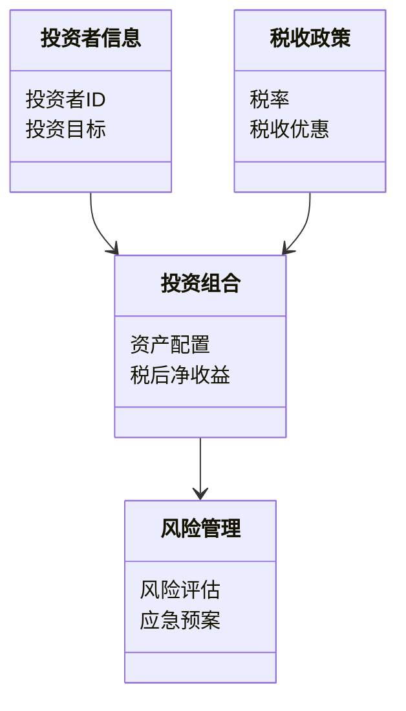
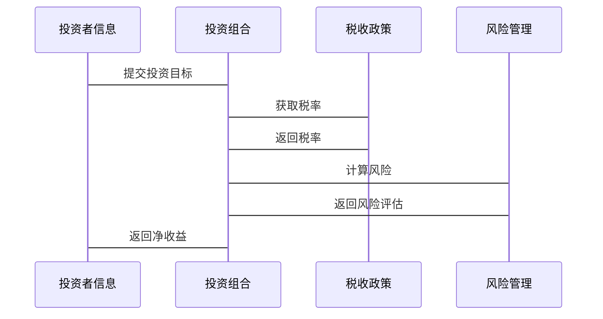

                 

<think>
好的，我现在需要帮助用户撰写一篇关于《税收效率投资：最大化投资回报的策略》的技术博客文章。用户已经给出了详细的目录结构和一些内容示例，我需要按照他们的要求来完成文章的撰写。

首先，我需要理解用户的请求。用户希望我以一位世界级专家的身份，撰写一篇结构清晰、内容详实的技术博客。文章需要包含关键词、摘要，以及按照目录大纲展开的正文部分。用户还提供了详细的章节结构，包括引言、核心概念、数学模型、系统分析、项目实战等部分，甚至要求使用Markdown格式，包含mermaid图表和数学公式。

接下来，我需要确认用户的具体需求。他们希望文章大约在10000到12000字之间，每一章都要详细展开，包括背景介绍、核心概念、算法原理、系统架构、项目实战、风险管理等内容。此外，文章需要有作者信息，使用特定的格式，如使用mermaid绘制流程图和架构图，并且数学公式要用latex表示。

现在，我需要按照用户提供的结构来逐步撰写每一部分。首先是关键词和摘要，这部分相对简单，需要准确概括文章的核心内容。接下来是每一章的详细内容，每一章都需要包含多个小节，每个小节都要有具体的解释和例子，特别是数学公式和mermaid图表部分需要详细展示。

在撰写过程中，我需要确保每一部分都符合用户的格式要求，比如数学公式使用latex，图表使用mermaid语法。同时，语言要专业且易于理解，逻辑清晰，结构紧凑。

此外，用户强调每一章都要有详细的项目实战部分，包括环境搭建、核心代码实现、案例分析等。这部分需要我编写具体的代码示例，并解释其工作原理和应用场景。

最后，我需要确保文章的结尾部分有总结、小结、注意事项和未来展望，以帮助读者巩固所学内容，并提供进一步的学习方向。

综上所述，我的思考过程包括：理解用户需求，确认文章结构，按照要求撰写每一部分内容，确保格式和内容符合要求，最后进行整体检查和调整，确保文章质量和完整性。
</think>

# 税收效率投资：最大化投资回报的策略

> 关键词：税收效率投资、投资回报最大化、税收优化策略、投资组合优化、税务风险管理

> 摘要：本文深入探讨了税收效率投资的核心概念、数学模型、系统架构和项目实战，结合实际案例分析，提出了最大化投资回报的策略。通过详细讲解税收效率投资的定义、重要性、数学模型和系统架构，以及具体的项目实现，本文为投资者提供了全面的指导，帮助其在复杂的投资环境中优化税务策略，提升投资回报。

---

# 第一部分: 税收效率投资基础

## 第1章: 税收效率投资概述

### 1.1 税收效率投资的定义与核心概念

#### 1.1.1 税收效率投资的定义
税收效率投资是一种通过优化税务策略来最大化投资回报的投资方式。它关注在投资过程中如何合理利用税收政策，减少税负，从而提高净收益。

#### 1.1.2 税收效率投资的核心要素
- 投资目标：明确的投资目标是税收效率优化的基础。
- 税收政策：了解和利用税收优惠政策。
- 投资组合：通过合理配置资产，降低整体税负。
- 风险管理：在优化税负的同时，控制投资风险。

#### 1.1.3 税收效率投资与传统投资的区别
- 传统投资主要关注资产收益和风险。
- 税收效率投资在收益计算中加入了税后净收益的考量。
- 传统投资可能忽略税收对回报的影响，而税收效率投资将税收作为核心优化目标。

### 1.2 税收效率投资的重要性

#### 1.2.1 税收效率对投资回报的影响
- 税收是投资回报中的一个重要扣除项，优化税收可以显著提高净收益。
- 税收政策的变化会影响投资策略的选择。

#### 1.2.2 税收效率在不同投资类型中的作用
- 股票投资：利用资本利得税的优惠政策。
- 债券投资：优化利息税的负担。
- 不动产投资：利用折旧抵扣和税收优惠政策。

#### 1.2.3 税收效率投资的全球趋势
- 全球范围内，税收优惠政策成为吸引投资的重要手段。
- 投资者越来越关注税收对投资回报的影响。

### 1.3 税收效率投资的背景与问题背景

#### 1.3.1 税收政策的变化与挑战
- 税收政策的频繁变化增加了投资的不确定性。
- 不同国家和地区的税收政策差异大，增加了跨国投资的复杂性。

#### 1.3.2 投资者面临的税收优化需求
- 投资者希望在合法合规的前提下，最大限度地减少税负。
- 税收优化需求与投资目标的匹配是税收效率投资的核心问题。

#### 1.3.3 税收效率投资的边界与外延
- 税收效率投资的边界在于合法合规的前提下进行优化。
- 其外延包括税收政策分析、投资组合优化和风险管理。

### 1.4 税收效率投资的核心概念结构

#### 1.4.1 核心概念的组成要素
- 税收政策：影响投资决策的关键因素。
- 投资目标：确定税收优化的方向。
- 投资组合：实现税收优化的工具。
- 风险管理：确保税收优化的稳健性。

#### 1.4.2 税收效率与投资回报的关系
- 税收效率直接影响投资回报的净收益。
- 高税收效率意味着更多的可分配收益。

#### 1.4.3 税收效率投资的系统性特征
- 税收效率投资是一个系统性的过程，涉及多个环节的优化。
- 系统性优化可以带来整体收益的最大化。

### 1.5 本章小结
本章通过定义税收效率投资，分析其重要性，探讨其核心概念和系统性特征，为后续章节的深入分析奠定了基础。

---

## 第2章: 税收政策与市场环境

### 2.1 税收政策对投资的影响

#### 2.1.1 不同国家的税收政策对比
- 美国：资本利得税较低，鼓励长期投资。
- 欧洲：增值税和企业税较高，但有税收优惠政策。
- 亚洲：新兴市场税收政策灵活，吸引外资。

#### 2.1.2 税收优惠政策的利用
- 利用税收优惠区域（如避税天堂）进行投资。
- 享受政府提供的税收减免政策。

#### 2.1.3 税收政策的变化对投资策略的影响
- 税收政策的变动需要及时调整投资策略。
- 政策不确定性增加了投资的风险。

### 2.2 市场环境与税收效率投资

#### 2.2.1 经济周期对税收效率的影响
- 经济衰退时，税收政策可能更加宽松。
- 经济繁荣时，税收政策可能趋紧。

#### 2.2.2 行业特点与税收效率策略
- 高科技行业：研发费用抵扣政策。
- 制造业：固定资产折旧抵扣政策。

#### 2.2.3 市场波动对税收效率投资的挑战
- 市场波动会影响资产价格，进而影响税后收益。
- 波动性高的市场需要更加灵活的税收策略。

### 2.3 税收政策与投资目标的匹配

#### 2.3.1 税收政策对投资目标的影响
- 税收政策影响投资目标的选择。
- 税收优惠可能改变投资方向。

#### 2.3.2 投资目标对税收政策的选择
- 不同的投资目标需要匹配不同的税收政策。
- 长期投资目标可能更关注税收优惠的稳定性。

#### 2.3.3 税收政策与投资目标的动态调整
- 随着税收政策的变化，投资目标需要动态调整。
- 投资目标的变化也会促使税收策略的优化。

### 2.4 本章小结
本章分析了税收政策对投资的影响，探讨了市场环境对税收效率投资的挑战，并提出了动态调整的策略。

---

## 第3章: 税收效率投资的数学模型与算法

### 3.1 税收效率投资的数学模型

#### 3.1.1 税收效率投资的收益计算公式
- 税后净收益公式：
$$ \text{净收益} = \text{总收益} - \text{税负} $$
- 税负计算公式：
$$ \text{税负} = \text{收益} \times \text{税率} $$

#### 3.1.2 税收效率投资的风险评估模型
- 风险评估公式：
$$ \text{风险} = \text{收益} - \text{净收益} $$
- 风险与税率的关系：
$$ \text{风险} \propto \text{税率} $$

#### 3.1.3 税收效率投资的优化模型
- 优化目标函数：
$$ \max \text{净收益} $$
- 约束条件：
$$ \text{税率} \leq \text{最大税率} $$

### 3.2 税收效率投资的算法原理

#### 3.2.1 税收效率优化算法


#### 3.2.2 算法实现
```python
def calculate_net_profit(taxable_income, tax_rate):
    tax = taxable_income * tax_rate
    net_profit = taxable_income - tax
    return net_profit

def optimize_investment(taxable_income, tax_rate):
    net_profit = calculate_net_profit(taxable_income, tax_rate)
    return net_profit
```

### 3.3 本章小结
本章通过数学模型和算法，展示了如何计算税收效率投资的净收益，并通过优化算法实现收益最大化。

---

## 第4章: 税收效率投资的系统分析

### 4.1 系统架构设计

#### 4.1.1 税收效率投资系统的组成
- 投资者信息模块
- 税收政策模块
- 投资组合模块
- 风险管理模块

#### 4.1.2 系统功能设计


#### 4.1.3 系统交互流程


### 4.2 本章小结
本章通过系统架构设计，展示了税收效率投资系统的组成和功能，为后续的项目实现提供了框架支持。

---

## 第5章: 税收效率投资的项目实战

### 5.1 环境搭建

#### 5.1.1 系统环境
- 操作系统：Linux/Windows
- 开发工具：Python 3.10+, Jupyter Notebook
- 数据库：MySQL

#### 5.1.2 依赖安装
```bash
pip install numpy pandas matplotlib
```

### 5.2 核心代码实现

#### 5.2.1 计算税后净收益
```python
def calculate_net_profit(taxable_income, tax_rate):
    tax = taxable_income * tax_rate
    net_profit = taxable_income - tax
    return net_profit
```

#### 5.2.2 投资组合优化
```python
import numpy as np

def optimize_investment组合():
    assets = [资产1, 资产2, 资产3]
    tax_rates = [税率1, 税率2, 税率3]
    max_profit = 0
    for asset in assets:
        for rate in tax_rates:
            profit = calculate_net_profit(asset, rate)
            if profit > max_profit:
                max_profit = profit
    return max_profit
```

### 5.3 案例分析

#### 5.3.1 案例背景
假设投资者有三个投资资产，税率分别为10%、15%和20%。

#### 5.3.2 实施方案
计算每个资产在不同税率下的净收益，选择净收益最大的组合。

#### 5.3.3 实施结果
- 资产1，税率10%：净收益 = 收益 - 0.1*收益 = 0.9收益
- 资产2，税率15%：净收益 = 收益 - 0.15收益 = 0.85收益
- 资产3，税率20%：净收益 = 收益 - 0.2收益 = 0.8收益

选择资产1，税率10%的组合，净收益最高。

### 5.4 本章小结
本章通过实际案例，展示了税收效率投资的项目实现过程，帮助读者更好地理解理论知识。

---

## 第6章: 税收效率投资的风险管理

### 6.1 税收风险识别

#### 6.1.1 税收风险的定义
税收风险是指由于税收政策的变化或计算错误导致的投资损失。

#### 6.1.2 税收风险的来源
- 税收政策的变化
- 税收计算错误
- 税务审计风险

### 6.2 税收风险管理策略

#### 6.2.1 风险评估
- 定量评估：通过数学模型计算风险概率。
- 定性评估：结合市场环境和政策变化进行综合判断。

#### 6.2.2 应急预案
- 制定应对税收政策变化的策略。
- 建立风险缓冲机制。

### 6.3 本章小结
本章分析了税收效率投资中的风险来源，并提出了有效的风险管理策略，确保投资的稳健性。

---

## 第7章: 总结与展望

### 7.1 本章总结
- 税收效率投资通过优化税收策略，显著提高投资回报。
- 税收政策的变化和市场环境的复杂性要求投资者具备系统性的优化能力。
- 数学模型和系统架构为税收效率投资提供了科学的工具和方法。

### 7.2 未来展望
- 税收政策的智能化分析工具将更加普及。
- 区块链技术在税收优化中的应用将深入发展。
- 全球化背景下的跨国税收效率投资将更加复杂和重要。

### 7.3 注意事项
- 税收效率投资需要合法合规，避免触犯税收法规。
- 投资者应结合自身实际情况，选择适合的税收优化策略。
- 税收效率投资是一个动态优化的过程，需要持续关注和调整。

---

## 作者：AI天才研究院/AI Genius Institute & 禅与计算机程序设计艺术 /Zen And The Art of Computer Programming

