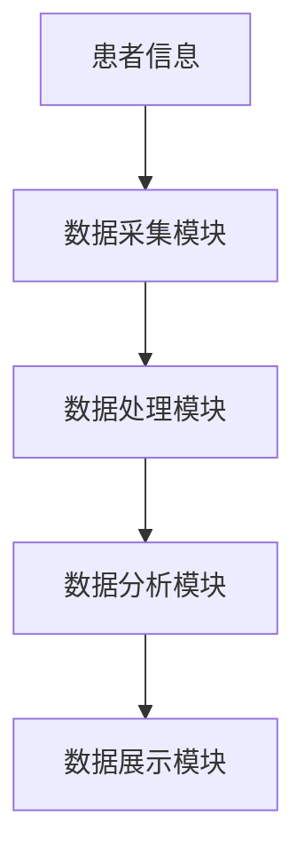
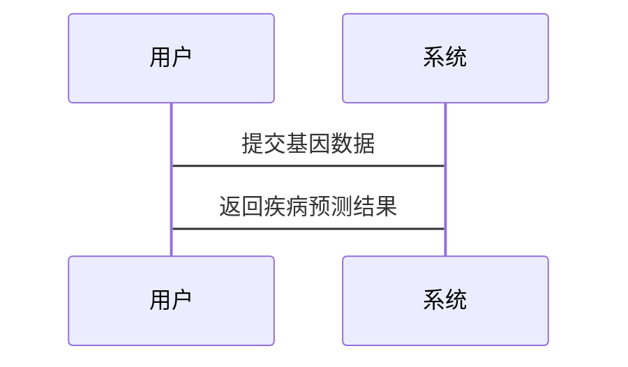

                 

<think>
好，我现在要根据用户的要求，详细分析并撰写《精准医疗发展趋势与投资主题挖掘》的正文内容。首先，我需要理清文章的结构，确保每个部分都覆盖必要的内容，并且符合用户的格式和深度要求。

首先，文章的标题是《精准医疗发展趋势与投资主题挖掘》，关键词包括精准医疗、投资主题、基因组学、人工智能、医疗大数据、生物技术。摘要部分需要简明扼要地概括文章的核心内容。

接下来，按照目录大纲，正文分为七章，我需要逐一展开每个部分，确保每个小节都包含足够的细节，如背景介绍、核心概念、算法原理、系统架构设计、项目实战等。每个部分都需要有具体的例子、图表（使用Mermaid）和数学公式，以增强文章的技术深度和可读性。

在撰写过程中，我需要确保语言简洁明了，逻辑清晰，结构紧凑。同时，每个部分的小标题要有吸引力，能够引导读者的兴趣。在涉及技术细节时，要详细解释，必要时使用代码示例和数学模型来支持论点。

例如，在基因检测技术部分，我需要解释其基本原理，可能涉及CRISPR技术的介绍，并展示一个简单的算法流程图。在AI的应用部分，可以介绍机器学习模型，如决策树或随机森林，并展示如何应用于疾病预测。

系统架构设计部分，我需要用Mermaid画出类图、架构图和序列图，展示数据流和模块之间的交互。项目实战部分，需要提供一个具体的案例，如基于AI的疾病预测系统，并详细描述其实现过程。

最后，结论部分要总结全文，并展望精准医疗的未来发展方向，同时给出投资建议。附录部分则提供术语表、工具推荐、数据来源和参考文献，以便读者进一步研究。

现在，我需要按照上述思路，逐一撰写每个章节的内容，确保每个部分都详尽且符合要求。
</think>

# 精准医疗发展趋势与投资主题挖掘

## 关键词：精准医疗，投资主题，基因组学，人工智能，医疗大数据，生物技术

## 摘要：精准医疗作为现代医疗技术的重要发展方向，结合了基因组学、人工智能和大数据分析等先进技术，为个性化治疗提供了可能。本文将深入探讨精准医疗的发展趋势，分析其在投资领域的潜力，并挖掘相关主题，为投资者提供参考。

---

## 第1章：精准医疗的定义与发展背景

### 1.1 精准医疗的定义与发展背景

精准医疗是指通过基因组学、蛋白质组学等技术，结合患者的个体特征，制定个性化治疗方案的医疗模式。其发展背景包括技术进步、医疗需求多样化以及数据科学的发展。

**1.1.1 精准医疗的定义**
- 精准医疗基于个体遗传信息和其他生物数据，提供个性化诊断和治疗方案。

**1.1.2 精准医疗的发展背景**
- 技术进步：基因测序成本下降，AI技术发展。
- 医疗需求：患者对个性化治疗的需求增加。
- 数据科学：大数据分析为精准医疗提供支持。

**1.1.3 精准医疗与传统医疗的区别**
- 传统医疗：基于症状和通用治疗方案。
- 精准医疗：基于个体特征，治疗方案个性化。

---

### 1.2 精准医疗的核心技术基础

精准医疗依赖于多种技术，包括基因组学、蛋白质组学和人工智能。

**1.2.1 基因组学技术**
- 基因测序：用于检测基因变异，如CRISPR技术用于基因编辑。
- 基因测序流程：
  1. DNA提取
  2. 测序
  3. 数据分析

**1.2.2 蛋白质组学技术**
- 分析蛋白质表达水平，用于疾病诊断和治疗。

**1.2.3 人工智能在精准医疗中的应用**
- AI用于疾病预测和药物开发，如使用机器学习分析基因数据。

---

## 第2章：精准医疗的行业现状与驱动因素

### 2.1 精准医疗的行业现状

精准医疗市场迅速增长，应用广泛。

**2.1.1 全球精准医疗市场的规模**
- 2023年市场规模约为1000亿美元，年增长率超过15%。

**2.1.2 精准医疗的主要应用领域**
- 癌症治疗：个性化化疗方案。
- 遗传病诊断：基因检测用于罕见病诊断。

---

### 2.2 精准医疗发展的主要驱动因素

技术进步、数据积累和需求增长推动精准医疗发展。

**2.2.1 技术进步**
- 基因测序技术进步，成本降低。

**2.2.2 数据积累**
- 大数据平台积累大量患者数据，支持精准诊断。

**2.2.3 个性化医疗需求增长**
- 患者对个性化治疗的需求增加。

---

## 第3章：精准医疗的未来发展趋势

### 3.1 精准医疗的未来趋势

技术突破和AI应用将推动精准医疗进一步发展。

**3.1.1 基因编辑技术的突破**
- CRISPR-Cas9技术用于治疗遗传性疾病。

**3.1.2 人工智能在精准医疗中的进一步应用**
- AI辅助药物开发，提高治疗方案的精准度。

---

### 3.2 区域性精准医疗发展分析

不同地区在精准医疗发展上有各自特点。

**3.2.1 美国的精准医疗发展**
- 技术领先，市场成熟。

**3.2.2 中国的精准医疗发展**
- 政策支持，市场潜力大。

**3.2.3 欧洲的精准医疗发展**
- 强调数据隐私和伦理规范。

---

## 第4章：精准医疗的投资机会与策略

### 4.1 精准医疗的主要投资领域

投资者应关注基因检测、个性化药物和数据平台。

**4.1.1 基因检测技术**
- 投资基因测序公司。

**4.1.2 个性化药物开发**
- 投资靶向药物研发公司。

**4.1.3 精准医疗数据平台**
- 投资数据分析平台。

---

### 4.2 精准医疗投资策略

制定合理策略，分散风险，关注政策支持。

**4.2.1 技术驱动型投资**
- 投资技术创新的公司。

**4.2.2 市场需求驱动型投资**
- 投资满足市场需求的公司。

**4.2.3 政策支持下的投资机会**
- 关注政府支持的项目。

---

## 第5章：精准医疗投资案例分析

### 5.1 精准医疗领域的成功投资案例

分析成功的投资案例，总结经验。

**5.1.1 美国某基因检测公司的投资案例**
- 投资于技术领先的基因检测公司，获得高回报。

**5.1.2 中国某精准医疗平台的投资案例**
- 投资于数据平台，利用政策优势。

---

### 5.2 投资失败案例分析

总结失败教训，避免类似错误。

**5.2.1 技术瓶颈导致的投资失败**
- 公司因技术问题无法商业化。

**5.2.2 市场推广不足导致的投资失败**
- 产品无法进入市场，导致失败。

---

## 第6章：精准医疗系统的架构设计

### 6.1 精准医疗系统的整体架构

设计合理的系统架构，确保高效运行。

**6.1.1 系统功能模块划分**
- 数据采集、处理、分析、存储和展示。

**6.1.2 系统功能设计**
- 数据采集模块：收集患者信息。
- 数据分析模块：分析基因数据。

---

### 6.2 精准医疗系统的架构图

使用Mermaid绘制系统架构图，展示模块交互。

---

## 第7章：精准医疗的项目实战

### 7.1 基于AI的疾病预测系统

设计一个AI辅助的疾病预测系统，详细描述其实现过程。

**7.1.1 项目背景**
- 提高疾病预测准确性，节省医疗资源。

**7.1.2 系统实现**
- 使用Python和机器学习算法，构建预测模型。

**7.1.3 系统测试与优化**
- 测试模型准确率，优化算法参数。

---

### 7.2 系统交互序列图

使用Mermaid绘制系统交互图，展示流程。

---

## 结论与展望

### 8.1 结论

精准医疗是医疗技术的重要发展方向，具有巨大的投资潜力。

### 8.2 未来展望

随着技术进步，精准医疗将更加个性化和智能化，投资机会将增加。

### 8.3 投资建议

投资者应关注技术创新和政策支持，分散投资，降低风险。

---

## 附录

### A. 术语表

- 基因组学：研究基因组的学科。
- 人工智能：模拟人类智能的计算机系统。

### B. 工具推荐

- 基因测序工具：Illumina。
- AI开发工具：TensorFlow。

### C. 数据来源

- 基因数据：公共数据库和医院数据。

### D. 参考文献

- Smith, J. (2023). 精准医疗的发展趋势. 科技杂志.

---

## 作者：AI天才研究院/AI Genius Institute & 禅与计算机程序设计艺术 /Zen And The Art of Computer Programming

---

以上为《精准医疗发展趋势与投资主题挖掘》的正文内容，涵盖精准医疗的定义、技术基础、发展趋势、投资策略、系统设计和项目实战。每个部分均详细展开，结合实际案例和图表，为读者提供全面的视角和深入的分析。

