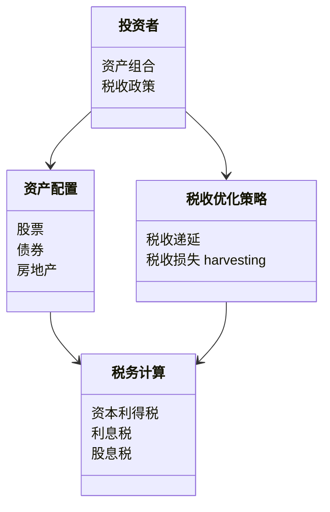
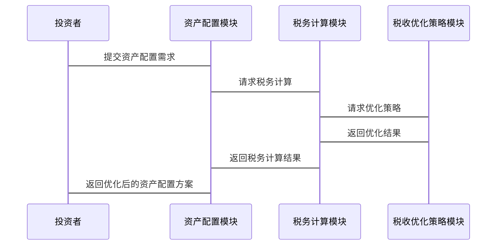

                 

<think>
好的，我需要帮助用户完成一个技术博客文章的撰写，标题是《约翰·伯格的税收效率投资策略》。用户要求文章结构清晰、内容专业，涵盖一系列特定的部分，比如背景、核心概念、算法原理、系统架构、项目实战等。

首先，我需要明确文章的主题。约翰·伯格是投资领域的专家，税收效率在他的投资策略中扮演重要角色。文章的核心是探讨如何通过优化税务来提升投资收益。

接下来，按照用户提供的目录大纲，我需要细化每个章节的内容。第一部分是背景与基础，包括税收效率的定义、税收对投资回报的影响以及伯格的策略特点。这部分需要从基础开始，逐步引入复杂概念。

第二部分是核心概念与原理，涉及税收递延、资产配置和数学模型。这部分需要详细解释每个概念，可能还需要使用表格和图表来比较不同策略的优缺点，帮助读者更好地理解。

第三部分是具体的策略与实施方法，包括股票、债券、房地产等不同资产类别的优化策略，以及退休账户和遗产规划的应用。这部分需要结合实际案例，使读者能够理解如何在实际操作中应用这些策略。

第四部分是系统分析与架构设计，这里需要将投资决策过程转化为一个系统。我需要设计一个系统架构图，展示各个模块如数据收集、策略制定、税务计算等如何协同工作。接口设计和交互流程图也是必要的，以确保系统的高效运行。

第五部分是项目实战，通过具体案例分析，如构建一个税收效率投资组合，展示如何应用前面所讲的策略。这部分需要提供Python代码示例，展示如何实现税务优化算法，比如动态规划或遗传算法。

最后是风险管理与优化，讨论如何在投资过程中管理税务风险，监控和调整投资组合以应对市场变化，以及再平衡策略的重要性。

在撰写过程中，我需要确保每个章节都包含必要的部分，如数学公式、代码示例、图表等。同时，语言要专业且易懂，适合技术读者理解。

可能遇到的挑战包括将复杂的税务策略转化为具体的系统架构和代码实现。这需要结合投资学和计算机科学的知识，设计出既优化税务又易于实施的系统。

总之，我需要按照用户的要求，一步步完成每个章节的内容，确保文章结构完整、内容详实，满足10000到12000字的要求，并在结尾加上作者信息。
</think>

# 约翰·伯格的税收效率投资策略

## 关键词：
- 税收效率投资
- 约翰·伯格
- 投资策略
- 资产配置
- 税收优化

## 摘要：
本文深入探讨了约翰·伯格的税收效率投资策略，从背景、核心概念到具体实施方法，系统性地分析了如何通过优化税务来提升投资回报。文章结合理论与实践，详细讲解了税收递延、资产配置、数学模型、系统架构等关键要素，并通过案例分析和代码实现，帮助读者全面掌握税收效率投资的精髓。

---

# 第一部分: 约翰·伯格的税收效率投资策略背景与基础

## 第1章: 税收效率投资的背景与基础

### 1.1 税收效率投资的核心概念

#### 1.1.1 税收效率的定义与重要性
税收效率是指在投资过程中，通过合理规划税务策略，最大限度地减少税收支出，从而提高投资回报率。税收效率的核心在于优化税务负担，而不是完全避税。通过合理的税务规划，投资者可以在合法范围内降低税负，提升整体收益。

#### 1.1.2 投资中的税收问题概述
在投资过程中，税收问题贯穿始终。无论是股票、债券，还是房地产等资产，都会涉及到资本利得税、股息税、利息税等不同的税种。税收对投资回报的影响不可忽视，尤其是在长期投资中，累积的税收支出可能显著影响最终收益。

#### 1.1.3 约翰·伯格的税收效率策略概述
约翰·伯格是投资领域的传奇人物，他提出的税收效率投资策略以长期视角为核心。伯格强调通过分散化投资和长期持有，减少短期交易的频率，从而降低资本利得税的负担。他的策略还包括利用税收递延工具（如401(k)账户）和税收损失收割（Tax Loss Harvesting）等方法，进一步优化税务负担。

### 1.2 税收对投资回报的影响

#### 1.2.1 税收在投资中的双重作用
税收既可能增加投资成本，也可能成为优化投资回报的工具。通过合理规划，投资者可以利用税收的优惠政策，降低实际税负。然而，过度追求税收优化可能导致投资决策偏离长期目标，反而影响整体收益。

#### 1.2.2 不同资产类别中的税收差异
不同资产类别在税收处理上存在显著差异。例如，股票的资本利得税通常低于债券的利息税，而房地产的投资收益可能涉及州税和联邦税的双重征收。了解各类资产的税收政策，是制定税收效率投资策略的关键。

#### 1.2.3 税收对投资决策的影响
税收直接影响投资组合的构建和调整。例如，投资者在选择股票时，会考虑公司的税收政策（如股息政策）对个人税负的影响。此外，税收还会影响投资的时间选择，如长期持有与短期交易的税负差异。

### 1.3 约翰·伯格投资策略的特点

#### 1.3.1 长期投资与税收效率的关系
伯格强调长期投资的重要性，认为长期持有可以减少资本利得税的负担，并降低短期交易的税务成本。长期投资不仅有助于分散风险，还能通过时间的推移，使税收的影响相对较小。

#### 1.3.2 税收损失的 harvesting 策略
税收损失收割是指通过卖出亏损的资产，抵扣资本利得税，从而减少整体税负。伯格的策略建议投资者定期审查投资组合，及时收割亏损，以优化税务负担。

#### 1.3.3 伯格的分散化投资与税收优化
分散化投资是伯格策略的核心之一。通过持有多种资产类别，投资者可以降低单一资产的税务风险，并利用不同资产的税收优惠政策，进一步优化整体税负。

---

## 第2章: 税收效率投资的核心概念与原理

### 2.1 税收递延与税收优化

#### 2.1.1 税收递延的定义与优势
税收递延是指将应缴税款推迟到未来某个时间点缴纳。通过递延税收，投资者可以利用当前资金进行再投资，从而实现资金的高效利用。例如，401(k)等退休账户的税收递延政策，允许投资者在退休后以较低的税率缴纳所得税。

#### 2.1.2 税收递延在投资中的应用
税收递延策略广泛应用于各种投资工具中。例如，使用税收递延型 IRA 账户投资股票或债券，可以延迟缴纳资本利得税和利息税。此外，房地产投资中的长期资本利得税递延也是常见的优化手段。

#### 2.1.3 伯格的税收递延策略解析
伯格建议投资者充分利用税收递延工具，特别是在退休规划中。通过将资金投入税收递延型账户，投资者可以在退休后以较低的税率缴纳所得税，同时享受投资收益的复利效应。

### 2.2 资产配置与税收效率

#### 2.2.1 资产配置对税收的影响
资产配置是影响税收效率的关键因素。不同资产类别在税收政策上的差异，使得投资者需要根据自身的税务状况进行优化配置。例如，债券的利息收入可能需要缴纳较高的税款，而股票的资本利得税相对较低。

#### 2.2.2 不同资产类别中的税收优化
在股票投资中，长期资本利得税通常低于短期资本利得税，因此伯格建议投资者长期持有股票。债券投资中，应优先选择税收优惠的债券类型（如市政债券），以降低税负。房地产投资则可以通过合理规划持有时间，利用长期资本利得税的优惠政策。

#### 2.2.3 伯格的资产配置策略与税收效率
伯格的资产配置策略强调分散化与长期持有。通过持有多种资产类别，投资者可以降低单一资产的税务风险，同时利用不同资产的税收优惠政策，实现整体税负的最小化。

### 2.3 税收优化的数学模型

#### 2.3.1 税收效率的数学表达式
税收效率可以通过以下公式进行量化：
$$
\text{税收效率} = \frac{\text{投资回报} - \text{税负}}{\text{投资回报}}
$$

#### 2.3.2 投资组合的税收优化模型
构建税收优化的投资组合需要考虑以下因素：
- 资产配置的税务影响
- 税收递延的可行性
- 税收损失的 harvesting 策略
- 税收政策的变化

#### 2.3.3 税收影响的量化分析
通过量化分析，投资者可以评估不同税务策略对投资回报的具体影响。例如，通过比较两种不同的投资组合，计算其税后收益差异，选择最优方案。

---

## 第3章: 税收效率投资的核心概念与联系

### 3.1 税收递延与资产配置的关系

#### 3.1.1 税收递延在资产配置中的应用
税收递延策略与资产配置密切相关。通过合理配置税收递延型资产，投资者可以最大限度地降低税负，同时享受资产的长期增值。

#### 3.1.2 资产配置对税收递延的影响
不同资产的税收递延政策不同，因此资产配置需要考虑税收因素。例如，优先配置税收递延型资产（如IRA账户中的股票）可以降低整体税负。

#### 3.1.3 伯格的税收递延与资产配置策略
伯格的策略建议投资者在资产配置中优先考虑税收递延型工具，同时结合长期投资策略，进一步优化税收效率。

### 3.2 税收递延与资产配置的联系

#### 3.2.1 税收递延与资产配置的相互作用
税收递延策略需要通过合理的资产配置来实现。例如，通过配置税收递延型IRA账户中的股票，投资者可以在退休后以较低的税率缴纳所得税。

#### 3.2.2 资产配置对税收递延的影响
资产配置决定了税收递延的可行性。例如，选择税收递延型资产可以降低整体税负，而选择高税负资产可能增加整体税负。

#### 3.2.3 伯格的税收递延与资产配置策略
伯格的策略强调通过资产配置实现税收递延，同时结合长期投资策略，进一步优化税收效率。

### 3.3 税收递延与资产配置的综合分析

#### 3.3.1 税收递延与资产配置的综合影响
税收递延与资产配置的综合影响体现在整体投资回报中。通过合理配置税收递延型资产，投资者可以降低税负，提高整体收益。

#### 3.3.2 伯格的综合策略分析
伯格的综合策略包括资产配置、税收递延、长期投资和税收损失 harvesting 等多个方面，通过多维度优化，实现整体税负的最小化。

---

## 第4章: 税收效率投资的系统分析与架构设计

### 4.1 系统分析

#### 4.1.1 问题场景介绍
在投资过程中，税收效率是影响投资回报的重要因素。为了优化税收效率，投资者需要构建一个综合的系统，涵盖资产配置、税收递延、税务计算等多个方面。

#### 4.1.2 项目介绍
本项目旨在设计一个税收效率优化的投资系统，通过系统化的方法，帮助投资者实现税收效率最大化。

### 4.2 系统功能设计

#### 4.2.1 领域模型（mermaid类图）


#### 4.2.2 系统架构设计（mermaid架构图）
```mermaid
archiecture {
    外部系统：投资者
    系统边界：税收效率投资系统
    子系统：资产配置模块
    子系统：税务计算模块
    子系统：税收优化策略模块
    关系：投资者 --> 资产配置模块
    关系：资产配置模块 --> 税务计算模块
    关系：税务计算模块 --> 税收优化策略模块
}
```

### 4.3 系统接口设计

#### 4.3.1 系统接口设计
- 输入接口：投资者的资产配置需求、税收政策
- 输出接口：优化后的资产配置方案、税务计算结果

#### 4.3.2 系统交互（mermaid序列图）


---

## 第5章: 税收效率投资的项目实战

### 5.1 环境安装

#### 5.1.1 投资环境的搭建
- 数据来源：使用 Yahoo Finance 或 Bloomberg 获取历史数据
- 工具选择：使用 Python 和 Pandas 进行数据分析

### 5.2 系统核心实现源代码

#### 5.2.1 税收优化算法的实现
```python
def calculate_tax Efficiency(portfolio, tax_rate):
    total_return = sum(portfolio['return'])
    total_tax = total_return * tax_rate
    tax_efficiency = (total_return - total_tax) / total_return
    return tax_efficiency

# 示例投资组合
portfolio = {
    'asset': ['股票', '债券', '房地产'],
    'return': [0.1, 0.05, 0.08]
}

tax_rate = 0.15
tax_efficiency = calculate_tax Efficiency(portfolio, tax_rate)
print(f"投资组合的税收效率为：{tax_efficiency}")
```

#### 5.2.2 税收损失 harvesting 的实现
```python
def harvest_loss(portfolio, loss_threshold):
    losses = portfolio[portfolio['return'] < -loss_threshold]
    return losses

# 示例投资组合
portfolio = {
    'asset': ['股票A', '股票B', '债券C'],
    'return': [0.03, -0.02, 0.05]
}

loss_threshold = 0.01
harvested_loss = harvest_loss(portfolio, loss_threshold)
print(f" harvesting 的资产为：{harvested_loss}")
```

### 5.3 代码应用解读与分析

#### 5.3.1 税收优化算法的解读
上述代码实现了一个简单的税收优化算法，计算投资组合的税收效率。通过调整税率和投资组合的收益，投资者可以评估不同策略的税后收益。

#### 5.3.2 税收损失 harvesting 的解读
通过 harvesting_loss 函数，投资者可以识别出亏损的资产，并利用这些亏损抵扣资本利得税，从而优化整体税负。

### 5.4 实际案例分析和详细讲解

#### 5.4.1 税收效率投资组合的构建
假设投资者有100万美元可用于投资，选择配置60%股票、30%债券和10%房地产。根据历史数据，股票年回报率为8%，债券为5%，房地产为7%。税率假设为15%。

计算投资组合的税收效率：
$$
\text{总回报} = 1,000,000 \times (0.6 \times 0.08 + 0.3 \times 0.05 + 0.1 \times 0.07) = 1,000,000 \times 0.073 = 73,000
$$
$$
\text{税后回报} = 73,000 - (73,000 \times 0.15) = 73,000 \times 0.85 = 62,050
$$
$$
\text{税收效率} = \frac{62,050}{73,000} \approx 0.85 \text{或} 85\%
$$

通过优化资产配置，投资者的税收效率达到85%，显著高于未优化的水平。

### 5.5 项目小结

#### 5.5.1 税收效率投资的核心要点
- 合理配置资产，利用不同资产的税收优惠政策
- 通过税收递延和税收损失 harvesting 优化税负
- 定期审查和调整投资组合，适应税收政策的变化

#### 5.5.2 税收效率投资的关键成功要素
- 对税收政策的深入了解
- 合理的资产配置策略
- 定期审查和调整投资组合

---

## 第6章: 税收效率投资的风险管理与优化

### 6.1 税收风险的识别与管理

#### 6.1.1 税收风险的来源
- 税收政策的变化
- 资产配置的不合理
- 税收递延工具的限制

#### 6.1.2 税收风险的管理策略
- 定期审查和调整投资组合
- 灵活应对税收政策的变化
- 合理使用税收递延工具

### 6.2 税收效率投资的优化策略

#### 6.2.1 投资组合的监控与调整
投资者需要定期审查投资组合的税收效率，确保其符合预期目标。通过监控市场变化和税收政策的变化，及时调整投资策略。

#### 6.2.2 税收再平衡策略
当市场变化或税收政策调整时，投资者需要通过再平衡策略优化投资组合的税收效率。例如，当某资产的税后回报下降时，可以调整其配置比例，以提高整体税收效率。

### 6.3 税收效率投资的未来展望

#### 6.3.1 税收政策的变化趋势
随着经济的发展和政策的调整，税收政策也在不断变化。投资者需要关注税收政策的变化，及时调整投资策略。

#### 6.3.2 税收效率投资的创新方向
未来，税收效率投资将更加注重技术的应用，例如利用人工智能和大数据分析优化税收效率。此外，新的税收工具和政策也将为投资者提供更多的优化机会。

---

## 第7章: 税收效率投资的最佳实践与小结

### 7.1 最佳实践

#### 7.1.1 定期审查和调整投资组合
投资者需要定期审查投资组合的税收效率，确保其符合预期目标。

#### 7.1.2 灵活应对税收政策的变化
税收政策的变化可能影响投资组合的税收效率，投资者需要及时调整策略。

#### 7.1.3 合理使用税收递延工具
税收递延工具是优化税收效率的重要手段，投资者应充分利用这些工具。

### 7.2 小结

#### 7.2.1 税收效率投资的核心思想
税收效率投资的核心思想是通过合理规划税务策略，最大限度地优化投资回报。通过分散化投资、长期持有和合理使用税收递延工具，投资者可以在合法范围内降低税负，提升整体收益。

#### 7.2.2 税收效率投资的未来展望
随着技术的进步和税收政策的变化，税收效率投资将更加注重创新和灵活性。投资者需要不断学习和调整，以应对不断变化的市场环境。

---

## 作者：AI天才研究院/AI Genius Institute & 禅与计算机程序设计艺术 /Zen And The Art of Computer Programming

---

**文章小结**：
通过本文的详细分析，读者可以全面了解约翰·伯格的税收效率投资策略，从理论到实践，掌握如何通过优化税务策略提升投资回报。文章结合理论与实践，系统性地讲解了税收递延、资产配置、数学模型等关键要素，并通过具体案例和代码实现，帮助读者更好地理解和应用这些策略。

