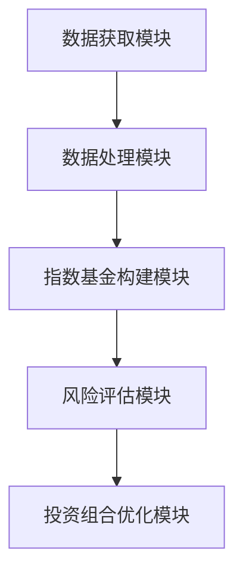

                 


# 第一部分: 约翰·博格尔的指数化价值投资概述

## 第1章: 指数化投资的起源与背景

### 1.1 指数化投资的定义与特点

#### 1.1.1 指数化投资的定义
指数化投资是一种投资策略，旨在通过跟踪特定市场指数的表现来构建投资组合。这种方法的核心在于分散投资，避免了个别资产的过高风险，同时降低了主动管理的成本。

#### 1.1.2 指数化投资的核心特点
- **分散性**：通过投资多个资产或股票，降低单一资产带来的风险。
- **低成本**：指数基金通常管理费用较低，因为它们被动跟踪指数，不需要频繁交易。
- **透明性**：投资者可以清晰地看到投资组合的构成，了解每一份投资的具体情况。

#### 1.1.3 指数化投资与传统投资的区别
- **主动性 vs 被动性**：传统投资通常涉及主动选择股票和时机，而指数化投资则是被动跟踪指数。
- **成本**：主动管理通常费用较高，而指数化投资费用较低。
- **风险**：主动投资风险较高，因为依赖于管理者的决策，而指数化投资风险相对分散。

### 1.2 约翰·博格尔与指数化投资

#### 1.2.1 约翰·博格尔的生平简介
约翰·博格尔（John C. Bogle）是指数化投资的先驱，被誉为“指数基金之父”。他创立了 Vanguard 集团，并在1975年推出了第一只指数基金。

#### 1.2.2 博格尔对指数化投资的贡献
博格尔通过创立 Vanguard 集团，推动了指数基金的发展。他强调了低成本和分散投资的重要性，认为长期来看，指数基金能够提供稳定的回报。

#### 1.2.3 博格尔投资理念的核心思想
博格尔的价值投资理念强调长期持有，分散投资，避免频繁交易和高昂的管理费用。他认为市场很难被预测，长期持有指数基金能够获得稳定的收益。

### 1.3 价值投资与指数化投资的结合

#### 1.3.1 价值投资的定义与特点
价值投资是一种投资策略，强调以低于市场价值的价格买入优质资产，长期持有，等待其价值回归。

#### 1.3.2 指数化投资与价值投资的联系
- **分散性**：两者都强调分散投资，避免集中风险。
- **长期视角**：两者都强调长期投资，追求稳定的回报。
- **成本控制**：指数化投资通过低成本获得收益，而价值投资也强调避免不必要的交易成本。

#### 1.3.3 博格尔如何将两者结合
博格尔通过指数基金实现了价值投资的分散化，避免了个别股票的风险，同时通过低成本管理，为投资者提供了稳定的回报。

## 第2章: 指数化投资的核心概念与原理

### 2.1 指数化投资的核心概念

#### 2.1.1 指数基金的构建原理
指数基金通过跟踪特定的市场指数，如标普500，来构建投资组合。投资组合的构成与指数的成分股及其权重一致。

#### 2.1.2 指数基金的跟踪误差
跟踪误差是指指数基金的实际收益率与跟踪指数的收益率之间的差异。误差越小，基金的表现越接近指数。

#### 2.1.3 指数基金的成本优势
指数基金通常具有较低的管理费用和交易费用，因为它们被动跟踪指数，不需要频繁调整投资组合。

### 2.2 指数化投资与被动投资的关系

#### 2.2.1 被动投资的定义与特点
被动投资是一种投资策略，旨在通过跟踪市场指数或特定的投资组合来获得收益，而非主动管理资产。

#### 2.2.2 指数化投资作为被动投资的典型代表
指数基金是被动投资的主要形式之一，通过跟踪市场指数实现投资收益，且成本较低。

#### 2.2.3 被动投资与主动投资的优劣势对比

| 投资策略 | 优   | 劣   |
|----------|------|------|
| 被动投资 | 成本低、风险分散 | 收益不稳定、难以超越市场 |
| 主动投资 | 可能获得超额收益 | 成本高、风险高 |

### 2.3 指数化投资的数学模型与公式

#### 2.3.1 指数基金的收益率计算公式
$$ R = \sum_{i=1}^{n} w_i \times R_i $$
其中，\( R \) 是投资组合的收益率，\( w_i \) 是第 \( i \) 只股票的权重，\( R_i \) 是第 \( i \) 只股票的收益率。

#### 2.3.2 指数基金的波动率计算公式
$$ \sigma = \sqrt{\sum_{i=1}^{n} w_i^2 \times \sigma_i^2 + \sum_{i \neq j} w_i w_j \times \text{Cov}(R_i, R_j)} $$
其中，\( \sigma \) 是投资组合的波动率，\( \sigma_i \) 是第 \( i \) 只股票的波动率，\( \text{Cov}(R_i, R_j) \) 是第 \( i \) 只和第 \( j \) 只股票的协方差。

#### 2.3.3 指数基金的夏普比率计算公式
$$ \text{夏普比率} = \frac{E[R_p] - R_f}{\sigma_p} $$
其中，\( E[R_p] \) 是投资组合的期望收益率，\( R_f \) 是无风险利率，\( \sigma_p \) 是投资组合的波动率。

## 第3章: 指数化投资的系统分析与架构设计

### 3.1 指数化投资的系统架构

#### 3.1.1 系统功能模块划分
- 数据获取模块
- 数据处理模块
- 指数基金构建模块
- 风险评估模块
- 投资组合优化模块

#### 3.1.2 数据源的选择与获取
数据源可以是公开的市场数据API，如Yahoo Finance或Alpha Vantage。数据获取模块负责从这些API获取市场指数的成分股及其历史价格数据。

#### 3.1.3 指数基金的构建与优化
指数基金构建模块根据市场指数的成分股及其权重构建投资组合，并通过优化算法（如均值-方差优化）进行调整，以降低跟踪误差和成本。

### 3.2 指数化投资的系统架构图



### 3.3 指数化投资的算法实现

#### 3.3.1 指数基金构建算法
```python
import pandas as pd
import numpy as np

# 假设我们有市场指数的成分股及其权重
index_components = ['股票1', '股票2', '股票3', ...]
weights = [0.3, 0.4, 0.3]

# 构建指数基金
def build_index_fund(components, weights):
    fund = pd.DataFrame(columns=['股票', '权重'])
    fund['股票'] = components
    fund['权重'] = weights
    return fund

fund = build_index_fund(index_components, weights)
```

#### 3.3.2 风险评估算法
```python
# 计算波动率
def calculate_volatility(returns):
    return np.std(returns)

# 计算夏普比率
def calculate_sharpe_ratio(returns, risk_free_rate):
    excess_return = returns - risk_free_rate
    return np.mean(excess_return) / calculate_volatility(excess_return)
```

#### 3.3.3 投资组合优化算法
```python
import numpy as np

# 均值-方差优化
def optimize_portfolio(returns):
    n = returns.shape[1]
    return np.dot(returns.mean(), np.ones(n))  # 示例优化，实际需更复杂的算法
```

## 第4章: 指数化投资的项目实战

### 4.1 项目环境安装

#### 4.1.1 Python环境的安装与配置
安装Python 3.8以上版本，推荐使用Anaconda环境。

#### 4.1.2 数据分析库的安装
安装Pandas、NumPy、Matplotlib等库：
```bash
pip install pandas numpy matplotlib
```

### 4.2 指数基金的核心实现

#### 4.2.1 数据获取与清洗
```python
import pandas_datareader as pdr

# 获取标普500指数成分股
def get_sp500_components():
    sp500 = pd.read_html('https://en.wikipedia.org/wiki/S&P_500')[1]
    components = sp500['Ticker'].tolist()
    return components

components = get_sp500_components()
```

#### 4.2.2 构建指数基金
```python
import pandas as pd

# 下载历史数据
def download_data(components, start_date, end_date):
    data = pd.DataFrame()
    for ticker in components:
        df = pd.get_data_yahoo(ticker, start_date, end_date)
        data[ticker] = df['Adj Close']
    return data

data = download_data(components, '2020-01-01', '2023-01-01')
```

#### 4.2.3 计算指数基金的收益率
```python
returns = data.pct_change().dropna()
```

#### 4.2.4 风险评估
```python
volatility = calculate_volatility(returns)
sharpe_ratio = calculate_sharpe_ratio(returns, 0.01)
```

### 4.3 项目小结

通过以上步骤，我们成功构建了一个基于Python的指数化投资系统。该系统能够从数据源获取市场指数成分股，下载历史数据，构建指数基金，并进行风险评估和优化。指数化投资的低成本和分散化特点使得其成为长期投资的理想选择，而通过系统化的架构设计和算法实现，我们可以更高效地进行投资管理和优化。

---

作者：AI天才研究院/AI Genius Institute & 禅与计算机程序设计艺术 /Zen And The Art of Computer Programming

