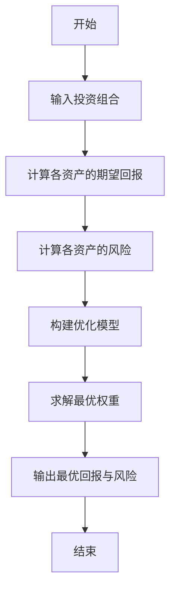
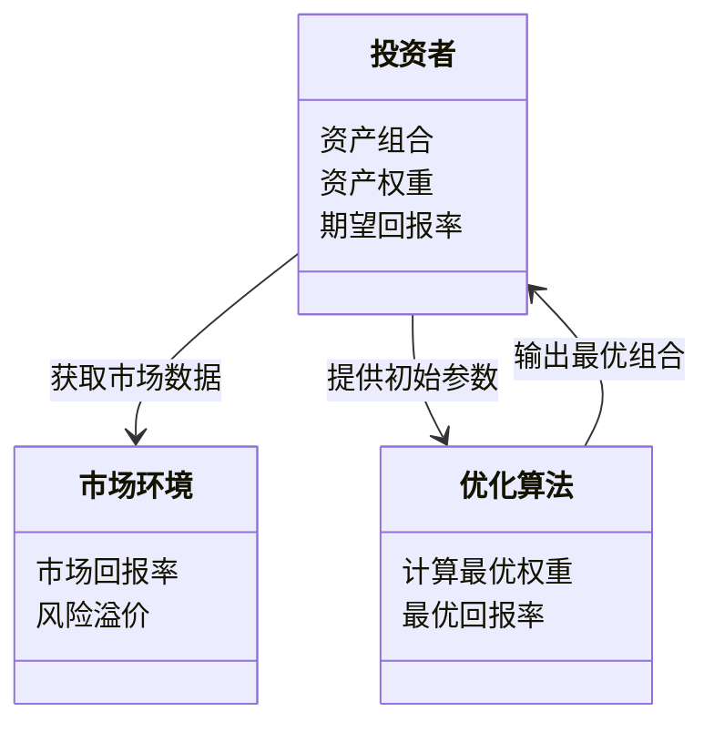
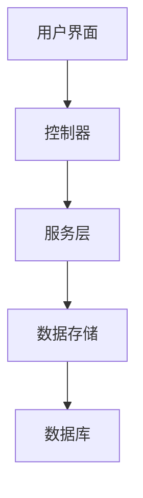

                 


# 约翰伯格的长期回报预期

> 关键词：投资哲学，长期回报，风险管理，投资组合优化，系统架构设计

> 摘要：本文深入探讨了约翰·伯格的长期回报预期理论，结合投资哲学、数学模型、系统架构和项目实战，详细分析了如何在复杂的投资环境中实现长期回报的最大化。通过案例分析和算法优化，本文为投资者提供了实用的策略和方法。

---

## 第一部分：投资哲学与长期回报概述

### 第1章：投资哲学与长期回报的定义

#### 1.1 投资哲学的核心理念

**1.1.1 约翰·伯格的投资理念**

约翰·伯格是投资界的传奇人物，他的投资哲学以“买入并持有优质资产”为核心，强调长期投资和分散投资的重要性。他认为，市场的短期波动是不可预测的，但长期趋势可以通过基本面分析来把握。

**1.1.2 长期回报的定义与特征**

长期回报是指在较长的时间跨度内（通常为5年或更长）投资资产的收益表现。其特征包括复利效应、风险分散和时间价值。

**1.1.3 投资哲学与回报预期的关系**

投资哲学决定了投资者对市场的看法和投资策略，直接影响回报预期的设定和实现。例如，伯格的长期持有策略旨在通过时间的积累实现收益最大化。

---

#### 1.2 长期回报的核心要素

**1.2.1 风险与收益的平衡**

在追求高收益的同时，必须控制风险。伯格强调分散投资以降低风险，同时通过长期持有降低短期波动的影响。

**1.2.2 时间价值与复利效应**

时间是投资者最好的朋友。长期投资通过复利效应，可以显著提高回报率。例如，年回报率10%的投资，经过30年，收益将增长到初始投资的约10倍。

**1.2.3 市场周期与经济环境的影响**

经济周期和市场波动对长期回报有重要影响。伯格建议在市场低谷时增加投资，而在市场高点时保持耐心。

---

#### 1.3 投资者心理与回报预期

**1.3.1 投资者心理偏差对回报预期的影响**

投资者往往容易受到贪婪和恐惧的影响，做出非理性决策。例如，市场下跌时的恐慌性抛售可能错过反弹机会。

**1.3.2 理性决策与非理性决策的对比**

理性投资者基于基本面分析做出决策，而非理性投资者则受情绪驱动。伯格强调理性决策的重要性。

**1.3.3 投资者行为对长期回报的影响**

长期回报的关键在于持续的纪律和耐心。投资者应避免频繁交易，以降低交易成本和税务负担。

---

## 第二部分：长期回报的数学模型与算法原理

### 第2章：长期回报的数学模型

#### 2.1 投资回报的基本公式

**2.1.1 单利与复利的计算公式**

单利：$A = P(1 + rt)$  
复利：$A = P(1 + r)^t$

其中，$P$ 是本金，$r$ 是年利率，$t$ 是时间（年）。

**2.1.2 投资组合回报的计算公式**

投资组合的期望回报率为各资产期望回报率的加权平均值。

公式：$\mu_p = \sum_{i=1}^n w_i \mu_i$  
其中，$w_i$ 是第 $i$ 资产的权重，$\mu_i$ 是第 $i$ 资产的期望回报率。

---

#### 2.2 现代投资组合理论（MPT）

**2.2.1 MPT的核心假设与公式**

MPT假设投资者是理性的，市场存在有效定价。其核心公式是夏普比率：

$$
\text{夏普比率} = \frac{\mu_p - r_f}{\sigma_p}
$$

其中，$\mu_p$ 是投资组合的期望回报率，$r_f$ 是无风险利率，$\sigma_p$ 是投资组合的波动率。

---

#### 2.3 风险与回报的量化关系

**2.3.1 风险溢价的计算公式**

$$
\text{风险溢价} = \text{无风险利率} + \beta \times (\text{市场回报} - \text{无风险利率})
$$

其中，$\beta$ 是资产的贝塔系数。

**2.3.2 夏普比率与特雷纳比率的定义**

夏普比率衡量单位风险超额回报，特雷纳比率衡量在给定系统性风险下的超额回报。

---

#### 2.4 算法原理与流程图

使用 Mermaid 绘制的长期回报优化算法流程图：



---

## 第三部分：长期回报的系统分析与架构设计

### 第3章：长期回报系统的架构设计

#### 3.1 系统功能设计（领域模型）

使用 Mermaid 绘制的领域模型类图：



---

#### 3.2 系统架构设计

使用 Mermaid 绘制的系统架构图：



---

## 第四部分：项目实战与案例分析

### 第4章：项目实战

#### 4.1 环境安装

安装 Python 和相关库：

```bash
pip install numpy pandas matplotlib
```

---

#### 4.2 核心实现源代码

```python
import numpy as np

def calculate_sharpe_ratio(returns, risk_free_rate):
    """
    计算夏普比率
    """
    return (np.mean(returns) - risk_free_rate) / np.std(returns)

# 示例数据
returns = np.array([0.1, 0.05, 0.15, 0.08, 0.12])
risk_free_rate = 0.02

print("夏普比率:", calculate_sharpe_ratio(returns, risk_free_rate))
```

---

#### 4.3 实际案例分析

假设投资组合由股票和债券组成，权重分别为70%和30%。计算其夏普比率：

股票期望回报率：10%，标准差：15%  
债券期望回报率：5%，标准差：5%  
无风险利率：2%

组合期望回报率：$0.7 \times 10\% + 0.3 \times 5\% = 8.5\%$  
组合标准差：需要计算方差并开平方。

---

## 第五部分：总结与展望

### 第5章：总结与展望

#### 5.1 本章小结

本文详细探讨了约翰·伯格的长期回报预期理论，结合投资哲学、数学模型和系统架构，为投资者提供了实用的策略。

#### 5.2 注意事项

- 长期投资需考虑经济周期和市场波动。
- 分散投资是降低风险的有效手段。

#### 5.3 拓展阅读

- 《投资学》（书籍推荐）
- 现代投资组合理论（进一步学习）

---

## 作者：AI天才研究院 & 禅与计算机程序设计艺术

---

本文通过系统分析和实战案例，深入探讨了约翰·伯格的长期回报预期理论，为投资者提供了从理论到实践的全面指导。

